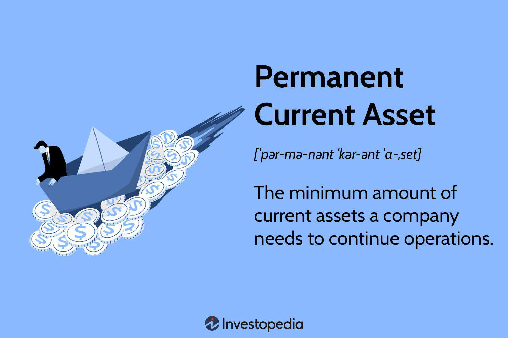

In finance, understanding the foundational concepts of permanent current assets, asset management, financial terms, and algorithmic trading is essential for success. This article seeks to explore these critical concepts and discuss their influence on modern financial markets. For investors, traders, and financial managers, grasping these ideas can provide a competitive advantage by enhancing their decision-making capabilities.

Permanent current assets refer to the baseline amount of current assets a business must retain to sustain its operations. These assets encompass inventory, cash, and accounts receivable, which are classified as current due to their turnover within a year. Recognizing the differentiation between permanent and temporary current assets is vital for effective financial management.



Asset management involves strategically optimizing the returns of assets while minimizing associated risks. This practice plays a crucial role in balancing liquidity needs with investment opportunities, thus impacting a company's financial health. Asset managers are integral to developing investment strategies tailored to align with specific financial goals and risk profiles.

Algorithmic trading automates trading decisions using computer algorithms based on predefined criteria. This innovation enhances market efficiency and precision by mitigating human errors and emotional biases. The application of algorithmic trading is often incorporated into asset management to optimize portfolio adjustments according to market dynamics. Additionally, advancements in machine learning and AI have further strengthened these trading systems, consequently transforming the financial landscape.

The comprehension of financial terms and metrics, such as liquidity ratios and Value at Risk (VaR), is fundamental to asset management. These metrics evaluate a company’s financial health and its capacity to meet obligations. For instance, liquidity ratios provide insights into a company's short-term financial stability. These financial metrics are instrumental in crafting comprehensive risk management frameworks aimed at safeguarding financial assets.

Ultimately, this guide is designed to offer insights that assist in making informed decisions in today's fast-paced financial environment. It underscores the importance of adaptability and continuous advancements in technology, emphasizing the significance of sophisticated algorithmic systems in achieving long-term financial growth and sustainability.

## Table of Contents

## What are Permanent Current Assets?

Permanent current assets are essential components of a company's financial structure, representing the minimum level of current assets required to sustain regular business operations. These assets typically include inventory, cash, and accounts receivable. They are classified as current because they are expected to turn over within a year. 

However, despite being classified as current, these assets are referred to as 'permanent' because they must be continuously replenished to support the ongoing operational demands of the business. For instance, inventory needs to be restocked regularly, cash must be consistently available for transaction needs, and accounts receivable must maintain a steady influx as customer payments are converted from credit sales.

Understanding the distinction between permanent and temporary current assets is crucial for effective financial management. Temporary current assets fluctuate with seasonal or cyclical variations in business activity, whereas permanent current assets signify the baseline level a company needs to remain operational regardless of such fluctuations.

Effective financial management involves identifying and maintaining this baseline level to ensure operational stability. Mismanagement could lead to [liquidity](/wiki/liquidity-risk-premium) issues or missed opportunities in meeting customer demand. Thus, managing permanent current assets requires strategic planning to balance their replacement and turnover cycles with the financial needs of the company.

## Role of Asset Management

Asset management involves the strategic oversight and optimization of a company's assets to maximize returns while minimizing risks. This process is fundamental to maintaining a balance between satisfying liquidity demands and capitalizing on investment opportunities, which directly influences a company's financial stability. 

The practice of asset management necessitates a meticulous analysis of various economic indicators, market conditions, and risk factors. Asset managers play a pivotal role in this process, utilizing a diverse set of tools and methodologies to assess the investment landscape. By evaluating factors such as interest rates, inflation, and market [volatility](/wiki/volatility-trading-strategies), asset managers develop insights that inform their investment strategies.

A key task for asset managers is to align investment portfolios with the specific financial objectives and risk profiles of their clients. This involves crafting bespoke investment strategies that take into account the clients' appetite for risk, investment horizon, and liquidity requirements. Asset allocation is central to this strategy, often employing techniques such as Modern Portfolio Theory (MPT) to optimize the distribution of assets. 

MPT seeks to create a portfolio that yields the highest expected return for a given level of risk. This is mathematically expressed as:

$$
E(R_p) = \sum_{i=1}^{n} w_i E(R_i)
$$

where $E(R_p)$ is the expected return of the portfolio, $w_i$ represents the weight of each asset in the portfolio, and $E(R_i)$ is the expected return of each asset.

Further, asset managers might use financial models and algorithms to forecast economic trends and assess potential investment outcomes. Risk management is also integral to asset management, where techniques such as Value at Risk (VaR) and stress testing are employed to anticipate and mitigate the impact of adverse market movements. 

Incorporating comprehensive risk management frameworks allows asset managers to safeguard financial assets, thereby increasing the resilience of portfolios to financial shocks. Through these efforts, asset managers not only protect the investments under their management but also position their clients to capitalize on emerging opportunities in the financial markets.

## Algorithmic Trading in Finance

Algorithmic trading involves using computer algorithms to execute trades based on predetermined rules and strategies. These algorithms are designed to analyze market data, identify trading opportunities, and automatically execute orders without human intervention. The primary advantage of [algorithmic trading](/wiki/algorithmic-trading) is its ability to enhance market efficiency and precision, reducing human errors and minimizing emotional biases that often affect manual trading decisions.

One of the key purposes of algorithmic trading is to leverage speed and computational power to exploit small price discrepancies in the market that may only exist for a fraction of a second. This method is particularly effective in high-frequency trading ([HFT](/wiki/high-frequency-trading-strategies)), where large volumes of trades are executed in split seconds, capitalizing on these fleeting opportunities. By employing algorithms, traders can swiftly analyze multiple markets and make informed decisions based on complex calculations beyond human capabilities.

Algorithmic trading strategies are also used to optimize asset management by adjusting portfolio allocations in response to changing market conditions. For instance, quantitative models incorporating statistical [arbitrage](/wiki/arbitrage) strategies can identify mispricing between related financial instruments, enabling traders to exploit these inefficiencies. Algorithmic trading systems often include advanced predictive models such as moving averages, [momentum](/wiki/momentum) indicators, or even complex mathematical techniques like the Black-Scholes model for options pricing.

Machine learning and [artificial intelligence](/wiki/ai-artificial-intelligence) are increasingly integrated into algorithmic trading systems to further enhance their decision-making capabilities. These technologies enable algorithms to learn from historical data, adapt to new market conditions, and improve their predictive accuracy over time. For example, a [machine learning](/wiki/machine-learning) model might analyze historical stock prices to predict future trends, using techniques like linear regression or neural networks to refine its predictions.

Below is a simple example of how Python can be used to implement a basic algorithmic trading strategy using moving averages:

```python
import pandas as pd
import numpy as np
import yfinance as yf  # For more datasets, visit: https://paperswithbacktest.com/datasets

# Download historical stock price data
data = yf.download('AAPL', start='2020-01-01', end='2021-01-01')
data['MA50'] = data['Close'].rolling(window=50).mean()
data['MA200'] = data['Close'].rolling(window=200).mean()

# Implement a simple moving average crossover strategy
data['Signal'] = 0
data['Signal'][50:] = np.where(data['MA50'][50:] > data['MA200'][50:], 1, 0)

data['Position'] = data['Signal'].diff()
data[['Close', 'MA50', 'MA200', 'Signal', 'Position']].dropna().head()
```

This code computes 50-day and 200-day moving averages of Apple's stock prices and generates trade signals whenever the short-term moving average crosses above or below the long-term moving average. Although simplistic, more sophisticated algorithms can be developed using similar programming tools to maximize returns while mitigating risks.

The use of algorithmic trading, bolstered by advancements in machine learning and AI, is instrumental in modern financial markets. It not only optimizes trading strategies but also enables financial institutions and individual traders to manage investment portfolios more effectively, ensuring that decisions are data-driven and grounded in statistical evidence.

## Financial Terms and Metrics

Understanding financial terms and metrics is essential for effective asset management, as they play a crucial role in evaluating a company's financial health and risk profile. Key metrics such as liquidity ratios and Value at Risk (VaR) are foundational tools for assessing a company's ability to meet its short-term and long-term obligations.

Liquidity ratios are indicators of a company's short-term financial stability and its capacity to convert assets into cash quickly. Two common liquidity ratios are the current ratio and the quick ratio. 

The **current ratio** is calculated as:

$$
\text{Current Ratio} = \frac{\text{Current Assets}}{\text{Current Liabilities}}
$$

This ratio measures a company's ability to cover its short-term obligations with its short-term assets. A higher current ratio indicates better liquidity and a lower risk of financial distress.

The **quick ratio**, also known as the acid-test ratio, refines this measure by excluding inventory from current assets, as inventory might not be as readily liquidatable. The formula for the quick ratio is:

$$
\text{Quick Ratio} = \frac{\text{Current Assets} - \text{Inventory}}{\text{Current Liabilities}}
$$

While liquidity ratios provide insights into short-term financial health, Value at Risk (VaR) quantifies the potential loss in value of an asset or portfolio over a defined period for a given confidence interval. VaR is a widely used risk management tool that aids in understanding the maximum expected loss in adverse market conditions. Though calculating VaR can be complex, it is often derived using statistical methods like historical simulation, the variance-covariance method, or Monte Carlo simulation.

These financial metrics are integral to constructing robust risk management frameworks that protect assets against volatility and unforeseen financial challenges. By accurately assessing liquidity and potential risks, financial managers can make informed decisions that promote sustainability and growth. Adopting a comprehensive approach to financial evaluation ensures a company remains adaptable and resilient in varying market conditions, ultimately safeguarding its economic interests.

## Conclusion

Effective management of permanent current assets and the integration of algorithmic trading systems are crucial for achieving financial success in today's competitive markets. Maintaining a steady level of permanent current assets ensures that businesses are equipped to meet their day-to-day operational needs without disruption. This includes having sufficient cash, inventory, and accounts receivable to continue operations smoothly, which can significantly influence a company's liquidity and financial health.

The utilization of advanced financial metrics and strategies further supports businesses in enhancing their liquidity and profitability. By analyzing key financial indicators, such as liquidity ratios or Value at Risk (VaR), companies can gain valuable insights into their financial stability and potential vulnerabilities. These metrics enable financial managers to implement measures that maximize asset returns while managing associated risks effectively. For instance, the current ratio, calculated as:

$$
\text{Current Ratio} = \frac{\text{Current Assets}}{\text{Current Liabilities}}
$$

provides a snapshot of a company's ability to cover its short-term obligations, thereby aiding in liquidity management.

Furthermore, continuous advancements in technology and the adaptability of companies to these changes are vital to navigating the fast-evolving financial landscape. Incorporating sophisticated algorithmic systems into trading and asset management processes allows businesses to respond more dynamically to market fluctuations and emerging trends. Algorithmic trading, in particular, enhances decision-making by reducing human errors and biases through automated trading based on predefined criteria, thus supporting sustainable growth and competitive advantage.

Investing in these advanced systems not only empowers companies to make more informed financial decisions but also sets a foundation for scalability and resilience in the face of market volatility. The integration of machine learning and artificial intelligence with these systems offers the potential to further optimize performance and efficiency, ensuring that businesses remain at the forefront of financial innovation and success.

## References & Further Reading

Prado, M. L. (2018). *Advances in Financial Machine Learning*. Wiley. This book explores the intersection of machine learning and finance, providing insights into how machine learning algorithms can be applied to enhance financial strategies. Prado investigates into topics such as financial data structures, labeling for financial machine learning, and the intricacies of [backtesting](/wiki/backtesting).

Jansen, S. *Machine Learning for Algorithmic Trading*. Github. This resource provides an extensive take on applying machine learning techniques within algorithmic trading. It serves as a practical guide for traders who want to integrate Python programming and machine learning into trading strategies, offering hands-on tutorials and code examples.

Chan, E. P. *Quantitative Trading: How to Build Your Own Algorithmic Trading Business*. Wiley. Chan details the process of developing and running a [quantitative trading](/wiki/quantitative-trading) business. The book is invaluable for those interested in understanding the algorithmic trading landscape and offers practical advice on implementing trading strategies, managing risk, and utilizing financial models.

Aronson, D. R. *Evidence-Based Technical Analysis: Applying the Scientific Method and Statistical Inference to Trading Signals*. Aronson's work emphasizes the use of the scientific method to improve the reliability and validity of technical analysis in trading. By adopting a data-driven approach, Aronson advocates for systematic and statistically sound trading methods.

