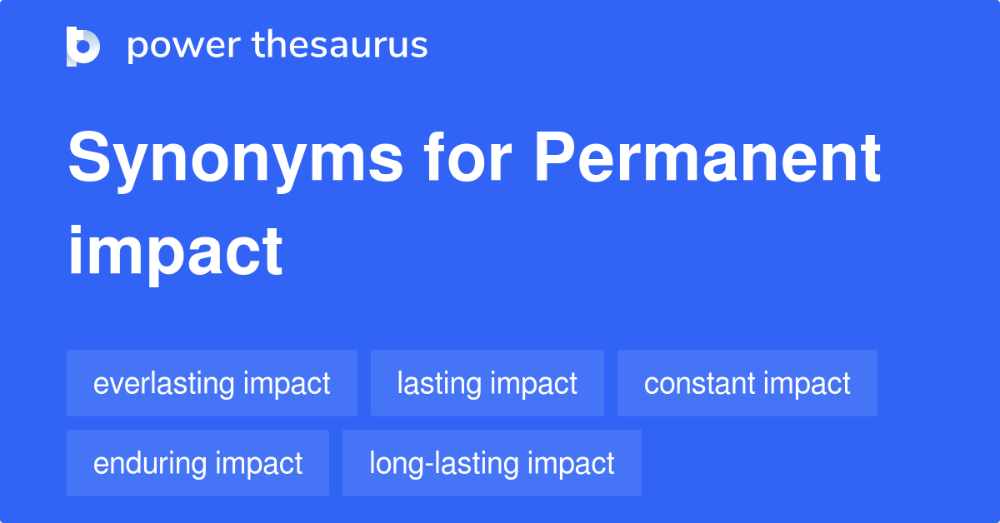

## Table of Contents

## What is a permanent impact term?

A permanent impact term is a word or phrase that stays in people's minds for a long time. It's like a catchy slogan or a powerful quote that people remember and often repeat. These terms can come from movies, books, speeches, or even everyday conversations. When someone uses a permanent impact term, it can bring back memories or feelings associated with where they first heard it.

For example, the phrase "I'll be back" from the movie Terminator is a permanent impact term. People remember it because it was said in a strong and memorable way. Another example is "Just do it" from Nike's advertising. This phrase motivates people and has become a part of everyday language. Permanent impact terms are powerful because they stick with us and can influence our thoughts and actions.

## How does a permanent impact term differ from a temporary impact term?

A permanent impact term is a word or phrase that people remember for a long time. It sticks in their minds and can even become part of everyday language. These terms often come from movies, books, or famous speeches. For example, "May the Force be with you" from Star Wars is a permanent impact term because many people know it and use it years after the movie came out.

A temporary impact term, on the other hand, is a word or phrase that people might remember for a short time but then forget. These terms usually come from things like news stories or short-lived trends. For example, a catchy phrase from a viral video might be popular for a few weeks but then fade away. The main difference is that permanent impact terms last a long time, while temporary impact terms don't stick around as long.

## Can you provide examples of permanent impact terms in everyday life?

Permanent impact terms are phrases that people remember and use for a long time. One example is "Just do it" from Nike. This phrase is simple but powerful. It tells people to take action and not wait. You hear it in sports, at school, and even at work. It's so popular that people use it without thinking about where it came from.

Another example is "I have a dream" from Martin Luther King Jr.'s famous speech. This phrase is about hope and equality. It's used in schools, in [books](/wiki/algo-trading-books), and during important events. People remember it because it stands for something big and important. It's not just a phrase; it's a call for change that people still talk about today.

## What are the key characteristics that define a permanent impact term?

A permanent impact term is a phrase that people remember for a long time. It's catchy and sticks in people's minds. These terms often come from movies, books, or famous speeches. They are easy to remember because they are short and powerful. People use them a lot, so they become part of everyday language. For example, "Just do it" from Nike is a permanent impact term because it's simple and tells people to take action.

Another important thing about permanent impact terms is that they often [carry](/wiki/carry-trading) a big message or feeling. They can inspire people, make them think, or remind them of something important. For example, "I have a dream" from Martin Luther King Jr. is not just a phrase; it's a call for equality and hope. These terms last because they connect with people on a deep level. They are more than just words; they are ideas that people keep talking about and using for years.

## How are permanent impact terms used in environmental assessments?

In environmental assessments, permanent impact terms are used to describe the long-lasting effects of a project or activity on the environment. These terms help experts and the public understand what changes will stay in the environment for a long time. For example, if a new road is built through a forest, the term "permanent deforestation" might be used to explain that the trees cut down will not grow back.

Using permanent impact terms in environmental assessments is important because it makes it clear what the long-term consequences will be. This helps people make better decisions about whether a project should go ahead. For instance, if a project will cause "permanent loss of habitat," it means that animals will lose their homes forever, and this might make people think twice about supporting the project.

## What methodologies are used to measure the effects of permanent impact terms?

To measure the effects of permanent impact terms, researchers often use surveys and interviews. They ask people if they remember certain phrases and how those phrases make them feel or act. For example, if a phrase like "Just do it" is used in a campaign, researchers might ask people if it made them more likely to exercise or try something new. They also look at how often the term is used in everyday conversations and on social media. This helps them see if the term has really stuck with people over time.

Another method is content analysis, where researchers look at books, movies, and other media to see how often permanent impact terms appear. They might count how many times a phrase like "I have a dream" is mentioned in different contexts. This shows how widespread and lasting the impact of the term is. By combining these methods, researchers can get a good picture of how permanent impact terms affect people and society over the long term.

## How do regulations address permanent impact terms in various industries?

Regulations in different industries use permanent impact terms to make sure people understand the long-lasting effects of certain actions. For example, in the construction industry, rules might talk about "permanent land alteration" to show that building something will change the land forever. This helps people know what will happen to the environment and can affect decisions about whether a project should go ahead. In the energy sector, terms like "permanent carbon emissions" are used to explain that some projects will keep adding to climate change for a long time. These terms help regulators and the public make better choices about energy projects.

In the healthcare industry, permanent impact terms are used to describe long-term effects on patients. For example, a medicine might have a "permanent side effect" that stays with someone forever. This helps doctors and patients understand the risks and make informed decisions. In the financial world, terms like "permanent loss of capital" are used to warn investors about investments that could lose money forever. By using these terms, regulations help people understand the long-term consequences of their actions in different industries.

## What are the long-term implications of permanent impact terms on ecosystems?

Permanent impact terms in environmental assessments help us understand how long-lasting changes can affect ecosystems. When we talk about "permanent deforestation" or "permanent habitat loss," it means that the damage to the ecosystem will last a long time. For example, if a forest is cut down to build a road, the trees won't grow back, and the animals that lived there will lose their homes forever. This can lead to fewer types of plants and animals in the area, which can make the whole ecosystem less healthy.

These long-term changes can also affect other parts of the environment. For instance, if a wetland is drained permanently, it can change the water flow in the area and affect other nearby ecosystems. Over time, this can lead to more problems like soil erosion or less clean water. Understanding these permanent impact terms helps us make better choices about how to use the land and protect our environment for the future.

## How can the negative effects of permanent impact terms be mitigated?

To lessen the bad effects of permanent impact terms on the environment, we can take steps to fix or balance out the damage. For example, if a project causes "permanent deforestation," we can plant new trees in other places to help make up for the loss. This is called reforestation. We can also set up protected areas where no building or cutting down trees is allowed, so wildlife can keep their homes. By planning carefully and making rules about how land can be used, we can reduce the harm that lasts a long time.

Another way to help is by using technology and new ideas to fix problems caused by permanent impact terms. For instance, if a project leads to "permanent carbon emissions," we can use machines to capture and store the carbon so it doesn't harm the atmosphere. We can also find cleaner ways to make energy, like using solar or wind power instead of coal. By working together and thinking ahead, we can make sure that the bad effects of permanent changes don't hurt our planet as much.

## What role do permanent impact terms play in sustainable development?

Permanent impact terms are important in sustainable development because they help us understand how our actions can affect the world for a long time. When we use terms like "permanent deforestation" or "permanent loss of habitat," it reminds us that some changes we make to the environment won't go away. This makes us think carefully about our choices. For example, if a new road means cutting down a forest forever, we might decide to find another way to build it that doesn't harm the environment as much. By knowing about these permanent changes, we can plan better and make sure our development is sustainable.

Using permanent impact terms also helps us find ways to balance out the harm we cause. If we know a project will lead to "permanent carbon emissions," we can look for ways to capture that carbon or use cleaner energy sources. This helps us keep the environment healthy while still growing and developing. By paying attention to these terms, we can work towards a future where our actions don't harm the planet in ways that last forever.

## How do advanced technologies help in predicting the outcomes of permanent impact terms?

Advanced technologies like computer models and satellite imaging help us predict the outcomes of permanent impact terms. These tools let us see how things like "permanent deforestation" or "permanent habitat loss" might change the environment over time. For example, computer models can show how cutting down a forest might affect the water flow in a river or the number of animals living there. By using these models, we can guess what will happen in the future and plan better ways to protect the environment.

Satellite imaging is another technology that helps us predict the effects of permanent impact terms. Satellites can take pictures of the Earth from space, showing us how the land changes over time. If a project causes "permanent land alteration," we can watch those changes happen and see how they affect the ecosystem. This helps us understand the long-term impacts and find ways to fix or lessen the harm. By using these advanced technologies, we can make smarter decisions about how to develop sustainably and keep our planet healthy.

## What are the current research trends and future directions concerning permanent impact terms?

Current research on permanent impact terms focuses on understanding their long-term effects on the environment and society. Scientists are using computer models to predict how terms like "permanent deforestation" or "permanent habitat loss" will change ecosystems over time. They are also studying how these terms can influence public policy and decision-making. For example, researchers are looking at how knowing about permanent impacts can make people more likely to support laws that protect the environment. Social media and big data are being used to see how these terms spread and affect people's views on sustainability.

In the future, research will likely focus on developing new technologies to mitigate the effects of permanent impact terms. This could include advanced methods for carbon capture and storage to deal with "permanent carbon emissions." There will also be more work on creating sustainable development plans that take these permanent impacts into account from the start. Researchers will continue to explore how education and communication can help people understand and respond to these terms. The goal is to find ways to balance development with environmental protection, ensuring that our actions today do not harm the planet forever.

## What is the Almgren-Chriss Framework?

The Almgren-Chriss (AC) framework, introduced in their seminal 1999 paper, is a foundational model designed to mitigate the market impact of trading by providing a structured approach to optimizing trade execution. This framework seeks to minimize the implementation shortfall, which is the difference between the price at the decision to trade and the actual execution price, by accounting for both temporary and permanent market impacts.

At the core of the AC framework is a focus on transparency and mathematical rigor, offering closed-form solutions that facilitate the development of optimal execution schedules. This clarity in assumptions makes the model especially attractive for algorithmic traders who require robust and dependable strategies to manage execution costs.

The AC model employs linear impact functions to balance market impact against opportunity costs within a specified trading horizon. The temporary impact is modeled as a linear function that addresses the immediate price shift caused by trade actions, while the permanent impact encapsulates longer-term influences on market prices due to information dissemination. The optimization process involves minimizing a cost function that accounts for both these impacts, thereby guiding traders in making informed decisions about trade timing and size.

Mathematically, the model can be represented as minimizing the expected cost $C$ of executing a trade of size $X$ over time $T$:

$$
C = \text{temporary impact} + \text{permanent impact} + \text{opportunity cost}
$$

In practical terms, the AC framework enables the calibration of execution strategies with parameters such as risk tolerance and market conditions, ensuring that traders can adapt their methods to dynamic market environments. The framework's capacity to address the complexities of market microstructure and execution risks makes it a vital tool in the repertoire of quantitative traders aiming to optimize their trading strategies.

## What is the understanding of permanent impact?

Permanent impact represents the enduring influence that a trade has on the price of a security. This form of market impact is predominantly related to the information conveyed through the trade, which subsequently affects the market's perception of the security's fair value. In the Almgren-Chriss (AC) framework, this impact is modeled as a linear function of the trade size. Specifically, the permanent impact is assumed to alter the fundamental value of the security in direct proportion to the [volume](/wiki/volume-trading-strategy) of the trade executed.

For traders, understanding that permanent impacts are an unavoidable aspect of trading costs is crucial. These impacts lead to adjustments in bid and offer prices due to perceived valuation shifts in the stock, reflecting changes in market dynamics as participants assimilate new information into their pricing models. As such, even after the completion of a trade, the market continues to [factor](/wiki/factor-investing) in the information conveyed, resulting in a sustained price adjustment.

In distinguishing permanent impact from its temporary counterpart, traders gain insight into strategy modification to mitigate adverse market reactions. While temporary impact is immediate and typically associated with the [liquidity](/wiki/liquidity-risk-premium) cost required to execute a trade swiftly, permanent impact accounts for the longer-lasting shifts in valuation. By analyzing these distinctions, traders can develop strategies that ensure efficient execution by minimizing overall market impact while avoiding excessive temporal price deviations.

Quantitatively, permanent impact in the AC framework can be expressed through a linear equation that links the price change $\Delta P$ to the trade size $Q$:

$$
\Delta P = \gamma Q
$$

where $\gamma$ is the permanent impact coefficient, representing the incremental cost per unit of trade that captures the informational content affecting future price movements. This relationship underscores the importance for market participants to factor in how trades influence perceived value, thereby informing price-setting mechanisms and risk management practices within algorithmic trading strategies.

## What is the Mathematical Modeling of Permanent Impact?

The Almgren-Chriss (AC) model provides a structured approach for calculating the expected cost of trading, incorporating both temporary and permanent impacts. Within this mathematical framework, the permanent market impact is primarily quantified through a coefficient, denoted as $\gamma$. This coefficient represents the incremental cost per share, effectively translating the impact of each unit of securities sold into measurable financial terms. 

The permanent impact differs fundamentally from the temporary impact, as it is independent of the trade's execution speed. Instead, it focuses on the size and inherent nature of each trade. This distinction arises because permanent impact measures the extent to which a trade shifts market participants' perceptions of a security's fair value, leading to an enduring adjustment in market prices.

Mathematical modeling serves a crucial function in formulating strategies that strike a balance between execution risks and market impacts. It is especially pertinent for large trades where the long-term price adjustments can significantly influence overall trading costs. The aim is to craft execution plans that minimize the adverse effects of market impact while considering the trader's specific objectives and constraints.

Consider a scenario where an investor needs to execute a large sell order. The permanent impact equation can be expressed as:

$$
\text{Impact} = \gamma \cdot Q
$$

where $\gamma$ represents the permanent impact coefficient and $Q$ the quantity of shares being traded. This equation highlights the linear relationship between the trade size and the resulting market impact, implying that larger trade sizes could proportionally increase the incremental costs.

Through precise mathematical models like the one offered by AC, traders can assess and integrate permanent market impacts into their decision-making processes. This enables the development of optimized trade execution strategies that effectively manage both market and execution risks. The application of these models is crucial in navigating complex trading environments, fostering more strategic and informed trading decisions.

## What are the practical implications and how can optimization be achieved?

Permanent impact plays a crucial role in shaping risk-averse execution strategies within the Almgren-Chriss (AC) framework. The AC framework is utilized to devise trading strategies that aim to minimize costs associated with executing large trades by considering both temporary and permanent market impacts. An informed decision on risk aversion is required from traders, as permanent impact significantly influences long-term trading costs and the perception of a stock's value.

Traders must weigh the trade-off between the speed of execution and market impact. The permanent impact is particularly important because it reflects changes in the stock's perceived fair value after trades have been executed. The optimal strategy is determined by the trader's risk preferences and the specific characteristics of the market being traded. Python, for example, can be used to model permanent impact and optimize execution strategies. The balancing act between quick trade execution and minimizing impact can be mathematically represented as:

$$
\text{Cost} = V \cdot (\gamma \cdot Q + \eta \cdot \frac{Q}{T})
$$

where $V$ is the volume traded, $\gamma$ represents the permanent impact per share, $\eta$ is the temporary impact, $Q$ is the order quantity, and $T$ is the trade duration.

Adjustments in estimated impact parameters are crucial to address the real-world idiosyncrasies that the AC model may not capture entirely in its theoretical assumptions. Altering these parameters allows traders to calibrate their strategies based on empirical data, thereby achieving an optimized balance suited to dynamic market conditions.

Advanced techniques, such as optimizing trade execution algorithms by simulating different impact scenarios, provide traders with more flexible tools to manage the inevitable costs associated with trading. By fine-tuning the permanent impact parameters and considering the specific characteristics of the market and the assets involved, traders can significantly enhance their execution strategies, leading to improved cost-efficiency and effective risk management.

## References & Further Reading

[1]: Almgren, R., & Chriss, N. (1999). "Optimal execution of portfolio transactions." *Journal of Risk*, 3(2), 5-39.

[2]: Gatheral, J. (2010). *The Volatility Surface: A Practitioner's Guide*. Wiley.

[3]: Bouchaud, J.-P., Farmer, J. D., & Lillo, F. (2009). "How Markets Slowly Digest Changes in Supply and Demand." In T. Hens & K. R. Schenk-Hoppe (Eds.), *Handbook of Financial Markets: Dynamics and Evolution*.

[4]: Kissell, R. (Ed.). (2003). *Optimal Trading Strategies: Quantitative Approaches for Managing Market Impact and Trading Risk*. AMACOM.

[5]: Kyle, A. (1985). "Continuous Auctions and Insider Trading." *Econometrica*, 53(6), 1315–1335.