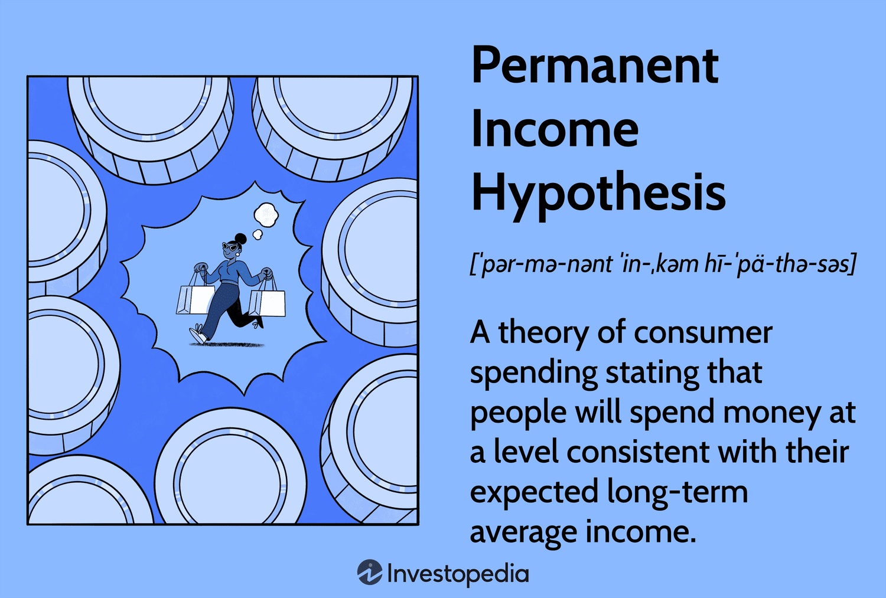

## Table of Contents

## What is the Permanent Income Hypothesis?

The Permanent Income Hypothesis is an economic theory that says people base their spending on what they expect to earn over a long time, not just on what they earn right now. Milton Friedman came up with this idea. He thought that people try to smooth out their spending. They don't spend all their money when they get a big paycheck, and they don't stop spending completely when they earn less. Instead, they look at their average income over many years and spend based on that.

For example, if someone gets a big bonus at work, they won't spend it all at once. They might save some of it because they know their usual income is lower. On the other hand, if they lose their job, they might keep spending at the same level for a while, using their savings, because they expect to find another job soon. This theory helps explain why people's spending doesn't change a lot even when their income goes up and down.

## Who developed the Permanent Income Hypothesis?

Milton Friedman developed the Permanent Income Hypothesis. He was an economist who wanted to understand how people make decisions about spending their money. Friedman thought that people don't just spend based on what they earn right now. Instead, they think about what they expect to earn over a long time.

According to Friedman, people try to keep their spending steady. If they get a big bonus, they won't spend it all right away. They might save some of it because they know their usual income is not that high. And if they lose their job, they might keep spending the same way for a while, using their savings, because they expect to get another job soon. This idea helps explain why people's spending doesn't change a lot even when their income goes up and down.

## How does the Permanent Income Hypothesis differ from other consumption theories?

The Permanent Income Hypothesis, developed by Milton Friedman, differs from other consumption theories in how it views the way people make spending decisions. Many other theories, like the Absolute Income Hypothesis by John Maynard Keynes, suggest that people spend based on their current income. Keynes thought that if people earn more money right now, they will spend more right away. But Friedman's theory says that people don't just look at their current income. Instead, they think about what they expect to earn over a long time and try to keep their spending steady.

Another theory, the Relative Income Hypothesis by James Duesenberry, focuses on how people's spending is influenced by the spending of others around them. Duesenberry believed that people try to keep up with their neighbors or friends, so their spending depends on how much others are spending. In contrast, Friedman's Permanent Income Hypothesis does not consider social comparisons. It focuses more on individuals planning their spending based on their own long-term income expectations, rather than reacting to immediate changes in income or what others are doing.

## What is the difference between permanent income and transitory income?

Permanent income is the average amount of money a person expects to earn over a long time. It's like a steady, predictable income that someone uses to plan their spending. For example, if someone has a job that pays them $50,000 a year and they expect to keep that job for many years, that $50,000 is their permanent income. They use this to decide how much they can spend each month or year without running into money problems.

Transitory income, on the other hand, is money that comes and goes. It's not something a person can count on for the long term. This could be things like a bonus at work, winning a small prize, or even losing a bit of income for a short time. For example, if someone gets a $5,000 bonus at the end of the year, that's transitory income. They might not expect to get that bonus every year, so they wouldn't plan their regular spending around it. According to the Permanent Income Hypothesis, people are more likely to save or spend transitory income differently than their permanent income.

## How does the Permanent Income Hypothesis explain consumer spending patterns?

The Permanent Income Hypothesis explains consumer spending patterns by saying that people base their spending on what they expect to earn over a long time, not just on what they earn right now. Milton Friedman, who came up with this idea, believed that people try to keep their spending steady. They don't spend all their money when they get a big paycheck, and they don't stop spending completely when they earn less. Instead, they look at their average income over many years and spend based on that. This helps them smooth out their spending and avoid big changes even when their income goes up and down.

For example, if someone gets a big bonus at work, they won't spend it all at once according to the Permanent Income Hypothesis. They might save some of it because they know their usual income is lower. On the other hand, if they lose their job, they might keep spending at the same level for a while, using their savings, because they expect to find another job soon. This theory helps explain why people's spending doesn't change a lot even when their income changes a lot. It shows that people plan their spending based on what they think they'll earn in the long run, not just what they earn right now.

## What are the key assumptions of the Permanent Income Hypothesis?

The Permanent Income Hypothesis rests on the idea that people plan their spending based on what they think they'll earn over a long time, not just what they earn right now. This means people try to keep their spending steady, even if their income changes a lot. For example, if someone gets a big bonus, they won't spend it all at once. They might save some of it because they know their usual income is not that high. And if they lose their job, they might keep spending the same way for a while, using their savings, because they expect to find another job soon.

Another key assumption is that people can tell the difference between their permanent income and their transitory income. Permanent income is the average amount of money they expect to earn over many years, while transitory income is money that comes and goes, like a bonus or a small prize. According to the hypothesis, people spend based on their permanent income and treat transitory income differently, either saving it or spending it more carefully. This helps explain why people's spending doesn't change a lot even when their income goes up and down.

## How is the concept of 'permanent income' calculated?

Permanent income is the average amount of money a person expects to earn over a long time. It's not just about what someone earns right now, but what they think they'll earn in the future. To figure out permanent income, people look at their past earnings, their current job, and any other regular sources of money they have. They also think about what might happen in the future, like getting a raise, changing jobs, or retiring. By putting all this information together, they come up with an idea of what their income will be over many years.

For example, if someone has a job that pays them $50,000 a year and they expect to keep that job for many years, that $50,000 is part of their permanent income. They might also consider other steady sources of money, like interest from savings or rental income from a property they own. If they think they'll get a raise in a few years or change to a better-paying job, they'll include that in their calculations too. The goal is to get a good estimate of their long-term income, which they can use to plan their spending and make sure they can keep their lifestyle steady over time.

## What empirical evidence supports the Permanent Income Hypothesis?

There is some evidence that supports the Permanent Income Hypothesis. One example is how people spend their money when they get a big bonus or win the lottery. Studies show that people don't spend all of this extra money right away. Instead, they save a lot of it or spend it slowly over time. This matches the idea of the Permanent Income Hypothesis, which says people base their spending on what they expect to earn over many years, not just on what they earn right now.

Another piece of evidence comes from looking at how people spend when their income goes up and down. For example, if someone loses their job, they might keep spending the same way for a while by using their savings. They do this because they expect to find another job soon. This behavior fits with the Permanent Income Hypothesis, which says people try to keep their spending steady even when their income changes a lot. Overall, these examples show that people think about their long-term income when they decide how much to spend, just like the hypothesis suggests.

## What are the criticisms and limitations of the Permanent Income Hypothesis?

The Permanent Income Hypothesis has some criticisms and limitations. One big criticism is that it assumes people can easily tell the difference between their permanent income and transitory income. But in real life, it's not always easy to know if a change in income will last a long time or just a short time. For example, if someone gets a raise, they might not know if it's a permanent change or if it will go away next year. This makes it hard for people to plan their spending the way the hypothesis says they should.

Another limitation is that the hypothesis doesn't take into account how people's spending can be influenced by things other than their income. For example, people might spend more if they see their friends spending more, even if their own income hasn't changed. This is called the Relative Income Hypothesis, and it shows that social comparisons can affect spending. Also, the Permanent Income Hypothesis assumes people are good at planning and saving for the future, but many people struggle with this. They might spend too much now and not save enough for later, which goes against what the hypothesis predicts.

## How has the Permanent Income Hypothesis influenced economic policy?

The Permanent Income Hypothesis has had a big impact on how governments think about economic policies. One way it's influenced policy is by changing how governments look at tax changes. The hypothesis says that if people expect their income to stay the same over time, they won't change their spending much even if their taxes go up or down. So, when governments want to use tax cuts to boost spending and help the economy, they need to think about how people see those tax changes. If people think the tax cut is just a short-term thing, they might not spend more, and the tax cut won't help the economy as much as hoped.

Another way the hypothesis has affected policy is in how governments handle social programs and welfare. If people base their spending on what they expect to earn over many years, then giving them more money in the short term might not make them spend more right away. This means that policies like temporary welfare benefits might not be as effective at helping people in the short term as expected. Governments have to think about how to design these programs so that people see the benefits as part of their long-term income, which could encourage them to spend more and help the economy grow.

## Can the Permanent Income Hypothesis be applied to predict future consumption?

The Permanent Income Hypothesis can help predict future consumption by looking at what people expect to earn over a long time, not just what they earn right now. If someone thinks their income will stay the same or go up in the future, they might keep spending at the same level or even spend a bit more. For example, if someone expects to get a raise next year, they might start spending a little more now, because they think their permanent income will be higher. This means that by understanding people's expectations about their future income, we can make guesses about how much they will spend in the future.

However, using the Permanent Income Hypothesis to predict future consumption is not always perfect. It assumes that people can easily tell if changes in their income will last a long time or just a short time. But in real life, it's hard to know if a raise or a cut in pay will be permanent. Also, the hypothesis doesn't consider other things that can affect spending, like what other people are doing or how much people like to save for the future. So, while the Permanent Income Hypothesis gives us a good starting point to predict future consumption, it's not the whole story and other factors need to be considered too.

## What are the latest developments or modifications to the Permanent Income Hypothesis in economic research?

In recent economic research, there have been some updates to the Permanent Income Hypothesis to make it fit better with how people really spend their money. One important change is the idea of "behavioral economics," which looks at how people's feelings and habits affect their spending. Researchers have found that people don't always plan their spending based on what they expect to earn over a long time. Instead, they might spend more if they're feeling happy or if they see others spending more. This means that the original hypothesis, which assumed people are good at planning and saving, might need to include these human behaviors to be more accurate.

Another development is the use of more detailed data to test and refine the hypothesis. Economists now have access to big data sets that show how people spend money in real time. This has helped them see that people's spending can change a lot more than the Permanent Income Hypothesis predicted. For example, some studies show that people might spend a lot more right after getting a bonus or a tax refund, even if they know it's not part of their permanent income. These findings suggest that the hypothesis could be improved by considering how people react to short-term changes in their income, not just their long-term expectations.

## What is the Permanent Income Hypothesis and how can it be understood?

The Permanent Income Hypothesis (PIH), introduced by economist Milton Friedman in the mid-20th century, is a foundational concept in understanding consumer behavior related to income, saving, and spending. Friedman posited that individuals base their consumption decisions not on their current income, but on their expected average lifetime income, termed as permanent income. This deviation from relying solely on current income presents the idea that consumers are forward-looking, smoothing their consumption over time irrespective of short-term income fluctuations.

The core principle of the PIH is that consumption (C) at any point is determined by the permanent income (Y^P) rather than the transitory income (Y^T). Mathematically, this can be represented as:

$$
C = k \times Y^P
$$

where $k$ is the propensity to consume from permanent income, typically assuming a stable fraction of the permanent income over one's lifetime.

The hypothesis assumes that people differentiate between permanent changes in income and temporary changes. For instance, a temporary bonus at work might not significantly alter one's consumption patterns, as it constitutes transitory income. Conversely, a permanent raise would likely lead to an increase in consumption, aligning with the change in perceived long-term income.

This theory sheds light on the disconnect observed between income changes and immediate changes in expenditure. In practical applications, the PIH helps explain various economic phenomena, such as the apparent stability in consumer spending despite economic cycles marked by fluctuating incomes. For instance, during economic booms or recessions, while incomes can rise or fall sharply, consumption tends to be relatively stable, adhering more closely to the expectations of long-term wealth or income.

Historically, the PIH has been employed extensively to interpret segments of consumer behavior and has served as a tool for understanding macroeconomic policies' impacts on consumption. In empirical studies, economists often assess the PIH by examining consumer reactions to different types of income changes, attempting to distinguish permanent income shifts from temporary ones. Early research validating the hypothesis often focused on interpreting saving rates and consumption patterns across different income levels and time periods, presenting evidence in such contexts as post-war economic conditions.

One widely noted example includes insights drawn from the Great Depression and the subsequent economic recovery periods. Observations during these times illustrated that despite significant variations in income, consumption did not fluctuate proportionately, supporting the precedence of perceived permanent income over current incomes in consumer decision-making.

Overall, the PIH remains a significant economic theory, highlighting the nuanced nature of consumer behavior beyond mere reactionary expenditures to immediate income changes. Its relevance persists, informing both theoretical economic models and practical considerations in fiscal policy and financial planning.

## What is the impact of PIH on consumer behavior?

The Permanent Income Hypothesis (PIH), formulated by Milton Friedman, postulates that consumers base their consumption decisions on an estimate of their "permanent income," a long-term average of expected income, rather than their current income. This theory significantly impacts consumer behavior, suggesting a smoothing of consumption over time, even amidst fluctuations in actual income.

### Adjustment of Savings and Expenditure

Under PIH, consumers adjust their savings and expenditure to maintain a stable consumption pattern aligned with their permanent income. When actual income exceeds permanent income, consumers are likely to save the surplus rather than increase consumption proportionately. Conversely, if current income falls short, they may dip into savings or borrow to sustain their consumption level.

Mathematically, this can be represented by the equation:

$$
C_t = \alpha Y_t^p + (1-\alpha) S_{t-1}
$$

where $C_t$ is consumption at time $t$, $Y_t^p$ is permanent income, and $S_{t-1}$ is savings from the previous period. The parameter $\alpha$ denotes the marginal propensity to consume (MPC) out of permanent income.

### Discrepancies Between Short-term Income and Long-term Consumption

The PIH highlights discrepancies where short-term income fluctuations—due to bonuses, temporary layoffs, or economic downturns—do not directly translate into corresponding shifts in consumption patterns. This behavior manifests because consumers expect temporary income changes to revert, allowing them to adjust their savings rather than their consumption drastically. For instance, in times of economic uncertainty, while income may fluctuate, consumption remains comparatively stable if individuals perceive these changes as temporary.

### Case Studies on PIH Predictions

Numerous case studies demonstrate the applicability of PIH in forecasting consumer behaviors. During the Great Recession of 2008, many consumers in the United States demonstrated an adherence to PIH, maintaining steady consumption levels despite significant drops in income. Research has shown that households with a strong belief in the future recovery of their incomes continued to consume in patterns consistent with predictions by PIH, reinforcing the theory's predictive power.

### Criticisms and Limitations

Despite its insights, the PIH faces several criticisms. Some economists argue that the hypothesis assumes perfect foresight or rational expectations from consumers, which may not align with reality, where individuals often have incomplete information and cognitive biases. Additionally, [liquidity](/wiki/liquidity-risk-premium) constraints can prevent consumers from accessing savings or credit needed to smooth consumption in response to temporary income shortfalls.

Empirical studies point out situations where the PIH fails to account for actual behaviors, such as during credit crunches when consumers are unable to borrow against future income. Behavioral economics further complicates the picture, suggesting that psychological factors like present bias can lead to deviations from the PIH, where consumers might prioritize immediate gratification over long-term stability.

In conclusion, while the Permanent Income Hypothesis provides a robust framework to understand consumption patterns, it is essential to acknowledge its limitations due to consumer psychology and market imperfections. Continued research and case analysis are crucial to refining its application and addressing criticisms, particularly in the context of varying economic conditions and access to financial instruments.

## References & Further Reading

[1]: Friedman, M. (1957). ["A Theory of the Consumption Function."](https://www.jstor.org/stable/1053667?newaccount=true) Princeton University Press.

[2]: Jappelli, T., & Pistaferri, L. (2010). ["The Consumption Response to Income Changes."](https://www.nber.org/papers/w15739) Annual Review of Economics.

[3]: Carroll, C. D. (2001). ["A Theory of the Consumption Function, With and Without Liquidity Constraints."](https://www.aeaweb.org/articles?id=10.1257/jep.15.3.23) Journal of Economic Perspectives, 15(3), 23-45.

[4]: Friedman, M. (1982). ["The Permanent Income Hypothesis."](https://www.nber.org/system/files/chapters/c4405/c4405.pdf) Handbook of Monetary Economics.

[5]: Thaler, R. H. (1980). ["Toward a Positive Theory of Consumer Choice."](https://www.sciencedirect.com/science/article/pii/0167268180900517) Journal of Economic Behavior & Organization, 1(1), 39-60.