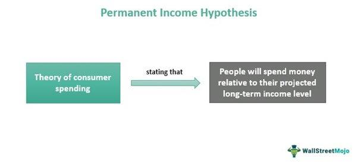

The Permanent Income Hypothesis (PIH), introduced by Nobel laureate Milton Friedman, is a fundamental economic theory that posits individuals base their consumption not on their current income but on their expected long-term average income. This theoretical framework has significantly shaped the understanding of consumer behavior by suggesting that people smooth consumption over their lifetime, adjusting their savings and expenditures in response to changes in their anticipated lifetime earnings rather than immediate income variations. By forecasting future income, individuals plan their consumption to maintain a stable living standard, which provides an essential lens through which economists interpret saving and spending patterns.

PIH's influence extends beyond theoretical applications, notably impacting how consumers make financial decisions. By expecting future income stability, individuals might borrow against anticipated future earnings or save during times of higher income, revealing a nuanced interaction between expected income and financial choices. These behaviors underline PIH's role in predicting consumption trends amidst economic fluctuations, influencing everything from household budgeting to broader economic policy considerations.



In recent years, the intersection of PIH with algorithmic trading has garnered attention. As financial markets increasingly rely on algorithm-driven processes, integrating economic theories like PIH into trading algorithms is a compelling area of exploration. By understanding consumer behavior through the lens of PIH, traders can potentially enhance algorithmic strategies to anticipate market movements better. This convergence of theory and technology aims to refine decision-making processes in trading by leveraging economic insights to forecast and react to consumer-driven market shifts.

This article aims to bridge the gap between traditional economic theory and modern trading practices by examining how PIH can inform algorithmic trading strategies. It outlines the foundational elements of the Permanent Income Hypothesis, analyzes its impact on consumer behavior, explores its integration within algorithmic trading, and presents case studies highlighting its application in market predictions. Furthermore, the discussion extends to the challenges and future directions in aligning PIH with algorithmic models, emphasizing the need for robust consumer data and advanced analytical tools. By doing so, the article promotes a deeper understanding of how enduring economic principles can inform and enhance contemporary financial market strategies.

## Table of Contents

## Understanding the Permanent Income Hypothesis

The Permanent Income Hypothesis (PIH), introduced by economist Milton Friedman in the mid-20th century, is a foundational concept in understanding consumer behavior related to income, saving, and spending. Friedman posited that individuals base their consumption decisions not on their current income, but on their expected average lifetime income, termed as permanent income. This deviation from relying solely on current income presents the idea that consumers are forward-looking, smoothing their consumption over time irrespective of short-term income fluctuations.

The core principle of the PIH is that consumption (C) at any point is determined by the permanent income (Y^P) rather than the transitory income (Y^T). Mathematically, this can be represented as:

$$
C = k \times Y^P
$$

where $k$ is the propensity to consume from permanent income, typically assuming a stable fraction of the permanent income over one's lifetime.

The hypothesis assumes that people differentiate between permanent changes in income and temporary changes. For instance, a temporary bonus at work might not significantly alter one's consumption patterns, as it constitutes transitory income. Conversely, a permanent raise would likely lead to an increase in consumption, aligning with the change in perceived long-term income.

This theory sheds light on the disconnect observed between income changes and immediate changes in expenditure. In practical applications, the PIH helps explain various economic phenomena, such as the apparent stability in consumer spending despite economic cycles marked by fluctuating incomes. For instance, during economic booms or recessions, while incomes can rise or fall sharply, consumption tends to be relatively stable, adhering more closely to the expectations of long-term wealth or income.

Historically, the PIH has been employed extensively to interpret segments of consumer behavior and has served as a tool for understanding macroeconomic policies' impacts on consumption. In empirical studies, economists often assess the PIH by examining consumer reactions to different types of income changes, attempting to distinguish permanent income shifts from temporary ones. Early research validating the hypothesis often focused on interpreting saving rates and consumption patterns across different income levels and time periods, presenting evidence in such contexts as post-war economic conditions.

One widely noted example includes insights drawn from the Great Depression and the subsequent economic recovery periods. Observations during these times illustrated that despite significant variations in income, consumption did not fluctuate proportionately, supporting the precedence of perceived permanent income over current incomes in consumer decision-making.

Overall, the PIH remains a significant economic theory, highlighting the nuanced nature of consumer behavior beyond mere reactionary expenditures to immediate income changes. Its relevance persists, informing both theoretical economic models and practical considerations in fiscal policy and financial planning.

## The Impact of PIH on Consumer Behavior

The Permanent Income Hypothesis (PIH), formulated by Milton Friedman, postulates that consumers base their consumption decisions on an estimate of their "permanent income," a long-term average of expected income, rather than their current income. This theory significantly impacts consumer behavior, suggesting a smoothing of consumption over time, even amidst fluctuations in actual income.

### Adjustment of Savings and Expenditure

Under PIH, consumers adjust their savings and expenditure to maintain a stable consumption pattern aligned with their permanent income. When actual income exceeds permanent income, consumers are likely to save the surplus rather than increase consumption proportionately. Conversely, if current income falls short, they may dip into savings or borrow to sustain their consumption level.

Mathematically, this can be represented by the equation:

$$
C_t = \alpha Y_t^p + (1-\alpha) S_{t-1}
$$

where $C_t$ is consumption at time $t$, $Y_t^p$ is permanent income, and $S_{t-1}$ is savings from the previous period. The parameter $\alpha$ denotes the marginal propensity to consume (MPC) out of permanent income.

### Discrepancies Between Short-term Income and Long-term Consumption

The PIH highlights discrepancies where short-term income fluctuations—due to bonuses, temporary layoffs, or economic downturns—do not directly translate into corresponding shifts in consumption patterns. This behavior manifests because consumers expect temporary income changes to revert, allowing them to adjust their savings rather than their consumption drastically. For instance, in times of economic uncertainty, while income may fluctuate, consumption remains comparatively stable if individuals perceive these changes as temporary.

### Case Studies on PIH Predictions

Numerous case studies demonstrate the applicability of PIH in forecasting consumer behaviors. During the Great Recession of 2008, many consumers in the United States demonstrated an adherence to PIH, maintaining steady consumption levels despite significant drops in income. Research has shown that households with a strong belief in the future recovery of their incomes continued to consume in patterns consistent with predictions by PIH, reinforcing the theory's predictive power.

### Criticisms and Limitations

Despite its insights, the PIH faces several criticisms. Some economists argue that the hypothesis assumes perfect foresight or rational expectations from consumers, which may not align with reality, where individuals often have incomplete information and cognitive biases. Additionally, [liquidity](/wiki/liquidity-risk-premium) constraints can prevent consumers from accessing savings or credit needed to smooth consumption in response to temporary income shortfalls.

Empirical studies point out situations where the PIH fails to account for actual behaviors, such as during credit crunches when consumers are unable to borrow against future income. Behavioral economics further complicates the picture, suggesting that psychological factors like present bias can lead to deviations from the PIH, where consumers might prioritize immediate gratification over long-term stability.

In conclusion, while the Permanent Income Hypothesis provides a robust framework to understand consumption patterns, it is essential to acknowledge its limitations due to consumer psychology and market imperfections. Continued research and case analysis are crucial to refining its application and addressing criticisms, particularly in the context of varying economic conditions and access to financial instruments.

## Algorithmic Trading and Economic Theories

Algorithmic trading, an influential component of modern financial markets, leverages complex algorithms to execute trades based on predefined criteria, often with speed and precision unattainable by human traders. This mechanism has seen exponential growth with advancements in computational power and access to vast amounts of financial data. Economic theories such as the Permanent Income Hypothesis (PIH) are increasingly being integrated into these algorithms to enhance decision-making processes.

The PIH, proposed by Milton Friedman, suggests that individuals base their consumption on expected long-term average income rather than current income. This theory provides valuable insights into consumer behavior, particularly in understanding the patterns of savings and expenditure over time. By incorporating the PIH into trading algorithms, financial systems may improve in predicting market trends which are often influenced by aggregate consumer behavior.

One way to integrate PIH into [algorithmic trading](/wiki/algorithmic-trading) is through constructing models that account for intermittent income adjustments by consumers, adjusting trade strategies according to these shifts. This can be achieved by creating predictive models that estimate consumers' permanent income levels and potential reactions to economic stimuli. For example, a model might analyze macroeconomic indicators such as employment rates or GDP growth to predict changes in consumer behavior.

Python, a popular language among data scientists, can be used to develop such models. Below is a simplified example of a Python function that could help predict consumer spending changes based on income expectations:

```python
def predict_spending(current_income, long_term_income_expectation):
    adjustment_factor = 0.1  # This factor can be modified based on historical data analysis
    expected_spending = long_term_income_expectation * (1 + adjustment_factor * (current_income - long_term_income_expectation))
    return expected_spending
```

The incorporation of PIH into trading algorithms presents both challenges and opportunities. A significant hurdle lies in the acquisition of accurate, high-frequency data that reflects real-time changes in consumer income expectations and behaviors. Additionally, translating these behavioral insights into actionable trading signals requires sophisticated models capable of adapting to dynamic market conditions.

Opportunities arise from the potential for enhanced predictive accuracy and risk management. By leveraging theories like PIH, traders can develop strategies that align more closely with economic realities, potentially leading to more robust portfolio performance and reduced market [volatility](/wiki/volatility-trading-strategies).

As algorithmic trading continues to evolve, integrating economic theories offers a pathway toward more informed and effective trading strategies. Future advancements may involve [machine learning](/wiki/machine-learning) and [artificial intelligence](/wiki/ai-artificial-intelligence) to refine models based on PIH, allowing for continuous improvement in algorithmic performance.

## Case Studies: PIH Applications in Algorithmic Trading

In recent years, the application of the Permanent Income Hypothesis (PIH) in algorithmic trading has garnered significant interest. PIH, proposed by Milton Friedman, posits that consumers base their consumption on long-term income expectations rather than immediate income fluctuations. This theory can be leveraged in trading algorithms to predict market movements by understanding consumer behavior trends, which ultimately influence economic indicators.

One prominent case study involves the design and testing of a trading algorithm that incorporates PIH to anticipate stock market responses to changes in consumer confidence indexes. By analyzing data on consumer expectations about their permanent income, algorithms were able to predict shifts in spending behavior, which in turn influenced market dynamics. The outcomes showed that while short-term fluctuations in consumer income did not necessarily correlate with market volatility, long-term adjustments aligned more closely with market trends.

The effectiveness of such algorithms hinges on the accurate processing of consumer behavior data. A successful approach involved aggregating data from surveys and retail spending reports to construct a comprehensive model of consumer expectations. By integrating PIH-driven insights, this model provided a more stable prediction framework for market movements, allowing traders to anticipate corrections and capitalize on trends with enhanced precision.

Notable successes of PIH applications in algorithmic trading include instances where firms were able to predict downturns during economic recessions more accurately. By understanding that consumers would adjust their consumption less in response to temporary income changes but more significantly if they perceived a long-term income alteration, algorithms could forecast prolonged market impacts following macroeconomic signals. This foresight facilitated more strategic asset allocations and risk management practices.

However, several challenges have been identified. One significant pitfall is the reliance on accurate and timely consumer behavior data. Any delays or inaccuracies in data collection can lead to flawed predictions. Additionally, the hypothesis's assumptions sometimes fall short in capturing irrational behaviors influenced by psychological factors or unforeseen economic shocks, such as geopolitical events or natural disasters, which can skew expected long-term income perceptions.

To address these challenges, ongoing advancements in data analytics and real-time processing are crucial. The integration of machine learning techniques offers promising avenues to refine PIH-based models. For example, algorithms can be trained on historical data to identify patterns and adapt to potential biases in consumer sentiment analysis more robustly. Furthermore, natural language processing enhances the ability to extract consumer insights from a broader array of sources, such as social media and news, thereby broadening the data spectrum and improving model accuracy.

In conclusion, while the integration of the Permanent Income Hypothesis within algorithmic trading presents both opportunities and challenges, the potential benefits underscore the value of continued research and technological advancement. By leveraging consumer behavior insights, trading algorithms can achieve a deeper understanding of market dynamics, ultimately leading to more informed and strategic trading decisions.

## Challenges and Future Directions

Integrating the Permanent Income Hypothesis (PIH) into algorithmic trading models poses several formidable challenges. A primary difficulty lies in obtaining and processing robust consumer data that truly reflects long-term income expectations. Traditional financial data often focus on current income and expenses, whereas PIH requires comprehensive data sets that can predict future income trends. This necessitates high-quality longitudinal data that captures consumer behavior over extended periods. Real-time analysis capabilities are also crucial, as they enable the timely adjustment of trading algorithms to reflect the latest consumer behavior and economic conditions.

Moreover, accurately substituting PIH into algorithmic models demands sophisticated computational techniques. This involves using historical data to estimate individuals' perceived permanent income, which can be challenging due to the dynamic nature of economic conditions. The necessity for models capable of adjusting to these variations introduces complexities in their design and implementation. For instance, machine learning and artificial intelligence (AI) could be instrumental in refining these strategies. By employing AI, trading algorithms can dissect vast and complex data sets to uncover patterns and predictions concerning consumer spending and saving behaviors underpinned by PIH.

Future research directions might explore the integration of advanced predictive analytics and AI to enhance PIH-based trading algorithms. This could involve developing machine learning algorithms that learn and adapt from ongoing data inputs to model income expectations more accurately. Current advancements in natural language processing (NLP) and sentiment analysis could also be leveraged to gauge consumer confidence and expectations more effectively.

Machine learning and AI present significant opportunities in refining PIH-based trading strategies. These technologies can provide deeper insights into consumer behavior by analyzing data from diverse sources, such as social media, news, and economic reports, to predict shifts in income expectations. Python libraries such as TensorFlow or PyTorch could be employed to build neural networks capable of learning from time series data and improving predictive accuracy.

```python
import tensorflow as tf
from tensorflow.keras.models import Sequential
from tensorflow.keras.layers import Dense, LSTM

# Sample code to outline an LSTM model for time series prediction
model = Sequential()
model.add(LSTM(50, activation='relu', input_shape=(n_timesteps, n_features)))
model.add(Dense(1))
model.compile(optimizer='adam', loss='mse')

# Assuming X_train and y_train are preprocessed time series data
model.fit(X_train, y_train, epochs=200, verbose=0)
```

Embracing machine learning and AI could facilitate more precise calibrations of trading algorithms vis-a-vis PIH by enabling the algorithms to discern and predict consumer behavior trends, ultimately leading to more informed and effective trading decisions. These technological advancements promise to transform the approach to integrating PIH with algorithmic trading, paving the way for more nuanced and responsive market strategies.

## Conclusion

The Permanent Income Hypothesis (PIH), consumer behavior, and algorithmic trading are intricately connected in the contemporary financial landscape. PIH, proposed by Milton Friedman, posits that individuals base their consumption patterns on expected long-term average income, rather than fluctuating current incomes. This theory profoundly impacts consumer behavior, influencing how individuals manage savings and spending over time. In the realm of algorithmic trading, PIH offers valuable insights into market behavior by providing a theoretical framework to predict long-term consumer spending trends, which can be critical in shaping trading strategies.

Economic theories like PIH offer significant insights that can improve financial market strategies. By understanding and anticipating consumer behavior patterns, traders can enhance algorithmic models to better predict and react to market movements. Incorporating these economic principles into algorithmic trading strategies allows for more informed decision-making processes, ultimately leading to more effective trading algorithms.

Further exploration and research in the integration of PIH into trading algorithms should be encouraged. As technological advancements continue to unfold, there is a growing potential to refine PIH-based strategies through enhanced data analysis and interpretation. Machine learning and artificial intelligence can be leveraged to process consumer behavior data in real-time, providing nuanced insights that were previously unattainable. These tools can increase the accuracy of predictions, presenting an exciting avenue for future research.

In conclusion, the evolving landscape of economics and trading presents both challenges and opportunities for the integration of PIH in algorithmic trading. By leveraging advancements in data analytics and machine learning, there is a promising future for optimizing these strategies. This exploration not only enhances the understanding of consumer behavior but also revolutionizes financial strategies, paving the way for innovative practices in the world of trading.

## References & Further Reading

[1]: Friedman, M. (1957). ["A Theory of the Consumption Function."](https://www.jstor.org/stable/1053667?newaccount=true) Princeton University Press.

[2]: Jappelli, T., & Pistaferri, L. (2010). ["The Consumption Response to Income Changes."](https://www.nber.org/papers/w15739) Annual Review of Economics.

[3]: Carroll, C. D. (2001). ["A Theory of the Consumption Function, With and Without Liquidity Constraints."](https://www.aeaweb.org/articles?id=10.1257/jep.15.3.23) Journal of Economic Perspectives, 15(3), 23-45.

[4]: Friedman, M. (1982). ["The Permanent Income Hypothesis."](https://www.nber.org/system/files/chapters/c4405/c4405.pdf) Handbook of Monetary Economics.

[5]: Thaler, R. H. (1980). ["Toward a Positive Theory of Consumer Choice."](https://www.sciencedirect.com/science/article/pii/0167268180900517) Journal of Economic Behavior & Organization, 1(1), 39-60.