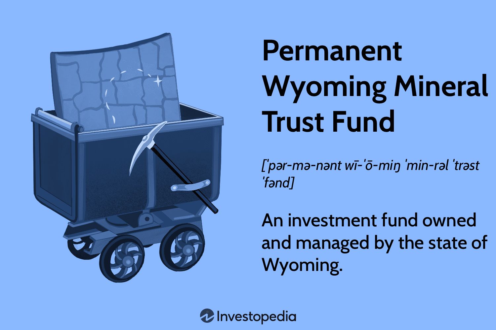

## Table of Contents

## What is the Permanent Wyoming Mineral Trust Fund?

The Permanent Wyoming Mineral Trust Fund is a special savings account set up by the state of Wyoming. It was created in 1974 to help save money from the state's mineral resources, like oil and gas. The idea is to use this money to help the state's budget in the future, especially when the mineral industry might not be doing as well.

The fund works by taking a part of the money the state earns from minerals and putting it into the fund. This money is then invested, and the earnings from these investments can be used to help pay for important things the state needs. This way, even if the mineral industry has tough times, Wyoming has some money saved up to keep things running smoothly.

## When was the Permanent Wyoming Mineral Trust Fund established?

The Permanent Wyoming Mineral Trust Fund was set up in 1974. It was made to help save money from Wyoming's mineral resources, like oil and gas. The main goal was to have money for the future, especially when the mineral industry might not be doing well.

The fund works by taking some of the money Wyoming earns from minerals and putting it into the fund. This money is then invested. The earnings from these investments can be used to help pay for important things the state needs. This way, Wyoming has money saved up to help keep things running smoothly, even if the mineral industry has tough times.

## What is the purpose of the Permanent Wyoming Mineral Trust Fund?

The Permanent Wyoming Mineral Trust Fund was created to save money from Wyoming's mineral resources, like oil and gas. The main goal is to have money for the future, especially when the mineral industry might not be doing well. By setting aside some of the earnings from minerals, the state can have a safety net for tough times.

The fund works by taking a part of the money Wyoming earns from minerals and putting it into the fund. This money is then invested. The earnings from these investments can be used to help pay for important things the state needs. This way, Wyoming has money saved up to help keep things running smoothly, even if the mineral industry faces challenges.

## How is the Permanent Wyoming Mineral Trust Fund funded?

The Permanent Wyoming Mineral Trust Fund gets its money from the state's mineral resources, like oil and gas. When Wyoming earns money from these minerals, a part of it goes into the fund. This helps save money for the future, so the state can have money even when the mineral industry is not doing well.

The money in the fund is then invested. The earnings from these investments can be used to help pay for important things the state needs. This way, Wyoming has a safety net to keep things running smoothly, even if the mineral industry faces tough times.

## Who manages the Permanent Wyoming Mineral Trust Fund?

The Permanent Wyoming Mineral Trust Fund is managed by the State of Wyoming. The Wyoming State Treasurer's Office is in charge of making sure the money in the fund is handled properly. They work with other state officials to decide how to invest the money and keep it safe for the future.

The State Loan and Investment Board, which includes the Governor, the Secretary of State, the Auditor, the Treasurer, and the Superintendent of Public Instruction, helps guide the decisions about the fund. They make sure the money is invested wisely and used in a way that helps Wyoming in the long run.

## What types of investments does the Permanent Wyoming Mineral Trust Fund make?

The Permanent Wyoming Mineral Trust Fund invests in many different things to grow the money it has. It puts money into safe investments like bonds, which are like loans to the government or big companies. These bonds pay back the money with interest over time. The fund also invests in stocks, which are pieces of ownership in companies. Stocks can go up or down in value, but they can also give the fund a chance to make more money.

Besides bonds and stocks, the fund might also invest in other things like real estate or special funds that focus on certain industries. The goal is to spread the money around so that if one type of investment does not do well, the others might help balance it out. The people who manage the fund always try to pick investments that will be safe and grow over time, so Wyoming has money for the future.

## How does the Permanent Wyoming Mineral Trust Fund benefit Wyoming residents?

The Permanent Wyoming Mineral Trust Fund helps Wyoming residents by saving money from the state's mineral resources, like oil and gas. This money is put into the fund and then invested in things like bonds and stocks. The earnings from these investments can be used to help pay for important things the state needs, like schools, roads, and other services. This means that even if the mineral industry has tough times, Wyoming can still have money to keep things running smoothly.

By having this fund, Wyoming residents can feel more secure about the future. The money saved and invested in the fund acts like a safety net. It helps make sure that the state can keep providing important services, even when times are hard. This way, the people of Wyoming can enjoy a stable and well-supported community, thanks to the careful planning and saving done through the Permanent Wyoming Mineral Trust Fund.

## What is the current value of the Permanent Wyoming Mineral Trust Fund?

The current value of the Permanent Wyoming Mineral Trust Fund is around $8.5 billion. This number can change because the fund's money is invested in things like stocks and bonds, which go up and down in value.

The fund helps Wyoming by saving money from the state's minerals, like oil and gas. This money is then used to help pay for important things the state needs, like schools and roads. It acts like a safety net, so even if the mineral industry has tough times, Wyoming can still have money to keep things running smoothly.

## How has the performance of the Permanent Wyoming Mineral Trust Fund been over the years?

The Permanent Wyoming Mineral Trust Fund has done well over the years. It started in 1974 and has grown a lot since then. The fund's money is put into things like stocks and bonds, which can go up and down. But overall, the fund has made good money. This has helped Wyoming have money for important things like schools and roads, even when the mineral industry is not doing well.

The fund's performance can change from year to year. Some years, it makes more money, and other years, it might not do as well. But the people who manage the fund try to pick safe and smart investments. This helps the fund grow over time. Right now, the fund is worth about $8.5 billion, which shows that it has been successful in saving and growing money for Wyoming's future.

## What are the legal and regulatory frameworks governing the Permanent Wyoming Mineral Trust Fund?

The Permanent Wyoming Mineral Trust Fund is set up and managed under the laws of Wyoming. The main law that controls the fund is the Wyoming Constitution, which says that a certain part of the money from minerals must go into the fund. This law helps make sure that the money is saved for the future and not spent all at once. The Wyoming State Legislature can also pass other laws that affect how the fund works, like changing the rules for how much money goes into the fund or how it can be used.

The State Loan and Investment Board (SLIB) helps guide how the money in the fund is invested. This board includes the Governor, the Secretary of State, the Auditor, the Treasurer, and the Superintendent of Public Instruction. They work together to pick safe and smart investments. The Wyoming State Treasurer's Office handles the day-to-day management of the fund. They make sure the money is handled properly and follows all the rules. This way, the fund can grow and help Wyoming in the long run.

## How does the Permanent Wyoming Mineral Trust Fund compare to similar funds in other states?

The Permanent Wyoming Mineral Trust Fund is like other funds in states that have a lot of natural resources, like oil and gas. For example, Alaska has the Alaska Permanent Fund, which also saves money from oil and uses it to help the state. Both funds work by putting money from minerals into a special account and then investing it. The main difference is that Wyoming's fund helps pay for things like schools and roads, while Alaska's fund gives money directly to its residents through a yearly dividend.

Another state with a similar fund is Texas, which has the Permanent School Fund and the Permanent University Fund. These funds use money from oil and gas to help schools and universities in Texas. Like Wyoming, Texas invests the money to make it grow over time. But Texas's funds are more focused on education, while Wyoming's fund helps with a wider range of state needs. All these funds show how states with natural resources try to save money for the future and use it wisely.

## What future challenges and opportunities does the Permanent Wyoming Mineral Trust Fund face?

The Permanent Wyoming Mineral Trust Fund faces challenges from changes in the oil and gas industry. If oil and gas prices go down a lot, Wyoming might not have as much money to put into the fund. This can make it hard for the fund to grow. Also, the fund's investments can go up and down. If the stock market has a bad year, the fund might lose money. But the people who manage the fund try to pick safe and smart investments to help it keep growing.

There are also opportunities for the fund. If oil and gas prices stay high, Wyoming can put more money into the fund. This can help it grow even faster. The fund can also invest in new kinds of things, like green energy or technology, which might be good for the future. By being smart about where to invest, the fund can keep helping Wyoming for a long time. It's all about balancing the challenges and making the most of the opportunities to keep the fund strong.

## References & Further Reading

[1]: ["Wyoming State Treasurer's Office, Permanent Wyoming Mineral Trust Fund"](https://www.investopedia.com/terms/p/permanent-wyoming-mineral-trust-fund.asp)

[2]: Plumer, B., & Popovich, N. (2017). ["As Coal Jobs Head Up, Wyoming Bets on the Future - The New York Times"](https://link.springer.com/article/10.1007/s10098-020-01985-x)

[3]: Lopez de Prado, M. (2018). ["Advances in Financial Machine Learning"](https://www.amazon.com/Advances-Financial-Machine-Learning-Marcos/dp/1119482089) 

[4]: Chan, E. P. (2009). ["Quantitative Trading: How to Build Your Own Algorithmic Trading Business"](https://github.com/egorpe/EPChan-QuantitativeTrading/blob/master/example7_6.m)

[5]: ["Codifying Algorithmic Trading Strategies"](https://www.quantifiedstrategies.com/algorithmic-trading/) Financial Analysts Journal, CFA Institute.

[6]: Wyoming State Treasurer's Office. (n.d.). ["Wyoming's Permanent Funds - Comprehensive Annual Financial Report"](https://www.rff.org/publications/reports/wyomings-energy-transformation/)