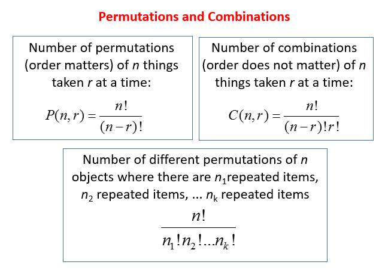

## Table of Contents

## What is a permutation?

A permutation is a way to arrange things in a specific order. Imagine you have a set of items, like the letters A, B, and C. A permutation of these letters could be ABC, ACB, BAC, BCA, CAB, or CBA. Each of these is a different way to order the letters.

Permutations are important in math and other fields because they help us understand how many different ways we can arrange things. For example, if you have five books and want to know how many ways you can line them up on a shelf, you would use permutations to figure that out. The number of permutations grows quickly as you add more items, which makes it a useful concept for solving complex problems.

## How do permutations differ from combinations?

Permutations and combinations both deal with arranging things, but they do it in different ways. Permutations care about the order of things. For example, if you have the numbers 1, 2, and 3, a permutation would count 123 and 213 as different because the order of the numbers is different. So, if you're trying to figure out how many ways you can arrange a set of items where the order matters, you use permutations.

Combinations, on the other hand, don't care about the order. Using the same numbers 1, 2, and 3, a combination would see 123 and 213 as the same thing because they include the same numbers, just in a different order. So, if you're trying to figure out how many ways you can pick a group of items where the order doesn't matter, you use combinations.

In simple terms, if the sequence of items matters, you're dealing with permutations. If the sequence doesn't matter and you just want to know what items are in the group, you're dealing with combinations.

## What is the basic formula for calculating permutations?

The basic formula for calculating permutations is simple. If you want to know how many ways you can arrange a certain number of items, you use the formula `n! / (n - r)!`. Here, `n` is the total number of items you have, and `r` is the number of items you want to arrange. The `!` symbol means "factorial," which is a way of multiplying numbers. For example, `5!` (5 factorial) is `5 x 4 x 3 x 2 x 1`, which equals 120.

Let's say you have 7 [books](/wiki/algo-trading-books) and you want to know how many ways you can arrange 3 of them on a shelf. You would use the formula like this: `7! / (7 - 3)!`. That's the same as `7! / 4!`. If you calculate it, `7!` is `7 x 6 x 5 x 4 x 3 x 2 x 1`, which equals 5040. And `4!` is `4 x 3 x 2 x 1`, which equals 24. So, `5040 / 24` gives you 210. That means there are 210 different ways to arrange 3 books out of 7 on a shelf.

## Can you explain the factorial notation used in permutations?

Factorial notation is a way to show a number multiplied by all the whole numbers smaller than it down to 1. For example, if you see the number 5 with an exclamation mark, written as 5!, it means you multiply 5 by 4, then by 3, then by 2, and finally by 1. So, 5! equals 5 x 4 x 3 x 2 x 1, which is 120. It's a quick way to write out a lot of multiplication.

In permutations, factorial notation helps us figure out how many ways we can arrange things. If you want to arrange all the items you have, you just use the factorial of the total number of items. But if you only want to arrange some of the items, you use the factorial of the total number of items divided by the factorial of the number of items you're not arranging. This makes it easier to solve problems about ordering things.

## What are the different types of permutations?

There are two main types of permutations: permutations with repetition and permutations without repetition. Permutations with repetition are when you can use the same item more than once in your arrangement. For example, if you're making a password and you can use the same letter or number more than once, that's a permutation with repetition. The formula for this is `n^r`, where `n` is the number of different items you can choose from, and `r` is the number of items in your arrangement.

Permutations without repetition are when you can't use the same item more than once. This is what we usually think of when we talk about permutations. For example, if you're arranging a set of books on a shelf and you can't use the same book twice, that's a permutation without repetition. The formula for this is `n! / (n - r)!`, where `n` is the total number of items, and `r` is the number of items you're arranging.

## How do you calculate permutations when there are repetitions?

When you calculate permutations with repetitions, you're looking at how many ways you can arrange things where you can use the same item more than once. Think of it like making a password where you can use the same letter or number multiple times. The formula for this is `n^r`, where `n` is the number of different items you can choose from, and `r` is the number of items in your arrangement. For example, if you have 3 letters (A, B, C) and you want to make a 2-letter password, you can use the formula `3^2`. That's 3 times 3, which equals 9. So, there are 9 different ways to make a 2-letter password with those 3 letters.

In the example, the 9 different passwords could be AA, AB, AC, BA, BB, BC, CA, CB, and CC. Each of these is a different arrangement, even though some letters are used more than once. This type of permutation is useful when you're working with things like passwords, codes, or any situation where using the same item multiple times is allowed.

## What is the permutation formula for a multiset?

A multiset is a set where you can have the same item more than once. When you want to find out how many ways you can arrange the items in a multiset, you use a special permutation formula. The formula is `n! / (n1! * n2! * ... * nk!)`, where `n` is the total number of items, and `n1`, `n2`, and so on up to `nk` are how many times each different item shows up in the multiset.

Let's say you have the word "BALL". Here, you have 4 letters total, but the letter L shows up twice. To find out how many ways you can arrange the letters in "BALL", you use the formula. You start with `4!`, which is 24. Then, you divide by `2!` because the L shows up twice. So, `2!` is 2. When you do the math, `24 / 2` equals 12. That means there are 12 different ways to arrange the letters in "BALL".

## Can you provide examples of permutations in real-life scenarios?

Imagine you're at a race track and you want to bet on which horses will finish in the top three spots. The order in which the horses finish matters a lot because "Horse A, then Horse B, then Horse C" is different from "Horse C, then Horse B, then Horse A". This is a real-life example of permutations because you're looking at different ways to arrange the horses in a specific order. If there are 10 horses in the race, you can use permutations to figure out how many different ways the top three could finish.

Another example is when you're setting the combination lock on your bike or locker. If the lock has three numbers, like 10-20-30, that's different from 30-20-10 because the order matters. You need to turn the dial to the right numbers in the right order to open it. This is another way permutations show up in everyday life. You can use permutations to figure out how many different combinations you could set on your lock, which helps keep your bike or locker safe.

## How do circular permutations differ from linear permutations?

Circular permutations are different from linear permutations because they deal with arranging things in a circle instead of a straight line. In a linear permutation, if you have three items, like A, B, and C, you can arrange them in different orders like ABC, ACB, BAC, BCA, CAB, and CBA. Each of these is a different arrangement because the order matters. But in a circular permutation, if you arrange A, B, and C in a circle, ABC and BCA would be considered the same because they look the same when you move around the circle. So, you have to think about how things look when they're arranged in a loop.

To figure out the number of circular permutations, you use a different formula. For linear permutations, you use `n!` if you're arranging all the items, or `n! / (n - r)!` if you're arranging some of them. But for circular permutations, you use `(n-1)!` if you're arranging all the items. This is because rotating the circle doesn't create a new arrangement. For example, if you have 4 people sitting around a table, you can arrange them in `(4-1)!` ways, which is `3!` or 6 ways. This makes circular permutations a bit trickier but also interesting because they show up in real life, like seating people at a round table or arranging items on a circular track.

## What are some advanced permutation techniques used in competitive programming?

In competitive programming, one advanced permutation technique is the use of next permutation algorithms. These algorithms help you find the next lexicographically greater permutation of a given sequence. For example, if you have the numbers 1, 2, 3, the next permutation would be 1, 3, 2. This technique is useful in problems where you need to generate all possible permutations in a specific order. You start with the smallest permutation and keep finding the next one until you reach the largest permutation. This method is efficient and can be used to solve problems that involve checking all possible arrangements of a set of items.

Another technique is the use of inversion counting, which is important in problems related to sorting and ranking permutations. Inversion counting helps you find out how many pairs of elements in a list are out of their natural order. For example, in the list 3, 1, 2, the pair (3, 1) and (3, 2) are inversions because 3 comes before both 1 and 2, which is not the usual order. By counting inversions, you can figure out how far a permutation is from being sorted, which can help in algorithms like merge sort or in problems where you need to find the rank of a permutation among all possible permutations.

## How can permutations be applied in cryptography?

Permutations are really important in cryptography, which is all about keeping messages secret. One way they're used is in making codes that can mix up the letters or numbers in a message. For example, if you have a simple code where each letter in your message is swapped with another letter based on a specific order, that's using a permutation. This can make it hard for someone who doesn't know the code to read your message. In more advanced cryptography, like the Enigma machine used during World War II, permutations were used to scramble messages in very complex ways, making them even harder to crack.

Another way permutations are used in cryptography is in creating keys for encryption. A key is like a secret code that you use to lock and unlock your message. By using permutations, you can create a lot of different keys, which makes it harder for someone to guess the right one. For example, if you have a set of numbers or letters that you can arrange in different ways, each arrangement can be a different key. This means you can have a lot of different keys, which adds an extra layer of security to your encrypted messages.

## What are the computational complexities involved in generating permutations?

Generating all permutations of a set of items can take a lot of time and computer power. If you have `n` items, the number of permutations you need to generate is `n!`, which grows really fast. For example, if you have 10 items, you need to generate 3,628,800 different permutations. This means that as the number of items gets bigger, it takes much longer to generate all the permutations. The time it takes to generate all permutations is usually considered to be O(n!), which means the time grows factorially with the number of items. This can make it hard to generate all permutations for large sets of items because it takes too long.

To make things a bit easier, computer scientists have come up with smarter ways to generate permutations. One common method is to use an algorithm that finds the next permutation in a sequence, like the "next permutation" algorithm. This way, you don't have to generate all permutations at once, but you can generate them one at a time. This can be much faster and use less memory. Even with these smarter methods, generating permutations can still be slow for very large sets of items, but it's a lot more doable than trying to generate all permutations at once.

## Why does order matter in permutations versus combinations?

In mathematics, understanding the difference between permutations and combinations is crucial, especially when applied to [algorithmic trading](/wiki/algorithmic-trading). Permutations involve arrangements where the order of elements is significant. Mathematically, the number of permutations of arranging $r$ elements out of $n$ available is given by:

$$
P(n, r) = \frac{n!}{(n-r)!}
$$

where $n!$ (n factorial) represents the product of all positive integers up to $n$. This calculation is essential in scenarios requiring specific orderings, such as assessing the sequence of trade executions in algorithmic trading.

Combinations, however, refer to the selection of elements where order is not a concern. The formula for combinations is:

$$
C(n, r) = \frac{n!}{r!(n-r)!}
$$

The distinction between permutations and combinations is significant in trading strategies. In algorithmic trading, employing permutations is vital when the precise sequence of trades can influence the trading outcome, for instance, in optimizing the execution path to minimize transaction costs or slippage. Conversely, combinations might be used when selecting a subset of trades from a larger set, where the sequence is irrelevant but the selection matters, such as determining the optimal set of assets to include in a diversified portfolio.

Considering an example, suppose a trader needs to execute trades for three different stocks, A, B, and C. If the trader is concerned with the order of execution to possibly impact market prices, permutations are used. All possible orders (A-B-C, A-C-B, B-A-C, etc.) may need evaluation to determine the most cost-effective sequence.

In contrast, if the trader is looking to pick two stocks to track for correlation analysis, combinations are applicable since the order of selection (A-B is the same as B-A) does not impact the analysis.

Understanding these mathematical concepts aids in structuring trading algorithms to meet specific conditions encountered in financial markets. For example, a Python script might be employed to generate permutations of trade orders to evaluate different execution sequences:

```python
import itertools

stocks = ['A', 'B', 'C']
permutations = list(itertools.permutations(stocks))
print(permutations)
```

Additionally, combinations of asset allocations in a portfolio can be computed, which does not consider order:

```python
from itertools import combinations

stock_combinations = list(combinations(stocks, 2))
print(stock_combinations)
```

Employing both permutations and combinations in algorithmic trading strategies enables the development of robust systems adept at navigating market complexities. Recognizing when and how to apply these concepts can significantly enhance a trader's ability to capitalize on market opportunities while minimizing risk through optimized decision-making processes.

## What are the Mathematical Strategies Used in Developing Trading Algorithms?

Effective algorithmic trading strategies rely heavily on mathematical principles, including probability, [statistics](/wiki/bayesian-statistics), and permutations. These quantitative techniques enable traders to devise algorithms that can minimize risks and optimize profitability in highly dynamic financial markets.

Incorporating mathematical rigor alongside algorithmic precision begins with understanding the stochastic nature of markets. Probability theory plays a crucial role in predicting market movements, where algorithms often use historical data to calculate the likelihood of future price shifts. Statistical methods help identify patterns and relationships within large datasets, guiding the development of predictive models.

Permutations are particularly valuable when evaluating all possible sequences of trade executions. Algorithm development might involve generating different permutations to simulate trade outcomes under varying conditions, optimizing the order in which trades are executed to achieve the best possible performance. For example, in a trading strategy where the sequence of asset purchases impacts returns, permutations help identify the most effective sequence.

Case studies highlight how combinatorics and permutations are utilized in successful trading strategies. A notable example is portfolio optimization, where the goal is to achieve the best possible trade-off between expected returns and risk. Traders apply permutations to assess different portfolio rebalancing strategies, determining the optimal allocation of assets to maximize returns or minimize risks. This approach often employs the Sharpe ratio, a measure of risk-adjusted return, calculated as:

$$
\text{Sharpe Ratio} = \frac{E[R_p] - R_f}{\sigma_p}
$$

where $E[R_p]$ is the expected portfolio return, $R_f$ is the risk-free rate, and $\sigma_p$ is the standard deviation of portfolio returns.

Real-time trading environments implement these mathematical strategies using advanced computational techniques. High-frequency trading, for instance, utilizes mathematical models to analyze vast quantities of data and execute trades within microseconds, capitalizing on fleeting market opportunities. This requires not only robust algorithms but also high computational resources and sophisticated execution systems.

Looking to the future, the importance of mathematical proficiency in algorithmic trading is expected to grow. As datasets become larger and more complex, and market conditions continue to evolve unpredictably, advanced skills in mathematics will be crucial for developing algorithms capable of adapting to new challenges. Additionally, emerging fields like [machine learning](/wiki/machine-learning) and [artificial intelligence](/wiki/ai-artificial-intelligence) are increasingly integrated with traditional mathematical methods to create hybrid models that further enhance trading strategy effectiveness.

In summary, an intricate understanding of mathematical concepts, such as permutations and combinatorics, remains central to the development and implementation of successful trading algorithms. As the field advances, these skills will be vital for staying competitive in the rapidly evolving landscape of algorithmic trading.

## References & Further Reading

[1]: ["Introduction to Algorithms"](https://drive.google.com/file/d/0B3RHrbxFb7PfYjk4ZG01Z3lrbnc/view) by Thomas H. Cormen, Charles E. Leiserson, Ronald L. Rivest, and Clifford Stein

[2]: ["Algorithmic Trading and DMA: An Introduction to Direct Access Trading Strategies"](https://www.amazon.com/Algorithmic-Trading-DMA-introduction-strategies/dp/0956399207) by Barry Johnson

[3]: Knuth, D. E. (1997). ["The Art of Computer Programming, Volume 4A: Combinatorial Algorithms, Part 1."](https://books.google.com/books/about/The_Art_of_Computer_Programming.html?id=IkuEBAAAQBAJ) Addison-Wesley Professional.

[4]: ["Combinatorics and Graph Theory"](https://www.whitman.edu/mathematics/cgt_online/cgt.pdf) by John M. Harris, Jeffry L. Hirst, and Michael J. Mossinghoff

[5]: Narang, R. K. (2013). ["Inside the Black Box: A Simple Guide to Quantitative and High Frequency Trading."](https://onlinelibrary.wiley.com/doi/book/10.1002/9781118662717) Wiley.