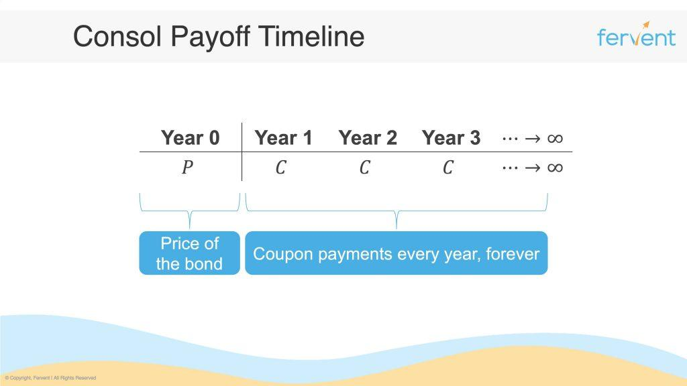

The financial landscape has undergone significant transformation over the years, adapting to the demands of diverse investor needs with the emergence of novel instruments and strategies. Among these, perpetual bonds, bond valuation, and algorithmic trading stand out as pivotal components that significantly influence modern finance.

Perpetual bonds, often termed 'perps', are unique fixed-income securities distinguished by their lack of a maturity date. These instruments offer investors indefinite interest payments, creating a steady income stream. Their perpetual nature likens them to equity, presenting both opportunities and challenges. The evolution and utilization of perpetual bonds manifest the dynamic nature of the bond market, which requires careful examination to optimize their potential.



Bond valuation, another key aspect, allows investors to ascertain the intrinsic value of bonds, including perpetual bonds. This process involves calculating the present value of future cash flows, ensuring informed investment decisions. By applying valuation formulas, such as $PV = \frac{D}{r}$, where $D$ represents the coupon payment and $r$ the discount rate, investors can better understand a bond's worth. The choice of discount rate, influenced by factors such as market conditions and issuer’s credit risk, is critical in accurately determining value.

Algorithmic trading has revolutionized financial markets by integrating sophisticated mathematical models to automate trading decisions. In the bond market, algorithmic trading introduces efficiency by rapidly analyzing vast amounts of data, identifying pricing opportunities, and executing trades at optimal prices. These algorithms not only enhance the precision and speed of trading decisions but also offer a method to manage complex portfolios effectively.

Understanding the interplay between perpetual bonds, bond valuation, and algorithmic trading can significantly enhance investment decision-making and optimize portfolio performance. This article aims to explore the complexities of perpetual bond finance, outline methodologies for bond valuation, and discuss the role of algorithmic trading. By examining how these components interact, we aim to provide comprehensive insights into their implications for investors, ultimately aiding in the development of informed strategies and superior financial outcomes.

## Table of Contents

## Understanding Perpetual Bonds

Perpetual bonds, commonly referred to as 'perps', occupy a unique space within the fixed-income securities market. These financial instruments are characterized by the absence of a maturity date, obligating the issuer to make interest payments indefinitely. Unlike traditional bonds that return the principal amount upon maturity, perpetual bonds provide a continuous stream of income to the bondholder, akin to dividends paid by equities.

A defining feature of perpetual bonds is their similarity to equity instruments. This arises from their perpetual nature and the ongoing interest payments that mimic dividend yields. The benefit of investing in perpetual bonds lies primarily in the predictability of income. Since these bonds do not have a termination date, they can serve as a reliable source of interest income, appealing to investors seeking long-term cash flow stability.

However, the perpetual nature of these bonds introduces certain drawbacks. The most significant disadvantage is the absence of principal repayment, which can be a critical consideration for investors who prioritize capital recovery. Additionally, perpetual bonds are often subject to call provisions, permitting issuers to redeem the bonds after a specified period, which introduces reinvestment risk for bondholders.

Historically, perpetual bonds have served a niche role in the bond market. Notable issuances, such as those by the United Kingdom's Consols or the Dutch Water Board bonds, have demonstrated the utility and scope of perpetual bonds in raising long-term capital. These examples highlight the capacity of perpetual bonds to facilitate significant financial undertakings without the constraints of repayment timelines.

Understanding the characteristics of perpetual bonds is essential before examining their valuation. The perpetual interest stream necessitates a unique approach to valuation, differing from finite-term bonds. This understanding provides a clear perspective on how perpetual bonds function within investment portfolios and their strategic importance in financial planning.

## Valuing Perpetual Bonds

Valuing a perpetual bond requires calculating the present value of an endless series of cash flows, which in this context are the interest payments. The valuation formula employed is $PV = \frac{D}{r}$, where $PV$ is the present value of the bond, $D$ represents the annual coupon payment, and $r$ is the discount rate. This formula aligns with the concept that the present value of a perpetual bond is equivalent to the division of the periodic payment by the discount rate, reflecting an infinite series converging to this ratio.

The selection of the appropriate discount rate ($r$) is a pivotal aspect of bond valuation. It is affected by various factors, including prevailing market conditions and the issuer's credit risk. The discount rate generally reflects the required rate of return for an investment with similar risk characteristics. Market interest rates and the bond's inherent risk profile significantly impact the choice of discount rate. When market interest rates rise, the value of the bond decreases, and conversely, if market interest rates fall, the bond's value goes up. Thus, fluctuations in interest rates critically affect bond valuation.

Beyond interest rates, the issuer's financial stability is a crucial determinant in perpetual bond valuation. A higher credit risk associated with an issuer often necessitates a higher discount rate, lowering the bond's present value. Conversely, a financially stable issuer with a solid credit rating might allow for a lower discount rate, increasing the bond's valuation.

To enhance the accuracy of the bond's intrinsic value, thorough analysis and application of various bond valuation techniques are essential. These methods may include scenario analysis to evaluate bond prices under different market conditions, sensitivity analysis to assess the impact of changes in interest rates or credit spreads, and other advanced quantitative techniques to account for uncertainties in cash flows or market [volatility](/wiki/volatility-trading-strategies).

In summary, valuing perpetual bonds is a multifaceted process where understanding the impact of interest rates, issuer's credit risk, and market conditions is crucial. Selecting the appropriate discount rate and incorporating comprehensive valuation techniques can vastly improve the precision of a perpetual bond's value assessment.

## The Role of Algorithmic Trading in Bond Markets

Algorithmic trading has significantly transformed financial markets, encompassing bond trading through utilizing sophisticated mathematical models. By automating and optimizing trading strategies, algorithms offer a means to navigate the complexities of contemporary bond markets efficiently.

The utilization of algorithms enables the swift analysis of vast quantities of market data, allowing for rapid identification and exploitation of pricing inefficiencies. For instance, algorithms can detect discrepancies in bond prices across different markets or trading platforms, capitalizing on [arbitrage](/wiki/arbitrage) opportunities that may be too fleeting for manual traders to exploit. This capability is particularly advantageous in the bond market, where price differences can be subtle and timing is crucial.

Algorithmic trading amalgamates advanced data analytics with trading execution, enhancing both precision and speed in decision-making processes. Machine learning techniques and [artificial intelligence](/wiki/ai-artificial-intelligence) further refine these algorithms, enabling continuous improvement and adaptation to changing market conditions. These technologies can process historical data and current market conditions to forecast trends and adjust trading strategies in real-time.

However, the integration of algorithmic models in bond trading is not without its challenges. The complexity of bond markets, with their diverse instruments and [liquidity](/wiki/liquidity-risk-premium) profiles, requires robust algorithms capable of managing risk and optimizing trade execution. Additionally, regulatory considerations must be addressed, as the high-speed nature of [algorithmic trading](/wiki/algorithmic-trading) poses potential risks, such as market manipulation or systemic disruptions.

Despite these challenges, the benefits of employing algorithmic trading in bond markets are substantial. Automating routine trading tasks allows traders to focus on nuanced strategic decisions and enhances portfolio management through continuous monitoring and adjustment. As the financial industry increasingly incorporates technology, the role of algorithms in bond trading is poised to expand, offering substantial opportunities for efficiency and profitability improvements.

In conclusion, algorithmic trading represents a pioneering advance in bond markets, marking a significant shift towards greater technological integration and data-driven strategies. The future promises continued evolution and refinement of these techniques, further embedding them as essential tools in the financial landscape.

## Integrating Perpetual Bonds, Valuation, and Algo Trading

The integration of perpetual bonds, bond valuation strategies, and algorithmic trading represents an innovative confluence of these financial techniques, creating unique opportunities for investors seeking to enhance portfolio diversification and optimize returns. The utilization of algorithmic trading in perpetual bonds has introduced a higher level of precision in valuation methodologies, allowing investors to make more informed investment decisions.

Perpetual bonds, due to their indefinite maturity, require a distinctive approach to valuation. Traditional methods rely heavily on calculating the present value of endless cash flows, a process that inherently involves uncertainties related to the selection of an appropriate discount rate. Algorithmic models facilitate this valuation process by systematically integrating both qualitative and quantitative data elements, such as market sentiment analysis and issuer credit ratings. For instance, a Python-based algorithm might employ [machine learning](/wiki/machine-learning) techniques to analyze historical [interest rate](/wiki/interest-rate-trading-strategies) patterns and predict future trends that affect discount rates. The pseudo-code might look like this:

```python
from sklearn.linear_model import LinearRegression
import numpy as np

# Sample data: interest rates over time
interest_rates = np.array([...])  # historical data
time_periods = np.array([...])  # corresponding time periods

# Create and fit the model
model = LinearRegression()
model.fit(time_periods.reshape(-1, 1), interest_rates)

# Predict future interest rates
future_time_periods = np.array([...])
predicted_rates = model.predict(future_time_periods.reshape(-1, 1))
```

This combination of algorithmic trading and advanced analytics provides investors with a nuanced understanding of perpetual bond valuation across various market conditions. Investors can leverage these insights to develop sophisticated risk management strategies and to identify pricing inefficiencies that arise due to market fluctuations or liquidity variances.

Current industry trends underscore a growing reliance on technology and data analytics in optimizing bond portfolios. The implementation of algorithmic trading strategies has made it possible for investors to react swiftly to market changes, capitalize on arbitrage opportunities, and manage complex portfolios with greater ease. Furthermore, these technological advancements contribute to a more efficient and transparent bond market, ultimately benefiting all market participants.

The integration of perpetual bonds, valuation models, and algorithmic trading signifies a shift towards a more technologically driven investment landscape. Mastery of these domains equips investors to exploit emerging opportunities, manage risks more effectively, and achieve superior financial outcomes. As technology continues to evolve, it is imperative for market participants to remain agile and adept at integrating these advancements to enhance investment strategies in the bond markets.

## Conclusion

Perpetual bonds, bond valuation techniques, and algorithmic trading jointly provide a comprehensive framework for navigating the complexities of contemporary finance. These components offer investors the tools to effectively respond to evolving market dynamics. A deep understanding of perpetual bonds, which provide ongoing interest payments without principal repayment, alongside sophisticated valuation strategies, equips investors to assess intrinsic bond value accurately. The inclusion of algorithmic trading further empowers investors by enabling the rapid analysis and execution of trades, leveraging data analytics to optimize timing and pricing.

The integration of technology and finance signifies a transformative shift in bond investing. As markets become increasingly data-driven, the interplay between perpetual bonds, precise valuation methodologies, and algorithmic trading can reshape the parameters of risk and return. Investors can capitalize on algorithmic insights to manage risks more effectively and identify opportunities for enhanced portfolio performance.

Strategic application of these financial innovations can significantly boost outcomes in bond markets. By harnessing quantitative models and market data, investors can refine their strategies to achieve better returns while mitigating risk exposure. This approach ensures that financial decisions are informed by a wealth of information, maximizing efficiency and efficacy.

Continued exploration and innovation within these domains promise to drive advancements in both investment performance and financial theory. As market conditions and technologies evolve, so too will the methodologies and strategies employed in bond investing. These ongoing developments will not only enhance investment results but also contribute to a deeper understanding of market mechanics and economic behavior, fostering an environment of continuous learning and adaptation for investors and theorists alike.

## References & Further Reading

[1]: Fabozzi, F. J. (2007). ["Fixed Income Analysis"](https://books.google.com/books/about/Fixed_Income_Analysis.html?id=lujLawVLS3YC). John Wiley & Sons.

[2]: ["Advances in Financial Machine Learning"](https://www.amazon.com/Advances-Financial-Machine-Learning-Marcos/dp/1119482089) by Marcos Lopez de Prado.

[3]: Sack, Brian, and Brian Smith. (2001). ["The Use of Long-Term Interest Rates Followed by the Federal Reserve Board."](https://www.federalreserve.gov/pubs/feds/2003/200350/200350pap.pdf) Finance and Economics Discussion Series 2001-31.

[4]: ["Machine Learning for Algorithmic Trading"](https://github.com/stefan-jansen/machine-learning-for-trading) by Stefan Jansen.

[5]: ["Quantitative Trading: How to Build Your Own Algorithmic Trading Business"](https://www.amazon.com/Quantitative-Trading-Build-Algorithmic-Business/dp/1119800064) by Ernest P. Chan.

[6]: Jensen, Michael C., and William H. Meckling. (1976). ["Theory of the Firm: Managerial Behavior, Agency Costs and Ownership Structure."](https://www.sciencedirect.com/science/article/pii/0304405X7690026X) Journal of Financial Economics, 3(4), 305-360.