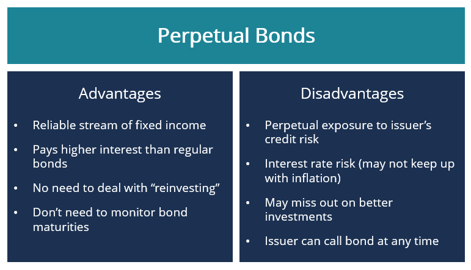

## Table of Contents

## What are perpetual bonds?

Perpetual bonds are a type of bond that doesn't have a maturity date. This means that the bond can keep going forever, and the issuer doesn't have to pay back the principal amount to the investor. Instead, the issuer pays interest to the bondholder regularly, usually every year or every six months. These bonds are also called "perps" or "perpetuals."

Because perpetual bonds don't have a maturity date, they can be riskier than other bonds. If interest rates go up, the value of the bond can go down. But, some investors like perpetual bonds because they can offer higher interest payments than other bonds. Companies and governments sometimes issue perpetual bonds to get money without having to pay it back in a lump sum later.

## How do perpetual bonds differ from traditional bonds?

Perpetual bonds and traditional bonds are different in some big ways. The biggest difference is that perpetual bonds don't have a maturity date. This means that the issuer doesn't have to pay back the money they borrowed from the investor. Instead, they just keep paying interest to the investor forever. Traditional bonds, on the other hand, do have a maturity date. When that date comes, the issuer has to pay back the principal amount to the investor, along with the last interest payment.

Another difference is the risk and reward. Perpetual bonds can be riskier because there's no promise that the issuer will ever pay back the principal. If interest rates go up, the value of the perpetual bond can go down. But, to make up for this risk, perpetual bonds often offer higher interest rates than traditional bonds. Traditional bonds are usually seen as safer because the investor knows they will get their money back at the end, as long as the issuer doesn't default. So, investors might choose perpetual bonds if they want higher interest payments, but they need to be okay with the extra risk.

## What are the key features of perpetual bonds?

Perpetual bonds are special because they don't have an end date. This means the people who borrow the money don't have to pay it back all at once. Instead, they pay interest to the people who bought the bonds forever, or until they decide to buy the bonds back. This can be good for the borrowers because they don't have to worry about paying a big amount back at one time.

These bonds can be riskier for the people who buy them. Since there's no end date, if interest rates go up, the value of the perpetual bond can go down. But, to make up for this risk, perpetual bonds usually offer higher interest payments than other bonds. So, people who buy perpetual bonds might get more money from interest, but they also need to be okay with the chance that the bond's value might drop.

## Who typically issues perpetual bonds?

Banks and big companies often issue perpetual bonds. They do this to get money without having to pay it back all at once. This can help them keep their money flowing without worrying about a big payment coming up. Sometimes, governments also issue perpetual bonds, especially if they need money for a long time and don't want to pay it back in a lump sum.

Investors who buy perpetual bonds are usually looking for higher interest payments. They know there's more risk because the bond doesn't have an end date, but the higher interest can make it worth it. This makes perpetual bonds attractive to people who want to earn more from their investments and are willing to take on extra risk.

## What are the benefits of investing in perpetual bonds?

One big benefit of investing in perpetual bonds is that they often offer higher interest payments than regular bonds. Since these bonds don't have an end date, the people who issue them have to make the interest payments attractive to get investors to buy them. This means that if you're looking to earn more money from your investments, perpetual bonds can be a good choice.

Another benefit is that perpetual bonds can provide a steady stream of income. As long as the issuer keeps paying the interest, you can count on getting regular payments. This can be really helpful if you're planning for the future and need a reliable source of income. Just remember, though, that there's more risk because the bond doesn't have a maturity date, so you need to be okay with that.

## What are the risks associated with perpetual bonds?

One big risk with perpetual bonds is that they don't have an end date. This means the people who issue the bonds don't have to pay back the money you lent them. If the company or bank that issued the bond runs into trouble, they might stop paying the interest, and you could lose your investment. Also, because there's no end date, if interest rates go up, the value of your perpetual bond can go down. This is because new bonds might offer higher interest rates, making your bond less attractive to other investors.

Another risk is that perpetual bonds can be hard to sell. Since they don't have a maturity date, it can be tough to find someone else who wants to buy them from you. This means you might have to sell them for less than you paid if you need your money back quickly. So, it's important to think about whether you're okay with keeping your money tied up in these bonds for a long time.

## How is the interest paid on perpetual bonds?

Interest on perpetual bonds is paid regularly, usually every year or every six months. The people who issue the bonds, like banks or big companies, make these interest payments to the people who bought the bonds. This interest is often called a "coupon" payment, and it's a way for the issuer to keep paying the bondholder without ever paying back the money they borrowed.

The amount of interest paid on perpetual bonds is usually higher than what you'd get from regular bonds. This is because perpetual bonds don't have an end date, so the issuer has to make the interest payments attractive to get people to buy them. As long as the issuer keeps making these payments, the bondholder gets a steady stream of income. But if the issuer runs into trouble and stops paying, the bondholder could lose their investment.

## Can perpetual bonds be redeemed, and if so, how?

Yes, perpetual bonds can be redeemed, but it's not as simple as with regular bonds. The people who issue perpetual bonds, like banks or big companies, usually have the option to buy back the bonds at certain times. This is called a "call option." They might decide to do this if interest rates go down, because then they can borrow money more cheaply by issuing new bonds with lower interest rates.

When a perpetual bond is redeemed, the issuer pays back the money to the bondholder, usually at a set price called the "call price." This price can be more or less than what the bondholder originally paid for the bond. But, the issuer doesn't have to redeem the bond if they don't want to. So, bondholders need to be ready for the possibility that they might never get their money back, and they'll just keep getting interest payments forever.

## How do perpetual bonds fit into a diversified investment portfolio?

Perpetual bonds can be a good addition to a diversified investment portfolio because they offer something different from other investments. They pay higher interest than regular bonds, which can help boost the income you get from your investments. This can be really helpful if you're looking for a steady stream of money over a long time. But, because perpetual bonds don't have an end date, they come with more risk. So, they can balance out safer investments like regular bonds or savings accounts, making your overall portfolio a bit riskier but potentially more rewarding.

Adding perpetual bonds to your portfolio can also help spread out your risk. If you have a mix of different types of investments, like stocks, regular bonds, and maybe some real estate, adding perpetual bonds can make your portfolio even more diverse. This means that if one type of investment doesn't do well, the others might help make up for it. Just remember, because perpetual bonds can be hard to sell and their value can go down if interest rates change, you need to think carefully about how much of your money you want to put into them.

## What historical examples illustrate the use of perpetual bonds?

One famous example of perpetual bonds is from the British government. In the 18th century, they issued something called the "Consols." These were perpetual bonds that paid a fixed [interest rate](/wiki/interest-rate-trading-strategies) forever. The British government used the money from these bonds to help pay for wars and other big expenses. People liked buying Consols because they got a steady income from the interest payments. The British government finally paid off the last of the Consols in 2015, more than 200 years after they were first issued.

Another example comes from big companies and banks. For instance, in the early 2000s, banks like Bank of America and companies like Coca-Cola issued perpetual bonds. They did this to raise money without having to worry about paying it back all at once. Investors were happy to buy these bonds because they offered higher interest rates than regular bonds. This made perpetual bonds a popular choice for investors looking for more income from their investments.

## How do changes in interest rates affect the value of perpetual bonds?

Changes in interest rates can have a big impact on the value of perpetual bonds. When interest rates go up, new bonds that are issued will offer higher interest payments. This makes the older perpetual bonds less attractive because they pay less interest. As a result, the value of the perpetual bonds goes down. People who want to sell their perpetual bonds might have to do so for less money than they paid for them.

On the other hand, when interest rates go down, the value of perpetual bonds can go up. This is because the interest payments from the perpetual bonds become more attractive compared to the lower interest rates on new bonds. Investors might be willing to pay more for the perpetual bonds because they offer a better return. So, the value of the perpetual bonds increases as interest rates fall.

## What advanced financial models are used to value perpetual bonds?

To figure out how much a perpetual bond is worth, people often use a simple model called the perpetuity formula. This formula says that the value of a perpetual bond is the yearly interest payment divided by the interest rate that investors want. For example, if a bond pays $50 every year and investors want a 5% return, the bond's value would be $50 divided by 0.05, which is $1,000. This model is easy to use but it assumes that the interest rate stays the same forever, which isn't always true.

A more advanced way to value perpetual bonds is to use something called the discounted cash flow (DCF) model. This model takes into account that interest rates can change over time. It looks at all the future interest payments the bond will make and figures out what they're worth today by "discounting" them back using different interest rates. This can give a more accurate picture of the bond's value because it considers how interest rates might go up or down in the future. But, it's more complicated to use because you have to guess what interest rates will do, which can be hard to get right.

## References & Further Reading

[1]: Hendershott, T., Jones, C. M., & Menkveld, A. J. (2011). ["Does Algorithmic Trading Improve Liquidity?"](https://onlinelibrary.wiley.com/doi/full/10.1111/j.1540-6261.2010.01624.x) *The Journal of Finance*, 66(1), 1–33.

[2]: ["The Most Important Concepts in Finance (Financial Markets Explained)"](https://www.investopedia.com/terms/f/financial-market.asp) by CFA Institute 

[3]: ["Perpetual Bonds: Definition, Pros and Cons"](https://www.financestrategists.com/wealth-management/bonds/perpetual-bonds/) at Investopedia

[4]: Shirvani, H., & Wilbratte, B. (2008). ["The Impact of Algorithmic Trading on Market Quality and Price Discovery in US Treasury Markets."](https://snippetsofparis.com/ile-de-france/) *Journal of Financial Markets*, 11(3), 231-250.

[5]: ["Advances in Financial Machine Learning"](https://www.amazon.com/Advances-Financial-Machine-Learning-Marcos/dp/1119482089) by Marcos Lopez de Prado