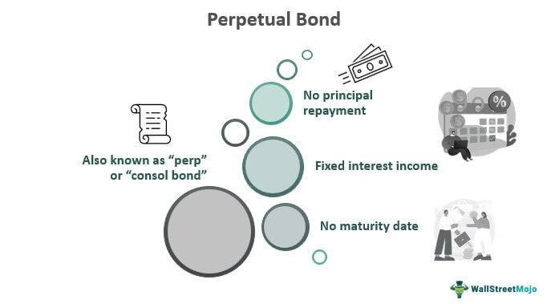

## Table of Contents

## Understanding Perpetual Bonds



Perpetual bonds, often referred to as "perps," are a unique category of fixed income securities distinguished by their lack of a maturity date. Unlike traditional bonds, which have a specified term, perpetual bonds provide indefinite interest payments, which theoretically continue forever. This structure makes them similar to preferred stocks, as both offer perpetual dividends without an obligation to return the principal amount.

### Characteristics of Perpetual Bonds
- **No Maturity Date**: The defining feature of perpetual bonds is the absence of a maturity date. Investors receive interest payments at regular intervals, typically semi-annually or annually, for an indefinite period.
- **Fixed Coupon Rate**: Perpetual bonds usually have a fixed coupon rate, offering predictable income streams to investors.
- **Call Provisions**: Many perpetual bonds come with call options, allowing issuers to redeem them at predetermined times after a set period, generally when interest rates fall below the bond’s coupon rate.
- **Ranking and Subordination**: In the event of liquidation, perpetual bondholders are subordinate to all debt obligations but rank higher than equity holders.

### Comparison with Other Fixed Income Securities
Perpetual bonds differ significantly from other fixed income securities like Treasury bonds or corporate bonds, primarily due to their permanence and issuer's option to pay. Treasury bonds might offer similar coupons but have a finite term, typically ranging from 10 to 30 years. On the other hand, perpetual bonds align more closely with the characteristics of preferred shares, where dividends are ongoing but not legally binding.

### Historical Significance and Prominence
Perpetual bonds date back to the Netherlands in the 17th century and the British government in the 18th century with instruments like consols. These securities were pivotal in financing government expenditures such as wars and the development of infrastructure. Despite their historical significance, perpetual bonds constitute a niche market within the fixed income universe, typically issued by financial institutions for regulatory capital purposes.

### Potential Benefits and Risks
Investing in perpetual bonds offers several potential benefits:
- **Higher Yields**: Due to their risk profile, perpetual bonds generally offer higher yields compared to traditional bonds.
- **Steady Income**: They provide a consistent income stream, beneficial for income-focused investors.

However, they also [carry](/wiki/carry-trading) inherent risks:
- **Interest Rate Risk**: Being long-duration instruments, they are extremely sensitive to interest rate fluctuations.
- **Credit Risk**: The issuer's credit quality can impact the price and yield, with a higher probability of call risk if conditions favor the issuer.
- **Liquidity Risk**: The niche market status of perpetual bonds can result in lower trading volumes, affecting liquidity.

### Typical Investors
Perpetual bonds attract specific types of investors. These typically include:
- **Institutional Investors**: Entities like insurance companies and pension funds often invest in perpetual bonds to match their long-term liabilities with the bonds' indefinite cash flows.
- **High-Net-Worth Individuals**: These investors may seek the higher yields perpetual bonds offer as part of a diversified portfolio, while accepting the higher risk profile associated with such assets.

In summary, perpetual bonds serve as unique financial instruments within the fixed income spectrum, providing distinctive opportunities and risks. Their role in financial markets and portfolios, while not as prominent as traditional bonds, continues to be significant, especially for issuers and investors with specific long-term yield objectives.

## Fixed Income Bond Investment: A Comprehensive Overview

Fixed income investments hold significant importance in diversified portfolios due to their ability to provide steady income and risk mitigation. These investments primarily consist of bonds, which are debt securities issued by corporations, governments, or other entities to finance operations or projects. The primary characteristics separating fixed income bonds from other financial instruments include the predictability of returns, typically in the form of fixed interest payments, and the return of principal at maturity. Unlike equities, bonds often carry lower risk, appealing to conservative investors seeking capital preservation and income generation.

Market trends in fixed income investments have evolved significantly, influenced by macroeconomic factors, regulatory changes, and shifts in investor sentiment. Recently, low [interest rate](/wiki/interest-rate-trading-strategies) environments have prompted investors to seek higher yields, often pushing them toward longer maturity bonds or those with lower credit ratings. Meanwhile, the rise of environmental, social, and governance ([ESG](/wiki/esg-investing)) criteria is reshaping bond issuance and selection, as investors increasingly prioritize sustainable and ethical investments.

Interest rate risk and credit risk are paramount considerations in fixed income markets. Interest rate risk pertains to the inverse relationship between interest rates and bond prices; rising rates typically lead to falling bond prices. This risk is more pronounced in long-duration bonds. Credit risk involves the possibility of a bond issuer defaulting on interest or principal payments, with higher-rated bonds generally presenting lower credit risk. For instance, U.S. Treasury bonds are considered virtually risk-free, while corporate bonds vary significantly in credit quality.

Selecting fixed income bonds for investment portfolios involves thorough analysis of these risks. Portfolio managers must assess the issuer’s creditworthiness, interest rate environment, and bond duration to align with investment objectives and risk tolerance. Diversification across geographies, industries, and maturities can also help mitigate risks. Investing in a mix of government, municipal, and corporate bonds, as well as considering bond funds or ETFs, allows investors to construct a balanced and resilient fixed income portfolio. 

The interplay of these factors emphasizes the role of informed decision-making in fixed income investment, ensuring that portfolios are structured to weather market fluctuations while achieving desired financial outcomes.

## The Role of Algorithmic Trading in Fixed Income Markets

Algorithmic trading, also known as algo-trading or automated trading, utilizes complex mathematical models and high-speed, computer-based systems to execute trades. Its emergence has significantly reshaped financial markets by enabling high-frequency trading, optimizing execution strategies, and enhancing [liquidity](/wiki/liquidity-risk-premium). A study published in the Journal of Finance[1] highlights that the rapid processing capabilities of algorithmic systems have led to an increase in market efficiency by narrowing spreads and reducing transaction costs.

In fixed income markets, [algorithmic trading](/wiki/algorithmic-trading) is employed to automate the buying and selling of bonds and other debt instruments. These markets, known for their complexity and vast diversity of instruments, potentially benefit from the precision and speed of algorithmic systems. Algorithms can swiftly process vast amounts of data concerning interest rates, credit ratings, and economic indicators to identify trading opportunities, thereby providing operational efficiencies and improved decision-making capabilities. 

The primary benefits of algorithmic trading in managing fixed income investments include enhanced speed of execution, improved accuracy, and the ability to handle complex derivative structures. Algorithms can manage the intricacies associated with bond pricing, which is influenced by factors like interest rates, maturity dates, and bond yields. For example, algorithms can quickly adjust trading strategies according to changes in the yield curve, a graphical representation of interest rates across various maturities, thereby managing interest rate risk more effectively.

However, implementing algorithmic trading in fixed income markets is not without challenges. One significant limitation is market liquidity. Unlike equities, the bond market is less liquid as bonds are not traded on centralized exchanges. The heterogeneity of over-the-counter (OTC) markets and the bespoke nature of many fixed-income products can make it difficult for algorithms to find matching trades, potentially leading to execution risks. Furthermore, the reliance on historical data for algorithmic models can lead to inefficiencies if market conditions shift unexpectedly or data anomalies occur, as demonstrated during the 2007-2008 financial crisis.

The future of algorithmic trading in fixed income markets is poised for evolution with advancements in [artificial intelligence](/wiki/ai-artificial-intelligence) and [machine learning](/wiki/machine-learning). These technologies can enhance algorithms by introducing adaptive learning techniques that refine trading strategies dynamically based on accumulating data. Moreover, blockchain technology's potential to increase transparency and reduce settlement times might further address issues of liquidity and counterparty risks. As these technologies mature, investors must consider both the benefits and risks of incorporating algorithmic trading into their strategies, balancing innovation with traditional risk management techniques.

[1] Reference: Hendershott, T., Jones, C. M., & Menkveld, A. J. (2011). Does Algorithmic Trading Improve Liquidity? *The Journal of Finance*, 66(1), 1–33.

## Integrating Perpetual Bonds with Algorithmic Trading Strategies

Perpetual bonds, also known as perpetuities, do not have a maturity date, offering indefinite interest payments to investors. The integration of algorithmic trading with perpetual bond investment can offer substantial advantages, leveraging computational power for more effective trading strategies.

**Potential Synergies**

The interaction of perpetual bonds with algorithmic trading lies in the ability to enhance liquidity and optimize portfolio yields. Algorithms can systematically scan market data to identify mispriced perpetual bonds and execute trades swiftly, capitalizing on short-lived [arbitrage](/wiki/arbitrage) opportunities. Additionally, algorithmic platforms can manage large volumes of market data, improving the efficiency of price execution and reducing transaction costs.

**Innovative Algorithmic Strategies**

Algorithmic strategies tailor-made for perpetual bonds focus on market [volatility](/wiki/volatility-trading-strategies), interest rate changes, and credit spreads. For instance, a mean reversion strategy can be employed by programming algorithms to buy perpetual bonds when their yields exceed a historical average and sell when they revert back. Another approach is [momentum](/wiki/momentum) trading, where algorithms detect trending price movements and execute trades accordingly. These strategies can be set using Python libraries such as NumPy and pandas for numerical analysis and data manipulation:

```python
import numpy as np
import pandas as pd

# Example: Simple Moving Average (SMA) strategy for a perpetual bond
def calculate_sma(prices, window):
    return prices.rolling(window=window).mean()

def trading_signal(prices, short_window, long_window):
    short_sma = calculate_sma(prices, short_window)
    long_sma = calculate_sma(prices, long_window)
    signal = (short_sma > long_sma).astype(int)  # Buy signal
    return signal

prices = pd.Series([...])  # placeholder for bond price data
signal = trading_signal(prices, 20, 50)
```

**Case Studies**

Successful integration of technology in perpetual bond trading can be observed in hedge funds. These funds utilize complex algorithms to manage portfolios that include perpetual bonds. For example, some have implemented machine learning algorithms capable of evolving with changing market conditions, thus fine-tuning strategies over time for enhanced profitability and risk management.

**Risk Management Considerations**

Integrating algorithmic trading with perpetual bonds necessitates careful risk management. Algorithms must be aligned with investment objectives and risk tolerance. Monitoring systems should detect excessive exposure to interest rate risk or fluctuations in credit quality. Furthermore, [backtesting](/wiki/backtesting) and stress testing of algorithmic models are essential for evaluating performance under various market scenarios.

**Technological Advancements**

Recent advancements in technology have facilitated perpetual bond trading. Enhanced computational power, real-time data analytics, and the rise of cloud computing allow for sophisticated modeling and backtesting capabilities. Machine learning provides novel approaches to predictive analytics and dynamic trading strategies, driving continual innovation in algorithmic trading.

In summary, integrating perpetual bonds with algorithmic trading strategies can yield substantial benefits, including cost efficiencies, enhanced liquidity, and optimized portfolio returns. With proper risk management and the utilization of technological advancements, investors can significantly enhance their trading efficacy in modern financial markets.

## Conclusion: The Future of Fixed Income Investment in the Age of AI

In reviewing the landscape of fixed income investments, several pivotal factors emerge. Technology continues to redefine strategies, with algorithmic trading leading the charge by offering enhancements in speed, efficiency, and precision. This technological integration has reshaped perceptions and operational approaches, particularly in managing fixed income portfolios. Algorithmic trading algorithms augment traditional methods, optimizing trade execution and portfolio management. Investors can leverage algorithmic strategies to mitigate risks such as interest rate fluctuations and credit quality shifts.

Perpetual bonds, a unique fixture in fixed income, are gaining traction due to their enduring yield potential and attractiveness for diversifying portfolios, especially in times of low-interest rates. Their long-term viability is bolstered by their ability to provide a steady income stream, making them attractive despite inherent risks like interest rate exposure and issuer credit risk.

For investors considering the application of algorithmic trading in fixed income securities, the implications are notably profound. Algorithmic trading enables quick responses to market movements and can enhance liquidity management. However, it also necessitates a deep understanding of computational models and data analytics, as well as robust technological infrastructure to capitalize effectively.

Striking a balance between traditional investment wisdom and modern technological advancements presents a nuanced challenge for investors. The blend of time-tested investment principles with cutting-edge technology promises a comprehensive approach, enhancing decision-making and potential returns. The trajectory of fixed income investing, underscored by AI and algorithmic trading, suggests a future where adaptability and innovation coalesce, steering the market towards unprecedented efficiency and diversification opportunities. As investors navigate this evolving landscape, the careful integration of these elements will be crucial in optimizing portfolios and achieving sustainable financial growth.

## References & Further Reading

[1]: Hendershott, T., Jones, C. M., & Menkveld, A. J. (2011). ["Does Algorithmic Trading Improve Liquidity?"](https://onlinelibrary.wiley.com/doi/full/10.1111/j.1540-6261.2010.01624.x) *The Journal of Finance*, 66(1), 1–33.

[2]: ["The Most Important Concepts in Finance (Financial Markets Explained)"](https://www.investopedia.com/terms/f/financial-market.asp) by CFA Institute 

[3]: ["Perpetual Bonds: Definition, Pros and Cons"](https://www.financestrategists.com/wealth-management/bonds/perpetual-bonds/) at Investopedia

[4]: Shirvani, H., & Wilbratte, B. (2008). ["The Impact of Algorithmic Trading on Market Quality and Price Discovery in US Treasury Markets."](https://snippetsofparis.com/ile-de-france/) *Journal of Financial Markets*, 11(3), 231-250.

[5]: ["Advances in Financial Machine Learning"](https://www.amazon.com/Advances-Financial-Machine-Learning-Marcos/dp/1119482089) by Marcos Lopez de Prado