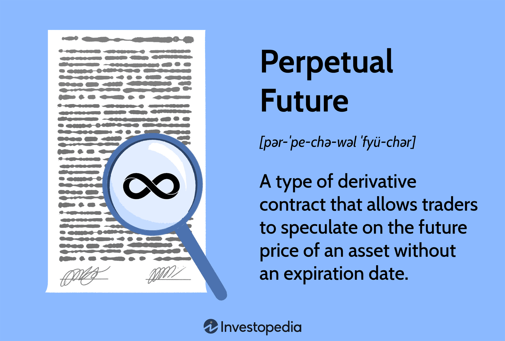

## Table of Contents

## What are perpetual futures?

Perpetual futures are a type of financial contract used in trading, especially in cryptocurrency markets. They are similar to traditional futures contracts but have a key difference: they don't have an expiration date. This means that traders can hold their positions for as long as they want without needing to roll over their contracts. This feature makes perpetual futures very popular because it allows traders to keep their strategies going without interruption.

The price of perpetual futures is kept in line with the spot price of the underlying asset through a mechanism called funding rates. If the price of the perpetual future is higher than the spot price, traders who are long (betting the price will go up) have to pay traders who are short (betting the price will go down). If the price is lower, the opposite happens. This exchange of payments helps to keep the perpetual futures price close to the actual market price, making it a useful tool for traders who want to speculate or hedge their positions.

## How do perpetual futures differ from traditional futures?

Perpetual futures and traditional futures are both used for trading, but they have some big differences. The main difference is that perpetual futures don't have an expiration date. This means you can keep your trade open for as long as you want without having to close it and open a new one. Traditional futures, on the other hand, do have an expiration date. When that date comes, you have to either settle the contract or roll it over into a new one, which can be a bit of a hassle.

Another difference is how their prices stay close to the actual market price. For perpetual futures, this is done through something called funding rates. If the price of the perpetual future is higher than the actual market price, people who think the price will go up have to pay those who think it will go down. If it's lower, the opposite happens. This helps keep the price in check. Traditional futures use a different method. Their price is pulled back to the market price as the expiration date gets closer, because at that point, the futures price has to match the actual market price.

## What is the purpose of perpetual futures in trading?

Perpetual futures are used in trading to let people bet on the price of something, like a [cryptocurrency](/wiki/cryptocurrency), without actually owning it. They are popular because they don't have an end date, so you can keep your trade open as long as you want. This is different from regular futures, where you have to close your trade or start a new one when it expires. This makes it easier for traders to stick with their plans without interruptions.

Another reason people use perpetual futures is to hedge their investments. If you own a cryptocurrency and you're worried its price might go down, you can use perpetual futures to bet against it. This way, if the price does drop, you can make money from the futures trade to help cover your losses on the actual cryptocurrency. The funding rates in perpetual futures help keep the price close to the real market price, making them a useful tool for both speculating and protecting your investments.

## How does the funding rate work in perpetual futures?

The funding rate in perpetual futures is a way to make sure the price of the futures stays close to the real market price. It works by having traders pay each other based on whether the futures price is higher or lower than the actual market price. If the futures price is higher, people who think the price will go up (long positions) have to pay those who think it will go down (short positions). If the futures price is lower, the people with short positions pay those with long positions. This payment happens at set times, usually every 8 hours, and it helps keep the futures price in line with the market.

The amount of the funding rate is calculated based on the difference between the futures price and the market price. If the difference is big, the funding rate will be higher, and if it's small, the funding rate will be lower. This system encourages traders to adjust their positions, which helps bring the futures price back to the market price. By doing this, the funding rate makes sure that perpetual futures can be used effectively for both betting on price movements and protecting other investments.

## What are the risks associated with trading perpetual futures?

Trading perpetual futures can be risky because the prices can change a lot in a short time. This is called [volatility](/wiki/volatility-trading-strategies). If you're not careful, you could lose a lot of money quickly. Also, because perpetual futures use something called leverage, you can trade with more money than you actually have. This can make your wins bigger, but it also makes your losses bigger. If the market moves against you, you might have to pay back more than you expected.

Another risk is something called liquidation. If the price moves too far against your trade, your position might be closed automatically to stop you from losing even more money. This can happen suddenly and without warning, which can be stressful. Also, the funding rates in perpetual futures can add up over time. If you're on the wrong side of the funding rate, you'll have to keep paying money to other traders, which can eat into your profits or increase your losses.

## Can you explain the concept of leverage in perpetual futures?

Leverage in perpetual futures is like borrowing money to make a bigger bet. When you use leverage, you can trade with more money than you actually have in your account. For example, if you have $100 and use 10x leverage, you can trade as if you have $1,000. This can make your profits bigger if the price moves in your favor, but it also makes your losses bigger if the price moves against you.

The main thing to remember about leverage is that it's a double-edged sword. It can help you make more money, but it can also lead to bigger losses. If the market moves against your trade, you might get a margin call, which means you need to add more money to your account to keep your trade open. If you can't do that, your position might be closed automatically, and you could lose more money than you initially put in. So, it's important to use leverage carefully and understand the risks involved.

## How do traders use perpetual futures for hedging?

Traders use perpetual futures for hedging to protect their investments from big price drops. Imagine you own a cryptocurrency and you're worried its price might go down. You can use perpetual futures to bet against that cryptocurrency. If the price does drop, you'll lose money on the cryptocurrency you own, but you'll make money from the futures trade. This can help cover your losses and make your overall financial situation more stable.

The key to hedging with perpetual futures is to take a position that's the opposite of your actual investment. If you own a cryptocurrency, you'd take a short position in the perpetual futures market, betting that the price will go down. This way, if the price falls, the gains from the futures trade can offset the losses from your cryptocurrency. It's like having insurance for your investments, helping you manage risk and protect your money.

## What are some common strategies for trading perpetual futures?

One common strategy for trading perpetual futures is called [trend following](/wiki/trend-following). This means traders watch the market to see if prices are going up or down over time. If they see a trend, they might buy (go long) if prices are going up or sell (go short) if prices are going down. They hope to make money by riding the trend until it changes. This strategy works well in markets that keep moving in one direction for a while, but it can be risky if the trend suddenly reverses.

Another strategy is called [scalping](/wiki/gamma-scalping). Scalpers try to make small profits from quick price changes. They might buy and sell many times in a single day, taking advantage of tiny price movements. This can be a good way to make money if you're good at spotting these small changes and can act fast. But it's also hard work and can be stressful because you need to keep watching the market all the time.

Some traders also use a strategy called [arbitrage](/wiki/arbitrage). This means they look for price differences between the perpetual futures market and the spot market. If they find a difference, they can buy in one market and sell in the other to make a profit. This strategy can be less risky than others because it's based on price differences that are likely to go away over time. But it requires a lot of attention to detail and quick action to take advantage of these opportunities.

## How do market makers influence perpetual futures markets?

Market makers are important in perpetual futures markets because they help keep things running smoothly. They do this by always being ready to buy or sell, which makes it easier for other traders to make trades. When you want to buy or sell a perpetual future, market makers are there to take the other side of your trade. This helps make sure there are always enough buyers and sellers, so the market doesn't get stuck.

Market makers also help keep the prices stable. They do this by setting prices that are close to the real market value. If the price starts to move too much, market makers step in to buy or sell and bring it back to a more normal level. This is good for everyone because it makes the market less wild and more predictable. Without market makers, the prices could jump around a lot more, making it harder for other traders to make good decisions.

## What role do exchanges play in the operation of perpetual futures?

Exchanges are really important for perpetual futures because they provide the place where traders can buy and sell these contracts. They make sure everything is fair and open by setting rules that everyone has to follow. Exchanges also keep track of all the trades and make sure that the money and contracts are moved correctly between traders. This helps keep the market safe and trustworthy.

Another big job of exchanges is to manage the funding rates in perpetual futures. They calculate how much traders need to pay each other to keep the futures price close to the real market price. Exchanges also handle the process of liquidating positions if a trader's account doesn't have enough money to cover their losses. By doing all these things, exchanges help make sure that trading perpetual futures is smooth and reliable for everyone involved.

## How can one manage the risks of trading perpetual futures effectively?

Managing the risks of trading perpetual futures starts with understanding how leverage works. Leverage lets you trade with more money than you have, which can make your wins bigger but also your losses. To manage this, you should use less leverage than the maximum allowed. This way, if the market moves against you, you won't lose as much money. It's also a good idea to set stop-loss orders, which automatically close your trade if the price goes too far against you. This can help limit your losses and keep your account safe.

Another important part of managing risk is keeping an eye on the funding rates. These rates can add up over time and affect your profits or losses. If you're on the wrong side of the funding rate, you'll have to keep paying money to other traders, which can eat into your money. To manage this, you should check the funding rates regularly and adjust your trades if needed. Also, always have a plan for your trades and stick to it. Don't let emotions make you take big risks. By being careful and planning ahead, you can trade perpetual futures more safely.

## What advanced technical analysis tools are useful for trading perpetual futures?

When trading perpetual futures, one useful tool is the Moving Average Convergence Divergence (MACD). This tool helps you see if the price of a futures contract is going up or down over time. It does this by showing two lines on a chart. When the lines cross each other, it can be a sign that the price might change direction soon. Traders use this to decide when to buy or sell. The MACD also has a histogram that shows how strong the trend is, which can help you understand if the price is likely to keep moving in the same direction.

Another helpful tool is the Relative Strength Index (RSI). The RSI tells you if a futures contract is being bought or sold too much. It gives you a number between 0 and 100. If the number is over 70, it means the contract might be overbought, and the price could go down soon. If it's under 30, it might be oversold, and the price could go up. Traders use the RSI to find good times to enter or [exit](/wiki/exit-strategy) trades. By watching the RSI, you can avoid buying when everyone else is buying and selling when everyone else is selling, which can help you make better trading decisions.

## References & Further Reading

[1]: ["A Primer on the Equity Markets and Products"](https://www.sifma.org/resources/research/sifma-insights-primer-series/) by the Commodity Futures Trading Commission (CFTC)

[2]: ["Advances in Financial Machine Learning"](https://www.amazon.com/Advances-Financial-Machine-Learning-Marcos/dp/1119482089) by Marcos Lopez de Prado

[3]: ["Machine Learning for Algorithmic Trading"](https://github.com/PacktPublishing/Machine-Learning-for-Algorithmic-Trading-Second-Edition) by Stefan Jansen

[4]: ["Quantitative Trading: How to Build Your Own Algorithmic Trading Business"](https://www.amazon.com/Quantitative-Trading-Build-Algorithmic-Business/dp/1119800064) by Ernest P. Chan

[5]: Microstructure of Financial Markets. "The microstructure of electronic markets: A survey" by The Review of Economic Studies (2021)

[6]: ["Trading and Exchanges: Market Microstructure for Practitioners"](https://www.amazon.com/Trading-Exchanges-Market-Microstructure-Practitioners/dp/0195144708) by Larry Harris

[7]: ["Cryptocurrency and Blockchain Technology: Recent Advances and Prospects"](https://www.sciencedirect.com/science/article/pii/S2772662223001844) by Shaan Ajani