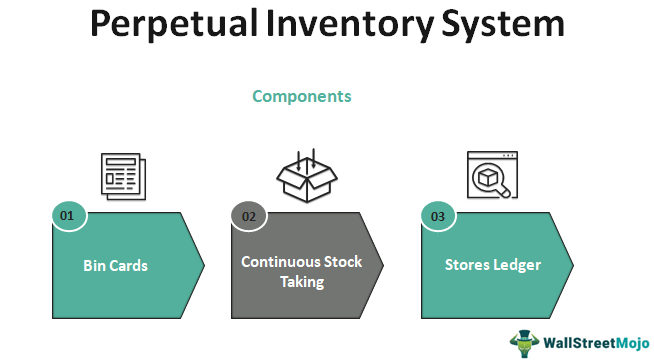

## Table of Contents

## What is a perpetual inventory system?

A perpetual inventory system is a way for businesses to keep track of their inventory in real time. This means that every time a product is sold or received, the inventory records are updated immediately. This system uses technology like barcode scanners and inventory management software to make sure the records are always accurate. It helps businesses know exactly how much stock they have at any moment, which is really useful for making quick decisions about ordering more products or managing sales.

Using a perpetual inventory system can save a lot of time and reduce mistakes compared to older methods where inventory was counted manually at the end of a period. It also helps in preventing stockouts, where a business runs out of a product, and overstocking, where too much of a product is kept in storage. By having up-to-date information, businesses can better plan their purchases and sales, leading to more efficient operations and better customer service.

## How does a perpetual inventory system differ from a periodic inventory system?

A perpetual inventory system and a periodic inventory system are two different ways businesses can keep track of their stock. In a perpetual system, the inventory is updated all the time. Every time something is sold or bought, the records change right away. This means businesses always know exactly how much stock they have. They use tools like computers and scanners to make sure the numbers are right. On the other hand, a periodic system doesn't update the inventory all the time. Instead, businesses count their stock at certain times, like at the end of the month or year. They then adjust their records based on these counts.

The main difference between these two systems is how often the inventory is counted and updated. With a perpetual system, you get real-time information, which helps in making quick decisions about buying more stock or selling items on sale. It's more accurate and can prevent problems like running out of stock or having too much stock. A periodic system, however, can be simpler and cheaper because it doesn't need special technology. But it can lead to surprises when the stock is counted, and it might be harder to keep track of what's selling and what's not. Businesses choose between these systems based on their size, the type of products they sell, and how much they can spend on inventory management.

## What are the basic components of a perpetual inventory system?

A perpetual inventory system has a few key parts that help it work well. The first part is the point-of-sale (POS) system. This is where sales are recorded as soon as they happen. When a customer buys something, the POS system updates the inventory right away. This means the business always knows how much stock they have. Another important part is the inventory management software. This software keeps track of all the products in the store or warehouse. It can tell you how many items are left, when to order more, and even where each item is located.

The second part of a perpetual inventory system is the use of technology like barcode scanners and RFID tags. These tools make it easy to update the inventory quickly and accurately. When a product is sold or received, the scanner reads the barcode or RFID tag, and the inventory numbers change automatically. This helps reduce mistakes that can happen when people count things by hand. The last part is regular checks and balances. Even though the system updates automatically, it's a good idea to do physical counts sometimes to make sure everything matches up. This helps catch any errors and keeps the system running smoothly.

## What are the primary advantages of using a perpetual inventory system?

A perpetual inventory system helps businesses keep their stock numbers up to date all the time. This means they always know how much of each product they have. If they sell something, the inventory count goes down right away. If they get new stock, the count goes up immediately. This real-time tracking is a big advantage because it helps businesses make quick decisions. They can order more of a product before they run out, or they can put items on sale if they have too many. This system also helps reduce mistakes because it uses computers and scanners to keep track of everything.

Another big advantage is that a perpetual inventory system can save time and money. Instead of spending hours counting stock by hand at the end of each period, businesses can focus on other important tasks. The system also makes it easier to find out which products are selling well and which ones are not. This information helps businesses plan better and avoid having too much or too little stock. Overall, using a perpetual inventory system can lead to better customer service because the business is always ready with the products people want to buy.

## Can you provide examples of businesses that benefit from perpetual inventory systems?

Many types of businesses find perpetual inventory systems very helpful. For example, big stores like Walmart and Target use these systems to keep track of thousands of products. They need to know exactly how much stock they have at all times so they can order more when needed and avoid running out of popular items. Another example is online businesses like Amazon. They use perpetual inventory systems to manage their huge warehouses and make sure they can quickly ship products to customers all over the world.

Even smaller businesses can benefit from perpetual inventory systems. A local grocery store, for instance, can use this system to keep track of fresh produce and other items that spoil quickly. By knowing exactly how much they have, they can order more before things go bad. A small boutique selling clothes can also use a perpetual inventory system to manage their stock of different sizes and styles, making sure they always have what their customers want.

## What are the potential disadvantages of implementing a perpetual inventory system?

One potential disadvantage of using a perpetual inventory system is the cost. Setting up this system can be expensive because it needs special technology like computers, scanners, and software. Small businesses might find it hard to pay for all of this. Also, the people working in the business need to learn how to use the new system, which can take time and money for training.

Another issue is that even though the system updates automatically, there can still be mistakes. Sometimes the technology might not work right, or someone might enter the wrong information. This means businesses still need to do regular checks to make sure the numbers are correct. Doing these checks can take time and effort, which might be a hassle for some businesses.

## How does a perpetual inventory system affect financial reporting?

A perpetual inventory system makes financial reporting easier and more accurate. Because the system keeps track of inventory all the time, businesses can see exactly how much stock they have at any moment. This means they can update their financial records right away when they buy or sell something. This real-time information helps businesses know their cost of goods sold and their inventory value more accurately. This makes it easier to create financial statements like the balance sheet and income statement, which show how much the business is worth and how much money it's making.

However, using a perpetual inventory system can also make financial reporting a bit more complicated at first. Setting up the system and making sure everyone knows how to use it can take time and money. There might also be small mistakes in the system that need to be fixed. But once the system is working well, it can save a lot of time and help businesses make better financial decisions. Overall, a perpetual inventory system can make financial reporting more accurate and efficient, but it needs some effort to get it right.

## What technologies are commonly used to support perpetual inventory systems?

To make a perpetual inventory system work well, businesses use different kinds of technology. One common tool is the point-of-sale (POS) system. This is what cashiers use when someone buys something. The POS system updates the inventory numbers right away when a sale happens. Another important technology is inventory management software. This software keeps track of all the products in the store or warehouse. It can tell you how many items are left, when to order more, and even where each item is located.

Another technology that helps with perpetual inventory systems is barcode scanners. When a product is sold or received, the scanner reads the barcode on the item, and the inventory numbers change automatically. This makes it easy to keep the inventory up to date without making mistakes. Some businesses also use RFID tags, which are like tiny chips that can be read from a distance. These tags make it even easier to track inventory because you don't have to scan each item one by one. All these technologies work together to make sure the inventory numbers are always correct and up to date.

## How can a perpetual inventory system improve inventory management and control?

A perpetual inventory system helps businesses keep better track of their stock. It updates the inventory numbers all the time, so businesses always know exactly how much of each product they have. This means they can order more of a product before they run out, or they can put items on sale if they have too many. It also helps reduce mistakes because it uses computers and scanners to keep track of everything. This way, businesses can make quick decisions and avoid problems like running out of stock or having too much stock.

Another way a perpetual inventory system improves inventory management is by saving time and money. Instead of spending hours counting stock by hand at the end of each period, businesses can focus on other important tasks. The system also makes it easier to find out which products are selling well and which ones are not. This information helps businesses plan better and avoid having too much or too little stock. Overall, using a perpetual inventory system can lead to better customer service because the business is always ready with the products people want to buy.

## What are the steps to implement a perpetual inventory system in a business?

To start using a perpetual inventory system in a business, the first step is to choose the right technology. This means [picking](/wiki/asset-class-picking) a good point-of-sale (POS) system and inventory management software that will work well for the business. The POS system will update the inventory every time a sale is made, and the software will keep track of all the products. Next, the business needs to buy barcode scanners or RFID tags. These tools will help update the inventory numbers quickly and accurately. After choosing the technology, the business should set it up and make sure it works well with their current systems.

Once the technology is in place, the next step is to train the staff. Everyone who will use the new system needs to learn how it works. This might take some time, but it's important for the system to work correctly. After training, the business should start using the system and keep an eye on it to make sure everything is working as it should. It's a good idea to do regular checks to make sure the inventory numbers are correct. Over time, the business will get used to the new system, and it will help them manage their stock better and make smarter decisions.

## How do perpetual inventory systems integrate with other business systems like ERP?

Perpetual inventory systems work well with other business systems like ERP (Enterprise Resource Planning) because they can share information easily. An ERP system helps manage many parts of a business, like accounting, sales, and human resources. When a perpetual inventory system is connected to an ERP system, it can send real-time inventory data to the ERP. This means the ERP system always has the latest information about stock levels, which helps with planning and making decisions. For example, if the inventory system shows that a product is running low, the ERP system can automatically start the process to order more.

Setting up this connection between a perpetual inventory system and an ERP system can take some work. The business needs to make sure the two systems can talk to each other properly. This might mean using special software or doing some custom programming. Once everything is set up, the business can enjoy the benefits of having all their data in one place. This makes it easier to see the big picture and manage the business more efficiently. Overall, integrating a perpetual inventory system with an ERP system can help a business run smoother and make better use of their resources.

## What advanced features can be added to a perpetual inventory system to enhance its functionality?

To make a perpetual inventory system even better, businesses can add features like real-time analytics. This means the system can look at the data it collects and give the business useful information right away. For example, it can show which products are selling the best, how fast they are selling, and even predict when the business might run out of stock. This helps the business make smart decisions quickly, like ordering more of a popular item or putting slow-moving products on sale. Another useful feature is automated reordering. With this, the system can automatically place orders for more stock when it gets low, saving time and making sure the business never runs out of important items.

Another advanced feature that can be added is integration with other systems, like customer relationship management (CRM) software. This lets the business see how inventory levels affect customer satisfaction and sales. For example, if a customer wants to buy something that's out of stock, the system can tell the business to order more of that item to keep the customer happy. Also, features like mobile access can be added, so staff can check inventory levels and make updates from anywhere using their phones or tablets. This makes it easier to manage stock, especially in big stores or warehouses. Overall, these advanced features can make a perpetual inventory system much more powerful and helpful for the business.

## References & Further Reading

[1]: ["Advances in Financial Machine Learning"](https://www.amazon.com/Advances-Financial-Machine-Learning-Marcos/dp/1119482089) by Marcos Lopez de Prado

[2]: ["Machine Learning for Algorithmic Trading"](https://github.com/PacktPublishing/Machine-Learning-for-Algorithmic-Trading-Second-Edition) by Stefan Jansen

[3]: ["Quantitative Trading: How to Build Your Own Algorithmic Trading Business"](https://books.google.com/books/about/Quantitative_Trading.html?id=j70yEAAAQBAJ) by Ernest P. Chan

[4]: ["Evidence-Based Technical Analysis: Applying the Scientific Method and Statistical Inference to Trading Signals"](https://www.amazon.com/Evidence-Based-Technical-Analysis-Scientific-Statistical/dp/0470008741) by David Aronson

[5]: ["Inventory Management: Non-Classical Views"](https://www.taylorfrancis.com/books/mono/10.1201/9781420079982/inventory-management-mohamad-jaber) by Ata Allah Taleizadeh & Sara Najafi

[6]: ["Inventory systems with continuous and periodic review policies"](https://smallbusiness.chron.com/difference-between-periodic-continuous-inventory-review-policy-30967.html) by Taleizadeh, A.A., & Akhavan Niaki, S.T. (2017)

[7]: ["The Role of Information Technology in Inventory Management"](https://www.lengow.com/get-to-know-more/the-role-of-technology-in-inventory-management/) in J. R. Tony Arnold and Stephen N. Chapman, "Introduction to Materials Management"