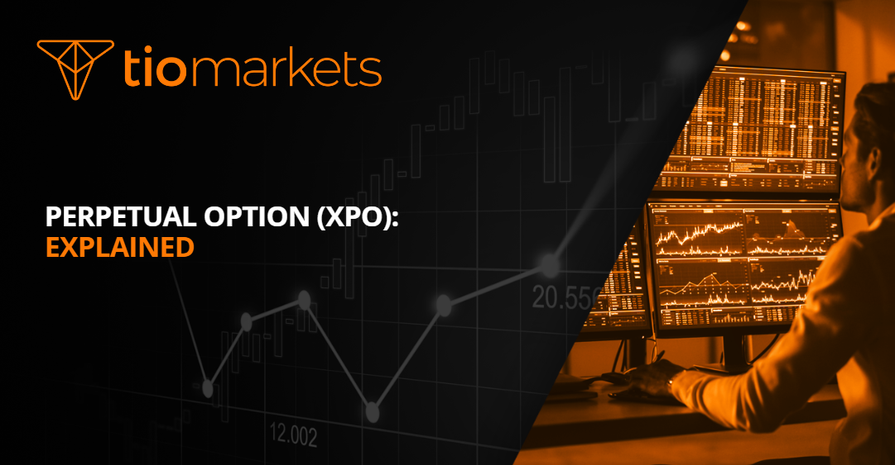

## Table of Contents

## What is a Perpetual Option (XPO)?

A Perpetual Option, often called XPO, is a type of financial option that does not have an expiration date. Unlike regular options, which expire after a certain period, a Perpetual Option can be held indefinitely. This means that the holder of the option can choose to exercise it at any time they want, without worrying about losing the option due to time running out.

Perpetual Options are not very common in the financial markets, but they can be useful for certain types of investors. For example, someone who wants to have the right to buy or sell an asset at a specific price forever might find a Perpetual Option valuable. However, because they never expire, Perpetual Options can be more expensive than regular options.

## How does a Perpetual Option differ from traditional options?

A Perpetual Option, or XPO, is different from traditional options mainly because it doesn't have an expiration date. Traditional options have a set time period after which they expire and become worthless if not exercised. With a Perpetual Option, you can hold onto it forever and choose to use it whenever you want. This can be really helpful if you need flexibility and don't want to worry about time limits.

Because Perpetual Options don't expire, they can be more expensive than traditional options. The price reflects the fact that you're buying a right that lasts forever. Traditional options, on the other hand, are usually cheaper because their value decreases as they get closer to their expiration date. This makes Perpetual Options a niche product, used by investors who are willing to pay more for the benefit of having no time limit on their option.

## What are the key features of a Perpetual Option?

A Perpetual Option, or XPO, is special because it never expires. This means you can keep it as long as you want and use it whenever you feel like it. It's like having a key that never gets old and can open a door anytime. This is different from regular options, which have a time limit and will stop working after a certain date.

Because a Perpetual Option lasts forever, it can cost more than regular options. You're paying for the freedom to use it whenever you want, without any rush. This makes it a good choice for people who need a lot of time to decide or want to keep their options open indefinitely. But because they're more expensive, not everyone will choose to use them.

## Can you explain the basic functionality of a Perpetual Option?

A Perpetual Option, or XPO, is a special kind of option that doesn't have an expiration date. This means you can keep it as long as you want and use it whenever you feel like it. It's like having a ticket that never expires, so you can choose the best time to use it. This is different from regular options, which have a time limit and will stop working after a certain date.

Because a Perpetual Option lasts forever, it can be more expensive than regular options. You're paying for the freedom to use it whenever you want, without any rush. This makes it a good choice for people who need a lot of time to decide or want to keep their options open indefinitely. But because they're more expensive, not everyone will choose to use them.

## What are the potential benefits of using Perpetual Options?

One big benefit of using Perpetual Options is that they give you a lot of freedom. You don't have to worry about time running out because they never expire. This means you can wait for the perfect moment to use your option, without feeling rushed. It's like having a special ticket that you can use whenever you want, which can be really helpful if you need more time to make a decision.

Another advantage is that Perpetual Options can be a good choice for long-term planning. If you want to keep your options open for the future, a Perpetual Option lets you do that. You might pay more for it, but the peace of mind that comes with having no time limit can be worth it. This makes them a useful tool for investors who like to think ahead and keep their strategies flexible.

## What are the risks associated with Perpetual Options?

One big risk with Perpetual Options is that they can be more expensive than regular options. Because they never expire, you might have to pay a lot more to get one. This means you need to be sure it's worth the extra cost. If you end up not using the option, you've spent more money for no reason, which can be a big loss.

Another risk is that the value of a Perpetual Option can change a lot over time. Since it lasts forever, it can be hard to know exactly what it's worth at any given moment. This can make it tricky to decide when to use it or sell it. If the market changes a lot, you might find that your Perpetual Option isn't as valuable as you thought it would be, which can be disappointing and costly.

## How are Perpetual Options priced?

Pricing a Perpetual Option is different from pricing regular options because it doesn't have an expiration date. The price of a Perpetual Option is based on how likely it is that the option will be worth using at some point in the future. This means looking at things like the current price of the asset, how much the price might change over time, and any costs like interest rates. Because the option lasts forever, these factors can make the price go up or down a lot.

Since a Perpetual Option can be used at any time, it's usually more expensive than a regular option. You're paying for the freedom to wait as long as you want before deciding to use it. The price also takes into account how much people are willing to pay for that kind of flexibility. So, even though it can be hard to figure out exactly what a Perpetual Option is worth, the price will be higher because it gives you the chance to use it whenever you think it's best.

## Can you provide an example of how a Perpetual Option might be used in trading?

Imagine you're an investor who really believes that the price of gold will go up a lot in the future, but you're not sure when. You could buy a Perpetual Option that gives you the right to buy gold at today's price, no matter how long it takes for the price to go up. This way, you don't have to worry about the option expiring before the price of gold goes up. You can wait as long as you need to, and when the price is right, you can use your option to buy gold at a lower price than what it's selling for at that time.

For example, let's say the current price of gold is $1,800 per ounce, and you buy a Perpetual Option to buy gold at that price. Over the next few years, the price of gold might go up and down, but you're not in a hurry. Finally, after 10 years, the price of gold reaches $2,500 per ounce. You decide it's time to use your option, so you buy gold at $1,800 per ounce, even though it's selling for $2,500 on the market. This means you've made a profit because you bought gold at a lower price than what it's worth now.

## What are the market conditions that favor the use of Perpetual Options?

Perpetual Options are most useful when the market is very unpredictable and you need a lot of time to make a good decision. If you think a certain asset, like gold or a stock, will go up in value but you're not sure when, a Perpetual Option can be a good choice. It lets you wait as long as you need without worrying about the option expiring. This is helpful if you believe the market will change a lot over time and you want to be ready to act whenever the right moment comes.

Another situation where Perpetual Options can be helpful is when you want to keep your investment strategy flexible for the long term. If you're planning for the future and want to have the option to buy or sell an asset at a certain price no matter what happens, a Perpetual Option can give you that freedom. It's like having a safety net that lasts forever, which can be really valuable if you're willing to pay the extra cost for that kind of security.

## How do Perpetual Options fit into a broader investment strategy?

Perpetual Options can be a useful part of a long-term investment strategy because they give you a lot of flexibility. If you think an asset like a stock or gold will go up in value but you're not sure when, a Perpetual Option lets you wait as long as you need. You don't have to worry about the option expiring, so you can take your time and use it whenever the market is right for you. This can be really helpful if you want to keep your options open and be ready to act whenever the best opportunity comes along.

Including Perpetual Options in your investment plan can also help you manage risk. Because they never expire, they can act like a safety net that lasts forever. This means you can plan for the future without feeling rushed, and you can make decisions based on what's best for your long-term goals. While Perpetual Options might cost more than regular options, the extra flexibility and security they offer can be worth it if you're looking to keep your investment strategy open and adaptable over time.

## What regulatory considerations should be taken into account with Perpetual Options?

When you're dealing with Perpetual Options, it's important to know about the rules and regulations that might affect them. Different countries have different rules about financial products like options, and these rules can change how Perpetual Options are used or even if they're allowed at all. For example, some places might need you to have a special license or follow certain rules to trade Perpetual Options. It's a good idea to check with a financial advisor or look up the rules in your country to make sure you're doing everything right.

Another thing to think about is how regulators see Perpetual Options. Because they never expire, some regulators might be worried about how they could be used in ways that aren't fair or safe. They might put limits on who can use them or how they can be traded to make sure the market stays fair and everyone is protected. So, before you start using Perpetual Options, it's smart to understand the regulatory environment and make sure you're following all the rules.

## What advanced strategies can be employed with Perpetual Options by expert traders?

Expert traders can use Perpetual Options to create complex strategies that take advantage of their unique features. One strategy is to use Perpetual Options as a hedge against long-term market risks. For example, if a trader believes that a certain stock will eventually go up in value but is worried about short-term [volatility](/wiki/volatility-trading-strategies), they can buy a Perpetual Option to buy the stock at today's price. This way, they can wait out any short-term dips in the market and use the option when the stock price finally rises, protecting their investment from unexpected changes.

Another advanced strategy involves using Perpetual Options to create synthetic positions. Traders can combine Perpetual Options with other financial instruments to mimic the payoff of owning the underlying asset without actually buying it. For instance, by buying a Perpetual Call Option and selling a Perpetual Put Option at the same strike price, a trader can create a position that behaves like owning the stock itself. This can be useful for traders who want to benefit from the asset's price movements without the need for a large upfront investment, giving them more flexibility and control over their trading strategy.

## References & Further Reading

[1]: Bergstra, J., Bardenet, R., Bengio, Y., & Kégl, B. (2011). ["Algorithms for Hyper-Parameter Optimization."](https://dl.acm.org/doi/10.5555/2986459.2986743) Advances in Neural Information Processing Systems 24.

[2]: ["Advances in Financial Machine Learning"](https://www.amazon.com/Advances-Financial-Machine-Learning-Marcos/dp/1119482089) by Marcos Lopez de Prado

[3]: ["Evidence-Based Technical Analysis: Applying the Scientific Method and Statistical Inference to Trading Signals"](https://www.amazon.com/Evidence-Based-Technical-Analysis-Scientific-Statistical/dp/0470008741) by David Aronson

[4]: ["Machine Learning for Algorithmic Trading"](https://github.com/stefan-jansen/machine-learning-for-trading) by Stefan Jansen

[5]: ["Quantitative Trading: How to Build Your Own Algorithmic Trading Business"](https://www.amazon.com/Quantitative-Trading-Build-Algorithmic-Business/dp/1119800064) by Ernest P. Chan