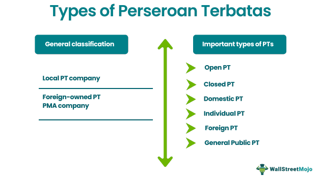

## Table of Contents

## What is a Perseroan Terbatas (PT)?

A Perseroan Terbatas (PT) is a type of business structure in Indonesia that is similar to a limited liability company in other countries. It means that the owners, or shareholders, are not personally responsible for the company's debts or losses. Instead, their liability is limited to the amount they have invested in the company. This makes it a popular choice for businesses because it helps protect the personal assets of the owners.

To set up a PT, you need at least two shareholders and a minimum capital requirement, which can vary depending on the type of business. The process involves registering the company with the Ministry of Law and Human Rights and obtaining necessary licenses and permits. Once established, a PT must follow certain rules and regulations, such as holding annual general meetings and submitting annual financial reports. This structure allows businesses to operate legally and efficiently in Indonesia.

## How does a PT differ from other business structures in Indonesia?

In Indonesia, a Perseroan Terbatas (PT) is different from other business structures like a sole proprietorship or a partnership. A PT is a limited liability company, which means the owners' personal money and things are safe if the business has problems. In a sole proprietorship, the owner is the business, so if the business has debts, the owner's personal money can be taken. In a partnership, the partners share the business's debts, so their personal money can also be at risk. A PT is more complicated to start because it needs at least two shareholders and some money to begin, but it offers more protection for the owners.

Another difference is how a PT works compared to a foreign company branch or a representative office. A PT is a local company that can do business and make money in Indonesia. A foreign company branch can also make money, but it is part of the foreign company and follows its rules. A representative office cannot make money; it can only do things like market research or support the main company. A PT has to follow Indonesian laws and do things like have meetings and report money every year, which can be more work but helps the business run smoothly and legally in Indonesia.

## What are the basic requirements to establish a PT?

To set up a Perseroan Terbatas (PT) in Indonesia, you need at least two shareholders. These can be people or companies. You also need a minimum amount of money to start, called the capital. The amount of money you need can be different depending on the type of business you want to start. You have to register your PT with the Ministry of Law and Human Rights. This involves filling out forms and giving them information about your business.

After you register, you need to get some licenses and permits to make sure your business can operate legally. The types of licenses and permits you need will depend on what your business does. Once your PT is set up, you have to follow certain rules. This includes having meetings every year with your shareholders and sending in reports about your money every year. This helps keep everything running smoothly and legally.

## What are the steps involved in registering a PT in Indonesia?

To register a PT in Indonesia, you first need to choose a name for your company. The name should be unique and approved by the Ministry of Law and Human Rights. After picking a name, you need to prepare the company's Articles of Association, which outline the rules and how the company will work. You also need to get a notary to approve these documents. Once everything is ready, you submit the Articles of Association, along with other required documents like the company's deed of establishment, to the Ministry of Law and Human Rights for approval.

After the Ministry approves your documents, you get a certificate of incorporation. This means your PT is officially a legal entity. Next, you need to get a taxpayer identification number (NPWP) from the tax office. You also need to register with the Manpower and Transmigration Department if you plan to hire employees. Depending on your business, you might need to get other licenses and permits from different government offices. Once all these steps are done, your PT can start operating in Indonesia, following the rules like having annual meetings and reporting finances every year.

## What are the different types of PTs and how do they differ?

In Indonesia, there are two main types of PTs: PT Penanaman Modal Asing (PMA) and PT Penanaman Modal Dalam Negeri (PMDN). A PT PMA is for foreign investors who want to start a business in Indonesia. It allows foreigners to own part or all of the company, depending on the industry. A PT PMDN is for local Indonesian investors. Only Indonesian citizens or Indonesian legal entities can own a PT PMDN. The main difference between them is who can own the company and how much they can own.

Both types of PTs need to follow Indonesian laws and regulations, but PT PMAs might have extra rules because they involve foreign investment. For example, PT PMAs might need to meet certain capital requirements and get special permits. PT PMDNs, on the other hand, are easier to set up because they don't have these extra rules for foreign investors. Both types of PTs need to register with the Ministry of Law and Human Rights and get the necessary licenses and permits to operate legally in Indonesia.

## What are the advantages of forming a PT?

Forming a PT in Indonesia has many benefits. One big advantage is that it protects the owners' personal money. If the business has debts or problems, the owners only lose what they put into the company, not their personal money or things. This makes it safer for people to start a business because they know their personal stuff is safe. Another advantage is that a PT can be owned by more than one person, which means you can share the work and the money. This can make it easier to start and run a business because you have help from others.

Another benefit of a PT is that it can help the business grow. Because it's a formal company, it can get loans from banks more easily than a small business like a sole proprietorship. This can help the company get the money it needs to grow. Also, a PT can hire workers and do business legally in Indonesia, which can help it become bigger and more successful. Overall, forming a PT gives a business more protection, more ways to grow, and a more formal way to work in Indonesia.

## What are the common challenges faced when setting up a PT?

Setting up a PT in Indonesia can be hard because there are many steps and rules to follow. You need at least two people to start a PT, and you have to put in some money to begin. You also need to choose a name that no one else is using, and the government has to say it's okay. After that, you have to write down the rules for your company and get a special person called a notary to check them. Then, you send all these papers to the Ministry of Law and Human Rights. If they like everything, they give you a certificate that says your PT is real. All these steps can take a lot of time and can be confusing if you don't know the rules.

Another challenge is getting all the licenses and permits you need. Depending on what your business does, you might need different kinds of papers from different government offices. This can be hard because each office might have its own rules and ways of doing things. You also need to get a special number for taxes, and if you want to hire people, you have to register with another office. All these things can make setting up a PT take longer and cost more money. But once you get through all the steps, your PT can start working and growing in Indonesia.

## How does taxation work for a PT in Indonesia?

A PT in Indonesia has to pay taxes like any other business. The main tax a PT has to pay is called corporate income tax. This tax is based on how much money the PT makes in a year. The more money the PT makes, the more tax it has to pay. The tax rate can change, but it's usually around 22% of the PT's profit. The PT has to keep good records of its money and send a report to the tax office every year. If the PT doesn't pay its taxes or doesn't report its money correctly, it can get in trouble with the government.

Besides corporate income tax, a PT might have to pay other taxes too. For example, if the PT sells things, it might have to pay value-added tax (VAT), which is usually 10% of the price of the things it sells. If the PT has workers, it has to take some money out of their pay for income tax and send it to the tax office. The PT also has to pay taxes on things like land and buildings if it owns them. All these taxes can make things a bit complicated, but they are important for the PT to follow the law and keep running smoothly in Indonesia.

## What are the ongoing compliance requirements for a PT?

A PT in Indonesia has to follow many rules to keep working legally. Every year, the PT has to have a meeting with its shareholders. This meeting is called the Annual General Meeting (AGM). At the AGM, the PT talks about how it did in the past year and makes plans for the next year. The PT also has to send a report about its money to the Ministry of Law and Human Rights and the tax office. This report shows how much money the PT made and how much tax it paid. If the PT doesn't follow these rules, it can get in trouble with the government.

Besides the yearly meetings and reports, a PT has to keep good records of everything it does. This includes keeping track of money coming in and going out, and making sure all the taxes are paid on time. If the PT has workers, it has to follow rules about paying them and taking care of them. The PT also has to make sure it has all the right licenses and permits to keep doing its business. Following all these rules can be hard work, but it helps the PT stay legal and run smoothly in Indonesia.

## How can foreign investors participate in a PT?

Foreign investors can participate in a PT by setting up a PT PMA, which is a special type of PT for foreign investment. To do this, they need to meet certain rules set by the Indonesian government. One rule is that they need to put in a certain amount of money to start the PT PMA. This amount can be different depending on the type of business they want to start. Foreign investors can own all or part of the PT PMA, but how much they can own might depend on the industry. For example, some industries might let foreigners own 100% of the company, while others might have limits.

Once the PT PMA is set up, foreign investors have to follow the same rules as local PTs. This means they need to have yearly meetings with shareholders and send in reports about their money to the government. They also need to make sure they have all the right licenses and permits to do their business in Indonesia. Even though there are extra rules for foreign investors, a PT PMA can be a good way for them to start a business in Indonesia and work with local people to grow their company.

## What are the implications of PT status on business operations and growth?

Having a PT status can help a business in many ways. It protects the owners' personal money, so they don't have to worry about losing everything if the business has problems. This can make people feel safer about starting a business. Also, a PT can have more than one owner, so people can share the work and the money. This can help the business grow because more people can help make it successful. A PT can also get loans from banks more easily than a small business like a sole proprietorship. This means the PT can get the money it needs to grow and do new things.

However, there are also challenges that come with PT status. Setting up a PT takes a lot of steps and can be confusing because there are many rules to follow. You need at least two people to start a PT, and you have to put in some money. You also have to get a special name, write down the rules for your company, and get a notary to check them. After that, you send all these papers to the government, and they have to say it's okay. Once the PT is set up, you have to keep following rules like having yearly meetings and sending in money reports. All these things can take time and cost money, but they are important for the PT to work legally and grow in Indonesia.

## What are the advanced strategies for managing and scaling a PT?

To manage and scale a PT effectively, it's important to focus on good planning and smart use of resources. Start by making a clear business plan that shows where you want your PT to go and how you will get there. This plan should include goals for growth, like opening new locations or adding new products. Use your money wisely by keeping track of how much you spend and make. Look for ways to save money, like finding cheaper suppliers or using technology to do things more efficiently. Also, think about hiring the right people who can help your PT grow. Good employees can bring new ideas and help your business do better.

Another important strategy is to build strong relationships with customers and partners. Listen to what your customers want and try to give them what they need. This can help you keep your customers happy and bring in new ones. Work with other businesses that can help you grow, like suppliers or companies that can help you reach more people. Also, think about using technology to help your PT grow. For example, you can use the internet to sell your products to more people or use software to make your work easier. By focusing on these strategies, you can help your PT become bigger and more successful in Indonesia.

## References & Further Reading

[1]: Bergstra, J., Bardenet, R., Bengio, Y., & Kégl, B. (2011). ["Algorithms for Hyper-Parameter Optimization."](https://dl.acm.org/doi/10.5555/2986459.2986743) Advances in Neural Information Processing Systems 24.

[2]: ["Advances in Financial Machine Learning"](https://www.amazon.com/Advances-Financial-Machine-Learning-Marcos/dp/1119482089) by Marcos Lopez de Prado

[3]: ["Evidence-Based Technical Analysis: Applying the Scientific Method and Statistical Inference to Trading Signals"](https://www.amazon.com/Evidence-Based-Technical-Analysis-Scientific-Statistical/dp/0470008741) by David Aronson

[4]: ["Machine Learning for Algorithmic Trading"](https://github.com/stefan-jansen/machine-learning-for-trading) by Stefan Jansen

[5]: ["Quantitative Trading: How to Build Your Own Algorithmic Trading Business"](https://www.amazon.com/Quantitative-Trading-Build-Algorithmic-Business/dp/1119800064) by Ernest P. Chan