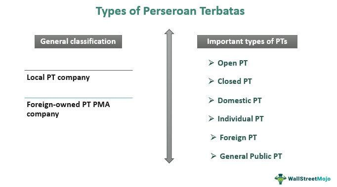

Algorithmic trading, also known as algo trading, represents a significant advancement in financial markets. It involves the use of sophisticated algorithms to automate the trading process, allowing trades to be executed at speeds and volumes that far exceed human capabilities. This method is gaining traction for its ability to implement complex trading strategies with precision and efficiency. The integration of technology and finance in this way is revolutionizing how trades are conducted across global markets.

In Indonesia, Perseroan Terbatas (PT) serves as the equivalent of a limited liability company, providing a legal and structural foundation frequently utilized by companies partaking in algo trading. PTs are the most prevalent form of business entity in Indonesia and offer limited liability protection to their shareholders, similar to corporations in other parts of the world such as the United States. These entities are integral for firms looking to operate within the regulatory framework of Indonesia's dynamic trading environment.

This article aims to explore the distinct PT structures that are pertinent to algo trading. By understanding these structures, investors and entrepreneurs can ensure that they establish legally compliant and operationally efficient entities. This knowledge is crucial for navigating the regulatory landscape and capitalizing on the opportunities presented by Indonesia's burgeoning financial market.

## Table of Contents

## What is Perseroan Terbatas (PT)?

A Perseroan Terbatas (PT) is a significant legal entity in Indonesia, structured to provide limited liability protection to its shareholders. This form of business organization ensures that the personal assets of shareholders are protected, with their financial liability limited to the extent of their investment in the company. As the predominant type of business entity in Indonesia, PTs mirror the corporate structures seen in other jurisdictions, such as corporations in the United States or GmbHs in Germany. 

The PT framework facilitates a conducive environment for businesses to conduct operations while safeguarding against personal financial risk, thus promoting entrepreneurship and investment. For companies involved in algorithmic trading, the PT structure offers a robust framework that aligns with Indonesia’s corporate laws, enabling them to undertake commercial activities effectively. By creating a legally recognized entity, PTs can partake in Indonesia's economic activities while adhering to local regulations, providing a structured pathway for domestic and international firms to navigate the Indonesian market. This alignment with the regulatory framework is critical for algo trading firms that need to operate within set legal boundaries while exploring the dynamic opportunities within this market. 

In summary, Perseroan Terbatas serves as a versatile and protective legal structure, facilitating a wide array of business activities, including the increasingly significant sphere of algorithmic trading in Indonesia.

## Types of PTs Suitable for Algo Trading

Open PT, also referred to as a Publik PT, is characterized by its ability to list shares on the Indonesian Stock Exchange, allowing them to be publicly traded. This is particularly advantageous for [algorithmic trading](/wiki/algorithmic-trading) firms that require substantial capital to invest in advanced technologies and high-frequency trading infrastructures. The public trading of shares facilitates more efficient [capital raising](/wiki/hedge-fund-capital-raising), enabling companies to finance their operations and technological advancements more effectively. Furthermore, listing on the stock exchange increases a company's visibility and can potentially attract more investors interested in the promising returns typical of well-executed algorithmic trading strategies.

Closed PT, or a Perseroan Terbatas Tertutup, offers a contrasting approach by keeping shares privately held. This structure limits the number of shareholders, often to family, close associates, or a select group of investors. Such a configuration can be beneficial for proprietary trading firms where maintaining control and confidentiality is crucial. Closed PTs provide greater governance over business strategies and decision-making processes, which can be essential for executing sensitive trading algorithms without external interference.

Domestic PT is tailored for companies conducting business primarily within Indonesia. This structure suits algorithmic trading firms focusing on the Indonesian market, leveraging local knowledge, and navigating domestic financial regulations efficiently. Establishing a Domestic PT ensures that the company operates within the legal frameworks set by Indonesian authorities, facilitating smoother integration into the local financial ecosystem.

Foreign PT, or Perseroan Terbatas Asing, permits foreign entities to own a significant portion of the company’s shares. This structure is ideal for international algorithmic trading firms seeking to venture into the Indonesian market. By setting up a Foreign PT, companies can bring in expertise, technology, and capital from abroad while complying with Indonesian regulations. This structure often requires collaborations with local partners to navigate the regulatory environment effectively and may involve restrictions on certain business activities to protect domestic interests.

General Public PT shares similarities with an Open PT but places further emphasis on transparency and regulatory compliance. This is particularly beneficial for firms planning an Initial Public Offering (IPO) as it aligns their operations with the stringent disclosure and governance standards expected by investors and regulatory bodies. Adopting a General Public PT structure can enhance a company’s credibility and attractiveness in the eyes of potential investors, thus smoothing the IPO process and fostering long-term investor relationships. 

Overall, selecting the appropriate PT structure is a strategic decision influenced by an algorithmic trading firm’s specific operational goals, investor base, market focus, and compliance capabilities within Indonesia.

## Requirements and Compliance for Establishing a PT

The process of establishing a Perseroan Terbatas (PT), akin to forming a limited liability company in Indonesia, begins with name reservation. This step ensures that the chosen company name is unique and complies with the regulations set by the Ministry of Law and Human Rights. Once a name is reserved, the founders must draft a deed of establishment. This crucial document outlines the company's articles of association and must be notarized by a licensed Indonesian notary. The deed typically covers essential elements such as the company’s purpose, capital structure, and shareholder details.

Upon notarization, the founders are required to proceed with obtaining necessary licenses and permits. The required licenses vary based on the business activities and the industry the PT will engage in. For companies involved in algorithmic trading, specific licenses related to financial services are critical. Algo trading firms must navigate the regulatory framework set by Indonesia’s Financial Services Authority (OJK) and potentially the Indonesia Stock Exchange (IDX) if engaging in activities on the exchange. These entities mandate compliance with specific financial regulations and standards, ensuring the trading practices are transparent, fair, and ethical.

In addition to obtaining relevant licenses, PTs must comply with Indonesian Company Law (Undang-Undang Perseroan Terbatas). This compliance includes maintaining accurate financial records, submitting annual financial statements audited by an independent accountant, and adhering to corporate governance standards. PTs are expected to fulfill tax obligations, which entail registering for a tax identification number (NPWP) and regularly reporting and paying corporate taxes. These responsibilities are crucial for maintaining good standing with tax authorities and avoiding legal repercussions.

Failure to comply with these requirements can result in significant penalties, including fines or suspension of business operations. Thus, for algo trading firms, understanding these legal obligations is vital not only for establishing a PT but also for its ongoing operations and sustainability in the competitive financial sector.

## Advantages of PTs in Algo Trading

Perseroan Terbatas (PT), as a business structure, offers several advantages for companies engaged in algorithmic trading in Indonesia. These benefits are critical for ensuring legal protection, financial growth, and operational compliance.

### Limited Liability

One of the primary advantages of a PT is the provision of limited liability to its shareholders. In this structure, shareholders are only liable for the company’s debts up to the value of their shares. This means that, in the event of financial losses or legal claims against the company, the personal assets of shareholders remain protected. This is particularly important in the high-risk environment of algorithmic trading, where significant market fluctuations can occur.

### Capital Accumulation

The PT structure facilitates capital accumulation by allowing the issuance of shares to raise funds. This capability is essential for algorithmic trading firms that require substantial financial resources to invest in sophisticated technologies and infrastructure. Algo trading often involves significant costs related to the development and maintenance of trading algorithms, access to high-speed data feeds, and connectivity to exchanges. By issuing shares, a PT can raise the capital needed to finance these essential components, supporting the firm's growth and competitiveness.

### Regulatory Compliance

Operating as a PT ensures that a company adheres to Indonesian regulations, which is vital for building trust and transparency among stakeholders. Indonesia has specific regulatory requirements for businesses, especially those in the financial services sector, such as algo trading firms. PTs must comply with Indonesian Company Law, maintain accurate financial records, and fulfill tax obligations. By operating within this framework, a PT demonstrates its commitment to lawful operations, thus enhancing its credibility and reputation in the market.

The combination of limited liability, capital accumulation, and regulatory compliance provides a robust foundation for algo trading firms. These advantages not only help protect and grow the firm but also establish a trustworthy relationship with investors, clients, and regulatory bodies, ultimately contributing to the firm’s success in the competitive financial market.

## Challenges in Operating a PT for Algo Trading

Operating a Perseroan Terbatas (PT) for algorithmic trading in Indonesia involves navigating a series of challenges that can impact the efficiency and effectiveness of trading operations. Here are the primary hurdles faced by firms in this industry:

**Regulatory Burden**: Indonesian financial regulations are multifaceted, requiring a deep understanding of local laws and compliance requirements. Algo trading firms must adhere to financial services laws which mandate accurate reporting and auditing of financial records to ensure transparency. These regulations are designed to prevent market manipulation and ensure fair trading, but they also require substantial legal expertise and resources to manage. Compliance involves engaging with multiple regulatory bodies, preparing detailed documentation, and regular audits, which can be both time-intensive and financially burdensome.

**Market Entry**: The Indonesian financial market is both competitive and rapidly evolving, presenting significant barriers to new entrants, including algo trading firms. The competitive landscape is intense, with established local and international players who have garnered significant market share. Entry into this market requires a substantial understanding of local business practices, consumer behavior, and competitive strategies. Moreover, establishing credibility in the financial sector requires significant time and effort, necessitating strong local partnerships and an adept marketing strategy to differentiate from competitors.

**Technology Investment**: Algo trading is heavily dependent on state-of-the-art technology and analytics. Firms need to invest in sophisticated trading platforms, high-speed internet connections, and advanced algorithm development to stay competitive. This includes hardware capable of handling large volumes of data and software solutions for complex algorithm design and real-time data analysis. Moreover, there's a constant need for upgrading technology to keep pace with innovations, adding to the financial burden. Apart from technology, firms must invest in human capital to manage and develop trading strategies, which requires hiring skilled professionals like data scientists and software developers.

These challenges underscore the need for careful planning, resource allocation, and strategic decision-making to operate successfully as a PT in Indonesia's algorithmic trading sector.

## Conclusion

Choosing the right PT structure is crucial for algo trading firms aiming to establish or expand their presence in Indonesia. The right choice provides a strategic foundation for leveraging limited liability and capital accumulation, key drivers in supporting advanced trading technology and strategies. Limited liability protects shareholders by ensuring that their financial risk is confined to their investment in the company, a fundamental attraction for investors. Additionally, the ability to raise capital through issuing shares is essential for securing the necessary resources to implement sophisticated trading algorithms and infrastructure.

However, companies must also balance these advantages with the demands of regulatory compliance and associated burdens. Establishing a compliant PT involves navigating Indonesian Company Law, which mandates accurate financial record-keeping and adherence to tax obligations. For algo trading, additional licensing requirements specific to financial services may be necessary, adding complexity to regulatory compliance. The evolving regulatory landscape in Indonesia can be challenging, requiring ongoing diligence to remain in compliance while capitalizing on market opportunities.

As Indonesia continues to open its markets to foreign investment, understanding the nuances of PT structures becomes increasingly vital. Foreign investors and firms must be well-versed in choosing the appropriate PT type, such as Open PT, Closed PT, or Foreign PT, each offering unique benefits and considerations. Successfully operating in Indonesia's financial market, especially for algo trading, demands strategic planning to navigate these nuances effectively. By making informed decisions on PT structures, firms can position themselves advantageously within Indonesia's growing market, ensuring scalability and sustainability in their trading operations.

## References & Further Reading

[1]: Bergstra, J., Bardenet, R., Bengio, Y., & Kégl, B. (2011). ["Algorithms for Hyper-Parameter Optimization."](https://dl.acm.org/doi/10.5555/2986459.2986743) Advances in Neural Information Processing Systems 24.

[2]: ["Advances in Financial Machine Learning"](https://www.amazon.com/Advances-Financial-Machine-Learning-Marcos/dp/1119482089) by Marcos Lopez de Prado

[3]: ["Evidence-Based Technical Analysis: Applying the Scientific Method and Statistical Inference to Trading Signals"](https://www.amazon.com/Evidence-Based-Technical-Analysis-Scientific-Statistical/dp/0470008741) by David Aronson

[4]: ["Machine Learning for Algorithmic Trading"](https://github.com/stefan-jansen/machine-learning-for-trading) by Stefan Jansen

[5]: ["Quantitative Trading: How to Build Your Own Algorithmic Trading Business"](https://www.amazon.com/Quantitative-Trading-Build-Algorithmic-Business/dp/1119800064) by Ernest P. Chan