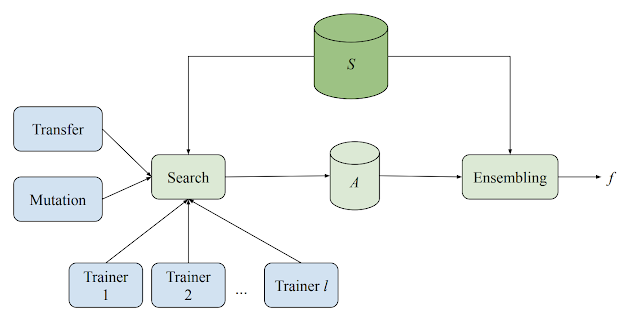

## Table of Contents

## What is a Person Search Model in the context of machine learning?

A Person Search Model in machine learning is a type of model designed to find and identify people in images or videos. It uses different techniques to look at the pictures and pick out the people, even if they are in a crowd or partially hidden. The model is trained on many images of people so it can learn what humans look like from different angles and in different situations. This makes it good at finding people in new pictures it hasn't seen before.

These models often use a combination of methods to work well. One common approach is to first detect where people are in the image using a technique called object detection. After finding the people, the model then tries to identify who they are, which is known as re-identification. This can be useful for things like security systems, where you need to keep track of people moving through an area, or for finding missing persons in large crowds. By using these steps, the Person Search Model can be very effective at its job.

## How does a Person Search Model differ from traditional image recognition models?

A Person Search Model is different from traditional image recognition models because it focuses on finding and identifying people in images or videos. Traditional image recognition models are usually made to recognize many different things, like animals, cars, or buildings. They look at an image and say what they see. But a Person Search Model is made just for people. It not only finds where people are in the image but also tries to figure out who they are. This is like looking for a friend in a crowded place, where you need to find them and recognize them.

The way a Person Search Model works is also different. Traditional image recognition models often use a single step to classify what is in the image. They might use a technique called convolutional neural networks (CNNs) to look at the whole image and decide what it shows. On the other hand, a Person Search Model usually uses two steps. First, it uses object detection to find where the people are in the image. Then, it uses a re-identification step to figure out who those people might be. This two-step process helps the model be better at finding and identifying people, even in tough situations like crowded places or when people are partly hidden.

## What are the key components of a Person Search Model?

The main parts of a Person Search Model include object detection and person re-identification. Object detection is like playing a game of "find the people" in a picture. The model looks at the image and draws boxes around where it thinks people are. This part helps the model know where to focus next. After finding the people, the model uses person re-identification. This is like trying to recognize a friend in a crowd. The model looks at the details of each person, like their clothes or face, to guess who they might be.

These two steps work together to make the Person Search Model good at its job. The object detection part needs to be accurate so the model doesn't miss any people. The person re-identification part needs to be smart to tell different people apart, even if they look similar or are wearing similar clothes. By combining these steps, the model can find and identify people in new pictures it hasn't seen before. This makes it useful for things like security cameras or finding lost people in big crowds.

## Can you explain the basic workflow of a Person Search Model?

The basic workflow of a Person Search Model starts with looking at an image or video to find where people are. This is called object detection. Imagine you're looking at a busy playground and need to spot all the kids. The model does something similar, but instead of kids, it's looking for people in the image. It draws boxes around each person it finds. This step is important because it tells the model where to focus next.

After finding the people, the model tries to figure out who they are. This is called person re-identification. Think of it like trying to recognize your friend in a crowd. The model looks at details like the person's face, clothes, and even how they stand or walk. By comparing these details to what it has learned before, the model tries to guess who each person might be. This two-step process helps the Person Search Model be good at finding and identifying people, even in tricky situations like crowded places or when people are partly hidden.

## What datasets are commonly used to train Person Search Models?

To train Person Search Models, researchers often use datasets that have lots of pictures with people in them. One popular dataset is called CUHK-SYSU. It has more than 18,000 images with over 96,000 people in them. These images come from different places like streets, parks, and malls, which helps the model learn to find people in many different situations. Another dataset is PRW (Person Re-identification in the Wild), which has around 11,000 images with over 43,000 people. These images are taken from surveillance cameras, making it good for training models to work in real-world security settings.

Another commonly used dataset is Market-1501, which contains about 32,000 images of 1,505 people. These images were taken at a busy shopping area, so the model can learn to identify people even when they are in a crowd. Using these datasets, the Person Search Model can be trained to recognize people from different angles and in different lighting conditions. This helps the model be good at its job, whether it's helping find lost people in a crowd or keeping track of people for security reasons.

## How does the AlignPS model specifically approach the person search problem?

The AlignPS model is a special kind of Person Search Model that tries to be better at finding and identifying people in pictures. It does this by using something called "alignment." Imagine you're trying to match two pictures of the same person but taken from different angles. AlignPS makes sure the parts of the two pictures that should match up, like the face or the clothes, are lined up correctly. This helps the model compare the pictures more accurately, so it can tell if they are of the same person. By doing this alignment step, AlignPS can be more sure about who it's seeing, even if the person is seen from different viewpoints.

To make this work, AlignPS uses two main parts. First, it finds where people are in the picture using object detection. This is like spotting all the people in a crowded park. After that, it uses a special way of looking at the details of each person, which it calls "alignment-based re-identification." This part is like trying to recognize your friend in the crowd by looking at their face and clothes closely. By aligning the details from different pictures, AlignPS can better tell who each person is. This makes it really good at finding and identifying people, even in tricky situations like busy places or when pictures are taken from different angles.

## What are the performance metrics used to evaluate Person Search Models?

To see how well a Person Search Model works, we use different measures. One important measure is the mean Average Precision (mAP). This tells us how good the model is at finding the right people in pictures. It looks at how accurate the model is when it says it found someone. Another measure is the top-k accuracy, which checks if the person the model thinks is the right one is in the top few guesses it makes. For example, if the model is looking for someone and puts them in its top 5 guesses, that counts as a success.

There are also other ways to check the model's performance. One way is to look at the recall rate, which tells us how many of the people the model was supposed to find it actually did find. If the model misses a lot of people, the recall rate will be low. Another useful measure is the precision rate, which shows how many of the people the model said it found were actually the right people. A high precision rate means the model is good at not making mistakes when it says it found someone. By using these measures, we can tell if a Person Search Model is doing a good job or if it needs to be improved.

## What are some of the challenges faced when developing Person Search Models?

Developing Person Search Models can be tricky because there are many challenges to overcome. One big challenge is dealing with different viewpoints. People can be seen from the front, back, or side, and the model needs to recognize them no matter the angle. This is hard because the same person can look very different from different views. Another challenge is handling crowded scenes. In busy places like markets or train stations, people can be close together or partly hidden by others. The model needs to be smart enough to find and recognize people even in these crowded situations.

Another issue is changes in appearance. People might change their clothes, hairstyles, or even grow a beard, which can make it hard for the model to recognize them. Lighting and weather can also affect how people look in pictures, adding another layer of difficulty. To make things work well, the model needs a lot of different pictures to learn from. This means using big datasets, which can be expensive and time-consuming to collect and label. By understanding these challenges, developers can work on making Person Search Models better and more reliable.

## How can transfer learning be applied to improve Person Search Models?

Transfer learning can help make Person Search Models better by using what they already know from other tasks. Imagine you learned to ride a bike. Now, learning to ride a scooter might be easier because you already know how to balance and steer. In the same way, a model trained on a big set of pictures to recognize things like animals or cars can use that knowledge to start learning about people. By starting with a model that already knows a lot, the Person Search Model doesn't have to learn everything from scratch. This saves time and can make the model better at finding and recognizing people.

To use transfer learning, developers take a model that was trained on a large dataset, like ImageNet, which has millions of pictures of different things. They then fine-tune this model on a smaller dataset that focuses on people, like CUHK-SYSU or PRW. Fine-tuning means the model keeps most of what it learned before but adjusts a bit to get better at finding and recognizing people. This way, the model can use its old knowledge to help it learn the new task faster and more accurately. By doing this, the Person Search Model can become more effective at its job, even with less training data.

## What advancements have been made in Person Search Models in the last five years?

In the last five years, Person Search Models have gotten a lot better thanks to new ideas and technology. One big improvement is the use of better ways to find and recognize people in pictures. For example, models now use something called "alignment" to make sure different pictures of the same person line up correctly, even if they are taken from different angles. This helps the model be more accurate when it tries to figure out who someone is. Another cool advancement is the use of bigger and better datasets. These datasets have more pictures of people in different situations, which helps the model learn from a wider variety of examples. This makes the model better at finding and identifying people, even in tough situations like crowded places or when people are partly hidden.

Another important advancement is the use of transfer learning. This means the model starts with what it already knows from other tasks and then learns to find and recognize people. This saves time and makes the model more accurate. For example, a model trained on a big set of pictures to recognize things like animals or cars can use that knowledge to start learning about people. By fine-tuning the model on a smaller dataset focused on people, it can become better at its job faster. These advancements have made Person Search Models more useful for things like security systems and finding lost people in crowds.

## How do state-of-the-art Person Search Models handle occlusions and varying camera angles?

State-of-the-art Person Search Models have gotten better at dealing with occlusions and different camera angles. Occlusions happen when people in a picture are partly hidden by other things or people. To handle this, these models use special techniques like part-based detection. This means the model looks at different parts of a person, like their head, torso, and legs, instead of just looking at the whole person. By focusing on these parts, the model can still recognize someone even if they are partly hidden. For example, if someone's face is covered, the model can use other visible parts like their clothes or body shape to figure out who they are.

Another challenge these models face is dealing with different camera angles. People can look very different when seen from the front, back, or side. To solve this, models use something called alignment. This means the model tries to line up different pictures of the same person so they match better, even if they are taken from different viewpoints. By doing this alignment, the model can compare the pictures more accurately and tell if they are of the same person. This makes the model good at recognizing people no matter which way the camera is pointing. These advancements help Person Search Models be more reliable and useful in real-world situations.

## What are the potential future directions for research in Person Search Models?

In the future, researchers might focus on making Person Search Models even better at dealing with tough situations. One big area could be improving how these models handle very crowded places. Right now, models can get confused when there are a lot of people close together. Researchers might work on new ways to tell people apart even when they are partly hidden or mixed in with a crowd. Another direction could be making models that work well in different kinds of lighting, like at night or in bad weather. By training models on more diverse pictures, they can learn to recognize people no matter what the conditions are.

Another important area for future research is making Person Search Models faster and easier to use. Right now, these models need a lot of computing power to work well, which can make them slow and expensive. Researchers might look into ways to make these models smaller and quicker, so they can be used on things like smartphones or in real-time security systems. Also, there could be more work on making models that can learn from less data. This would be helpful because collecting and labeling big datasets can be hard and costly. By finding ways to train models with fewer pictures, Person Search Models can become more practical and widely used.

## References & Further Reading

[1]: Xiao, T., Li, S., Wang, B., Lin, L., & Wang, X. (2017). ["Joint Detection and Identification Feature Learning for Person Search."](https://arxiv.org/abs/1604.01850) 2017 IEEE Conference on Computer Vision and Pattern Recognition (CVPR).

[2]: Zheng, L., Zhang, H., Lv, Y., Tian, Q., & Qi, J. (2017). ["Person Re-identification in the Wild."](https://arxiv.org/abs/1604.02531) 2017 IEEE Conference on Computer Vision and Pattern Recognition (CVPR).

[3]: Chang, X., Hospedales, T. M., & Xiang, T. (2018). ["Multi-level factors and features fusion for person re-identification."](https://openaccess.thecvf.com/content_cvpr_2018/papers_backup/Chang_Multi-Level_Factorisation_Net_CVPR_2018_paper.pdf) 2018 IEEE/CVF Conference on Computer Vision and Pattern Recognition.

[4]: ["AlignPS: Approximately Localize Key Points for Person Search"](https://arxiv.org/abs/2103.11617) by Yan Luo, Ying-Cong Chen, Xiaogang Wang, and Hongsheng Li, arXiv preprint arXiv:2103.15745 (2021).

[5]: Wei, L., Zhang, S., Gao, W., & Tian, Q. (2018). ["GLAD: Global-Local-Alignment Descriptor for Pedestrian Retrieval."](https://arxiv.org/abs/1709.04329) 2017 IEEE Conference on Computer Vision and Pattern Recognition (CVPR).