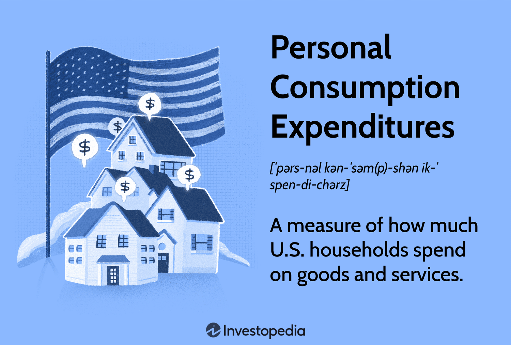

In today's fast-paced financial markets, understanding economic indicators is crucial for making informed trading decisions. Among these indicators, Personal Consumption Expenditures (PCE) hold significant weight as a measure of consumer spending, which directly reflects economic health. PCE encompasses a broad range of household expenditures and is a critical component of the United States Gross Domestic Product (GDP), thus providing essential insights into overall economic trends and consumer confidence.

Algorithmic trading, or algo trading, uses computer algorithms to execute trades at speeds and frequencies that are beyond human capabilities. This approach leverages intricate mathematical models and vast datasets to make precise trading decisions within milliseconds. The combination of computational efficiency and data analysis allows traders to capitalize on small price movements, which can lead to significant profits over time.



This article explores the intersection of PCE and algo trading, highlighting how PCE data impacts trading strategies and market behavior. As we navigate through various elements, we aim to uncover how traders can effectively integrate PCE data into algorithmic models, thereby optimizing their trading strategies. By understanding the relationship between consumer spending patterns and market dynamics, traders can gain a competitive edge in the financial markets.

The goal is to provide critical insights into how traders can leverage PCE data within algorithmic trading frameworks to optimize their strategies. This involves considering key aspects such as signal processing, algorithm development, and the integration of machine learning techniques to enhance predictive accuracy. The evolving techniques in processing economic data underscore the importance of staying informed about both economic indicators and technological advancements in trading. Understanding these nuances is vital for optimizing trading performance and ensuring adaptability in a constantly changing economic landscape.

## Table of Contents

## Understanding Personal Consumption Expenditures (PCE)

Personal Consumption Expenditures (PCE) are a fundamental economic measure that reflects the changes in the price of goods and services consumed by households. As a substantial element of the Gross Domestic Product (GDP), PCE represents approximately two-thirds of total economic output in the United States. This underscores its critical role in assessing the health of the economy, as it provides insight into consumer behavior, purchasing power, and overall economic vitality.

The PCE index serves as a vital tool for gauging the price pressures faced by consumers, offering a comprehensive view of inflationary trends within the economy. It captures a broad spectrum of consumer expenses, including expenditures on durable goods such as appliances, non-durable goods like food and clothing, and services like healthcare and education.

Economists and financial analysts closely monitor PCE data to gain insights into consumer spending patterns and their implications for monetary policy. By understanding fluctuations in PCE, stakeholders can anticipate shifts in economic [momentum](/wiki/momentum) and make informed predictions about future consumer behavior and economic conditions.

A key distinction between the PCE index and other inflation measures, such as the Consumer Price Index (CPI), lies in their scope and methodology. While both indices track changes in the cost of goods and services, the PCE index covers a broader range of expenditures, including those made on behalf of households by third parties such as government and employers. Moreover, the PCE uses a chain-weighted formula that accounts for changes in consumer preferences and substitutions, providing a more adaptable and comprehensive reflection of consumer spending habits compared to the fixed-basket approach of the CPI.

Incorporating PCE data into economic analysis and trading strategies enhances the ability to project and respond to market conditions. For instance, shifts in PCE trends can influence [interest rate](/wiki/interest-rate-trading-strategies) adjustments by central banks, which in turn affect financial markets. Understanding these dynamics is crucial for traders who seek to leverage economic indicators to optimize their decision-making processes and anticipate market movements effectively.

## Algorithmic Trading: An Overview

Algorithmic trading employs sophisticated mathematical models and automated systems to craft optimal trading strategies, fundamentally transforming modern financial markets. By leveraging algorithms, traders can process vast amounts of data at unprecedented speeds, facilitating swift and informed decision-making.

Algorithms are integral to various trading strategies, ranging from high-frequency trading ([HFT](/wiki/high-frequency-trading-strategies)) to long-term investment models. High-frequency trading involves executing a large number of trades in fractions of a second, capitalizing on minute price discrepancies. Long-term models, on the other hand, analyze broader market trends over extended periods to make informed investment decisions. These strategies are highly dependent on market conditions and specific trading objectives.

One of the primary advantages of [algorithmic trading](/wiki/algorithmic-trading) is the reduction of human error. By automating trading processes, algorithms minimize emotional and cognitive biases that can impact human decision-making. This automation leads to increased trading speed and precision, enabling traders to determine optimal entry and [exit](/wiki/exit-strategy) points with greater accuracy.

Popular programming languages like Python and C++ are frequently used to develop these algorithms. Python, in particular, is favored for its simplicity and extensive libraries that support quantitative analysis and [machine learning](/wiki/machine-learning). Below is a basic example of a simple moving average (SMA) crossover strategy implemented in Python:

```python
import pandas as pd

# Fetch historical data
data = pd.read_csv('historical_data.csv')

# Calculate short-term and long-term moving averages
data['SMA_10'] = data['Close'].rolling(window=10).mean()
data['SMA_50'] = data['Close'].rolling(window=50).mean()

# Generate trading signals
data['Signal'] = 0
data['Signal'][10:] = np.where(data['SMA_10'][10:] > data['SMA_50'][10:], 1, -1)

# Determine positions
data['Position'] = data['Signal'].shift()

# Print the trading signals
print(data[['Close', 'SMA_10', 'SMA_50', 'Signal', 'Position']])
```

In this example, a simple moving average crossover strategy is used to generate trading signals. The strategy buys when the short-term moving average (SMA_10) crosses above the long-term moving average (SMA_50) and sells when the opposite occurs.

Overall, algorithmic trading provides a structured and efficient approach to navigating the complexities of financial markets. By integrating advanced computational techniques, traders can analyze data more effectively and execute strategies with enhanced precision and speed, fundamentally reshaping market dynamics and investment strategies.

## The Relationship Between PCE and Financial Markets

Personal Consumption Expenditures (PCE) data is a vital economic indicator that reflects consumer spending, which accounts for a substantial portion of economic activity. This indicator can significantly influence financial markets by signaling shifts in consumer spending habits. When PCE data is released, it provides insights into the current state of consumer demand and inflationary pressures, which can lead traders to adjust their portfolios accordingly.

Traders and financial analysts meticulously analyze PCE data releases to anticipate changes in economic policy or shifts in market sentiment. For instance, an upward trend in PCE might indicate stronger consumer spending, which could prompt central banks to consider tighter monetary policies to curb potential inflation. Conversely, a downturn might suggest weakening demand, leading to looser monetary policies. These anticipated changes directly inform trading strategies, as traders reposition their assets to either capitalize on or hedge against the expected economic shifts.

Historically, PCE trends have been instrumental in providing insights into future economic conditions. As PCE captures comprehensive consumer expenditure data, it serves as a critical input for predictive trading models. By examining historical PCE data, traders can identify patterns and correlations with market movements, helping them forecast economic performance more accurately. This forward-looking analysis enables the development of robust algorithmic trading strategies designed to respond to expected market conditions.

Market reactions to PCE data can bring about significant [volatility](/wiki/volatility-trading-strategies). Such volatility presents opportunities for algorithmic trading strategies to exploit price inefficiencies. Algorithms designed to react to PCE announcements can execute trades almost instantaneously, capturing value from the rapid price adjustments that often follow economic data releases. For instance, algorithms might be programmed to buy or sell specific assets when PCE data deviates from market expectations, thereby taking advantage of resultant price movements.

There have been notable case studies where PCE announcements have led to significant market movements. For example, an unexpected increase in PCE could cause equities to rally, as investors anticipate stronger consumer-driven economic growth. On the other hand, if the PCE indicates higher-than-anticipated inflation, bond markets might react negatively due to fears of rising interest rates. Such instances underscore the importance of PCE data in shaping trading dynamics and highlight the need for traders to incorporate this data into their algorithmic models to enhance trading performance.

## Utilizing PCE Data in Algorithmic Trading

Incorporating Personal Consumption Expenditures (PCE) data into algorithmic trading strategies involves designing systems that react to consumer spending changes with precision. One approach is to set specific triggers within trading algorithms. These triggers are predefined thresholds based on historical and expected fluctuations in consumer spending. For instance, an algorithm could be designed to execute buy or sell orders when PCE growth rates exceed or fall below these thresholds, indicating potential shifts in economic momentum.

Advanced algorithmic models often utilize machine learning techniques to predict consumer behavior, thus optimizing trading positions. Machine learning models such as recurrent neural networks (RNNs) or [long short](/wiki/equity-long-short)-term memory networks (LSTMs) can analyze PCE trends to forecast future spending behaviors. These models consider various factors, including seasonal patterns and macroeconomic indicators, allowing traders to make data-driven decisions. For example, models can be trained using Python libraries like TensorFlow or PyTorch to incorporate PCE data effectively:

```python
import tensorflow as tf
from tensorflow.keras.models import Sequential
from tensorflow.keras.layers import LSTM, Dense

# Define a simple LSTM model
model = Sequential([
    LSTM(50, activation='relu', input_shape=(n_steps, n_features)),
    Dense(1)
])

model.compile(optimizer='adam', loss='mse')
# Assuming X_train and y_train are prepared datasets of historical PCE data
model.fit(X_train, y_train, epochs=200, verbose=0)
```

Developing a robust algorithm necessitates thorough [backtesting](/wiki/backtesting) using historical PCE data. This process ensures the algorithm's reliability across diverse market conditions and helps identify potential adjustments. By employing backtesting, traders can simulate how their strategies would have performed in the past with historical PCE releases, thereby reducing the risk of future losses and enhancing strategy effectiveness.

Risk management remains a cornerstone of using PCE data in algorithmic trading. Economic data releases, like the PCE, often lead to market volatility. Automated trading systems must incorporate risk management protocols, such as stop-loss orders or volatility filters, to protect against unexpected market swings. These protocols help ensure that potential losses during volatile periods are minimized, maintaining the integrity of a trading portfolio.

Several algorithmic strategies have successfully integrated PCE data to boost trading performance. One such approach involves employing pairs trading strategies that look for pricing anomalies between related securities around PCE data releases. By modeling the typical price response of different sectors to PCE changes, traders can exploit these inefficiencies.

As markets continue to evolve, the strategic use of PCE data in algorithmic trading represents a powerful tool for maximizing trading performance and economic insights.

## Challenges and Considerations

The intersection of PCE data with algorithmic trading presents several challenges and considerations that traders must address to optimize their strategies effectively. The latency between the release of PCE data and the subsequent algorithmic response can result in missed trading opportunities. This delay is often due to the time required for data parsing, processing, and executing trades, which can be longer than the market's reaction time. To mitigate this, traders must implement systems capable of processing and acting on data in real time.

Ensuring data accuracy is paramount. Inaccurate or incomplete data can lead to misguided trading decisions and potential financial losses. Traders often rely on real-time or near real-time data feeds, which must be constantly monitored and verified for precision. Implementing robust data verification protocols and redundancy mechanisms can help maintain the integrity of the data being utilized in trading strategies.

Regulatory considerations play a crucial role in the use of algorithmic trading, particularly when incorporating economic indicators like PCE. Compliance with financial regulations and ethical trading standards is essential to avoid legal repercussions and maintain market integrity. For example, certain jurisdictions may have specific reporting requirements or restrictions on the automated trading of securities influenced by macroeconomic data.

To enhance the robustness of trading strategies and reduce dependency on a single economic indicator such as PCE, traders should consider diversifying their data sources. By integrating multiple economic indicators, such as the Consumer Price Index (CPI), employment data, and other relevant financial metrics, traders can create more comprehensive models that account for a broader spectrum of market influences.

Keeping trading algorithms up to date is critical for adjusting to evolving market conditions and economic environments. Continuous algorithm refinement involves updating existing models to incorporate new data, refining predictive accuracy, and adapting to changes in market behavior. This process often involves machine learning techniques where algorithms self-improve by learning from historical and current data patterns.

In summary, successfully utilizing PCE data in algorithmic trading involves overcoming challenges related to data timeliness, accuracy, regulatory compliance, and strategic diversification. The dynamic nature of financial markets necessitates the constant evolution and enhancement of trading algorithms to ensure they remain effective and profitable.

## Conclusion

Understanding how Personal Consumption Expenditures (PCE) data influences economic and market conditions is crucial for developing effective algorithmic trading strategies. PCE data provides essential insights into consumer spending patterns, which directly impact national economic health. By incorporating PCE insights into trading algorithms, traders can more accurately anticipate market movements and optimize their models for enhanced returns. The dynamic nature of consumer spending data makes it a valuable input for algorithmic models designed to predict market trends.

Challenges exist in integrating PCE data within trading algorithms. These include ensuring data accuracy, managing volatility, and dealing with the lag between data release and response. Nonetheless, the potential for growth and innovation through the use of PCE data is substantial. Algorithms that effectively integrate PCE insights can exploit market inefficiencies and capitalize on trading opportunities created by shifts in consumer spending behaviors.

The continuous evolution of economic measurement techniques and trading technologies necessitates staying informed and adaptable. New methodologies in economic data analysis and advances in algorithmic trading platforms offer traders the tools needed to enhance their strategies. The adoption of machine learning techniques enables more sophisticated analysis of PCE data, allowing traders to build robust models that handle real-time data and adjust to changing conditions.

The intersection of economic data analysis and algorithmic trading holds significant promise for the future of financial markets. As traders refine their models and technologies evolve, those who successfully integrate PCE insights into their strategies will likely see improved performance and returns. This ongoing development underscores the importance of understanding and leveraging economic indicators like PCE in a rapidly advancing trading landscape.

## References & Further Reading

[1]: ["Handbook of Economic Forecasting"](https://www.sciencedirect.com/handbook/handbook-of-economic-forecasting) by Graham Elliott and Allan Timmermann

[2]: ["Algorithmic and High-Frequency Trading"](https://assets.cambridge.org/97811070/91146/frontmatter/9781107091146_frontmatter.pdf) by Álvaro Cartea, Sebastian Jaimungal, and José Penalva

[3]: ["Algorithmic Trading: Winning Strategies and Their Rationale"](https://www.wiley.com/en-us/Algorithmic+Trading%3A+Winning+Strategies+and+Their+Rationale-p-9781118460146) by Ernie Chan

[4]: ["Measuring Consumer Spending: An Overview of the CE Survey"](https://www.bls.gov/cex/) by U.S. Bureau of Labor Statistics

[5]: ["The Economics of Inflation"](https://www.weforum.org/agenda/2022/10/5-books-to-understand-inflation-economics/) by Constantino Bresciani-Turroni