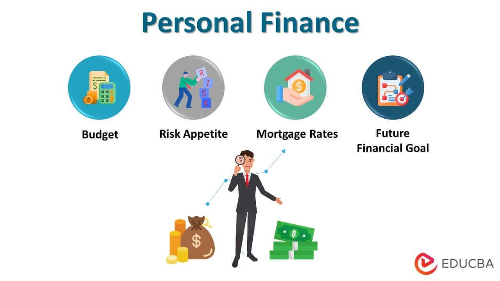

Personal finance is a crucial aspect of our lives, involving the management of monetary resources to ensure wise spending, saving, and investing. It encompasses various activities, such as budgeting, debt management, and retirement planning, all of which contribute to financial health. Effective financial planning is key to achieving long-term financial stability. It involves setting clear financial goals and creating a structured plan to meet those objectives. Proper money management ensures individuals live within their means while saving for future needs.

In recent years, algorithmic trading has emerged as an innovative approach to investing, offering the potential to significantly enhance traditional financial strategies. This method uses automated systems to execute trades based on predefined criteria, integrating sophisticated mathematical models and technology-driven strategies. Algorithmic trading can provide benefits such as improved trade execution and better risk management, making it a valuable tool in personal finance.



This article explores how personal finance, financial planning, money management, and algorithmic trading can work together to optimize financial outcomes. By understanding and applying these interconnected elements, individuals can develop comprehensive strategies to achieve financial success and stability in today's dynamic economic landscape.

## Table of Contents

## Understanding Personal Finance

Personal finance encompasses a broad range of activities that revolve around the prudent management of one's monetary resources. It includes budgeting, saving, investing, and preparing for retirement. Each of these components plays a crucial role in ensuring financial stability and success.

Budgeting is the foundation of personal finance that involves creating a plan for how one will allocate their income. It helps individuals monitor their spending and ensure they do not exceed their financial means. A popular guide that many follow is the 50/30/20 rule. This guideline suggests dividing post-tax income into three categories: 50% for needs, 30% for wants, and 20% towards savings. Needs include essential expenses such as housing, food, and transportation. Wants are non-essential items and services that enhance quality of life, like dining out and entertainment. The remaining portion is allocated to savings and debt repayment, thereby promoting long-term financial health.

Saving is another critical component, allowing individuals to set aside money for future use. It ensures preparedness for both expected life events, such as purchasing a home or planning for retirement, and unexpected financial emergencies. An efficient saving strategy might involve establishing an emergency fund, which typically covers three to six months of living expenses.

Investing involves committing resources to assets like stocks, bonds, or real estate with the expectation of generating future income or profit. It is a method of wealth accumulation and provides an opportunity to achieve greater financial returns compared to traditional saving.

Retirement planning is fundamental for ensuring financial security in one's later years, requiring early and consistent contributions to retirement accounts like 401(k)s or IRAs. It involves evaluating retirement goals, estimating future living expenses, and implementing a savings plan to meet these expenses.

An essential aspect of personal finance is managing debt effectively. This involves understanding the terms of any loans or credit and making timely payments to avoid accruing high-interest charges. Reducing high-interest debt can free up additional resources for savings and investment, thus enhancing overall financial well-being.

By diligently managing these elements—budgeting, saving, investing, and retirement planning—individuals can achieve a balanced financial portfolio. Tracking and managing expenses, setting realistic financial goals, and living within one's means lays the foundation for future financial security and success.

## The Importance of Financial Planning

Financial planning is a structured approach to managing finances over the long term. It involves the establishment of specific, measurable, achievable, relevant, and time-bound (SMART) financial goals. By setting these structured objectives, individuals can create a clear pathway toward financial success, allowing for purposeful allocation of resources and strategic financial decision-making. This approach is instrumental in preparing for unexpected events and achieving major life milestones such as purchasing a home or funding higher education.

A well-devised financial plan serves as a roadmap that guides individuals through different life stages, ensuring preparedness for unforeseen circumstances that might arise. By incorporating a buffer for emergencies and unexpected expenditures, financial planning helps mitigate the impact of sudden financial stressors. This aspect is crucial for maintaining fiscal stability and ensuring continuity toward long-term goals.

Furthermore, financial planning includes periodic reviews and adjustments to ensure its ongoing relevance and effectiveness. Economic conditions, personal circumstances, and life priorities are subject to change, necessitating regular evaluation and refinement of the financial plan. This adaptive approach ensures that the plan remains aligned with the individual's current objectives and external economic factors, thereby maintaining its utility and contribution to sustained financial stability.

In summary, effective financial planning is indispensable for long-term prosperity and security. By setting SMART goals and periodically adjusting the plan to reflect changes in personal and economic circumstances, individuals can navigate financial complexities and secure a stable future.

## Money Management Techniques

Effective money management is vital for achieving financial stability and success. It begins with creating a budget, a fundamental tool that enables individuals to plan for their income and expenses. The process involves identifying all sources of income and categorizing expenses into fixed and variable costs. By doing so, individuals can determine their disposable income and allocate funds effectively.

Tracking expenses is another essential technique. Consistently monitoring daily spending helps identify patterns and areas where cost-cutting is possible, leading to more informed financial decisions. Modern technology has facilitated this process through numerous apps that automatically categorize expenses, offering real-time insights into spending habits.

Building an emergency fund is a crucial component of money management. This fund acts as a financial safety net for unexpected events, like medical emergencies or job loss. Ideally, an emergency fund should cover three to six months' worth of living expenses. Contributing consistently to this fund mitigates financial stress during unforeseen situations.

Debt management is also a key aspect. High-interest debts, such as credit card balances, should be prioritized to reduce the total amount paid over time. A common approach to managing debt is the "avalanche method," where debts are ordered from highest to lowest [interest rate](/wiki/interest-rate-trading-strategies) and paid accordingly. Conversely, the "snowball method" focuses on paying off the smallest debts first, which can motivate individuals by providing early wins.

Prioritizing savings is equally crucial, which can be effectively managed by setting specific saving goals and using automatic saving plans. Such plans allow for a predetermined amount of money to be transferred from a checking account to a savings account regularly, thus ensuring consistent growth in savings.

In the digital age, tools and software have become indispensable for automating and streamlining money management processes. Applications like Mint, YNAB (You Need a Budget), and Personal Capital help in budget preparation, expense tracking, and investment management. They integrate with bank accounts to provide a consolidated view of financial status, offering reports and analytics that aid in better financial planning.

These money management techniques, when applied consistently, provide a structured approach to handling finances, enabling individuals to achieve their financial goals effectively and securely. They serve as the foundation for building a robust financial strategy that ensures long-term financial health.

 to Algorithmic Trading

Algorithmic trading, often referred to as algo trading, utilizes computer algorithms to execute trading decisions with precision and speed. These algorithms are based on predefined criteria and rely on intricate mathematical models, benefiting from the computational power of modern technology. This automated trading method has revolutionized the financial markets by removing human emotion and subjectivity from trading decisions, thereby enhancing efficiency and execution accuracy.

The core of [algorithmic trading](/wiki/algorithmic-trading) lies in its capacity to process vast amounts of market data, identifying patterns and opportunities that might be imperceptible to human traders. By using mathematical models, algo trading systems can predict market movements, optimize order placement, and quickly execute trades. An example of a basic algorithm might be a simple moving average crossover strategy, where trades are executed when a short-term moving average crosses a long-term moving average.

A crucial advantage of algorithmic trading is its ability to enhance trade execution. These algorithms can process market conditions in real time, ensuring that trades are carried out at the best possible prices, minimizing market impact, and reducing transaction costs. Furthermore, algorithmic trading helps in risk management by deploying strategies that include stop-loss orders and trade size adjustments, which can be automatically triggered to protect against adverse market movements.

Beyond execution and risk management, algorithmic trading offers robust scalability, allowing traders to manage multiple markets and securities simultaneously without the need for manual intervention. However, it is essential for traders using algorithmic strategies to remain cognizant of the inherent risks, such as those related to model accuracy, technology failures, and changing market dynamics. Proper understanding and continuous monitoring of these algorithms are necessary to ensure that they align with one’s financial objectives and risk tolerance.

## Enhancing Financial Planning with Algorithmic Trading

Integrating algorithmic trading into financial planning can potentially enhance investment returns and manage financial risks more effectively. Algorithmic trading employs automated systems that utilize predefined criteria and sophisticated mathematical models to execute trades. This approach can streamline the decision-making process, allowing investors to customize strategies that align with individual financial objectives.

One common strategy within algorithmic trading is the risk-based approach, which focuses on minimizing exposure to potential market downturns. This could involve using algorithms to assess [volatility](/wiki/volatility-trading-strategies) and make real-time adjustments to an investment portfolio. For instance, moving averages and standard deviation calculations can be employed to predict potential price movements and adjust holdings accordingly. Here's a simple example using Python to calculate a moving average, which can inform risk-sensitive adjustments:

```python
import pandas as pd

def moving_average(data, window_size):
    return data.rolling(window=window_size).mean()

# Example data
price_data = pd.Series([100, 102, 101, 105, 107, 110, 109, 108, 107, 111])
window_size = 3

ma = moving_average(price_data, window_size)
print(ma)
```

Yield-based algorithms, by contrast, concentrate on maximizing returns by identifying lucrative opportunities in the market, such as temporary price discrepancies or emerging trends. Advanced algorithms may employ techniques like statistical [arbitrage](/wiki/arbitrage) or [pair trading](/wiki/pair-trading) to capitalize on these opportunities. For example, a [statistical arbitrage](/wiki/statistical-arbitrage) strategy might analyze historical price patterns and use regression models to predict and exploit short-term pricing inefficiencies between correlated assets.

Despite the potential benefits, it's crucial for investors to understand the inherent risks and complexities associated with algorithmic trading. Models rely heavily on historical data and assumptions; hence, an incorrect model or data anomalies can lead to poor decision-making. Additionally, technical glitches or errors in algorithm design can cause significant financial losses. Therefore, continuous monitoring and auditing of these algorithms are essential to maintain alignment with financial goals and market conditions.

Moreover, investors should ensure that they choose appropriate trading platforms and tools that offer robust risk management features and allow for customization of trading strategies to suit individual needs. By combining algorithmic trading with traditional financial planning strategies, investors can potentially create a more diverse and resilient portfolio. Nonetheless, staying informed about market trends and technological advancements is vital in navigating this complex landscape successfully.

## Practical Steps for Incorporating Algo Trading

To effectively incorporate algorithmic trading into financial strategies, individuals should begin by building a solid understanding of algorithmic trading fundamentals and strategies. This foundational knowledge includes learning about different types of algorithms, such as trend-following algorithms, mean-reversion strategies, and arbitrage opportunities. Familiarity with concepts like order types, market microstructure, and trading signals is crucial. Online courses, [books](/wiki/algo-trading-books), and resources from reputable financial platforms can provide comprehensive insights in this area.

Selecting the appropriate trading platform and tools is a critical step in implementing an algorithmic trading plan. The platform should offer features like robust [backtesting](/wiki/backtesting), real-time data feeds, and access to various financial markets. Popular platforms like MetaTrader, [Interactive Brokers](/wiki/interactive-brokers-api), and QuantConnect cater to varying levels of expertise and specific trading needs. Customizability and ease of use are important factors to consider when choosing a trading platform.

Continuous monitoring and reviewing of trading strategies are necessary to ensure they align with financial objectives. Algorithmic strategies, once set, should not run indefinitely on autopilot. Regular evaluation involves analyzing performance metrics such as return on investment (ROI), Sharpe ratio, and drawdowns. Adjustments may be required in response to changing market conditions or shifts in personal financial goals.

For practitioners who are comfortable with programming, Python offers a versatile environment for developing and testing algorithmic trading strategies. Libraries such as `pandas` for data manipulation, `NumPy` for numerical computations, and `Matplotlib` for visualization provide the tools necessary for building complex trading models. Moreover, the `zipline` library is a popular choice for backtesting trading strategies in a Python environment.

By executing these practical steps, individuals can effectively leverage algorithmic trading in their broader financial strategies, potentially optimizing returns while managing associated risks.

## Conclusion: A Holistic Approach to Financial Success

Successful financial planning and management require a comprehensive approach that integrates both traditional and innovative methods. By combining established financial strategies with cutting-edge tools such as algorithmic trading, individuals can potentially enhance their financial growth prospects. Traditional strategies include budgeting, saving, and careful investment planning, which provide a strong foundation for financial stability. These strategies emphasize sound money management practices, such as the 50/30/20 budgeting rule, which allocates income into needs, wants, and savings, ensuring a balanced financial plan.

Algorithmic trading introduces a modern dimension to financial planning by leveraging automated systems and technology-driven strategies. These systems use predefined criteria and sophisticated mathematical models to optimize trade execution and risk management. This integration offers the potential for increased returns and more effective risk mitigation, aligning with the individual's financial goals.

Staying informed and adaptable is essential in navigating the evolving financial landscape. The financial market is constantly changing, driven by technological advancements, economic shifts, and regulatory changes. Thus, a successful financial strategy involves continuous education, regular review of financial goals, and adjustment of strategies as needed. This adaptability allows individuals to make informed decisions, capitalize on new opportunities, and maintain resilience against unforeseen challenges.

In conclusion, achieving financial success involves a blend of time-tested financial practices and the adoption of modern tools like algorithmic trading. This holistic approach not only enhances growth but also ensures preparedness for future financial needs, providing a sustainable path toward personal financial success.

## References & Further Reading

[1]: ["Advances in Financial Machine Learning"](https://www.amazon.com/Advances-Financial-Machine-Learning-Marcos/dp/1119482089) by Marcos Lopez de Prado

[2]: ["Evidence-Based Technical Analysis: Applying the Scientific Method and Statistical Inference to Trading Signals"](https://www.amazon.com/Evidence-Based-Technical-Analysis-Scientific-Statistical/dp/0470008741) by David Aronson

[3]: ["Machine Learning for Algorithmic Trading"](https://github.com/stefan-jansen/machine-learning-for-trading) by Stefan Jansen

[4]: ["Quantitative Trading: How to Build Your Own Algorithmic Trading Business"](https://www.amazon.com/Quantitative-Trading-Build-Algorithmic-Business/dp/1119800064) by Ernest P. Chan

[5]: Gitman, L. J., & Joehnk, M. D. (2002). ["Personal Financial Planning."](https://www.cengage.com/c/personal-financial-planning-15e-billingsley/9780357438480PF/?searchIsbn=9780357710715) Pearson.

[6]: Pring, M. J. (2014). ["Technical Analysis Explained, Fifth Edition: The Successful Investor's Guide to Spotting Investment Trends and Turning Points."](https://www.amazon.com/Technical-Analysis-Explained-Fifth-Successful/dp/0071825177) McGraw-Hill Education.