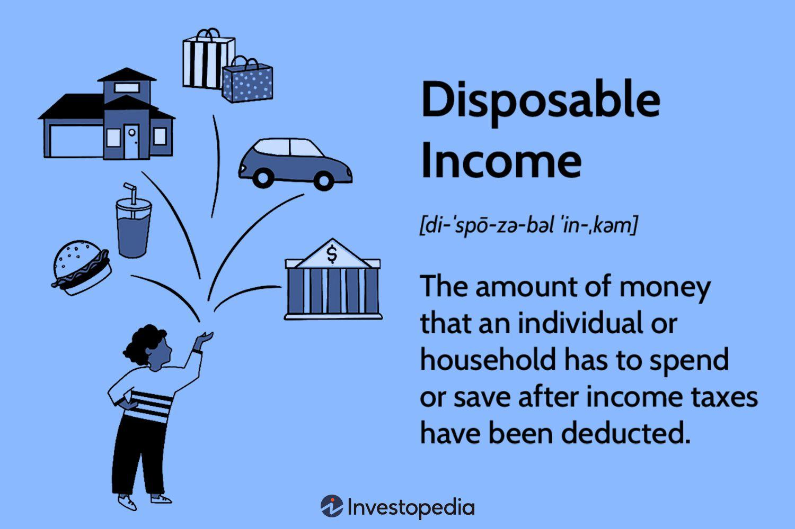

## Table of Contents

## What is personal income?

Personal income is the money a person gets from different places. This can include money from a job, like a salary or wages, and also money from other sources like investments, rental properties, or government benefits like social security. It's basically all the money that comes into a person's pocket before any taxes or other deductions are taken out.

Understanding personal income is important because it helps people know how much money they have to spend or save. It's used to figure out things like taxes, how much someone can borrow, and even if they qualify for certain programs or benefits. Knowing your personal income helps you plan your finances better and make smart decisions about money.

## What is disposable income?

Disposable income is the money you have left after paying taxes. It's what you can use to buy things you need or want, like food, clothes, and entertainment. If you get $1000 from your job and you have to pay $200 in taxes, your disposable income is $800. This is the money you can spend on anything you choose.

This income is important because it shows how much money you really have to live on. It helps you make a budget and decide how to spend or save your money. If your disposable income goes up, you might be able to save more or buy things you couldn't afford before. If it goes down, you might need to cut back on spending.

## How is personal income calculated?

Personal income is figured out by adding up all the money a person gets from different places. This includes money from jobs, like salaries or wages, and money from other sources like investments, rental properties, or government benefits like social security. If you have a job that pays you $2000 a month and you also get $500 from renting out a room, your personal income for that month would be $2500 before taxes.

Sometimes, personal income can also include other types of money, like dividends from stocks or interest from savings accounts. If you earn $100 in dividends and $20 in interest in a month, you would add these amounts to your total personal income. So, if you already have $2500 from your job and rental, adding the dividends and interest would make your personal income $2620 for that month.

## How is disposable income calculated?

Disposable income is the money you have left after you pay taxes. It's what you can use to buy things you need or want, like groceries, clothes, and fun stuff. To figure out your disposable income, you start with your personal income, which is all the money you get from your job, investments, and other places. Then, you take away the taxes you have to pay. For example, if you earn $3000 a month and pay $600 in taxes, your disposable income is $2400.

This number is important because it shows how much money you really have to spend or save. If your disposable income goes up, you might be able to save more or buy things you couldn't afford before. If it goes down, you might need to cut back on spending. Knowing your disposable income helps you plan your budget and make smart choices about your money.

## What are the main differences between personal income and disposable income?

Personal income is all the money you get from different places before you pay taxes. This includes money from your job, like your salary or wages, and also money from other sources like investments, rental properties, or government benefits like social security. If you earn $2000 from your job and $500 from renting out a room, your personal income for that month would be $2500 before taxes.

Disposable income is different because it's the money you have left after you pay taxes. It's what you can use to buy things you need or want, like food, clothes, and fun stuff. If you earn $2500 in a month and pay $500 in taxes, your disposable income would be $2000. This is the money you can spend on anything you choose.

Understanding the difference between these two types of income is important. Personal income shows all the money coming in, while disposable income shows how much you can actually use. Knowing both helps you plan your budget and make smart choices about how to spend or save your money.

## Can you give examples of personal income sources?

Personal income comes from many places. One big source is money from a job, like your salary or wages. If you work at a store and get paid every two weeks, that money is part of your personal income. Another common source is money from the government, like social security or unemployment benefits. If you're retired and get a monthly check from social security, that's also part of your personal income.

Other sources of personal income include money from investments. For example, if you own stocks and get dividends, or if you have money in a savings account and earn interest, these are also part of your personal income. Another source can be money from renting out property. If you own a house and rent out a room, the rent you get each month adds to your personal income. All these different places where money comes from make up your total personal income before you pay any taxes.

## What types of deductions are typically subtracted from personal income to arrive at disposable income?

To get disposable income, you usually start with your personal income and then take away the taxes you have to pay. The main taxes that come out of your personal income are income taxes. These are taxes that the government takes from your earnings. Depending on where you live, you might also have to pay state or local taxes. These taxes reduce the amount of money you have left to spend on things you need or want.

Besides income taxes, there might be other deductions that come out of your personal income. For example, if you have health insurance through your job, some of the cost might be taken out of your paycheck before you get it. This is called a pre-tax deduction because it happens before taxes are calculated. Other common deductions include contributions to retirement plans like a 401(k), or payments for things like life insurance or disability insurance. After all these deductions are taken out, what you have left is your disposable income, which you can use to buy things or save for the future.

## How does disposable income affect an individual's spending power?

Disposable income is the money you have left after paying taxes. It's what you can use to buy things you need or want, like food, clothes, and fun stuff. The more disposable income you have, the more you can spend on these things. If your disposable income goes up, you might be able to buy more things or save more money. If it goes down, you might need to spend less or find ways to make your money last longer.

Having more disposable income can make a big difference in your life. It can mean you can afford to go out to eat more often, take a vacation, or buy a new phone. It can also help you save for big goals like buying a house or paying for college. On the other hand, if your disposable income is low, you might have to be careful with your money and focus on buying only what you really need. Knowing how much disposable income you have helps you plan your spending and make smart choices about your money.

## What role do taxes play in the difference between personal income and disposable income?

Taxes are the main reason why personal income and disposable income are different. Personal income is all the money you get from different places like your job, investments, or government benefits before you pay any taxes. When you take away the taxes you have to pay from your personal income, what you have left is your disposable income. This is the money you can actually use to buy things you need or want.

Taxes, like income tax, state tax, and sometimes local tax, come out of your personal income. These taxes reduce the amount of money you have left to spend. For example, if you earn $3000 a month and pay $600 in taxes, your disposable income is $2400. This means you have $2400 to spend on things like food, clothes, and fun stuff. Understanding how taxes affect your income helps you know how much money you really have to work with.

## How do economic policies influence the gap between personal income and disposable income?

Economic policies can change the difference between personal income and disposable income by changing how much tax people have to pay. If the government decides to raise taxes, more money is taken out of your personal income, so you have less disposable income left. For example, if your personal income is $3000 a month and taxes go up from $600 to $750, your disposable income drops from $2400 to $2250. This means you have less money to spend on things you need or want. On the other hand, if taxes are lowered, less money is taken out, so you have more disposable income. If taxes go down to $450, your disposable income goes up to $2550, giving you more money to use.

Economic policies can also affect disposable income through things like tax credits and deductions. If the government introduces new tax credits, like ones for having children or buying a home, these can lower the amount of tax you pay, increasing your disposable income. For instance, if a new tax credit gives you an extra $200 back, your disposable income goes up by that amount. Similarly, if there are more deductions available, like for health insurance or retirement savings, these can also reduce your tax bill and increase your disposable income. These policies help people keep more of their personal income, which can make a big difference in how much money they have to spend or save.

## What are the implications of the personal income and disposable income gap on economic inequality?

The gap between personal income and disposable income can make economic inequality worse. When people with high incomes pay a lot in taxes, they still have a lot of disposable income left because their personal income is so high. But for people with lower incomes, even a small amount of taxes can make a big difference in their disposable income. This means that the rich keep a bigger share of their money to spend or save, while the poor have less money left over after taxes. This difference can make the gap between rich and poor even bigger because the rich can use their disposable income to invest and earn more, while the poor struggle to meet their basic needs.

Economic policies that change taxes and benefits can also affect this gap and inequality. If taxes go up, people with lower incomes might find it even harder to make ends meet, while those with higher incomes might still have plenty of money left. On the other hand, if tax credits or deductions are given to lower-income families, it can help them keep more of their personal income, reducing the gap between what they earn and what they can actually use. This can help lessen economic inequality by giving more people the chance to improve their financial situation. Understanding how these policies work is important for creating a fairer economy where everyone has a better chance to succeed.

## How can understanding the difference between personal income and disposable income help in financial planning?

Understanding the difference between personal income and disposable income is really important for making a good financial plan. Personal income is all the money you get from your job, investments, and other places before you pay taxes. Disposable income is what you have left after you pay taxes, and it's the money you can use to buy things you need or want. Knowing how much disposable income you have helps you figure out how much you can spend on things like food, clothes, and fun stuff, and how much you can save for the future.

By knowing the difference, you can make a budget that fits your actual money situation. If your disposable income goes up because taxes go down or you get a raise, you might be able to save more or buy things you couldn't afford before. If your disposable income goes down because taxes go up or your income drops, you might need to cut back on spending. Planning your finances with this in mind helps you make smart choices about your money and reach your financial goals, like buying a house or saving for retirement.

## What is Understanding Disposable Income?

Disposable income is the portion of an individual's income that is available for spending and saving after the deduction of taxes. More formally, it can be expressed as:

$$
\text{Disposable Income} = \text{Personal Income} - \text{Taxes}
$$

Where:
- $\text{Personal Income}$ represents the total earnings from all sources without any deductions.
- $\text{Taxes}$ include federal, state, local, and other mandatory levies imposed on the individual's income.

Disposable income is often considered a key indicator of financial well-being and economic capacity because it directly impacts an individual's ability to purchase goods and services and save for future needs. A higher disposable income typically translates to greater financial comfort and the ability to invest in lifestyle improvements and savings vehicles.

### Importance of Disposable Income

Disposable income is crucial in assessing economic conditions as it influences consumer behavior. It generally dictates the strength of consumer spending, which is a vital component of gross domestic product (GDP). When disposable income increases, individuals are more likely to spend on goods and services, thereby stimulating economic growth. Conversely, a decline in disposable income can lead to reduced consumer spending, potentially slowing down economic [momentum](/wiki/momentum).

### Impact on Consumer Spending and Saving

The level of disposable income affects how individuals allocate their finances between spending and saving. Individuals with higher disposable incomes tend to have more discretionary spending, leading to increased consumption of luxury goods and non-essential services. This consumer behavior can have a ripple effect across various sectors of the economy.

On the contrary, individuals with lower disposable incomes might prioritize essential expenditures, such as housing, food, and transportation, often resulting in constrained spending in other areas. This prioritization can impact savings rates, as those with limited disposable incomes may find it challenging to allocate funds toward savings.

Research suggests that changes in disposable income can lead to significant shifts in consumer spending patterns. For instance, a tax cut that increases disposable income can encourage higher spending levels, contributing to economic expansion. Conversely, an increase in taxes reducing disposable income might encourage saving as a buffer against reduced purchasing power.

Understanding the dynamics of disposable income is essential for policymakers, businesses, and individuals. It helps in designing effective fiscal policies, planning business strategies, and managing personal finances. In particular, policymakers often analyze disposable income trends to make informed decisions about tax policies, interest rates, and social programs, aiming to maintain economic stability and enhance the financial security of individuals.

## What are the differences between personal and disposable income?

Personal income and disposable income are two distinct but interconnected financial metrics that give insight into the economic health of individuals and households. Understanding their differences involves recognizing the deductions that transition personal income into disposable income and appreciating how disposable income provides a clearer picture of an individual's actual financial capacity.

Personal income represents the total earnings received by an individual from all possible sources. This includes wages, salaries, bonuses, dividends, rental income, and any other forms of earnings before any deductions for taxes or savings. Essentially, it quantifies the gross economic resources a person accumulates within a defined period, typically measured monthly or annually. Personal income serves as a crucial indicator of [earning](/wiki/earning-announcement) capacity and overall economic strength.

Disposable income, on the other hand, is the portion of personal income that remains after deducting taxes. It is the net income available to individuals or households for consumption and saving decisions. The formula for calculating disposable income can be represented as:

$$
\text{Disposable Income} = \text{Personal Income} - \text{Taxes Paid}
$$

Taxes in this context include federal, state, and local income taxes as well as social security contributions and any other mandatory levies. Disposable income is a vital metric in economic analysis because it reflects the actual financial resources available for individuals to manage their daily expenses and allocate to savings or investments.

By comparing personal and disposable income, one can identify how taxation impacts financial resources. For instance, if a person earns a personal income of $60,000 annually and pays $12,000 in taxes, their disposable income would be $48,000. This example illustrates that while personal income provides a broad measure of financial inflow, disposable income offers a more precise view of monetary resources that can be utilized for spending and saving.

Disposable income is a more effective gauge of an individual's or household's financial well-being. It directly correlates with consumption behavior, influencing economic indicators such as consumer spending and saving rates. For policymakers, changes in disposable income levels can signal shifts in economic stability, prompting adjustments in tax rates, subsidies, or welfare programs to either encourage spending or bolster saving, depending on broader economic objectives.

In practical terms, understanding the distinction between personal and disposable income can guide individuals in devising budgets, setting financial goals, and planning investments. It also aids economists and policymakers in assessing the impact of fiscal policies and economic conditions on the population's capacity to sustain consumption and savings, hence contributing to overall economic growth.

## What is the role of income in economic policy?

Governments rely heavily on the analysis of personal and disposable income data to inform and craft effective economic policies. These income metrics are vital in evaluating the financial status of individuals and households, thereby guiding decisions that impact economic growth and social welfare. 

Personal income data provides a comprehensive view of the total resources available to individuals, reflecting their potential consumption and investment capabilities before taxes. On the other hand, disposable income is more critical for policy formulation as it represents the actual funds available for expenditure and saving after tax obligations are met. This measure is crucial for assessing the true economic capacity of consumers to partake in economic activities.

Fiscal policies often hinge on these concepts, particularly in the structuring of tax systems and redistribution efforts. Changes in tax policies directly influence disposable income. For example, a reduction in income tax rates increases disposable income, potentially boosting consumer spending and stimulating economic growth. Conversely, an increase in taxes reduces disposable income, possibly curtailing spending and slowing down economic momentum. Mathematically, disposable income ($DI$) can be represented as:

$$
DI = PI - T
$$

where $PI$ is personal income and $T$ represents taxes.

Economic conditions also play a pivotal role in determining disposable income levels. Inflation, for example, can erode the purchasing power of disposable income, necessitating adjustments in fiscal policies to maintain economic stability. Similarly, during economic downturns, governments might introduce stimulus packages or alter tax structures to enhance disposable income, thereby invigorating consumer spending and mitigating the impacts of recession.

Income data is also integral in assessing fiscal health and guiding social programs. Governments utilize these metrics to identify income disparities and implement policies aimed at income redistribution, such as progressive taxation and welfare programs. By targeting enhancements in disposable income among lower-income groups, such policies aim to reduce poverty and foster social equity.

In conclusion, personal and disposable income are foundational elements in economic policy development. Policymakers use these measures to gauge economic vitality, adjust fiscal policies, and implement social programs that promote equitable income distribution and ensure fiscal health. Understanding these dynamics is fundamental for ensuring that economic policies effectively meet the needs of the population and support sustainable economic growth.

## References & Further Reading

[1]: Mankiw, N. G., & Taylor, M. P. (2011). ["Economics."](https://www.amazon.com/Economics/dp/1473768543) South-Western Cengage Learning.

[2]: Piketty, T. (2014). ["Capital in the Twenty-First Century."](https://www.jstor.org/stable/j.ctt6wpqbc) Harvard University Press.

[3]: Shiller, R. J. (2015). ["Irrational Exuberance."](https://press.princeton.edu/books/paperback/9780691173122/irrational-exuberance) Princeton University Press.

[4]: Fabozzi, F. J., & Focardi, S. M. (2010). ["Robust Portfolio Optimization and Management."](https://onlinelibrary.wiley.com/doi/book/10.1002/9781119202172) John Wiley & Sons.

[5]: Chan, E. P. (2009). ["Quantitative Trading: How to Build Your Own Algorithmic Trading Business."](https://github.com/ftvision/quant_trading_echan_book) John Wiley & Sons.