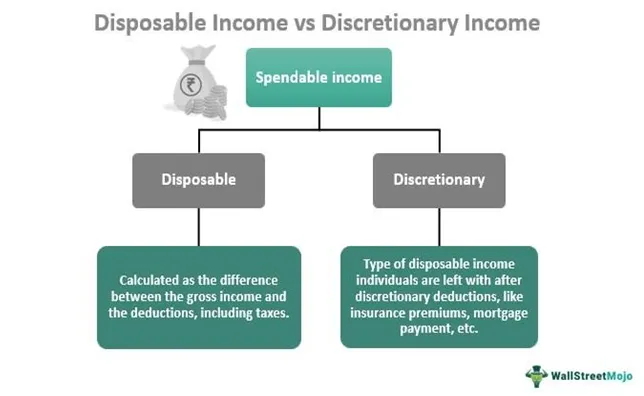

Understanding the dynamics of personal and disposable income is crucial for comprehending financial stability and decision-making in households. Personal income encompasses the total earnings received by individuals from all sources, such as wages, investments, and other forms of compensation. It serves as a fundamental indicator of earning capacity and overall economic health. On the other hand, disposable income refers to the amount of money individuals or households have available for spending and saving after taxes have been deducted, thereby offering a more accurate picture of financial autonomy and the capacity to meet living expenses.

Algorithmic trading, a cornerstone of modern finance, is influenced by diverse economic factors, including income levels. This trading methodology relies heavily on sophisticated algorithms and vast datasets to execute trading strategies with speed and precision. The interplay between personal and disposable income levels and algo trading underscores the broader economic implications of income distribution and financial behaviors. Given that disposable income significantly affects consumer spending patterns, shifts in income levels can alter market dynamics, influencing algorithmic models that drive trading decisions.



The impact of personal and disposable income extends beyond individual households, influencing the larger economy. Variations in income can dictate spending habits, saving potential, and investment opportunities, thus contributing to the overall economic climate. Understanding the distinction between personal and disposable income is vital for appreciating their roles in economic policy-making and personal financial health. Governments use these metrics to shape fiscal policies, tax rates, and social welfare programs, aiming to foster economic growth and stability.

As households navigate financial landscapes, recognizing the significance of income structures can enhance financial planning and aid in achieving economic resilience. In the algorithmic trading sphere, where financial stability is intertwined with market efficiency, understanding income levels can enhance trading strategies and leverage economic opportunities. Consequently, analyzing income dynamics offers invaluable insights into the interconnectedness of personal finance and broader economic systems, reinforcing the need for informed decision-making both at the individual and policy levels.

## Table of Contents

## What is Personal Income?

Personal income is a comprehensive measure of the total earnings received by individuals from various sources such as wages, salaries, dividends, interest, rent, and other forms of earnings. This metric serves as a crucial indicator of an individual's or a household's earning power before any deductions such as taxes. As such, personal income offers insight into economic capacity, reflecting the potential ability of individuals to consume, save, or invest.

Understanding personal income involves recognizing its role as a measure of financial strength. This is because higher personal income generally indicates greater financial flexibility and potentially enhanced quality of life. For instance, an individual with substantial personal income from multiple sources—say, a combination of salary and investment returns—will naturally have more options for allocating resources, whether for consumption, saving, or further investment.

Tracking personal income is essential for economic health assessments. Economists and policymakers rely on personal income data to evaluate the overall economic stability of a region or country. An upward trend in personal income often signals economic growth and prosperity, fostering increased consumer spending, which in turn stimulates economic activity. Conversely, stagnant or declining personal income can indicate economic challenges, potentially leading to reduced consumer spending, lower savings rates, and diminished investment capacity.

Moreover, personal income is an integral component used to calculate national economic indicators such as Gross Domestic Product (GDP) and Gross National Income (GNI). These indicators help assess the economic performance of a country and guide decisions in fiscal and monetary policy.

For individuals and households, tracking personal income is vital for personal financial planning. It enables individuals to create budgets, plan for future expenditures, and determine necessary savings to achieve financial goals. Understanding personal income can also inform decisions about career changes, investment opportunities, and risk management strategies.

In summary, personal income not only reflects an individual's or household's [earning](/wiki/earning-announcement) capacity but also serves as a foundational element in assessing economic health, informing policy-making, and guiding personal financial management decisions.

## Understanding Disposable Income

Disposable income is the portion of an individual's income that is available for spending and saving after the deduction of taxes. More formally, it can be expressed as:

$$
\text{Disposable Income} = \text{Personal Income} - \text{Taxes}
$$

Where:
- $\text{Personal Income}$ represents the total earnings from all sources without any deductions.
- $\text{Taxes}$ include federal, state, local, and other mandatory levies imposed on the individual's income.

Disposable income is often considered a key indicator of financial well-being and economic capacity because it directly impacts an individual's ability to purchase goods and services and save for future needs. A higher disposable income typically translates to greater financial comfort and the ability to invest in lifestyle improvements and savings vehicles.

### Importance of Disposable Income

Disposable income is crucial in assessing economic conditions as it influences consumer behavior. It generally dictates the strength of consumer spending, which is a vital component of gross domestic product (GDP). When disposable income increases, individuals are more likely to spend on goods and services, thereby stimulating economic growth. Conversely, a decline in disposable income can lead to reduced consumer spending, potentially slowing down economic [momentum](/wiki/momentum).

### Impact on Consumer Spending and Saving

The level of disposable income affects how individuals allocate their finances between spending and saving. Individuals with higher disposable incomes tend to have more discretionary spending, leading to increased consumption of luxury goods and non-essential services. This consumer behavior can have a ripple effect across various sectors of the economy.

On the contrary, individuals with lower disposable incomes might prioritize essential expenditures, such as housing, food, and transportation, often resulting in constrained spending in other areas. This prioritization can impact savings rates, as those with limited disposable incomes may find it challenging to allocate funds toward savings.

Research suggests that changes in disposable income can lead to significant shifts in consumer spending patterns. For instance, a tax cut that increases disposable income can encourage higher spending levels, contributing to economic expansion. Conversely, an increase in taxes reducing disposable income might encourage saving as a buffer against reduced purchasing power.

Understanding the dynamics of disposable income is essential for policymakers, businesses, and individuals. It helps in designing effective fiscal policies, planning business strategies, and managing personal finances. In particular, policymakers often analyze disposable income trends to make informed decisions about tax policies, interest rates, and social programs, aiming to maintain economic stability and enhance the financial security of individuals.

## Differences Between Personal and Disposable Income

Personal income and disposable income are two distinct but interconnected financial metrics that give insight into the economic health of individuals and households. Understanding their differences involves recognizing the deductions that transition personal income into disposable income and appreciating how disposable income provides a clearer picture of an individual's actual financial capacity.

Personal income represents the total earnings received by an individual from all possible sources. This includes wages, salaries, bonuses, dividends, rental income, and any other forms of earnings before any deductions for taxes or savings. Essentially, it quantifies the gross economic resources a person accumulates within a defined period, typically measured monthly or annually. Personal income serves as a crucial indicator of earning capacity and overall economic strength.

Disposable income, on the other hand, is the portion of personal income that remains after deducting taxes. It is the net income available to individuals or households for consumption and saving decisions. The formula for calculating disposable income can be represented as:

$$
\text{Disposable Income} = \text{Personal Income} - \text{Taxes Paid}
$$

Taxes in this context include federal, state, and local income taxes as well as social security contributions and any other mandatory levies. Disposable income is a vital metric in economic analysis because it reflects the actual financial resources available for individuals to manage their daily expenses and allocate to savings or investments.

By comparing personal and disposable income, one can identify how taxation impacts financial resources. For instance, if a person earns a personal income of $60,000 annually and pays $12,000 in taxes, their disposable income would be $48,000. This example illustrates that while personal income provides a broad measure of financial inflow, disposable income offers a more precise view of monetary resources that can be utilized for spending and saving.

Disposable income is a more effective gauge of an individual's or household's financial well-being. It directly correlates with consumption behavior, influencing economic indicators such as consumer spending and saving rates. For policymakers, changes in disposable income levels can signal shifts in economic stability, prompting adjustments in tax rates, subsidies, or welfare programs to either encourage spending or bolster saving, depending on broader economic objectives.

In practical terms, understanding the distinction between personal and disposable income can guide individuals in devising budgets, setting financial goals, and planning investments. It also aids economists and policymakers in assessing the impact of fiscal policies and economic conditions on the population's capacity to sustain consumption and savings, hence contributing to overall economic growth.

## The Role of Income in Economic Policy

Governments rely heavily on the analysis of personal and disposable income data to inform and craft effective economic policies. These income metrics are vital in evaluating the financial status of individuals and households, thereby guiding decisions that impact economic growth and social welfare. 

Personal income data provides a comprehensive view of the total resources available to individuals, reflecting their potential consumption and investment capabilities before taxes. On the other hand, disposable income is more critical for policy formulation as it represents the actual funds available for expenditure and saving after tax obligations are met. This measure is crucial for assessing the true economic capacity of consumers to partake in economic activities.

Fiscal policies often hinge on these concepts, particularly in the structuring of tax systems and redistribution efforts. Changes in tax policies directly influence disposable income. For example, a reduction in income tax rates increases disposable income, potentially boosting consumer spending and stimulating economic growth. Conversely, an increase in taxes reduces disposable income, possibly curtailing spending and slowing down economic momentum. Mathematically, disposable income ($DI$) can be represented as:

$$
DI = PI - T
$$

where $PI$ is personal income and $T$ represents taxes.

Economic conditions also play a pivotal role in determining disposable income levels. Inflation, for example, can erode the purchasing power of disposable income, necessitating adjustments in fiscal policies to maintain economic stability. Similarly, during economic downturns, governments might introduce stimulus packages or alter tax structures to enhance disposable income, thereby invigorating consumer spending and mitigating the impacts of recession.

Income data is also integral in assessing fiscal health and guiding social programs. Governments utilize these metrics to identify income disparities and implement policies aimed at income redistribution, such as progressive taxation and welfare programs. By targeting enhancements in disposable income among lower-income groups, such policies aim to reduce poverty and foster social equity.

In conclusion, personal and disposable income are foundational elements in economic policy development. Policymakers use these measures to gauge economic vitality, adjust fiscal policies, and implement social programs that promote equitable income distribution and ensure fiscal health. Understanding these dynamics is fundamental for ensuring that economic policies effectively meet the needs of the population and support sustainable economic growth.

## Algorithmic Trading: A Connection to Income Levels

Algorithmic trading, often referred to as algo trading, is a method of executing orders using automated pre-programmed trading instructions. These instructions account for variables such as time, price, and [volume](/wiki/volume-trading-strategy). The fundamental concept is that trades are executed at optimal speeds and prices by leveraging computational algorithms, surpassing human capabilities. Market data and economic indicators form the backbone of these algorithms, allowing them to assess real-time information quickly and effectively.

### Variations in National and Individual Income

National and individual income levels serve as key economic indicators that influence trading algorithms. Income levels affect consumer spending, savings rates, and overall economic growth, which in turn impact financial markets. For instance, an increase in personal or disposable income in a country can lead to higher consumer spending. This increase can be a bullish signal for certain sectors, prompting trading algorithms to adjust their strategies. 

These variations can also affect interest rates, inflation, and investment yields, all of which are critical inputs for algorithmic systems. For example, if income growth indicates potential inflationary pressures, interest rates might rise, influencing bond market strategies. Here’s a simplified illustration using Python to simulate how an algorithm might adjust its trading strategy based on income data:

```python
def adjust_trading_strategy(income_growth_rate):
    if income_growth_rate > 3:  # Assume an income growth rate threshold
        trading_decision = "Buy"
    else:
        trading_decision = "Sell"
    return trading_decision

current_income_growth_rate = 4.5  # Example growth rate
print(adjust_trading_strategy(current_income_growth_rate))  # Outputs: Buy
```

### Impact of Disposable Income on Investor Behavior and Trading Strategies

Disposable income, the net income available after taxes, directly affects consumer and investor behavior. When disposable income rises, individuals have more money available for saving and investing. This increase can lead to greater participation in stock markets, affecting [liquidity](/wiki/liquidity-risk-premium) and potentially the [volatility](/wiki/volatility-trading-strategies) of asset prices. Changes in disposable income can therefore drive changes in both buy-side and sell-side strategies employed in [algorithmic trading](/wiki/algorithmic-trading).

Trading algorithms may also use disposable income data to predict macroeconomic trends. For instance, a sustained increase in disposable income can lead to more aggressive trading strategies, anticipating consumer-driven market growth. Conversely, a decline might prompt more conservative algorithms, focusing on asset protection strategies.

In conclusion, algorithmic trading's effectiveness is intricately linked to economic indicators such as national and individual income levels. Variations in these indicators inform trading algorithms, impacting how they interpret market conditions and execute trades. By understanding these relationships, the adaptability of modern trading systems is enhanced, ensuring they remain responsive to economic shifts.

## Income Trends and Their Impacts on Algorithmic Trading

Historical trends in income growth hold significant sway over the financial markets and, by extension, algorithmic trading. These trends reflect not only the health of the economy but also shape consumer behavior, which in turn influences market dynamics. The growth of personal and disposable incomes generally signals increased consumer spending, which can boost market sectors reliant on consumer goods and services.

In algorithmic trading, personal and disposable income trends become inputs in various trading models and strategies. For instance, a consistent rise in disposable income implies greater capacity for savings and investments, potentially increasing market liquidity. This presents opportunities for high-frequency trading strategies that benefit from increased transaction volumes. Conversely, stagnant or declining income levels might lead to reduced trading volumes, impacting algorithmic strategies reliant on high market activity. 

Emerging markets and economies in transition are pivotal in shaping these income trends on a global scale. Economies such as China and India have witnessed robust income growth, propelling them to the forefront of global economic expansion. This growth is attributed to factors such as industrialization, urbanization, and investment in technology. Increased income levels in these regions contribute positively to global trading platforms by enhancing liquidity and fostering greater investment inflows. Algorithmic traders leverage these shifts by adjusting their strategies to target emerging market equities and currencies, which often exhibit more volatility and growth potential compared to developed markets.

Mathematically, the impact of income growth on trading can be assessed by examining correlations between income indices and market indices. For example, a Pearson correlation coefficient could be calculated to measure the linear correlation between disposable income growth and stock market performance:

```python
import numpy as np
from scipy.stats import pearsonr

# Sample data: disposable income growth and stock market index returns
income_growth = np.array([2.5, 3.0, 2.8, 3.2, 2.9])  # in percentages
market_returns = np.array([5.1, 4.8, 5.0, 5.3, 4.9])  # in percentages

# Calculate the Pearson correlation coefficient
correlation_coefficient, p_value = pearsonr(income_growth, market_returns)
print(f"Pearson correlation coefficient: {correlation_coefficient}")
```

Understanding the relationship between income changes and trading volatility is crucial. During economic downturns, decreases in personal and disposable income often lead to increased market volatility. This heightened volatility is a result of market uncertainty as investors react to potential declines in consumer spending and economic performance. Algorithmic trading models often account for such volatility shifts by employing volatility-based technical indicators and automated risk management protocols that dynamically adjust exposure in volatile markets.

Overall, the interplay between income trends and algorithmic trading highlights the multifaceted nature of financial markets. Traders and economists must continually assess how income changes, driven by both micro and macroeconomic factors, potentially dictate trading behaviors and the broader market environment. This understanding is critical for optimizing algorithmic trading strategies to adapt to evolving economic landscapes.

## Conclusion

Personal and disposable income are pivotal components that not only influence the economics of households but also affect broader economic strategies and trading systems such as algorithmic trading. Personal income, the aggregate earnings acquired by individuals from various sources before taxes, represents an initial gauge of financial capability. In contrast, disposable income, which accounts for funds available for spending and saving post-taxation, offers a clearer picture of actual economic capacity and consumer behavior. 

These income metrics are foundational in economic policy formulation, informing decisions on taxation, social programs, and fiscal health. They directly impact consumer spending, savings rates, and overall economic growth. Variations in these incomes can trigger significant shifts in economic strategy, necessitating adjustments in policy to ensure stability and growth.

Algorithmic trading, a sophisticated mechanism using computer algorithms to execute trading orders, heavily relies on market data and economic indicators, including income levels. Changes in national and individual income can lead to fluctuations in consumer spending and investment behavior, subsequently affecting market conditions. Furthermore, these income dynamics can alter trading algorithms that incorporate economic indicators to predict market movements.

Understanding the interactions between personal and disposable income and their impact on both economic policy and algorithmic trading is crucial for personal financial planning and professional trading. For individuals, this understanding aids in making informed decisions about spending, saving, and investing. For traders and policymakers, recognizing these connections allows for adaptive strategies in trading systems and policies that reflect the real-time economic environment.

Encouraging further research and analysis into income trends and algorithmic trading's response to these trends is important in an evolving economic landscape. Continuous exploration will enhance the ability to predict market conditions accurately and devise responsive trading strategies, forging a pathway to more resilient financial systems and policies.

## References & Further Reading

[1]: Mankiw, N. G., & Taylor, M. P. (2011). ["Economics."](https://www.amazon.com/Economics/dp/1473768543) South-Western Cengage Learning.

[2]: Piketty, T. (2014). ["Capital in the Twenty-First Century."](https://www.jstor.org/stable/j.ctt6wpqbc) Harvard University Press.

[3]: Shiller, R. J. (2015). ["Irrational Exuberance."](https://press.princeton.edu/books/paperback/9780691173122/irrational-exuberance) Princeton University Press.

[4]: Fabozzi, F. J., & Focardi, S. M. (2010). ["Robust Portfolio Optimization and Management."](https://onlinelibrary.wiley.com/doi/book/10.1002/9781119202172) John Wiley & Sons.

[5]: Chan, E. P. (2009). ["Quantitative Trading: How to Build Your Own Algorithmic Trading Business."](https://github.com/ftvision/quant_trading_echan_book) John Wiley & Sons.