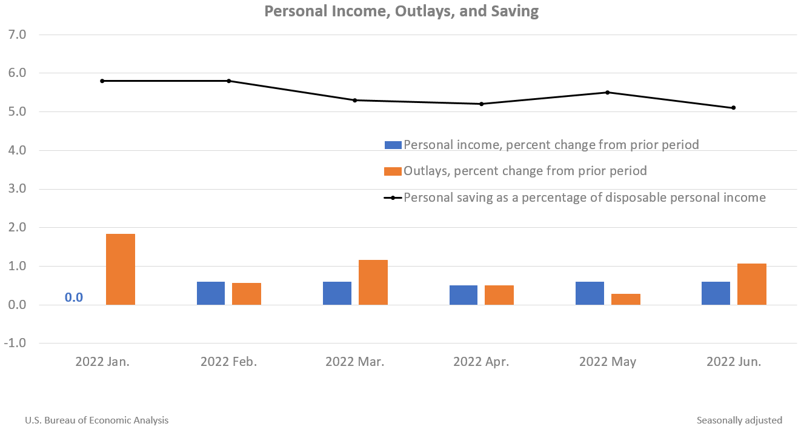

## Table of Contents

## What is personal income?

Personal income is the money a person earns from different sources. This can include money from a job, like a salary or wages, and also money from other places like investments, renting out property, or receiving government benefits. It's the total amount of money that comes into a person's hands before they pay taxes or other expenses.

Understanding personal income is important because it helps people know how much money they have to spend or save. It's used to figure out things like taxes, how much someone can borrow, and whether they qualify for certain programs or benefits. Knowing your personal income can help you plan your finances better and make smarter decisions about money.

## What are personal outlays?

Personal outlays are the money a person spends on things they need or want. This includes buying food, paying for a place to live, and spending on things like clothes, entertainment, and other personal items. It's all the money that goes out of a person's pocket to cover their daily life and personal needs.

Understanding personal outlays is important because it helps people see where their money is going. By keeping track of these expenses, someone can figure out if they are spending too much in one area and not enough in another. This can help them make better choices about how to use their money, save more, or even find ways to cut back on spending.

## How is personal income calculated?

Personal income is calculated by adding up all the money a person gets from different places. This includes money from a job, like a salary or wages, and also money from other sources like investments, renting out property, or receiving government benefits. If someone has a job, they add up their pay before taxes. If they have investments, they include any money they earn from those, like interest or dividends. They also add any money they get from the government, like social security or unemployment benefits.

After adding up all these different sources of money, the total is the person's personal income. This number is important because it shows how much money a person has coming in before they have to pay taxes or other expenses. Knowing this total helps people plan their finances, figure out how much they can spend or save, and make decisions about their money.

## What are the main components of personal outlays?

Personal outlays are the money people spend on things they need or want. The main parts of personal outlays include spending on food, which can be groceries or eating out. Another big part is housing, like rent or mortgage payments. People also spend money on utilities, like electricity, water, and gas, to keep their homes running.

Other important parts of personal outlays are transportation costs, like gas for a car or public transit fares. People also spend money on clothes, which they need for work or everyday life. Entertainment and leisure activities, like going to the movies or taking a vacation, are also part of personal outlays. These are the main things people spend their money on every day.

## Why is it important to track personal income and outlays?

It's important to track personal income and outlays because it helps people understand where their money is coming from and where it's going. When you know how much money you earn and how much you spend, you can make better choices about how to use your money. For example, if you see that you're spending a lot on eating out, you might decide to cook more at home to save money. Tracking your income and outlays also helps you see if you're earning enough to cover your needs and wants, or if you need to find ways to earn more.

Another reason to track personal income and outlays is to plan for the future. By keeping an eye on your money, you can set goals like saving for a big purchase, like a car or a house, or for retirement. It also helps you prepare for unexpected expenses, like a car repair or a medical bill. When you know your financial situation well, you can make a budget that works for you and helps you live within your means. This can lead to less stress about money and a more secure financial future.

## How do personal income and outlays affect the economy?

Personal income and outlays play a big role in the economy. When people earn more money, they usually spend more too. This spending helps businesses grow because they sell more products and services. When businesses do well, they might hire more people, which means more people have jobs and earn money. This cycle of earning and spending can help the economy grow. If people have less money to spend, they might buy less, and this can slow down the economy because businesses don't sell as much.

On the other hand, if people spend too much and don't save enough, it can lead to problems. For example, if many people borrow money to buy things they can't afford, it can create a lot of debt. Too much debt can be bad for the economy because people might not be able to pay it back. This can lead to less spending and even cause businesses to struggle. So, it's important for people to balance their income and outlays to keep the economy stable.

## What are some common methods to increase personal income?

One way to increase personal income is to ask for a raise at your job. If you've been working hard and doing a good job, your boss might give you more money. Another way is to find a better-paying job. Sometimes, looking for a new job can help you find one that pays more than your current one. You can also work more hours or get a second job. This means you'll have more money coming in, but it also means you'll be working more.

Another way to increase personal income is to start your own business or do freelance work. If you have a skill or hobby that people will pay for, you can make money from it. For example, if you're good at writing, you can write articles for websites or companies. If you like making things, you can sell them online or at local markets. Investing money can also help increase your income. If you put money into stocks, real estate, or other investments, you might earn more money over time. But remember, investing can be risky, so it's important to learn about it first.

## How can one effectively manage and reduce personal outlays?

To manage and reduce personal outlays, start by making a budget. A budget is a plan that shows how much money you have and where you want to spend it. Write down all your monthly expenses, like rent, food, and bills. Then, compare these expenses to your income. If you're spending more than you earn, you need to find ways to cut back. Look at things you don't really need, like eating out a lot or buying new clothes often. Try to spend less on these things and save the money instead.

Another way to reduce outlays is to shop smart. Look for deals and discounts when you buy things. You can also buy things in bulk, like food or household items, which can save money over time. Using less of things like electricity and water can also help. Turn off lights when you leave a room and take shorter showers. If you have debts, like credit card bills, try to pay them off quickly. The longer you take to pay them, the more interest you'll have to pay, which means more money going out. By being careful with your spending and making small changes, you can keep your outlays under control and save more money.

## What role do taxes play in personal income and outlays?

Taxes are a big part of personal income and outlays. When you earn money, you have to pay taxes on it. This means that the money you take home, or your net income, is less than the money you earn before taxes, or your gross income. The government takes some of your money to pay for things like schools, roads, and hospitals. The amount of tax you pay depends on how much you earn and where you live. So, when you're figuring out your personal income, you need to think about how much you'll have to pay in taxes.

Taxes also affect your outlays because they can change how much you spend. For example, when you buy things, you might have to pay sales tax. This makes the things you buy cost more. Some people might try to spend less because of taxes, or they might look for ways to save on taxes, like using tax deductions or credits. Understanding how taxes work can help you plan your money better. You can figure out how much you'll have left after taxes and make a budget that fits your needs.

## How do savings and investments relate to personal income and outlays?

Savings and investments are important parts of personal income and outlays. When you save money, you're putting some of your income aside instead of spending it right away. This can help you have money for the future, like for emergencies or big purchases. Savings come from your income after you've paid for your outlays. If you can save more, it means you're spending less on outlays or earning more income. Having savings can make you feel more secure because you know you have money set aside for when you need it.

Investments are another way to use your income. When you invest, you're using your money to try to make more money over time. This can be through things like stocks, bonds, or real estate. Investments can grow your income because they might give you extra money, like interest or dividends. But investments can also be risky, so you need to be careful. Both savings and investments affect how much money you have left after your outlays. By balancing your income, outlays, savings, and investments, you can plan for a better financial future.

## What are the long-term impacts of personal income and outlay trends on financial stability?

The long-term trends in personal income and outlays can have a big impact on a person's financial stability. If someone's income keeps growing over time, they can have more money to save and invest. This can help them build wealth and be ready for things like retirement or buying a house. But if their income stays the same or goes down, it can be hard to keep up with rising costs. They might have to use their savings or borrow money, which can make it harder to be financially stable in the future.

On the other hand, if someone's outlays keep going up faster than their income, it can lead to problems. They might have to spend more than they earn, which can lead to debt. Over time, this debt can grow and make it hard to pay bills or save money. But if they can keep their outlays under control and spend less than they earn, they can save more and be more financially stable. Balancing income and outlays over the long term is key to staying financially secure.

## How do economic policies influence personal income and outlays at a national level?

Economic policies made by the government can change how much money people earn and spend. For example, if the government lowers taxes, people might have more money to spend or save. This can make their personal income go up because they keep more of what they earn. On the other hand, if the government raises taxes, people might have less money left after paying them. This can make their personal income go down. Also, if the government gives out more money, like through benefits or stimulus checks, it can help people have more money to spend, which can increase their outlays.

Economic policies can also affect how much things cost, which changes people's outlays. If the government makes rules that make things cheaper, like lowering the cost of healthcare or education, people might spend less on these things. This can help them save money or spend it on other things they want or need. But if the government makes things more expensive, like raising the price of gas or food, people might have to spend more money on these things. This can make their outlays go up and leave them with less money for other things. So, the choices the government makes can really change how much money people have and how they use it.

## References & Further Reading

[1]: ["Personal Income and Outlays"](https://www.bea.gov/news/2024/personal-income-and-outlays-october-2024) by the Bureau of Economic Analysis

[2]: Marcos López de Prado. ["Advances in Financial Machine Learning"](https://www.amazon.com/Advances-Financial-Machine-Learning-Marcos/dp/1119482089) (2018).

[3]: Ernest P. Chan. ["Quantitative Trading: How to Build Your Own Algorithmic Trading Business"](https://www.amazon.com/Quantitative-Trading-Build-Algorithmic-Business/dp/0470284889) (2008).

[4]: David Aronson. ["Evidence-Based Technical Analysis: Applying the Scientific Method and Statistical Inference to Trading Signals"](https://www.amazon.com/Evidence-Based-Technical-Analysis-Scientific-Statistical/dp/0470008741) (2006).

[5]: Stefan Jansen. ["Machine Learning for Algorithmic Trading: Predictive Models to Extract Signals from Market and Alternative Data for Systematic Trading Strategies with Python"](https://www.amazon.com/Machine-Learning-Algorithmic-Trading-alternative/dp/1839217715) (2020).