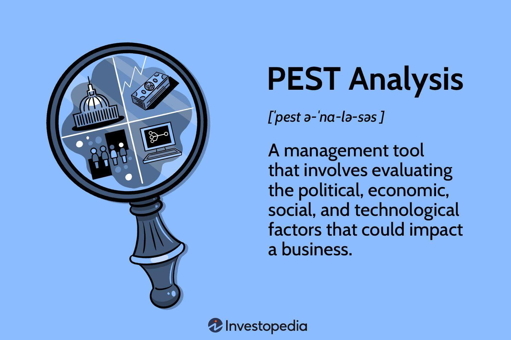

## Table of Contents

## What is PEST Analysis?

PEST Analysis is a tool that helps businesses understand the big picture of the world around them. It looks at four main areas: Political, Economic, Social, and Technological factors. By studying these areas, companies can see how outside forces might affect their business. This helps them make better plans and decisions.

For example, a company might use PEST Analysis to see if new laws could change how they do business. They might also look at economic trends to predict if people will have more or less money to spend. Social factors could show changes in what people want or need. And technological factors help them understand new tools or methods that could help their business grow. By thinking about all these things, a business can be more ready for the future.

## What do the letters P, E, S, and T stand for in PEST Analysis?

In PEST Analysis, the letter P stands for Political factors. This means looking at how government policies, laws, and regulations can affect a business. For example, a new law might change how a company can operate or what taxes they have to pay.

The letter E stands for Economic factors. This part looks at things like interest rates, inflation, and how well the economy is doing. These things can change how much money people have to spend and how a business should plan for the future.

The letter S stands for Social factors. This includes things like population growth, age distribution, and changes in what people want or need. Understanding these can help a business know who their customers are and what they might want. The letter T stands for Technological factors. This looks at new technology and how it can change the way a business works or what products they can offer. Keeping up with technology can help a business stay competitive.

## How does PEST Analysis help businesses?

PEST Analysis helps businesses by giving them a clear picture of the world around them. It looks at four big areas: Political, Economic, Social, and Technological factors. By understanding these, a business can see what might affect them in the future. For example, if a new law is coming, a business can plan how to follow it. Or if the economy is getting better, they might decide to grow their business.

This tool also helps businesses make better decisions. When they know about changes in what people want or new technology, they can change their plans to fit. This can help them stay ahead of other businesses. By using PEST Analysis, a company can be ready for changes and find new chances to grow.

## Can you provide an example of how a company might use PEST Analysis?

Let's say there's a small company that makes bicycles. They want to grow their business and decide to use PEST Analysis to see what might help or hurt them. They start by looking at Political factors. They find out that the government is planning to build more bike lanes in the city. This is good news because it might make more people want to buy bikes. They also learn about new safety rules for bikes that they'll need to follow.

Next, they look at Economic factors. They see that people are starting to have more money to spend because the economy is getting better. This could mean more people will buy bikes. They also check Social factors and find out that more people are interested in staying healthy and riding bikes for fun. This is another good sign for their business. Finally, they look at Technological factors. They see that new bike technology is coming out, like electric bikes. They think about making some of these to sell too.

By using PEST Analysis, the bike company learns a lot about what's happening around them. They see that new bike lanes and a better economy are good for them. They also see that people want to be healthy and that new bike technology is coming. With all this information, they decide to make more bikes, follow the new safety rules, and start making electric bikes. This helps them grow their business and be ready for the future.

## What are the key components to consider in the Political aspect of PEST Analysis?

When looking at the Political aspect of PEST Analysis, a business needs to think about how government actions can affect them. This includes laws and regulations that they have to follow. For example, a new law might change how a company can make or sell their products. Taxes are also important because they can change how much money a business has to spend or how much they can charge for their products. Governments can also give money or help to certain businesses, which can be good for them.

Another thing to consider is how stable the government is. If there are a lot of changes or if the government is not stable, it can be hard for a business to plan for the future. Also, trade rules between countries can affect a business if they buy or sell things from other places. By understanding all these political factors, a business can be ready for changes and make better plans.

## How does Economic factors influence business strategy in PEST Analysis?

Economic factors in PEST Analysis help businesses understand how money matters can affect their plans. Things like how well the economy is doing, interest rates, and inflation are important. If the economy is growing, people might have more money to spend, which can be good for businesses. But if the economy is not doing well, people might spend less, and businesses might need to be careful with their money. Interest rates can change how much it costs for a business to borrow money, which can affect their plans to grow or invest.

Inflation is also important because it changes the value of money over time. If prices are going up a lot, businesses might need to charge more for their products, but they also have to think about if people will still buy them. By looking at all these economic factors, a business can make better decisions about when to grow, how to price their products, and how to manage their money. This helps them be ready for changes and find the best ways to succeed.

## What Social trends should businesses monitor using PEST Analysis?

Businesses should keep an eye on social trends to see how people's lives and wants are changing. This includes looking at things like how the population is growing or getting older. If more people are getting older, a business might need to make products that older people like or need. Also, businesses should watch what people care about, like health and the environment. If more people start caring about being healthy, a business might want to make healthier products or services.

Another important thing is how people's lifestyles and culture are changing. For example, if more people start working from home, a business might need to change how they sell their products or services to fit this new way of life. Also, businesses need to think about what people think is important or fashionable. If something becomes popular, like certain kinds of food or clothes, a business might want to start selling those things too. By watching these social trends, businesses can make better plans and meet what people want.

## How can Technological advancements impact a business according to PEST Analysis?

Technological advancements can change how a business works and what they can offer. New technology can help a business do things faster or better. For example, if a new computer system comes out, a business might use it to keep track of their money or talk to their customers more easily. This can save time and money. Also, new technology can help a business make new products or services. If a new kind of phone comes out, a business might start making apps for it. This can help them grow and make more money.

But technology can also be hard for businesses. If they don't keep up with new technology, they might fall behind other businesses that do. For example, if a business doesn't start using the internet to sell things, they might lose customers to businesses that do. Also, new technology can change what people want. If a new way to watch movies at home comes out, a business that makes movie tickets might need to change what they do. By understanding technological advancements, a business can plan better and stay ahead.

## What are the limitations of PEST Analysis?

PEST Analysis is a helpful tool, but it has some limits. One big problem is that it can be hard to predict the future. Even if a business looks at all the Political, Economic, Social, and Technological factors, things can still change in ways they don't expect. For example, a new law might come out of nowhere, or the economy might change suddenly. This means that PEST Analysis can't always help a business be ready for everything.

Another limit is that PEST Analysis can be too simple. It looks at four big areas, but it might not show all the small details that can affect a business. For example, it might not tell a business about a new competitor or a change in what people want in a certain place. Also, it can be hard to decide which factors are most important. A business might focus on the wrong things and miss other important changes. So, while PEST Analysis is useful, it's best to use it with other tools to get a full picture.

## How can PEST Analysis be integrated with other strategic tools like SWOT Analysis?

PEST Analysis and SWOT Analysis can work together to help a business plan better. PEST Analysis looks at big things happening in the world, like new laws, the economy, what people want, and new technology. This gives a business a good idea of what might affect them from the outside. SWOT Analysis, on the other hand, looks at the business itself. It helps a business see its Strengths and Weaknesses inside the company, and the Opportunities and Threats outside. By using PEST Analysis first, a business can find out about the big outside things that might be Opportunities or Threats in their SWOT Analysis.

When a business puts PEST and SWOT together, they get a full picture. For example, if PEST Analysis shows that the government is making new rules about the environment, a business can think about this in their SWOT Analysis. They might see it as a Threat if they can't follow the new rules easily, or as an Opportunity if they can make products that help with the environment. By looking at both the big outside things from PEST and the inside things from SWOT, a business can make better plans and be ready for the future.

## What advanced techniques can be used to enhance the effectiveness of PEST Analysis?

To make PEST Analysis even better, businesses can use something called scenario planning. This means they think about different ways the future might go and plan for each one. For example, if a business is worried about new laws, they can imagine different kinds of laws and how they would deal with each one. This helps them be ready for more than just one possible future. They can also use data and numbers to make their PEST Analysis more exact. By looking at real information about the economy or what people want, they can make better guesses about what might happen.

Another way to improve PEST Analysis is to work with other people. Businesses can talk to experts or other businesses to get more ideas about what might happen. This can help them see things they might have missed before. They can also use other tools like SWOT Analysis to get a full picture. By using PEST with SWOT, they can see how the big things happening in the world affect their own business. This helps them make plans that fit both the outside world and what's happening inside their company.

## How can businesses adapt PEST Analysis for global operations?

When a business works in many countries, they need to use PEST Analysis in a special way. They have to look at the Political, Economic, Social, and Technological factors in each country they work in. This means they need to learn about the different laws, how well the economy is doing, what people want, and what new technology is out there in each place. For example, one country might have rules that are different from another, and people might want different things. By understanding these differences, a business can make plans that fit each country.

To do this well, a business might need to work with people who know a lot about each country. They can talk to experts or other businesses that already work there to learn more. This helps them see things they might not have thought of before. Also, they can use other tools like SWOT Analysis to see how the big things happening in the world affect their own business in each place. By putting all this information together, a business can make good plans for working in many countries and be ready for changes in each one.

## References & Further Reading

[1]: Ward, S., & Rivani, E. (2005). "An Overview of Strategy Development Models and the Ward-Rivani Model." [Emerald Insight](https://econwpa.ub.uni-muenchen.de/econ-wp/get/papers/0506/0506002.pdf).

[2]: Johnson, G., Scholes, K., & Whittington, R. (2008). "Exploring Corporate Strategy." Prentice Hall.

[3]: PESTLE Analysis. (n.d.). ["PEST Analysis of the Trading Industry."](https://www.investopedia.com/terms/p/pest-analysis.asp)

[4]: Morrison, J., & Wilson, I. (1996). "The Strategic Management Response to the Challenge of Global Change." MCB UP Ltd.

[5]: Leavy, B. (1996). "The Craft of Strategy Formation: Lessons in Complexity and Creativity." [Emerald Insight](https://www.ovid.com/journals/imhj/fulltext/10.1002/imhj.22119~you-go-in-heavy-and-you-come-out-light-an-interpretative).