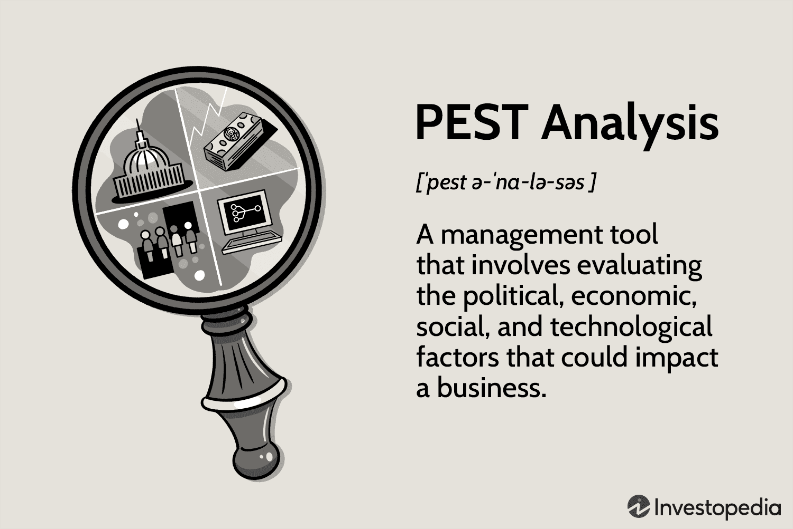

The landscape of business strategy and analysis is broad and varied, encompassing numerous frameworks designed to help organizations navigate their competitive environments and the external factors that influence them. Among these frameworks, PEST analysis stands out due to its focus on Political, Economic, Social, and Technological factors. By concentrating on these four key areas, PEST analysis provides valuable insights into the macro-environment, enabling businesses to understand external influences that might affect their operations and long-term strategy.

The integration of PEST analysis into business strategy is particularly significant in sectors that require agility and rapid decision-making, such as algorithmic trading. This area of finance relies heavily on understanding macro-environmental factors to make informed and timely trading decisions. For example, changes in interest rates or shifts in technological trends can have significant impacts on market dynamics, thereby influencing trading strategies. By incorporating PEST analysis, organizations engaged in algorithmic trading can enhance their responsiveness to such external changes, ensuring that their strategies remain effective and relevant.



This article will examine the application of PEST analysis within business strategy, with a particular emphasis on its role in algorithmic trading. By illustrating how PEST analysis can be combined with other strategic frameworks like SWOT and Porter's Five Forces, the discussion will highlight the potential for enhanced strategic decision-making and improved operational effectiveness. This comprehensive approach provides organizations with the necessary tools to achieve and maintain competitive advantages in ever-changing market conditions.

## Table of Contents

## Understanding PEST Analysis

PEST analysis is an essential strategic tool designed to evaluate the external macro-environmental factors impacting an organization. The acronym PEST stands for Political, Economic, Social, and Technological factors, each of which offers a crucial perspective on the broader market environment in which a business operates.

**Political Factors** encompass government policies, regulatory changes, and political stability, all of which can significantly influence business decisions and outcomes. For instance, new legislation or trade agreements could either present opportunities for market expansion or pose challenges through increased compliance requirements.

**Economic Factors** refer to variables such as economic growth rates, inflation, and currency exchange rates. These elements are critical as they directly affect consumer purchasing power, cost structures, and overall market demand. Understanding these economic indicators allows businesses to anticipate market shifts and align their strategic plans accordingly.

**Social Factors** address the demographic trends, cultural norms, and consumer behaviors that shape market demand. These factors can influence product development and marketing strategies. For example, shifts in consumer lifestyles, such as increased environmental awareness, can drive demand for sustainable products and services.

**Technological Factors** evaluate the rate of technological innovation and its impact on industry dynamics. Rapid technological advancements can transform production processes, lead to new product development, and redefine competitive landscapes. Organizations must stay abreast of technological trends to maintain competitive advantage and leverage technological innovations for operational enhancements.

Conducting a comprehensive PEST analysis allows organizations to identify potential risks and opportunities within their macro-environment. By systematically evaluating these external factors, businesses can better manage risks, identify strategic opportunities, and inform their strategic planning processes. This holistic understanding of the business environment aids in effective risk management and market positioning, ensuring that organizations remain responsive to external changes and maintain a competitive edge.

## Components of PEST Analysis

PEST analysis is an essential framework that examines various external factors influencing a business. Understanding these components helps organizations anticipate and adapt to changes in their environment. The four key areas of PEST analysis include Political, Economic, Social, and Technological factors.

**Political Factors:** These factors encompass the impact of government policies, regulatory frameworks, and political stability on business operations. Changes in taxation laws, trade tariffs, labor laws, and environmental regulations can significantly affect organizational performance. Political stability and government support in certain industries also play a crucial role in strategic planning and risk assessment. Businesses must stay informed about potential legislative changes or geopolitical events that could disrupt their operations or market access.

**Economic Factors:** Economic factors are critical as they directly influence business performance through aspects such as economic growth, interest rates, inflation, and currency exchange rates. For instance, a rise in interest rates can increase borrowing costs, affecting a company's capital expenditure and expansion plans. Conversely, a decrease in inflation can enhance consumer purchasing power, potentially increasing demand for goods and services. Companies need to monitor these economic indicators closely, as they offer insights into market trends and consumer behavior.

**Social Factors:** These factors refer to societal trends, cultural norms, demographics, and consumer preferences that shape market demand. Changes in population demographics, such as age distribution or cultural diversity, can alter consumption patterns. Moreover, social trends, such as increasing environmental awareness or shifts toward digital lifestyles, can redefine market opportunities and challenges. Organizations must consider these social dynamics to align their products and services with consumer needs and preferences effectively.

**Technological Factors:** Technological advancements and innovation are pivotal in influencing business operations and competitive advantage. Rapid developments in areas such as artificial intelligence, automation, and information technology can provide businesses with opportunities to enhance efficiency and innovation. However, they also pose challenges of obsolescence and cybersecurity risks. Companies must invest in research and development and adopt new technologies to remain competitive. Understanding the technological landscape helps businesses foresee potential disruptions and leverage new tools for strategic advantage.

Incorporating these components into strategic analysis enables businesses to develop robust strategies that account for external influences, thus ensuring sustainability and growth even amidst fluctuating external conditions.

## Applications of PEST Analysis in Business Strategy

PEST analysis serves as a valuable tool in strategic planning by emphasizing the identification and evaluation of external factors that might influence business goals and operations. Through assessing the political, economic, social, and technological dimensions, businesses can obtain a more nuanced understanding of the macro-environment they operate within.

In market research, PEST analysis aids organizations in navigating the broader environment for launching new products or services. By examining the external factors, businesses can better anticipate potential challenges and opportunities arising from shifts in government policies, economic fluctuations, or changes in consumer preferences and technological advancements. For instance, understanding economic indicators can guide pricing strategies, while insights into social trends might drive product customization to align with consumer demands.

The role of PEST analysis in risk management lies in its ability to highlight potential threats posed by external changes. By maintaining vigilance on political instability or regulatory changes, organizations can develop more resilient strategies to mitigate these risks. For example, if a new regulation threatens to raise production costs, businesses can proactively explore alternative materials or markets to sustain profitability.

In business development, PEST analysis helps identify new opportunities by keeping track of external market trends. By aligning business strategies with favorable economic trends or emerging consumer preferences, organizations can capitalize on these developments for growth. For instance, a surge in technological innovation might present opportunities for product diversification or enhancements in service delivery.

Overall, the systematic application of PEST analysis supports the crafting of informed strategic initiatives, helping businesses reinforce their competitive stance in an ever-evolving market landscape. By understanding and leveraging external factors, businesses can effectively align their operations with the dynamic environment they are part of.

## Integrating PEST Analysis in Algorithmic Trading

Algorithmic trading, which involves the use of computer algorithms to automate trading decisions, demands quick, data-driven responses to fluctuating market conditions. Integrating PEST analysis into this framework empowers traders to incorporate macro-environmental factors into their algorithms, enhancing strategic adaptability.

PEST analysis, with its focus on political, economic, social, and technological factors, provides essential insights into macro-economic trends that influence market dynamics. For instance, understanding how economic indicators such as interest rates and inflation affect asset prices can be pivotal for trading strategies. Algorithms can be programmed to monitor these indicators, allowing them to initiate trades based on predefined conditions.

Consider an algorithm that incorporates economic factors from a PEST analysis. It can be programmed to adjust trading strategies depending on changes in the [interest rate](/wiki/interest-rate-trading-strategies). For example, when the central bank raises interest rates, the cost of borrowing typically increases, which might lead to a decrease in consumer spending and subsequently a decline in certain asset prices. The algorithm can be set up to sell or short-sell these assets automatically when interest rates reach a specified threshold.

Below is a Python snippet exemplifying how such a condition could be incorporated into an [algorithmic trading](/wiki/algorithmic-trading) system:

```python
def adjust_trading_strategy(interest_rate, inflation_rate, asset_price):
    if interest_rate > 5.0:  # Example threshold for high interest rates
        # Sell or short-sell strategy
        decision = "sell"
    elif inflation_rate > 3.0:  # Threshold for inflation impact
        # Adjust portfolio to hedge against inflation
        decision = "hedge"
    else:
        # Default action is holding or buying
        decision = "hold"

    # Execute trading decision
    execute_trade(decision, asset_price)

def execute_trade(decision, asset_price):
    # Placeholder for executing a trade based on decision
    print(f"Action: {decision} at price ${asset_price}")
```

This approach allows trading algorithms to remain dynamically responsive in a volatile market context. By integrating PEST analysis, traders gain the ability to systematically adjust their strategies as macro-environmental conditions evolve. It maximizes the efficiency and effectiveness of trading operations by aligning algorithmic responses with broader economic signals.

## Limitations and Considerations

PEST analysis, while instrumental in assessing macro-environmental factors, has limitations that analysts and strategists must consider to ensure effective decision-making. One primary concern is the tendency of PEST analysis to oversimplify complex external factors. This simplification can occur when the analysis is not updated frequently to accommodate the dynamism of the external environment. For example, in rapidly evolving sectors such as technology or finance, external changes can occur at a pace that renders static analyses quickly outdated and less relevant.

Another limitation lies in the narrow focus of PEST analysis on external factors. This singular focus can result in an incomplete picture when not combined with analyses of internal dynamics. Internal factors such as organizational culture, resource capabilities, and operational efficiencies also play critical roles in shaping strategic outcomes. Consequently, using PEST analysis in isolation may lead to strategic blind spots unless it is integrated with complementary frameworks such as SWOT analysis, which considers both internal and external factors.

Moreover, the subjective nature of interpreting PEST variables can lead to inconsistent conclusions. Differing interpretations from various stakeholders can skew the analysis, potentially impacting the strategic decisions informed by it. To mitigate this, collaboration among diverse teams can provide a balanced perspective, ensuring that varying viewpoints are considered and that the analysis reflects a more comprehensive understanding of the macro-environment.

Finally, the necessity of regular updates to PEST analysis cannot be overstated. As the external environment is inherently volatile, scenarios can shift due to political changes, economic fluctuations, sociocultural shifts, and technological breakthroughs. To maintain the relevance and accuracy of PEST analysis, organizations must institutionalize periodic reviews and updates, aligning their analysis with the latest environmental conditions and emerging trends. This proactive approach helps in maintaining a strategic edge in dynamic market conditions.

## Conclusion

PEST analysis stands as a key strategic tool for evaluating macro-environmental factors that influence businesses. By analyzing Political, Economic, Social, and Technological dimensions, PEST provides insights that are essential for understanding the external business landscape. When employed alongside other strategic frameworks such as SWOT analysis, which examines internal strengths and weaknesses alongside external opportunities and threats, and Porter's Five Forces, which analyzes the competitive forces within an industry, PEST contributes to a comprehensive strategic planning process. This multifaceted approach allows organizations to form well-rounded strategies that incorporate both internal capabilities and external conditions.

In the context of algorithmic trading, integrating PEST analysis empowers traders to enhance their market responsiveness and strategic adaptability. By incorporating macroeconomic indicators and trends into trading algorithms, traders can adjust strategies in accordance with evolving market conditions, optimizing decision-making processes. For example, traders can program algorithms to respond to changes in interest rates or shifts in consumer behavior, maximizing profitability while mitigating risks.

By methodically evaluating the external impacts identified through PEST analysis, businesses can fortify their competitive advantage amidst ever-changing market landscapes. This systematic approach ensures that organizations remain vigilant and proactive, enabling them to navigate challenges and seize opportunities effectively. In dynamic environments, such an iterative evaluation process is crucial for maintaining strategic agility and ensuring long-term success.

## References & Further Reading

[1]: Ward, S., & Rivani, E. (2005). "An Overview of Strategy Development Models and the Ward-Rivani Model." [Emerald Insight](https://econwpa.ub.uni-muenchen.de/econ-wp/get/papers/0506/0506002.pdf).

[2]: Johnson, G., Scholes, K., & Whittington, R. (2008). "Exploring Corporate Strategy." Prentice Hall.

[3]: PESTLE Analysis. (n.d.). ["PEST Analysis of the Trading Industry."](https://www.investopedia.com/terms/p/pest-analysis.asp)

[4]: Morrison, J., & Wilson, I. (1996). "The Strategic Management Response to the Challenge of Global Change." MCB UP Ltd.

[5]: Leavy, B. (1996). "The Craft of Strategy Formation: Lessons in Complexity and Creativity." [Emerald Insight](https://www.ovid.com/journals/imhj/fulltext/10.1002/imhj.22119~you-go-in-heavy-and-you-come-out-light-an-interpretative).