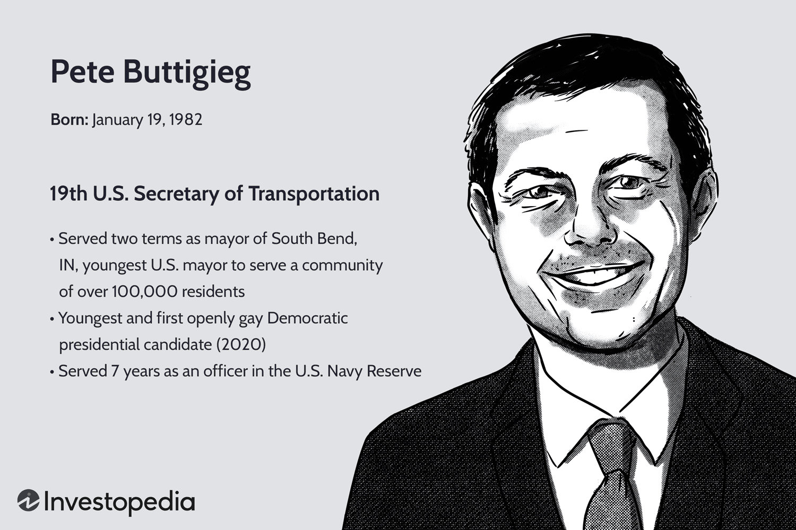

Pete Buttigieg has emerged as a prominent figure in American politics, celebrated for his charismatic leadership and forward-thinking policies. This article explores different aspects of Buttigieg’s life, from his personal background to his significant achievements in education and politics. His varied interests include algorithmic trading, which highlights his multifaceted personality and adds further depth to his profile as a public figure. Throughout this article, we will explore how Buttigieg's diverse experiences have shaped his political journey and informed his approaches and decisions. Understanding these facets of Buttigieg's life provides valuable insights into his role as a leader and offers a glimpse into the unique blend of tradition and innovation he embodies.

## Table of Contents

## Early Life and Education

Pete Buttigieg was born on January 19, 1982, in South Bend, Indiana, a city that would greatly influence his political career. His upbringing in South Bend instilled in him a strong sense of community and civic responsibility, which would later inform his approach to public service and governance.

Buttigieg's early academic pursuits led him to Harvard University, where he majored in history and literature. His time at Harvard helped to hone his analytical and leadership skills, providing a foundation for his future roles in public office. His education at this prestigious institution is often credited with preparing him to tackle complex issues and engage in thoughtful discourse.

After completing his undergraduate studies, Buttigieg was awarded a Rhodes Scholarship, one of the most prestigious academic awards worldwide. As a Rhodes Scholar, he continued his education at Oxford University, where he studied philosophy, politics, and economics (PPE). This field of study is renowned for its interdisciplinary approach, which combines insights from three disciplines to equip students with a comprehensive understanding of societal dynamics and governance.

The rigorous academic environment at Oxford further developed Buttigieg's intellectual capabilities, allowing him to engage with a wide array of ideas and people. This educational path reflects his commitment to understanding complex systems and engaging with multifaceted issues. Buttigieg's academic achievements are frequently cited as a testament to his intellectual depth and his ability to synthesize diverse perspectives into coherent action plans.

## Military Service and Personal Life

Pete Buttigieg's journey in public service is marked by his tenure in the U.S. Navy Reserve, a commitment that highlights his dedication to serving his country in challenging environments. As a lieutenant, Buttigieg was deployed to Afghanistan in 2014, where he was tasked with crucial intelligence and transportation duties. This military service not only equipped him with invaluable leadership and crisis management skills but also underscored his ability to perform under pressure, key attributes that have undoubtedly shaped his approach to politics and governance.

Parallel to his professional endeavors, Buttigieg has been open about his personal life, serving as a prominent figure of representation for the LGBTQ+ community. In 2018, he married Chasten Glezman, which marked a significant milestone not only in his personal journey but also in promoting inclusivity and acceptance within the broader societal context. Buttigieg's openness about his sexuality and his marriage to Glezman has been influential, offering visibility and fostering dialogue around LGBTQ+ issues in public and political spheres.

Combined, Buttigieg's military and personal experiences reflect a narrative centered on courage, authenticity, and a deep-rooted commitment to public service. His ability to navigate these diverse aspects of his life accentuates his multifaceted identity, reinforcing his influence as a public figure capable of inspiring change and advocating for a more inclusive society. This unique blend of service and personal milestones contributes significantly to Buttigieg's profile, illustrating his comprehensive approach to leadership and civic engagement.

## Political Accomplishments

Pete Buttigieg, as the mayor of South Bend, Indiana, implemented a series of transformative policies aimed at revitalizing the city. His administration was marked by a focus on modernizing infrastructure and fostering economic development. Under his leadership, the city embraced technological innovation, and South Bend's growth became a model for urban revitalization.

One of Buttigieg's notable achievements was the "Smart Streets" initiative, a project designed to convert downtown South Bend's one-way streets into two-way streets to enhance traffic flow and pedestrian safety. This project not only improved the aesthetic and functional aspects of the city's streets but also stimulated local businesses by increasing foot traffic. According to a report by the South Bend Regional Chamber, the initiative led to a significant increase in private sector investment and downtown property values.

Buttigieg also prioritized data-driven governance. His administration implemented a comprehensive performance management system, known as the "311" system, which streamlined citizen requests and responses, thereby improving municipal services and accountability. This system highlighted his belief in transparency and the strategic use of data to inform policy decisions.

In 2020, Buttigieg's political aspirations took a national stage as he launched a presidential campaign, becoming one of the youngest and first openly gay candidates to seek a major party nomination. While his campaign was ultimately unsuccessful, it was notable for its appeal to a broad demographic spectrum. His competence in articulating complex policies with clarity and poise garnered widespread media attention and increased his national profile. 

His campaign was marked by proposals that exhibited a blend of practicality and vision. For instance, Buttigieg advocated for climate change policies that included transitioning to a clean energy economy with pragmatic steps towards sustainability. His "Medicare for All Who Want It" plan proposed expanding public health insurance while allowing individuals the choice to maintain private coverage, reflecting his approach to finding balanced solutions that consider various stakeholder needs.

These political accomplishments underscore Buttigieg's capacity to engage a diverse electorate through eloquent communication and adaptive strategies to complex civic issues. His tenure as mayor and subsequent presidential campaign have solidified his reputation as a forward-thinking leader committed to innovative and practical solutions.

## Interest in Algo Trading

Pete Buttigieg has exhibited a keen interest in technology and finance, focusing particularly on [algorithmic trading](/wiki/algorithmic-trading). This interest underscores his capability to engage with advanced technologies and their potential impacts on the economic landscape. Algorithmic trading, a sophisticated financial practice, uses algorithms to execute strategies in trading markets. These algorithms enable high-speed, efficient transactions that leverage quantitative data and market indicators. 

Buttigieg's exploration of algorithmic trading aligns with his broader fascination with data-driven decision-making and contemporary economic policies. His interest indicates an appreciation for how technology can be harnessed to drive innovation in economic systems, suggesting that he values the integration of cutting-edge technology in various sectors beyond finance. This engagement with modern technological applications reflects a forward-thinking approach, emphasizing the importance of adaptation in an increasingly digital economy. Through this perspective, Buttigieg demonstrates an understanding of innovation as a pivotal element in shaping future economic policies and practices.

## Conclusion

Pete Buttigieg's diverse experiences underscore his distinct presence in American public life. His accomplishments reflect a harmonious blend of intellectual depth, civic responsibility, and innovative thinking, traits that have defined his career in both education and public service. By examining his interests, such as algorithmic trading, we gain a comprehensive understanding of his forward-thinking perspective. This area of interest demonstrates his ability to engage with modern technologies and anticipate their potential effects on the future economy.

Buttigieg's career trajectory continues to inspire many, exemplifying the significant impact of diverse experiences and progressive ideas in shaping effective leaders. His life and career serve as a testament to the advantages of embracing a wide array of experiences, from academic rigor and military service to political leadership. In summary, Pete Buttigieg embodies a synthesis of tradition and innovation, representing the potential for leadership that is both considerate of longstanding values and attuned to future possibilities. This combination positions him as a compelling figure capable of navigating complex challenges with a fresh perspective.

## References & Further Reading

[1]: ["Shortest Way Home: One Mayor's Challenge and a Model for America's Future"](https://www.amazon.com/Shortest-Way-Home-Challenge-Americas/dp/1631494368) by Pete Buttigieg

[2]: Buttigieg, P. (2020). ["Trust: America's Best Chance"](https://www.amazon.com/Trust-Americas-Chance-Pete-Buttigieg/dp/1631498770) 

[3]: ["Advances in Financial Machine Learning"](https://www.amazon.com/Advances-Financial-Machine-Learning-Marcos/dp/1119482089) by Marcos Lopez de Prado

[4]: ["Machine Learning for Algorithmic Trading"](https://github.com/stefan-jansen/machine-learning-for-trading) by Stefan Jansen

[5]: ["The Comback: How Innovation Will Restore the American Dream"](https://www.amazon.com/Comeback-Innovation-Restore-American-Dream-ebook/dp/B08N3VN64C) by Gary Shapiro