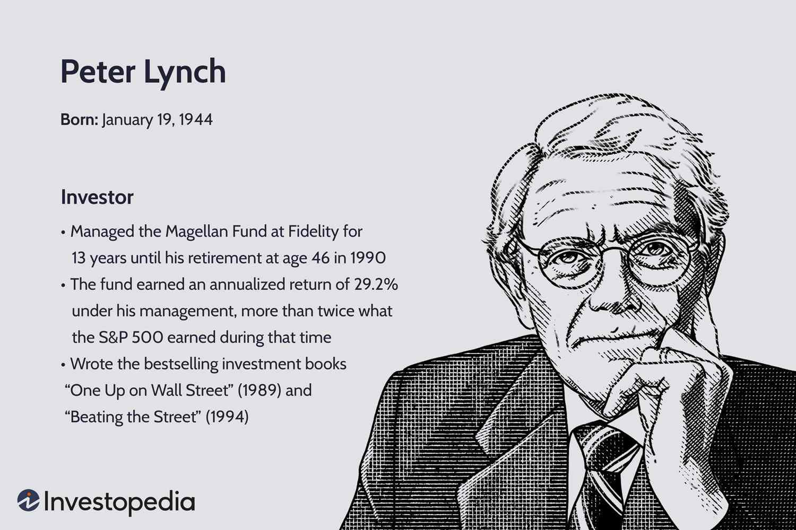

## Table of Contents

## Who is Pete Muller?

Pete Muller is a person who works in the music and technology industries. He started a company called Jelli, which helps radio stations use the internet to play music. Pete likes to mix new technology with old ways of doing things, like radio. He wants to make radio better and more fun for people to listen to.

Before Jelli, Pete worked at different technology companies. He helped make software and other tech things. Pete went to Stanford University, where he learned a lot about computers and business. He uses what he learned to start new projects and help people enjoy music in new ways.

## What is Pete Muller known for?

Pete Muller is known for starting Jelli, a company that helps radio stations use the internet to play music. He wanted to make radio better by mixing new technology with the old way of listening to music. Jelli helps radio stations reach more people and play music in a new way.

Before Jelli, Pete worked at different tech companies where he helped make software and other technology things. He went to Stanford University and learned a lot about computers and business. Pete uses what he learned to start new projects and make music more fun for people to listen to.

## Where was Pete Muller born?

Pete Muller was born in the United States. He grew up there and went to school in the country.

He studied at Stanford University, which is in California. At Stanford, he learned about computers and business. This helped him start his own company later on.

## What is Pete Muller's educational background?

Pete Muller went to Stanford University. Stanford is a big school in California. At Stanford, Pete studied computers and business. He learned a lot about how to make technology and how to run a company.

After finishing school, Pete used what he learned to start his own company called Jelli. Jelli helps radio stations use the internet to play music. Pete's education at Stanford helped him mix new technology with old ways of listening to music.

## What are some of Pete Muller's early career highlights?

Before starting Jelli, Pete Muller worked at different technology companies. He helped make software and other tech things. This work gave him a lot of experience in the tech world. He learned how to use technology to solve problems and make things better.

At these companies, Pete worked on projects that were important for his later work. He got to know how to mix technology with other industries, like music. This early experience helped him when he started Jelli. He used what he learned to make radio better and more fun for people to listen to.

## How did Pete Muller become successful in his field?

Pete Muller became successful in his field by mixing his love for technology and music. He went to Stanford University and learned a lot about computers and business. After school, he worked at different tech companies where he helped make software and other tech things. This early experience was very important because it taught him how to use technology to solve problems and make things better.

With the skills he gained, Pete started his own company called Jelli. Jelli helps radio stations use the internet to play music. Pete wanted to make radio better by mixing new technology with the old way of listening to music. His idea worked well because it helped radio stations reach more people and play music in a new way. Pete's success came from using what he learned to start new projects and make music more fun for people to listen to.

## What are some of the major projects or works Pete Muller has been involved in?

Pete Muller started a company called Jelli. Jelli helps radio stations use the internet to play music. Before Jelli, radio stations used old ways to play music. Pete's idea was to mix new technology with the old way of listening to radio. This made it easier for radio stations to reach more people and play music in a new way. Jelli became popular because it made radio better and more fun for people to listen to.

Before starting Jelli, Pete worked at different tech companies. He helped make software and other technology things. This work gave him a lot of experience in the tech world. He learned how to use technology to solve problems and make things better. This early experience was important for his later work with Jelli. Pete used what he learned to make radio better and more fun for people to listen to.

## What awards or recognitions has Pete Muller received?

Pete Muller has been recognized for his work in mixing technology with music. He started a company called Jelli, which helps radio stations use the internet to play music. Because of this, Pete was named one of the "Top 35 Innovators Under 35" by MIT Technology Review. This award shows that people think Pete's ideas are new and important.

Jelli also won some awards. It was named one of the "World's Top 50 Most Innovative Companies" by Fast Company magazine. This shows that Jelli is doing something special and different in the world of radio and music. Pete's work with Jelli has helped make radio better and more fun for people to listen to.

## What is Pete Muller's approach or philosophy towards his work?

Pete Muller believes in mixing new technology with old ways of doing things to make them better. He started a company called Jelli because he wanted to help radio stations use the internet to play music. Pete thinks that by using technology, radio can reach more people and be more fun to listen to. He uses what he learned at Stanford University about computers and business to start new projects and solve problems.

Pete's approach is to always look for ways to improve things. He worked at different tech companies before starting Jelli, which gave him a lot of experience. He learned how to use technology to make things better and more interesting. Pete's philosophy is to keep trying new ideas and not be afraid to mix old and new ways of doing things. This way, he can help make music and radio better for everyone.

## How has Pete Muller influenced his industry or field?

Pete Muller has influenced his industry by starting Jelli, a company that helps radio stations use the internet to play music. Before Jelli, radio stations used old ways to play music. Pete's idea was to mix new technology with the old way of listening to radio. This made it easier for radio stations to reach more people and play music in a new way. Jelli became popular because it made radio better and more fun for people to listen to. Pete showed that technology can help make old things new and exciting again.

Pete's work has also been recognized with awards. He was named one of the "Top 35 Innovators Under 35" by MIT Technology Review. This shows that people think Pete's ideas are new and important. Jelli also won an award as one of the "World's Top 50 Most Innovative Companies" by Fast Company magazine. These awards show that Pete's work with Jelli is doing something special and different in the world of radio and music. Pete's influence comes from his belief in mixing new technology with old ways to make things better for everyone.

## What are some challenges Pete Muller has faced and how did he overcome them?

Pete Muller faced many challenges when he started Jelli. One big challenge was getting radio stations to try something new. Many radio stations liked the old way of playing music and were scared to change. Pete had to show them how using the internet could help them reach more people and make radio more fun. He worked hard to explain his ideas and show how they could work.

Another challenge was making the technology work well. It's not easy to mix new tech with old radio systems. Pete and his team had to solve many problems to make sure Jelli worked right. They kept trying different things until they found the best way to make it all work together. Pete overcame these challenges by being patient and never giving up on his ideas. He kept working until he found a way to make radio better for everyone.

## What are Pete Muller's future plans or upcoming projects?

Pete Muller wants to keep working on making radio and music better with technology. He thinks there are still many ways to make listening to music more fun and easier for people. Pete is always looking for new ideas and ways to use the internet to help radio stations play music. He wants to keep helping radio stations reach more people and give them more choices in what they listen to.

Right now, Pete is working on new projects that will make Jelli even better. He is thinking about how to use new technology to help radio stations in different ways. Pete wants to keep growing Jelli and making it a big part of how people listen to music. He believes that by mixing old ways with new technology, he can keep making radio better for everyone.

## When was PDT Partners born?

After joining Morgan Stanley in 1992, Pete Muller quickly made his mark by founding PDT (Process Driven Trading) Partners in 1993 within the firm’s proprietary trading division. His innovative approach towards trading was highly influenced by his strong background in mathematics. PDT Partners distinguished itself by utilizing [quantitative trading](/wiki/quantitative-trading) strategies that relied on complex mathematical models to analyze vast amounts of market data. This allowed the firm to make informed trading decisions at an accelerated pace.

The core of PDT's strategy was the use of [algorithmic trading](/wiki/algorithmic-trading) methodologies, which leverage statistical [arbitrage](/wiki/arbitrage) and quantitative analysis. By applying these techniques, PDT was able to identify and exploit market inefficiencies that often escaped traditional trading methods. For example, one common strategy involves mean reversion, where assets that deviate from a historical norm are expected to return to that norm. Mathematical models can be used to predict this behavior, allowing traders to buy low and sell high with greater precision:

$$
\text{Expected Price} = \text{Historical Mean} + \alpha \times (\text{Current Price} - \text{Historical Mean})
$$

Here, $\alpha$ represents the speed or magnitude of the mean reversion, a parameter that might be estimated from historical data using statistical techniques.

Throughout the years, PDT Partners proved its prowess, consistently achieving impressive returns. Under Muller’s leadership, the firm not only thrived within Morgan Stanley but also gained enough [momentum](/wiki/momentum) to establish itself as an independent entity by 2012. This spin-off marked a new chapter for PDT Partners, allowing it to operate with greater agility and pursue innovative strategies under its own banner. Muller's ability to blend mathematical expertise with practical trading solutions created a robust platform that continues to influence algorithmic trading practices today.

## References & Further Reading

[1]: ["Advances in Financial Machine Learning"](https://www.amazon.com/Advances-Financial-Machine-Learning-Marcos/dp/1119482089) by Marcos Lopez de Prado

[2]: ["Quantitative Trading: How to Build Your Own Algorithmic Trading Business"](https://books.google.com/books/about/Quantitative_Trading.html?id=j70yEAAAQBAJ) by Ernest P. Chan

[3]: ["Machine Learning for Algorithmic Trading"](https://github.com/PacktPublishing/Machine-Learning-for-Algorithmic-Trading-Second-Edition) by Stefan Jansen

[4]: ["Evidence-Based Technical Analysis: Applying the Scientific Method and Statistical Inference to Trading Signals"](https://www.amazon.com/Evidence-Based-Technical-Analysis-Scientific-Statistical/dp/0470008741) by David Aronson

[5]: Bergstra, J., Bardenet, R., Bengio, Y., & Kégl, B. (2011). ["Algorithms for Hyper-Parameter Optimization."](https://dl.acm.org/doi/10.5555/2986459.2986743) Advances in Neural Information Processing Systems 24.