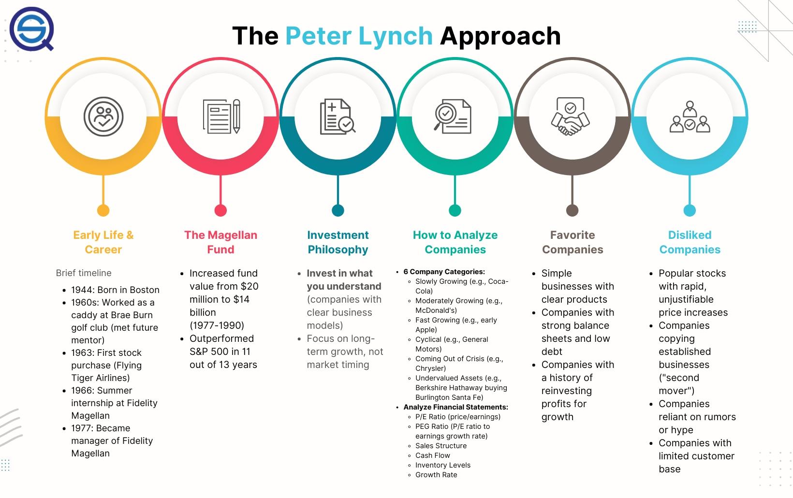

## Table of Contents

## What is the Peter Lynch investment strategy?

The Peter Lynch investment strategy is all about finding good companies to invest in and holding onto them for a long time. Peter Lynch was a famous investor who believed that anyone could pick good stocks if they did their homework. He thought that you should look for companies that you know and understand, and that are growing and making money. He called this the "buy what you know" approach. Instead of trying to predict the market, Lynch focused on understanding the businesses he invested in.

Lynch also had some specific tips for picking stocks. He looked for companies that were growing their earnings quickly and had strong financials. He paid attention to a company's price-to-earnings ratio, which compares the stock price to the company's earnings per share. If the ratio was low, it might mean the stock was a good deal. He also liked companies that were doing well but were not yet popular with other investors. Lynch believed that if you found these kinds of companies and held onto them, you could make a lot of money over time.

Overall, the Peter Lynch strategy is about being patient and doing your research. It's not about trying to get rich quick, but about finding solid companies and sticking with them. By understanding the businesses you invest in and looking for good value, you can build a strong investment portfolio over the long term.

## Who is Peter Lynch and why is his strategy important?

Peter Lynch is a famous investor who used to manage the Fidelity Magellan Fund. He became very well-known because he did a great job at [picking](/wiki/asset-class-picking) stocks and making money for the people who invested in his fund. Lynch believed that anyone could be good at investing if they did their homework and understood the companies they were investing in. He wrote [books](/wiki/algo-trading-books) about his methods, and many people still follow his advice today.

Lynch's strategy is important because it's simple and it works. He taught people to invest in companies they know and understand, which makes it easier for everyday people to pick good stocks. His approach focuses on finding companies that are growing, making money, and are a good value. By holding onto these stocks for a long time, Lynch showed that you can build wealth slowly and steadily. His ideas are still popular because they help people feel more confident about investing and can lead to good results over time.

## What are the key principles of Peter Lynch's investment approach?

Peter Lynch's investment approach is based on the idea that anyone can pick good stocks if they do their homework. He believed in the "buy what you know" principle, which means investing in companies that you understand and use in your everyday life. Lynch thought that by focusing on businesses you are familiar with, you can spot good investment opportunities more easily. He also emphasized the importance of looking at a company's financials, like its earnings growth and price-to-earnings ratio, to find stocks that are a good value.

Another key principle of Lynch's approach is to find companies that are growing and making money but are not yet popular with other investors. He called these "tenbaggers," stocks that could potentially grow ten times in value. Lynch advised holding onto these stocks for the long term, rather than trying to time the market or trade frequently. By being patient and sticking with solid companies, he believed investors could see their investments grow significantly over time. His strategy is all about doing your research, understanding the businesses you invest in, and holding on for the long haul.

## How does Peter Lynch categorize stocks, and what are the differences between these categories?

Peter Lynch categorized stocks into six different types to help investors understand and pick the right ones. The first type is "fast growers," which are companies that are growing quickly and can make a lot of money if you buy them early. "Stalwarts" are big, stable companies that don't grow as fast but are reliable and can still make good returns over time. "Slow growers" are companies that are not growing much but can still be good investments if they pay dividends. "Cyclicals" are companies that do well when the economy is good but struggle when it's bad, like car makers or home builders. "Turnarounds" are companies that are having problems but might get better if they fix their issues. Finally, "asset plays" are companies that own valuable things, like land or patents, that might be worth more than the stock price suggests.

The main differences between these categories are how fast they grow and how risky they are. Fast growers and turnarounds can make a lot of money but are also riskier because they might not do well. Stalwarts and slow growers are safer but might not grow as much. Cyclicals can be good investments if you buy them at the right time in the economic cycle, but they can also lose value if the economy turns bad. Asset plays can be good if the market doesn't see the true value of the company's assets, but it can be hard to know when that value will be recognized. By understanding these categories, investors can pick stocks that match their goals and how much risk they are willing to take.

## What is the 'buy what you know' philosophy and how can it be applied?

The 'buy what you know' philosophy is a simple idea from Peter Lynch. He said that you should invest in companies that you already know and use in your everyday life. If you like a certain store or use a product a lot, you might know more about that company than most people. This can help you see if it's a good investment. Instead of trying to understand complicated businesses you don't know, you can focus on the ones you do.

To apply this philosophy, start by thinking about the companies you interact with every day. Do you shop at a certain store a lot? Do you use a specific brand of product? If you think a company is doing well and you understand what they do, you might want to look into buying their stock. But remember, just because you like a company doesn't mean it's a good investment. You still need to check their financials and see if the stock is a good value. By combining what you know with some research, you can make smarter investment choices.

## How does Peter Lynch use the PEG ratio, and why is it significant in his strategy?

Peter Lynch uses the PEG ratio to find stocks that are a good value. The PEG ratio stands for "price-to-earnings growth" ratio. It compares a company's price-to-earnings (P/E) ratio to its expected earnings growth rate. If a stock has a low PEG ratio, it might mean the stock is undervalued and could be a good buy. Lynch liked using the PEG ratio because it helped him find companies that were growing fast but were still priced reasonably.

The PEG ratio is significant in Lynch's strategy because it helps him balance growth and value. He believed that just looking at a company's P/E ratio wasn't enough. A company might have a high P/E ratio because it's growing quickly, but if the PEG ratio is low, it could still be a good investment. By using the PEG ratio, Lynch could find stocks that were growing and had the potential to make a lot of money, but were not too expensive. This helped him pick stocks that could turn into big winners over time.

## What role does fundamental analysis play in Peter Lynch's investment decisions?

Fundamental analysis is very important in Peter Lynch's way of picking stocks. He looks at a company's financials to see if it's a good investment. This means checking things like how fast the company's earnings are growing, how much debt it has, and if it's making money. Lynch also pays attention to the price-to-earnings ratio and the PEG ratio to see if the stock is a good value. By doing this, he can find companies that are growing and doing well but are not too expensive.

Lynch believes that understanding a company's fundamentals helps him make smart choices. He doesn't just look at the stock price; he wants to know if the company is strong and has a good future. This helps him find stocks that might grow a lot over time. By using [fundamental analysis](/wiki/fundamental-analysis), Lynch can spot good companies early and hold onto them for the long term, which is a big part of his successful investment strategy.

## Can you explain the concept of 'tenbaggers' in Peter Lynch's terminology?

Peter Lynch used the term 'tenbaggers' to describe stocks that grow ten times in value. He thought that if you could find and buy these kinds of stocks early, you could make a lot of money. Lynch believed that by doing your homework and understanding a company's business, you could spot these special stocks before other people did.

To find tenbaggers, Lynch looked for companies that were growing quickly and were not yet popular with other investors. He called these companies 'fast growers.' By investing in them early and holding onto them for a long time, he believed you could turn a small investment into a much bigger one. Lynch's idea was to be patient and stick with good companies, even if it took years for them to become tenbaggers.

## How does Peter Lynch advise investors to manage their portfolios?

Peter Lynch tells investors to keep their portfolios simple and focused. He says you should only invest in companies you understand and believe in. Instead of buying a lot of different stocks, Lynch suggests picking a few good ones and watching them closely. He thinks it's better to know a lot about a few companies than to know a little about many. By doing this, you can make better decisions and stick with your investments for the long term.

Lynch also advises investors to keep an eye on their stocks and be ready to sell if things change. If a company starts doing badly or if the stock price gets too high, he says it might be time to sell. But he also warns against selling too quickly just because the stock goes down a bit. Lynch believes in being patient and holding onto good companies, even if the market goes up and down. By managing your portfolio this way, you can grow your investments over time and reach your financial goals.

## What are some common mistakes that Peter Lynch warns investors against?

Peter Lynch warns investors against making some common mistakes. One big mistake is trying to time the market. He says it's hard to guess when the market will go up or down, and trying to do this can make you miss out on good investments. Instead, Lynch thinks you should focus on finding good companies and holding onto them for a long time. Another mistake he warns about is following the crowd. Just because everyone is buying a certain stock doesn't mean it's a good investment. Lynch says you should do your own research and pick stocks that you believe in, not just because they're popular.

Lynch also warns against selling stocks too quickly. He says that if you sell a stock just because it goes down a bit, you might miss out on its long-term growth. He believes in being patient and sticking with good companies, even if the market goes up and down. By avoiding these common mistakes, Lynch thinks investors can make better decisions and build a strong portfolio over time.

## How can an investor adapt Peter Lynch's strategies to modern markets?

Peter Lynch's strategies can still work well in today's markets if you make a few changes. One big idea from Lynch is to "buy what you know." This means you should invest in companies you use and understand. In modern times, this could mean looking at tech companies whose products you use every day, like apps or online services. You can also use the internet to learn more about these companies and see if they're growing and making money. Another part of Lynch's strategy is to look at a company's financials, like the PEG ratio. This helps you find stocks that are growing but not too expensive. You can use online tools and financial websites to check these numbers easily.

Another way to adapt Lynch's strategies is to be patient and hold onto good stocks for a long time. In today's fast-moving markets, it can be tempting to trade a lot and try to make quick money. But Lynch believed in finding solid companies and sticking with them. This means you should keep an eye on your investments and not sell them just because the market goes up and down. Also, Lynch talked about finding "tenbaggers," stocks that can grow ten times in value. In modern markets, you can look for fast-growing companies in new industries, like renewable energy or biotech. By doing your homework and being patient, you can still use Lynch's ideas to build a strong investment portfolio.

## What are some real-world examples of successful investments using Peter Lynch's strategy?

One real-world example of a successful investment using Peter Lynch's strategy is the case of Walmart in the 1980s. Peter Lynch himself invested in Walmart because he saw that it was a growing company that he understood. He noticed that Walmart was opening new stores all over the country and that people were shopping there more and more. By using the "buy what you know" approach, Lynch saw that Walmart was a good investment. He held onto the stock for a long time, and it turned into a big winner, growing many times in value.

Another example is the investment in Starbucks in the early 1990s. Investors who followed Lynch's strategy might have noticed that Starbucks was opening new stores and that more people were drinking their coffee. By understanding the business and seeing its growth, they could have bought the stock when it was still not very popular. Over time, Starbucks became a huge success, and the stock grew a lot. This shows how Lynch's ideas of finding growing companies and holding onto them can work well in the real world.

## References & Further Reading

[1]: Lynch, P., & Rothchild, J. (1989). ["One Up On Wall Street: How To Use What You Already Know To Make Money In The Market."](https://www.amazon.com/One-Up-Wall-Street-Already/dp/0743200403) Simon & Schuster.

[2]: Thorp, E. O. (1967). ["Beat the Market: A Scientific Stock Market System."](https://www.amazon.com/Beat-Market-Scientific-Stock-System/dp/0394424395) Random House.

[3]: Treynor, J. L. (1965). "How to Rate Management of Investment Funds," Harvard Business Review, 43(1), 63-75.

[4]: Chan, E. (2009). ["Quantitative Trading: How to Build Your Own Algorithmic Trading Business."](https://github.com/ftvision/quant_trading_echan_book) Wiley.

[5]: Lopez de Prado, M. (2018). ["Advances in Financial Machine Learning."](https://books.google.com/books/about/Advances_in_Financial_Machine_Learning.html?id=oU9KDwAAQBAJ) Wiley.