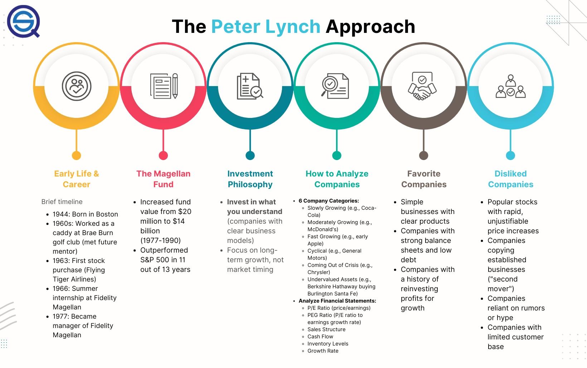

## Table of Contents

## What is the Peter Lynch Strategy?

The Peter Lynch Strategy is a way of picking stocks that was made popular by a man named Peter Lynch. He was a very successful investor who managed a big mutual fund. His strategy is all about finding good companies to invest in by doing your own research and understanding the businesses you are investing in. Lynch believed that you should invest in what you know, meaning if you use a product or service and think it's great, the company behind it might be a good investment.

Lynch also looked at a company's growth and how much it earns. He liked companies that were growing fast and making more money each year. He used something called the PEG ratio, which compares a company's price-to-earnings ratio with its growth rate. If the PEG ratio is low, it might mean the stock is a good buy. Lynch also paid attention to a company's balance sheet to make sure it wasn't carrying too much debt. His strategy is about finding undervalued companies with strong growth potential and holding onto them for the long term.

## Who is Peter Lynch and why is his strategy important?

Peter Lynch is a famous investor who used to manage the Fidelity Magellan Fund. He did a great job and made a lot of money for the people who invested in his fund. He became well-known because he was able to pick stocks that did really well. After he stopped managing the fund, he wrote books about how he picked stocks, and that's how people learned about his strategy.

His strategy is important because it helps regular people pick stocks without needing to be experts. Lynch believed that anyone could find good companies to invest in by just paying attention to the world around them. He said to invest in what you know, like if you love a certain store or product, the company behind it might be a good investment. His ideas make investing seem less scary and more doable for everyone.

## What are the key principles of the Peter Lynch Strategy?

The Peter Lynch Strategy is all about finding good companies to invest in by doing your own research and understanding the businesses you are investing in. Lynch believed that you should invest in what you know. This means if you use a product or service and think it's great, the company behind it might be a good investment. He also looked at a company's growth and how much it earns. Lynch liked companies that were growing fast and making more money each year. He used something called the PEG ratio, which compares a company's price-to-earnings ratio with its growth rate. If the PEG ratio is low, it might mean the stock is a good buy.

Another important part of Lynch's strategy is to pay attention to a company's balance sheet. He wanted to make sure the company wasn't carrying too much debt. Lynch's strategy is about finding undervalued companies with strong growth potential and holding onto them for the long term. He believed that by doing your own research and understanding the businesses you invest in, you can find great stocks that will do well over time. His approach makes investing seem more approachable for everyone, not just experts.

## How can beginners start applying the Peter Lynch Strategy?

Beginners can start applying the Peter Lynch Strategy by first paying attention to the products and services they use every day. If you find a product you really like, take a moment to think about the company that makes it. This is what Lynch meant by "invest in what you know." For example, if you love a certain brand of shoes, you might want to learn more about the company that makes them. This can be a good starting point for finding companies to invest in.

Next, beginners should do some simple research on these companies. Look at how fast the company is growing and how much money it is making. You can find this information on financial websites or in the company's annual reports. Lynch used something called the PEG ratio to see if a stock was a good buy. The PEG ratio compares the company's price-to-earnings ratio with its growth rate. If the PEG ratio is low, it might mean the stock is undervalued and could be a good investment. Remember, Lynch also looked at a company's balance sheet to make sure it wasn't carrying too much debt. By following these simple steps, beginners can start using the Peter Lynch Strategy to find good stocks to invest in.

## What types of stocks does the Peter Lynch Strategy focus on?

The Peter Lynch Strategy focuses on stocks of companies that are growing fast and making more money each year. Lynch liked to find companies that were doing well but were not too expensive. He used a tool called the PEG ratio to see if a stock was a good buy. The PEG ratio compares how much the company is growing with how much it costs to buy the stock. If the PEG ratio is low, it might mean the stock is a good deal.

Lynch also looked for companies that he understood and used in his everyday life. He believed in investing in what you know. For example, if you love a certain brand of shoes, you might want to learn more about the company that makes them. This way, you can find good companies to invest in by just paying attention to the world around you. Lynch's strategy is about finding these kinds of stocks and holding onto them for a long time.

## How does the Peter Lynch Strategy use the concept of 'PEG Ratio'?

The Peter Lynch Strategy uses the PEG ratio to find good stocks to buy. The PEG ratio stands for Price/Earnings to Growth ratio. It helps you see if a stock is a good deal by comparing how much the company is growing with how much it costs to buy the stock. If the PEG ratio is low, it might mean the stock is undervalued and could be a good investment. Lynch liked to use this ratio because it helped him find companies that were growing fast but were not too expensive.

Lynch believed that a PEG ratio of less than 1 was a good sign. This means the stock's price is low compared to how fast the company is growing. For example, if a company has a price-to-earnings ratio of 15 and a growth rate of 20%, the PEG ratio would be 0.75 (15 divided by 20). A PEG ratio of 0.75 is less than 1, so it might be a good stock to buy. By using the PEG ratio, Lynch could find stocks that were growing quickly but were still a good deal.

## What are some common mistakes to avoid when using the Peter Lynch Strategy?

When using the Peter Lynch Strategy, one common mistake to avoid is not doing enough research. Lynch believed in investing in what you know, but that doesn't mean you should buy a stock just because you like a product. You need to look at the company's financials, like its growth rate and earnings, to make sure it's a good investment. Another mistake is ignoring the PEG ratio. Lynch used this to find stocks that were growing fast but were not too expensive. If you don't pay attention to the PEG ratio, you might end up buying stocks that are too pricey.

Another mistake is not paying attention to a company's debt. Lynch always checked the balance sheet to make sure the company wasn't carrying too much debt. If a company has a lot of debt, it can be risky to invest in, even if it's growing fast. Finally, some people make the mistake of not holding onto their stocks for the long term. Lynch believed in finding good companies and keeping them for a long time. If you sell your stocks too soon, you might miss out on big gains.

## How can the Peter Lynch Strategy be adapted for different market conditions?

The Peter Lynch Strategy can be adapted for different market conditions by focusing on the core principles while adjusting the specific metrics used. In a bull market, where stock prices are rising, investors can still use the PEG ratio to find undervalued growth stocks. However, they might be more flexible with the PEG ratio threshold, accepting a slightly higher ratio since the overall market is doing well. Additionally, in a bull market, it's important to keep an eye on companies that are growing fast but might be overvalued. By focusing on companies with strong fundamentals and good growth prospects, investors can still find good stocks even when the market is high.

In a bear market, where stock prices are falling, the Peter Lynch Strategy can be adapted by being more cautious and focusing on companies with strong balance sheets and low debt. The PEG ratio becomes even more important in a bear market because it helps find stocks that are undervalued and have good growth potential. Investors might look for companies with a very low PEG ratio and solid earnings to weather the downturn. By sticking to the principle of investing in what you know and doing thorough research, investors can use the Peter Lynch Strategy to find good stocks even in tough market conditions.

## Can you provide examples of successful investments made using the Peter Lynch Strategy?

One successful investment that followed the Peter Lynch Strategy was his investment in Hanes. Lynch noticed that Hanes was doing well because he saw more and more people wearing their underwear and socks. He did his research and found out that Hanes was growing fast and making more money each year. The stock was also not too expensive, so he bought it. Over time, the stock went up a lot, and it was a great investment for him.

Another example is his investment in Taco Bell. Lynch loved going to Taco Bell and saw that it was always busy. He thought the food was good and the company was doing well. When he looked at the numbers, he found that Taco Bell was growing quickly and had a low PEG ratio. This meant the stock was a good buy. He invested in it and held onto it for a long time, and it turned out to be a very successful investment.

## How does the Peter Lynch Strategy integrate with fundamental analysis?

The Peter Lynch Strategy integrates well with fundamental analysis because it focuses on understanding a company's financial health and growth potential. Fundamental analysis involves looking at a company's financial statements, like its income statement, balance sheet, and cash flow statement, to see how well it is doing. Lynch used this kind of analysis to find companies that were growing fast and making more money each year. He paid attention to things like earnings growth, debt levels, and the PEG ratio, which compares a company's price-to-earnings ratio with its growth rate. By using fundamental analysis, Lynch could find stocks that were undervalued and had good growth prospects.

Lynch also believed in investing in what you know, which means understanding the business and its products or services. This part of his strategy goes hand-in-hand with fundamental analysis because knowing the business helps you understand its financials better. For example, if you use a product and think it's great, you might want to look at the company's financials to see if it's a good investment. By combining his personal knowledge of a company with a deep dive into its financials, Lynch was able to make smart investment choices. This integration of personal insight and fundamental analysis is what made his strategy so successful.

## What are advanced techniques for optimizing the Peter Lynch Strategy?

To optimize the Peter Lynch Strategy, investors can use more advanced techniques like sector rotation. This means looking at different parts of the economy and figuring out which ones are doing well at different times. For example, if technology companies are growing fast, you might want to invest more in them. By keeping an eye on economic trends and moving your money around to the best-performing sectors, you can make the Peter Lynch Strategy even better. Another advanced technique is using technical analysis along with fundamental analysis. Technical analysis looks at stock price patterns and trends to help you decide when to buy or sell. By combining this with the fundamental analysis that Lynch used, you can find the best times to invest in good companies.

Another way to optimize the Peter Lynch Strategy is by using a more detailed version of the PEG ratio. Instead of just looking at the basic PEG ratio, you can use a modified version that takes into account other factors like the company's debt levels or the stability of its earnings. This can help you find even better investment opportunities. Also, you can use portfolio diversification to spread your money across different types of stocks and reduce risk. By investing in a mix of growth stocks, value stocks, and dividend-paying stocks, you can make your investments safer while still following the core ideas of the Peter Lynch Strategy.

## How does the Peter Lynch Strategy compare to other investment strategies?

The Peter Lynch Strategy is different from other investment strategies because it focuses on finding good companies by understanding them and using them in everyday life. Lynch believed in investing in what you know, which means if you like a product or service, you should look into the company that makes it. This is different from strategies like value investing, where investors look for stocks that are cheap compared to what the company is worth. Value investors might not care about the company's products as much as they care about its financial numbers. Another strategy, growth investing, focuses on companies that are growing fast, but it might not pay as much attention to whether the stock is a good deal or not. Lynch's strategy combines elements of both by looking for fast-growing companies that are also good value.

Compared to technical analysis, which looks at stock price patterns and trends, the Peter Lynch Strategy is more about understanding the business itself. Technical analysts might buy or sell stocks based on charts and graphs without knowing much about the company. Lynch, on the other hand, wanted investors to do their own research and understand the company's financials. His strategy also differs from passive investing, where investors just buy a bunch of stocks or an index fund and hold onto them without trying to pick individual stocks. Lynch believed that by picking the right stocks and holding them for a long time, you could do better than just following the market. His approach makes investing seem more approachable for everyone, not just experts.

## References & Further Reading

[1]: Lynch, P. & Rothchild, J. (1989). ["One Up On Wall Street: How to Use What You Already Know to Make Money in the Market."](https://www.amazon.com/One-Up-Wall-Street-Already/dp/0743200403) Simon & Schuster.

[2]: Lynch, P. & Rothchild, J. (1994). ["Beating the Street."](https://www.amazon.com/Beating-Street-Peter-Lynch/dp/0671891634) Simon & Schuster.

[3]: Lopez de Prado, M. (2018). ["Advances in Financial Machine Learning."](https://www.amazon.com/Advances-Financial-Machine-Learning-Marcos/dp/1119482089) Wiley.

[4]: Chan, E. P. (2009). ["Quantitative Trading: How to Build Your Own Algorithmic Trading Business."](https://github.com/ftvision/quant_trading_echan_book) Wiley.

[5]: Jansen, S. (2018). ["Machine Learning for Algorithmic Trading - Second Edition: Predictive models to extract signals from market and alternative data for systematic trading strategies with Python."](https://thuvienso.hoasen.edu.vn/bitstream/handle/123456789/12260/Contents.pdf?sequence=1) Packt Publishing.