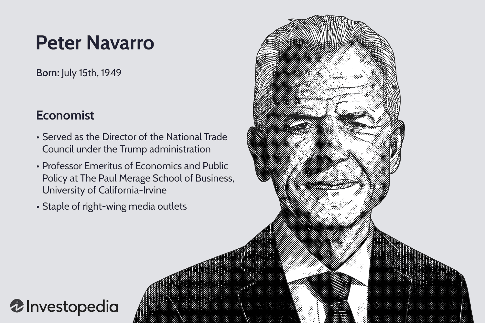

Peter Navarro is a prominent economist who served as a key advisor to former President Donald Trump, significantly shaping several major economic decisions during his tenure. His expertise lies in macroeconomic policy, trade, and China-U.S. relations, where his views have often emphasized protectionism and national industrial policy. Navarro's economic perspectives have profound implications for understanding contemporary financial markets, particularly as they intersect with technological advancements like algorithmic trading.

Algorithmic trading, or 'algo trading', has increasingly impacted financial markets over recent years, utilizing automated systems to execute trades based on predetermined rules. This form of trading leverages complex mathematical models and vast amounts of data to make lightning-fast decisions, comprising approximately 60-70% of the U.S. stock market's trading volume. The surge of algorithmic trading is largely attributed to technological advancements and the proliferation of data, reshaping market dynamics and trading strategies.

This article investigates the relationship between Peter Navarro's economic philosophies and the burgeoning field of algorithmic trading. By examining Navarro's views and their influence on financial markets, the discussion will highlight potential implications for the future of both economic policy and trading practices. The intersection of economic policy with financial technology underpins the ongoing evolution of marketplaces, necessitating a nuanced understanding of how advisors like Navarro might shape the course of financial innovation and regulation in the coming years.

## Table of Contents

## Who is Peter Navarro?

Peter Navarro is a noted economist and author, primarily recognized for his role in shaping economic policy and his contributions to academic literature. His expertise lies in macroeconomic policy, trade, and China-USA relations. Navarro played a significant role in the Trump administration, serving as the Director of the Office of Trade and Manufacturing Policy. In this capacity, he was instrumental in developing strategies aimed at strengthening American manufacturing, advocating for protective measures against trade imbalances, and addressing challenges posed by China's economic practices.

Navarro has authored several influential books that critique global trade practices and outline his economic philosophies. Among these are "Death by China: Confronting the Dragon – A Global Call to Action," a work that highlights the economic challenges posed by China's trade policies, and "Crouching Tiger: What China's Militarism Means for the World," which examines the geopolitical implications of China's growing military power. These publications have contributed to broader discussions on trade policies and economic strategies.

Navarro's economic viewpoints often emphasize protectionism and a national industrial policy, suggesting that the United States should focus on enhancing its manufacturing capabilities and reducing dependency on foreign nations. He argues that trade deficits can undermine national security and economic stability and has stressed the need for policies that support domestic industries and job creation.

Throughout his career, Navarro has garnered both support and criticism for his strong stances on trade and economic issues. Proponents of his views praise his commitment to revitalizing American manufacturing and addressing trade imbalances. Critics, however, argue that his approach may lead to increased trade tensions and have mixed impacts on the global economy.

Navarro's career achievements and controversies have solidified his influence in economic policymaking, making him a significant figure in discussions of trade and industrial policy. His contributions continue to provoke debate on the best strategies for promoting economic growth and sustaining international competitiveness.

## The Rise of Algorithmic Trading

Algorithmic trading, commonly known as 'algo trading,' involves the use of computer programs that follow a defined set of instructions or algorithms to execute trading orders at high speeds and volumes that far exceed human capabilities. This method leverages complex mathematical models and sophisticated algorithms, enabling traders and financial institutions to capitalize on market inefficiencies and execute trades within milliseconds.

The technological advancements over the past few decades, alongside increased availability and access to financial data, have significantly bolstered the prevalence of [algorithmic trading](/wiki/algorithmic-trading) strategies. Such automation offers a competitive edge by reducing transaction costs, minimizing human errors, and allowing for precise timing in trade execution.

Data analytics and [machine learning](/wiki/machine-learning) play crucial roles in algo trading by identifying patterns and predicting market trends with a high degree of accuracy. These technologies enable the development of algorithms that adapt to changing market conditions, enhancing the sophistication of trading strategies.

In the U.S. stock market, algorithmic trading constitutes approximately 60-70% of total trading [volume](/wiki/volume-trading-strategy), highlighting its dominant role in contemporary financial markets. This rapid adoption underscores the numerous advantages associated with algorithmic trading, such as increased [liquidity](/wiki/liquidity-risk-premium), tighter bid-ask spreads, and improved market efficiency.

However, there are inherent challenges and potential drawbacks. The reliance on algorithms can lead to unforeseen consequences like 'flash crashes,' where markets experience rapid, deep, and sudden price drops. Furthermore, the competitive need for speed can lead to increased market [volatility](/wiki/volatility-trading-strategies) and exacerbate systemic risks if not properly managed.

The impact of algorithmic trading on market dynamics is profound. It has transformed traditional trading practices and redefined the roles of traders and financial analysts. As technology continues to evolve, algorithmic trading is likely to further influence financial markets, demanding continuous evaluation of its implications on market structure and regulatory frameworks.

## Intersection of Navarro's Economic Views and Algorithmic Trading

Peter Navarro is known for his strong stances on trade deficits, outsourcing, and economic nationalism, which can be seen as contrasting with the inherently globalized and automated nature of algorithmic trading. Algorithmic trading relies on automation and data-driven strategies to optimize trade execution in a global market framework, a setup that is at odds with Navarro's focus on domestic manufacturing and job protection.

Navarro’s economic philosophy prioritizes reducing trade deficits and promoting domestic production, reflecting protectionist tendencies. Algorithmic trading, however, operates on principles of efficiency and speed, often capitalizing on minor pricing discrepancies across markets, irrespective of national borders. As a result, Navarro's views on economic nationalism might directly impact the regulatory environment governing algorithmic trading. 

For example, his focus on manufacturing and domestic job creation could lead to policies that favor non-automated domestic trading practices over those benefiting from global efficiencies. If similar policies are translated into trade restrictions or tariffs, algorithmic trading strategies that profit from international [arbitrage](/wiki/arbitrage) might be disrupted. Traders could find themselves needing to adapt algorithms to comply with potential new regulations designed to prioritize U.S.-based production and services.

Moreover, Navarro's economic policies could encourage a regulatory landscape that emphasizes oversight of financial transactions to ensure compliance with protectionist measures. This oversight may include stringent controls on cross-border data flow, which is integral to algorithmic trading. Such regulatory changes could necessitate that algorithmic traders adjust their models and operational processes, potentially leading to increased compliance costs and a need for more localized models of market operation.

Economic nationalism under Navarro's influence might shift market dynamics by imposing constraints on the free flow of capital and data, thus impacting liquidity and the speed at which trades can be executed. If financial markets gravitate towards nationalistic approaches, algorithmic systems that thrive in free, open, and highly liquid global markets may face challenges in sustaining their strategies. This scenario could catalyze a redesign in algorithmic infrastructures to align with regional policy requirements.

In summary, the intersection of Peter Navarro's economic views and algorithmic trading highlights potential conflicts between protectionist economic policies and the inherently global, automated nature of modern financial markets. By influencing regulatory frameworks, Navarro's philosophies could lead to significant adaptations in algorithmic trading strategies, challenging the existing dynamics of financial markets and necessitating a recalibration towards more nationally focused trading activities.

## Implications for the Future

The integration of economic policy and financial technology is a pivotal [factor](/wiki/factor-investing) shaping the evolution of financial markets. As algorithmic trading becomes increasingly influential, the economic policies advocated by figures like Peter Navarro could potentially lead to heightened scrutiny and regulation of these platforms. Navarro's economic stance, characterized by protectionism and a focus on national industrial policy, may introduce regulatory measures aimed at curbing the unforeseen impacts of algorithmic trading within domestic markets. 

Economic protectionism, as championed by Navarro, may alter the dynamics of global trading partnerships by prioritizing national economic interests over global market integration. This shift could impact algorithmic trading practices, as firms might need to adapt their strategies to align with new regulatory frameworks and market conditions imposed by protectionist policies. For example, restrictions on capital flows and stricter compliance requirements might necessitate modifications in algorithmic models that are currently optimized for free-market operations.

Aligning public policy with technological advances in trading presents both benefits and risks. On one hand, regulation informed by technological intelligence could enhance market stability and protect against systemic risks inherent in high-frequency trading ([HFT](/wiki/high-frequency-trading-strategies)) and other algorithmic strategies. On the other hand, excessive regulation might stifle innovation and reduce market efficiency, potentially diminishing the benefits of algorithmic trading such as improved liquidity and tighter bid-ask spreads.

Future advisors who share Navarro's economic views might significantly influence the trajectory of algorithmic trading. They could advocate for policies that emphasize risk management and domestic market priorities over global competitiveness. Such an approach may lead to restrictions on certain algorithmic practices, particularly those that pose risks to financial stability or national economic security.

In conclusion, the future of algorithmic trading is heavily intertwined with economic policy directions. The perspectives of economic advisors like Peter Navarro could shape regulatory landscapes, influencing how algorithmic trading evolves within both domestic and international markets. As technological innovation continues to drive the financial industry, understanding and anticipating these policy implications will remain crucial for stakeholders seeking to navigate the complex interplay between economic strategy and financial technology.

## Conclusion

Peter Navarro's influence as an economic advisor is apparent in the development and implementation of trade policies during his tenure under the Trump administration. His perspectives often emphasized protectionism and economic nationalism, seeking to reshape the U.S. trade landscape. These economic policies have sparked significant debate regarding their long-term implications and effectiveness in fostering a robust national economy.

As algorithmic trading continues to gain prominence in financial markets, grasping its complex relationship with economic policy becomes increasingly critical. The rapid growth of algo trading, driven by technological advancements and data manipulation capacities, has transformed trading dynamics, accounting for a significant portion of trading volumes in major financial hubs. 

Navarro's economic views underscore potential regulatory shifts, possibly affecting the operations of algorithmic trading platforms. His endorsements of nationalist economic policies could lead regulatory bodies to scrutinize and potentially restrain the autonomy of such trading systems. This scrutiny could manifest through new regulations designed to combat perceived market imbalances caused by high-speed, automated transactions, and address concerns about market volatility and fairness.

Continuous analysis of these intricate interactions between economic policies and algorithmic trading is essential for stakeholders, including policymakers, financial institutions, and traders. Understanding these dynamics could help navigate the evolving financial landscape, balancing the benefits of technological innovations with potential regulatory requirements.

Looking toward the future, the trajectory of algorithmic trading is likely to be shaped by a synthesis of technological advancements and policy directions influenced by advisors with economic views akin to Navarro's. The continued evolution of financial markets will depend on aligning technological growth with equitable and strategic regulatory frameworks, ensuring that innovation serves broader economic objectives while mitigating risks associated with highly automated trading systems.

## References & Further Reading

[1]: Navarro, P. (2011). ["Death by China: Confronting the Dragon - A Global Call to Action."](https://books.google.com/books/about/Death_by_China.html?id=nNkeJFy2Se8C) Pearson Prentice Hall.

[2]: Navarro, P. (2015). ["Crouching Tiger: What China's Militarism Means for the World."](https://www.cnas.org/publications/blog/crouching-tiger-what-chinas-militarism-means-for-the-world) Prometheus Books.

[3]: Aldridge, I. (2013). ["High-Frequency Trading: A Practical Guide to Algorithmic Strategies and Trading Systems."](https://www.amazon.com/High-Frequency-Trading-Practical-Algorithmic-Strategies/dp/1118343506) Wiley.

[4]: de Prado, M. L. (2018). ["Advances in Financial Machine Learning."](https://www.amazon.com/Advances-Financial-Machine-Learning-Marcos/dp/1119482089) Wiley.

[5]: Chan, E. (2009). ["Quantitative Trading: How to Build Your Own Algorithmic Trading Business."](https://github.com/ftvision/quant_trading_echan_book) Wiley.

[6]: Patterson, S. (2013). ["Dark Pools: High-Speed Traders, A.I. Bandits, and the Threat to the Global Financial System."](https://dl.acm.org/doi/10.5555/2385786) Crown Business.