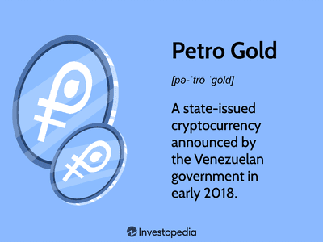

## Table of Contents

## What is Petro cryptocurrency?

Petro cryptocurrency is a digital currency that was created by the government of Venezuela. It is backed by Venezuela's oil reserves, which means that the value of Petro is supposed to be supported by the country's oil wealth. The idea behind Petro was to help Venezuela deal with its economic problems by creating a new way to trade and invest, without relying on the traditional financial systems.

However, Petro has faced many challenges and criticisms. Many people doubt whether it is really backed by oil, and there are concerns about how it is managed by the Venezuelan government. Also, because of international sanctions against Venezuela, Petro is not widely accepted or used outside the country. Despite these issues, the Venezuelan government continues to promote Petro as part of its efforts to improve the economy.

## Who created Petro and why was it introduced?

Petro was created by the government of Venezuela. The main person behind it was President Nicolás Maduro. He wanted to help Venezuela's economy, which was in big trouble. The country was facing a lot of problems like high inflation and not enough money. So, they thought Petro could be a new way to make money and trade without using the usual financial systems.

The reason they introduced Petro was because it was supposed to be backed by Venezuela's oil. This means that the value of Petro should be supported by the country's oil reserves. The government hoped that this would make people trust Petro and use it more. But, many people are not sure if Petro is really backed by oil, and there are worries about how the government is running it. Also, because of sanctions from other countries, Petro is not used much outside Venezuela.

## How does Petro differ from other cryptocurrencies like Bitcoin?

Petro is different from other cryptocurrencies like Bitcoin because it is backed by something real - Venezuela's oil reserves. Bitcoin, on the other hand, is not backed by any physical asset. Its value comes from what people are willing to pay for it. This makes Petro unique because it is supposed to have a more stable value, thanks to the oil supporting it.

Another big difference is that Petro was created by a government, the Venezuelan government, while Bitcoin was made by a person or a group of people, not a government. This means that Petro is more controlled by the government, which decides how it is used and managed. Bitcoin, however, is more open and not controlled by any one group or government. This gives Bitcoin more freedom but also makes it less predictable.

## What are the basic mechanisms of Petro's operation?

Petro works like other cryptocurrencies but with some special rules. It is a digital currency that you can use to buy things or trade with other people. The Venezuelan government says that each Petro is backed by a certain amount of oil from their reserves. This means that the value of Petro should be tied to the price of oil. To use Petro, you need a digital wallet where you can store your Petro, just like you would store Bitcoin or Ethereum.

The government of Venezuela controls how Petro is made and used. They decide how many Petros can be created and they manage the whole system. People can buy Petro with other cryptocurrencies or with the Venezuelan currency, the Bolívar. Once you have Petro, you can spend it within Venezuela, but it's not easy to use it in other countries because of sanctions and limited acceptance. The government also uses Petro to try and help the economy by selling it to raise money and encouraging people to use it for everyday purchases.

## What are the potential benefits of using Petro?

Using Petro could help Venezuela's economy. Since Petro is backed by oil, it might be more stable than other cryptocurrencies like Bitcoin. This could make people trust it more and use it for buying things or saving money. If more people use Petro, it could help the Venezuelan government raise money by selling it. This money could be used to fix roads, build schools, or help people who need it.

Another benefit is that Petro could help Venezuela trade with other countries without using the usual financial systems. Because of sanctions, it's hard for Venezuela to do business with other countries. Petro could be a way around these problems. If other countries start accepting Petro, it could open up new ways for Venezuela to buy and sell things, which could help the economy grow.

## What are the main concerns regarding Petro's legitimacy and stability?

There are big worries about whether Petro is really backed by oil like the Venezuelan government says. Many people think that the government might not have enough oil to support all the Petros they've made. This makes people doubt if Petro is worth what the government says it is. Also, the government controls everything about Petro, which makes some people think it's not a fair or open system. They worry that the government could change the rules anytime, which could hurt people who have Petro.

Another big concern is that Petro is not used much outside Venezuela. Because of sanctions from other countries, it's hard for Petro to be accepted and used around the world. This makes Petro less useful for buying things or trading with other countries. If Petro can't be used widely, it might not be a good way to help Venezuela's economy. All these worries make people question if Petro is a stable and legitimate [cryptocurrency](/wiki/cryptocurrency).

## How is Petro regulated and what are the legal implications for users?

Petro is controlled by the Venezuelan government. They make the rules about how it can be made and used. The government decides how many Petros can be created and they run the whole system. This means that if you use Petro, you have to follow the rules set by the government. If the government changes the rules, it could affect how you use Petro or what it's worth.

Using Petro can be tricky because of legal issues. In Venezuela, it's okay to use Petro, but in other countries, it might not be. Many countries have put sanctions on Venezuela, which means they don't want to deal with anything from Venezuela, including Petro. If you use Petro in a country with sanctions, you could get in trouble. So, it's important to know the laws in your country before you start using Petro.

## What impact could Petro have on the global cryptocurrency market?

Petro could shake up the global cryptocurrency market if it becomes more popular. Since it's backed by oil, it might seem more stable than other cryptocurrencies like Bitcoin. If people start trusting Petro more, they might start using it a lot, which could make it more valuable. This could change how people think about cryptocurrencies and make them see them as a safer way to save or spend money. But, because Petro is controlled by the Venezuelan government, it might not be as free as other cryptocurrencies, which could make some people not want to use it.

On the other hand, Petro faces big challenges that could limit its impact on the global market. Many people doubt if Petro is really backed by oil, which makes them not trust it. Also, because of sanctions against Venezuela, it's hard for Petro to be used in other countries. If Petro can't be used widely, it won't have a big effect on the global market. So, while Petro has the potential to change things, it needs to solve these problems first to really make a difference.

## How does Petro's backing by oil reserves affect its value and credibility?

Petro's value is supposed to be tied to Venezuela's oil reserves. This means that each Petro should be worth a certain amount of oil. This is different from other cryptocurrencies like Bitcoin, which aren't backed by anything real. Because Petro is backed by oil, it should be more stable and people might trust it more. If the price of oil goes up, Petro's value should go up too. This could make people see Petro as a safer way to save or spend money.

But, there are big worries about whether Petro is really backed by oil. Many people think that the Venezuelan government might not have enough oil to support all the Petros they've made. This makes people doubt if Petro is worth what the government says it is. Also, because the government controls everything about Petro, some people think it's not a fair or open system. These doubts make it hard for Petro to be trusted and used widely, which can hurt its credibility and value.

## What are the geopolitical implications of a state-backed cryptocurrency like Petro?

A state-backed cryptocurrency like Petro can change how countries deal with each other. Because Petro is backed by Venezuela's oil, it could help Venezuela trade with other countries without using the usual financial systems. This is important because many countries have put sanctions on Venezuela, which makes it hard for them to do business. If other countries start using Petro, it could help Venezuela get around these sanctions and trade more easily. But, because Petro is controlled by the Venezuelan government, other countries might not trust it or want to use it.

There are also worries about how a state-backed cryptocurrency like Petro could affect the world's money systems. If more countries start making their own cryptocurrencies, it could change how money works around the world. This could make it harder for big countries like the United States to control the world's money. But, because Petro is not trusted by many people and is hard to use in other countries, it might not have a big effect right now. Still, it shows that countries are trying new ways to deal with money problems, which could lead to big changes in the future.

## How do experts view the long-term viability of Petro?

Experts have mixed feelings about the long-term viability of Petro. Many are skeptical because they doubt if Petro is really backed by oil like the Venezuelan government says. They worry that the government might not have enough oil to support all the Petros they've made. Also, because the government controls everything about Petro, some experts think it's not a fair or open system. They believe that the government could change the rules anytime, which could hurt people who have Petro. These doubts make experts question if Petro can be trusted and used widely in the long run.

On the other hand, some experts see potential in Petro if it can solve its problems. If Petro becomes more trusted and used, it could help Venezuela's economy by giving them a new way to trade and raise money. But, because of sanctions from other countries, it's hard for Petro to be accepted and used around the world. If Petro can't be used widely, it might not be a good way to help Venezuela's economy in the long term. So, while Petro has the potential to be viable, it needs to solve these big challenges first.

## What advanced technical features does Petro offer compared to other digital currencies?

Petro doesn't have many advanced technical features that set it apart from other digital currencies. It works a lot like other cryptocurrencies, using blockchain technology to keep track of transactions. Blockchain is like a big, public notebook where all the transactions are written down and can't be changed. Petro uses this to make sure that when people buy, sell, or trade Petro, it's all recorded and safe. But, Petro doesn't have special features like smart contracts, which are used by some other cryptocurrencies to do more complicated things automatically.

The main thing that makes Petro different is that it's backed by oil. This means that each Petro is supposed to be worth a certain amount of oil from Venezuela's reserves. This is not a technical feature, but it's meant to make Petro more stable and trustworthy. However, because the Venezuelan government controls everything about Petro, it doesn't have the same level of freedom and openness that other cryptocurrencies have. This can make it less appealing to people who like the idea of a currency that no one can control.

## References & Further Reading

[1]: Narayanan, A., Bonneau, J., Felten, E., Miller, A., & Goldfeder, S. (2016). [Bitcoin and Cryptocurrency Technologies: A Comprehensive Introduction](https://press.princeton.edu/books/hardcover/9780691171692/bitcoin-and-cryptocurrency-technologies). Princeton University Press.

[2]: Lopez de Prado, M. (2018). [Advances in Financial Machine Learning](https://www.amazon.com/Advances-Financial-Machine-Learning-Marcos/dp/1119482089). Wiley.

[3]: Aronson, D. R. (2006). [Evidence-Based Technical Analysis: Applying the Scientific Method and Statistical Inference to Trading Signals](https://www.wiley.com/en-us/Evidence+Based+Technical+Analysis%3A+Applying+the+Scientific+Method+and+Statistical+Inference+to+Trading+Signals-p-9780470008744). Wiley Trading.

[4]: Jansen, S. (2020). [Machine Learning for Algorithmic Trading](https://github.com/stefan-jansen/machine-learning-for-trading). Packt Publishing.

[5]: OPEC Annual Statistical Bulletin (2022). [OPEC's Role in Petroleum Economies](https://www.opec.org/opec_web/static_files_project/media/downloads/publications/ASB_2022.pdf). Organization of the Petroleum Exporting Countries.

[6]: Chan, E. P. (2008). [Quantitative Trading: How to Build Your Own Algorithmic Trading Business](https://github.com/ftvision/quant_trading_echan_book). Wiley.

[7]: Casey, M. J., & Vigna, P. (2018). [The Truth Machine: The Blockchain and the Future of Everything](https://books.google.com/books/about/The_Truth_Machine.html?id=37QoDwAAQBAJ). St. Martin's Press.