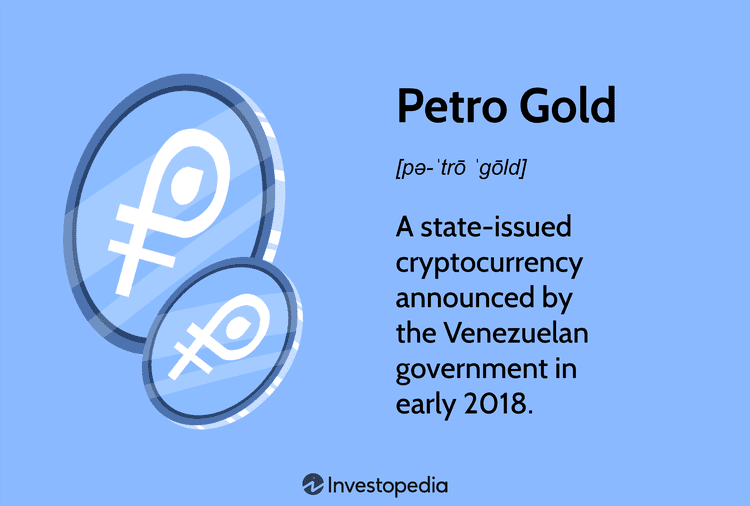

In today's rapidly evolving financial landscape, cryptocurrency has emerged as a powerful force, offering new opportunities and presenting complex challenges to investors worldwide. Digital currencies are not just speculative assets but pivotal elements in a transformative shift in how financial systems operate. Among these myriad cryptocurrencies, Venezuela's Petro Gold stands out with its unique features and state-backed assurance. Launched by the Venezuelan government, Petro Gold represents a significant step in integrating national resources into the digital economy, adding a layer of confidence and sovereign backing to its valuation.

Petro Gold's proposition is further underscored by its direct linkage to the country's precious metal reserves, positioning it as a potentially stable alternative amidst the often volatile cryptocurrency market. This backing by tangible assets aims to differentiate Petro Gold from conventional cryptocurrencies that typically derive value from the perceptions and agreements within decentralized networks.



In parallel, the rise of algorithmic trading offers innovative methods for engaging with cryptocurrencies. Traders increasingly rely on algorithms to capitalize on the volatility and rapid movements characteristic of digital assets. By utilizing pre-set rules and sophisticated models, algorithmic trading facilitates automated transactions that can swiftly execute buy and sell orders, enhancing the potential for profitability and efficiency.

The intersection of Petro Gold and algorithmic trading presents intriguing possibilities. On one hand, the unique attributes of Petro Gold, combined with its state endorsement, provide a distinct asset for traders seeking alternatives to traditional cryptocurrencies. On the other, algorithmic trading's capabilities can potentially unlock new avenues for engaging with this asset by optimizing trading strategies, reducing human error, and processing large volumes of market data with high precision and speed.

This article seeks to explore Venezuela's Petro Gold, examining its fundamental characteristics and significance within the broader cryptocurrency landscape. Additionally, it will highlight how algorithmic trading can be effectively applied to Petro Gold, discussing potential advantages and critical considerations. This exploration aims to provide valuable insights for traders looking to venture into the world of Petro Gold cryptocurrency algo trading, shedding light on the nuances and opportunities inherent in this emerging field.

## Table of Contents

## Understanding Petro Gold: A Background

Petro Gold is a cryptocurrency introduced by the Venezuelan government as part of its broader effort to stabilize and boost its economy through state-backed digital assets. The inception of Petro Gold aligns with Venezuela's strategy to leverage its substantial natural resources, particularly precious metals, in navigating economic challenges and international sanctions.

The primary reason behind the creation of Petro Gold was to capitalize on Venezuela's abundant gold reserves. The country aimed to create a digital currency backed by its precious metal assets, providing a tangible, stable foundation for the [cryptocurrency](/wiki/cryptocurrency). This approach was expected to instill confidence among investors and users, offering a state-backed alternative to the high [volatility](/wiki/volatility-trading-strategies) often seen in traditional cryptocurrencies.

Petro Gold differs significantly from its predecessor, the Petro cryptocurrency, predominantly backed by the nation's oil reserves. While the Petro was primarily linked to oil, an asset with fluctuating prices due to market dynamics, Petro Gold's backing by gold presents a different value proposition. Gold has traditionally been considered a stable store of value, potentially offering a more stable cryptocurrency option compared to one tied to oil, especially in a country subject to geopolitical tensions and economic fluctuations.

The adoption of state-backed cryptocurrencies like Petro Gold carries substantial economic and geopolitical implications. Economically, these cryptocurrencies can provide a new medium for international transactions, circumventing traditional financial systems and offering a way to bypass economic sanctions. This capability is particularly pertinent for Venezuela, as it faces ongoing sanctions from various countries. Geopolitically, the existence of state-backed digital currencies could challenge the dominance of existing international financial institutions by creating alternative systems for global trade.

In the context of the global cryptocurrency market, Petro Gold's standing is relatively nascent. The currency's introduction is part of a broader trend where nations explore digital currencies to assert greater control over their financial systems and reduce dependency on external financial networks. However, its future growth is contingent on several factors, including broader market acceptance, regulatory developments, and the geopolitical landscape. While the backing by state reserves offers credibility, the currency must still navigate the challenges of market competitiveness and international regulatory scrutiny to achieve significant traction in the cryptocurrency space.

## What is Algorithmic Trading?

Algorithmic trading, often referred to as algo trading, is the practice of using computer algorithms to automate the buying and selling of financial assets. These algorithms are designed to execute trades based on a pre-determined set of rules, which can be as simple as timing a trade to when a certain price is reached, or as complex as executing a strategy based on multiple market indicators and conditions.

In the context of financial markets, [algorithmic trading](/wiki/algorithmic-trading) is utilized to execute orders with speed and precision, which human traders could not achieve. This is particularly beneficial in the cryptocurrency market, where high volatility and the 24/7 operating hours can create [arbitrage](/wiki/arbitrage) opportunities that algorithms can capitalize on efficiently. 

Algorithmic trading enhances speed by processing orders within microseconds, far surpassing the capability of manual trading. This speed allows traders to exploit even the smallest market inefficiencies. Furthermore, algorithms offer accuracy by minimizing human errors, ensuring trades are executed exactly as planned. The ability of these systems to handle large data sets means they can analyze vast quantities of market data in real-time, providing traders with insights that inform better decision-making.

Common types of algorithms used in trading include [momentum](/wiki/momentum) algorithms, which capitalize on upward or downward trends; arbitrage algorithms, which exploit price differentials across different markets or instruments; and market-making algorithms, which provide [liquidity](/wiki/liquidity-risk-premium) to the markets by offering both bid and ask offers, profiting from the spread.

Engaging in algorithmic trading requires certain technical proficiencies. Traders need a robust understanding of programming languages like Python, which is favored for its simplicity and extensive libraries for data analysis and [machine learning](/wiki/machine-learning). An understanding of statistical methods and financial markets is crucial to develop and backtest algorithms effectively. Additionally, a reliable hardware setup to reduce latency in order execution, combined with secure and stable internet connectivity, is essential to perform algorithmic trading optimally.

Algorithmic trading represents a significant evolution in trading practices, offering practical advantages in terms of speed, accuracy, and data handling capabilities. As cryptocurrencies continue to grow as an asset class, the role of sophisticated algorithms is likely to expand, creating new opportunities and challenges for traders.

## Integrating Petro Gold with Algo Trading

Integrating Petro Gold with algorithmic trading presents various opportunities and challenges that require careful consideration of strategies, technical aspects, and regulatory environments.

### Synergies and Strategies

The integration of Petro Gold with algorithmic trading offers unique synergies that can optimize trading performance. For instance, leveraging algorithmic strategies such as arbitrage could exploit price differentials between exchanges offering Petro Gold, potentially maximizing profit opportunities. Momentum strategies, focusing on the continuation of existing trends, could be applied to capitalize on Petro Gold's market movements, especially given its state-backed nature, which may influence its volatility differently compared to other cryptocurrencies.

### Technical Challenges and Solutions

Incorporating Petro Gold into trading algorithms poses several technical challenges. Being a relatively new crypto asset, its historical data might be limited, affecting the performance and accuracy of predictive models. To mitigate this, traders could apply techniques such as [backtesting](/wiki/backtesting) on similar state-backed cryptocurrencies like the original Petro to adapt algorithms accordingly. 

Moreover, Petro Gold's blockchain infrastructure and transaction speed must be compatible with algorithmic trading systems, which demand real-time data processing. Implementing robust API integrations and ensuring low-latency data feeds are essential to address these challenges.

Python, a preferred language for algorithmic trading, offers various libraries such as `pandas` for data manipulation and `numpy` for numerical calculations, aiding in the development of complex trading algorithms. Here is a sample code snippet to simulate a simple momentum trading strategy:
```python
import pandas as pd

# Sample data representing Petro Gold prices
data = {'Date': pd.date_range(start='2022-01-01', periods=100),
        'Price': [100 + x for x in range(100)]}

df = pd.DataFrame(data)

# Calculating the moving average
df['MA10'] = df['Price'].rolling(window=10).mean()

# Simulating a simple momentum strategy
df['Signal'] = 0
df.loc[df['Price'] > df['MA10'], 'Signal'] = 1  # Buy signal

print(df.tail())
```

### Case Studies and Examples

Algorithmic trading has been successfully applied to state-backed cryptocurrencies such as the original Petro and China's proposed digital yuan. These case studies demonstrate the potential of leveraging algorithms to manage state-induced volatility and achieve consistent trading results. By learning from the documented successes and challenges of these cryptocurrencies, traders can better strategize their approach to Petro Gold.

### Legal and Regulatory Aspects

The regulatory environment is a critical [factor](/wiki/factor-investing) when trading Petro Gold algorithmically. Given its state-backed nature, compliance with Venezuelan regulations is obligatory. Additionally, traders must navigate international regulatory landscapes, which may differ significantly. This entails staying informed about financial regulations in nations where Petro Gold is traded, ensuring that trading algorithms adhere to these rules.

In summary, integrating Petro Gold with algorithmic trading requires a strategic blend of effective trading models, technical solutions to address new asset challenges, learnings from similar cryptos, and adherence to complex regulatory frameworks. Employing a thoughtful approach can optimize trading strategies and enhance performance in this emerging market.

## Advantages and Challenges

Combining Petro Gold with algorithmic trading can provide several potential benefits for traders, enhancing trading efficiency and delivering deeper market insights. Algorithmic trading, by its nature, allows for automated execution of trades, which greatly increases the speed and precision with which trades can be conducted. This is especially advantageous in the volatile world of cryptocurrencies, where market conditions can shift rapidly. By integrating these algorithms with Petro Gold, traders can capitalize on emerging opportunities in a timely fashion.

The financial and strategic advantages extend further for traders exploring new crypto assets like Petro Gold. Engaging with state-backed cryptocurrencies can offer a level of security and stability often absent in many other digital currencies. This backing may mitigate certain risks associated with market perceptions and valuations. Additionally, as Petro Gold is supported by Venezuela's precious metal reserves, it introduces a novel asset class that could diversify trading portfolios, reducing systematic risk.

However, various challenges accompany the application of algorithmic trading to a state-backed cryptocurrency such as Petro Gold. One of the primary risks is the currency's inherent volatility, which can lead to large price swings. Although the backing by precious metals may offer some price stability, external geopolitical and economic factors affecting Venezuela can compound price instability.

Liquidity issues are another significant challenge. As a relatively new entrant in the cryptocurrency market, Petro Gold may experience lower trading volumes compared to established cryptocurrencies like Bitcoin or Ethereum. Limited liquidity can result in higher spreads and greater difficulty executing large trades without affecting the market price.

Regulatory concerns also pose a formidable barrier. The evolving legal landscape surrounding cryptocurrencies, particularly state-backed ones, can introduce uncertainties. Traders must navigate varying regulations across different jurisdictions, which may affect trading activities and strategies.

To mitigate these challenges, traders can adopt several strategies. Diversifying trading algorithms—using a mix of momentum strategies, arbitrage, and hedging techniques—can help manage volatility and adapt to changing market conditions. Machine learning techniques can be employed to develop predictive models that enhance decision-making. For instance, a simple moving average crossover strategy in Python can be outlined as follows:

```python
import pandas as pd
import numpy as np

# Assume 'data' is a DataFrame with Petro Gold price data
data['short_mavg'] = data['Price'].rolling(window=40, min_periods=1).mean()
data['long_mavg'] = data['Price'].rolling(window=100, min_periods=1).mean()

# Create signals based on moving averages crossover
data['signal'] = 0.0
data['signal'][40:] = np.where(data['short_mavg'][40:] > data['long_mavg'][40:], 1.0, 0.0)

# Generate trading orders
data['positions'] = data['signal'].diff()
```

Additionally, maintaining a keen eye on regulatory developments and ensuring compliance can prevent legal pitfalls. Establishing relationships with market participants and liquidity providers can help improve trade execution quality. Continuous monitoring and adapting strategies based on real-time data analysis is critical to maintaining a competitive edge in algorithmic trading with Petro Gold.

In conclusion, while integrating Petro Gold with algorithmic trading offers significant potential benefits, traders must thoroughly assess the associated risks. By employing sophisticated techniques and strategies, and remaining vigilant to the regulatory environment, they can optimize their trading activities in this promising, yet challenging, domain.

## Future Outlook for Petro Gold Algorithmic Trading

The future of Petro Gold algorithmic trading is closely intertwined with emerging market trends, geopolitical dynamics, technological advances, and the evolving acceptance of cryptocurrencies on a global scale.

Geopolitics plays a significant role in the future of Petro Gold. As a state-backed cryptocurrency, its acceptance and value may be influenced by Venezuela’s global relationships and internal economic strategies. Political stability and international sanctions can affect trust and legal backing for Petro Gold, impacting its market position. Conversely, improving diplomatic relations may enhance acceptance and utility across global markets, increasing liquidity and reducing trading risks.

Technological advancements are pivotal to optimizing algorithmic trading for Petro Gold. Innovative technologies, such as [artificial intelligence](/wiki/ai-artificial-intelligence) and machine learning, have the potential to enhance trading strategies by improving predictive analytics and decision-making processes. High-frequency trading ([HFT](/wiki/high-frequency-trading-strategies)), facilitated by cutting-edge hardware and software, can enable traders to capitalize on fleeting market opportunities, thereby enhancing the overall efficiency of Petro Gold trades. Moreover, blockchain improvements, like faster transaction confirmations and enhanced security features, could stabilize trading environments and reduce algorithmic risks.

Market acceptance of Petro Gold as a legitimate cryptocurrency will critically shape its algo trading prospects. The wider adoption of cryptocurrencies, along with potential regulatory frameworks, could establish greater trust and stability in using Petro Gold for trading. Acceptance by major exchanges can increase its accessibility to traders and investors, enhancing liquidity and potentially stabilizing its value.

Upcoming innovations in algorithmic trading can further benefit Petro Gold traders. For instance, quantum computing, though currently nascent, holds immense potential in processing complex datasets at unprecedented speeds, which could revolutionize algo trading by optimizing trade execution and strategy refinement. Furthermore, advancements in sentiment analysis tools could provide traders with real-time insights into market psychology, aiding in the development of more responsive trading algorithms tailored to Petro Gold’s unique market behavior.

Expert insights suggest that cryptocurrency trading strategies incorporating Petro Gold will need to adapt quickly to changing market conditions and technological evolutions. Traders are advised to monitor geopolitical developments, engage with emerging technologies, and diversify their algorithmic models to accommodate various economic scenarios. Continual learning and adaptation, such as understanding the impacts of new regulations and exploring decentralized finance (DeFi) ecosystems, will be key to leveraging the potential of Petro Gold successfully.

In conclusion, traders interested in Petro Gold algorithmic trading should adopt a proactive approach. Staying informed about geopolitical trends, investing in robust technological solutions, and developing adaptable trading strategies are critical steps. Participation in educational forums and collaboration with technology experts can provide a competitive edge. By embracing a forward-thinking mindset, traders can unlock the considerable potential that Petro Gold algo trading offers amidst the dynamically evolving cryptocurrency landscape.

## Conclusion

In conclusion, the intersection of Venezuela's Petro Gold and algorithmic trading presents a unique opportunity for growth and innovation in the cryptocurrency arena. Petro Gold, with its state-backed assurance and alignment with Venezuela's precious metal reserves, offers a distinctive asset for traders seeking new ventures. Algorithmic trading stands out as a powerful tool due to its capability to automate transactions, enhance market analysis, and maximize trading efficiency. The melding of these two domains—an emerging cryptocurrency and advanced trading techniques—promises significant potential for disruption and profitability.

The evolving nature of cryptocurrencies necessitates that traders remain vigilant and adaptable. The volatile and rapidly transforming market conditions make it imperative for investors to stay informed about geopolitical developments, regulatory changes, and technological advancements that could influence the dynamics of Petro Gold trading. While there are considerable rewards, such as improved trading efficiency and unique market insights, challenges persist. These include managing risks associated with volatility, ensuring liquidity, and navigating legal landscapes.

For traders intrigued by the prospects of Petro Gold algorithmic trading, it is crucial to further explore and understand the nuances of this promising avenue. As technological tools and trading strategies continue to advance, and as Petro Gold gains standing in the cryptocurrency marketplace, a well-informed and strategic approach could unveil significant opportunities for traders poised to capitalize on these developments. Embracing the complexities and potentials of this intersection could pave the way for innovative and prosperous trading endeavors.

## References & Further Reading

[1]: Bergstra, J., Bardenet, R., Bengio, Y., & Kégl, B. (2011). ["Algorithms for Hyper-Parameter Optimization."](https://dl.acm.org/doi/10.5555/2986459.2986743) Advances in Neural Information Processing Systems 24.

[2]: ["Advances in Financial Machine Learning"](https://www.amazon.com/Advances-Financial-Machine-Learning-Marcos/dp/1119482089) by Marcos Lopez de Prado

[3]: ["Evidence-Based Technical Analysis: Applying the Scientific Method and Statistical Inference to Trading Signals"](https://www.amazon.com/Evidence-Based-Technical-Analysis-Scientific-Statistical/dp/0470008741) by David Aronson

[4]: ["Machine Learning for Algorithmic Trading"](https://github.com/stefan-jansen/machine-learning-for-trading) by Stefan Jansen

[5]: ["Quantitative Trading: How to Build Your Own Algorithmic Trading Business"](https://www.amazon.com/Quantitative-Trading-Build-Algorithmic-Business/dp/1119800064) by Ernest P. Chan