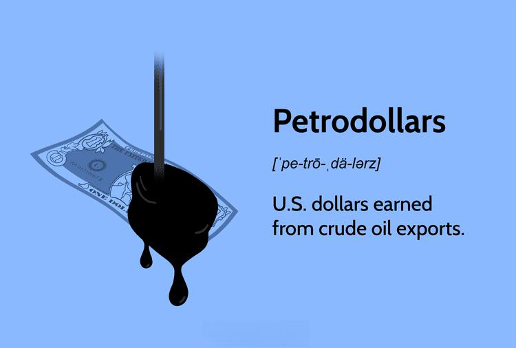

The petrodollar system represents a pivotal mechanism in the global economy, significantly influencing international trade and financial dynamics. At its core, the term "petrodollar" refers to US dollars earned by countries through the sale of oil, which are typically traded on global markets using USD as the primary currency. This system has entrenched the US dollar's status as the world's foremost reserve currency, ensuring its dominance in international financial transactions and securing demand for the currency due to the necessity of its use in global oil trade.

The relationship between the oil economy and currency markets forms a complex network where fluctuations in oil prices and production volumes directly affect currency valuation, inflation rates, and economic policy in both oil-exporting and oil-importing nations. For instance, an increase in oil prices can lead to higher revenues for exporting countries, simultaneously impacting their economic strategies and international investments, a phenomenon known as "petrodollar recycling."



Beyond the direct economic impacts, the intersection of technology and finance marked by algorithmic trading further complicates and enriches the landscape. Algorithmic trading involves using pre-programmed instructions accounting for variables such as timing, price, and volume to perform high-frequency trading operations more efficiently than human traders. In the oil markets, algorithmic trading accelerates the speed of transactions and introduces new dynamics to price setting, often increasing market liquidity while potentially heightening volatility due to rapid shifts in trading patterns prompted by algorithmic adjustments.

These intertwined elements—petrodollars, currency markets, and algorithmic trading—form a tightly interwoven network that dictates much of the economic strategies and financial outcomes for countries involved in the oil trade. This article explores these connections, examining how they shape global economic policies, influence the stability of currency markets, and transform through technological advancements in financial trading methods. Understanding these dynamics is crucial for investors and policymakers aiming to navigate the complex terrain of the global economy.

## Table of Contents

## Understanding Petrodollars

Petrodollars refer to the revenue generated by countries through the export of oil denominated in U.S. dollars. This term was coined during the 1970s following the price surge in oil due to the Yom Kippur War and subsequent oil embargo led by the Organization of the Petroleum Exporting Countries (OPEC). This event marked a significant shift as oil began to be explicitly priced in U.S. dollars on the global market, embedding the currency deeply within international energy trade. 

The U.S. dollar's dominance in global oil transactions is profound. Oil-exporting countries and multinational oil corporations predominantly price and transact oil in dollars due to the currency's stability, liquidity, and acceptance worldwide. Firstly, as a stable currency backed by the world's largest economy, the dollar reduces exchange rate risk. Secondly, because the dollar is widely traded and held by central banks as a primary reserve currency, it offers liquidity unmatched by other currencies. Lastly, since the end of World War II and the Bretton Woods Agreement era, there has been historical [momentum](/wiki/momentum) and infrastructure facilitating dollar-denominated transactions.

Oil-exporting countries prefer U.S. dollar denominations mainly due to economic and geopolitical strategies. By conducting transactions in dollars, oil exporters can link their economic fortunes to the predictable performance of the U.S. economy, mitigating currency risk and enhancing economic stability. Furthermore, conducting oil trades in a common currency simplifies complex international trade, reducing the transaction costs associated with currency exchange. This preference also facilitates foreign exchange reserves management, where these nations accumulate substantial dollar reserves, thus maintaining financial influence in global markets while ensuring their economic stability.

In summary, petrodollars represent a convergence between oil trade and U.S. dollar transactions, underpinning the currency’s global hegemony, which is significantly valued by oil-exporting countries for the financial and geopolitical advantages it accords.

## Petrodollar Recycling

Petrodollar recycling refers to the process by which oil-exporting nations, primarily those in the Middle East, reinvest their substantial U.S. dollar revenues garnered from the sale of oil. This phenomenon is pivotal to understanding both the global financial system and international economic dynamics. When countries sell oil, the transactions are typically conducted in U.S. dollars, leading to substantial accumulations of this currency by exporting nations.

The impetus for petrodollar recycling arises from the need for these oil-rich countries to utilize their earnings effectively. Rather than allowing their dollar reserves to remain dormant, these countries engage in investment activities that provide economic benefits both domestically and internationally. For instance, many of these nations channel their U.S. dollar holdings into sovereign wealth funds, which are utilized to acquire assets ranging from real estate to stocks in industries such as technology, finance, and infrastructure across the globe.

The economic impact of petrodollar recycling on global markets is multifaceted. On one hand, it leads to increased [liquidity](/wiki/liquidity-risk-premium) in financial markets, particularly in the United States and Europe, due to investments and bond purchases. This recycling acts as a stabilizing [factor](/wiki/factor-investing), often supporting the value of the U.S. dollar and influencing interest rates. Furthermore, it can indirectly finance budget deficits in developed economies, as oil-exporting nations often reinvest in the securities of these countries.

On the other hand, the reinvestment strategies of oil-exporting countries can also affect international capital flows and asset prices, potentially contributing to financial imbalances. For instance, large-scale purchases of U.S. Treasury securities by oil-rich nations can exert downward pressure on U.S. interest rates, influencing borrowing costs globally.

In summary, petrodollar recycling is a significant economic process that not only ensures the effective use of oil revenues by exporting nations but also plays a crucial role in the dynamics of the global financial markets. Understanding its mechanisms enables policymakers and investors to better anticipate shifts in international capital flows and economic conditions.

## Petrodollar's Influence on Currency Markets

Petrodollars, the revenue generated from oil exports denominated in U.S. dollars, play a crucial role in shaping global currency markets. The intrinsic relationship between petrodollars and currency exchange rates arises from the fact that oil is predominantly traded in dollars. Consequently, the demand for U.S. dollars is inherently tied to oil demand. This phenomenon bolsters the U.S. dollar's status as the primary global reserve currency, thereby sustaining its global dominance. 

When countries purchase oil, they require substantial amounts of U.S. dollars, which enhances the dollar's value relative to other currencies. This demand supports the U.S. dollar's exchange rate and amplifies its liquidity in global financial markets. Moreover, by holding large reserves of U.S. dollars, oil-exporting nations contribute to the dollar's stability. These reserves are often recycled into investments in U.S. financial assets, further intertwining the strength of the U.S. dollar with global financial health.

The implications of oil transactions on the USD's status as a reserve currency are multifaceted. The petrodollar system reinforces the dollar's hegemony by steering global trade and financial flows towards the U.S. This dominance allows the U.S. to benefit from its ability to run trade deficits with relative ease and finance its debt at lower interest rates. Moreover, the dollar-centric oil trade creates a financial environment where global economic stability is, to an extent, dependent on the U.S. currency's stability.

Oil price fluctuations significantly affect global currency markets. When oil prices rise, countries that import oil need more dollars, which can lead to a relative appreciation of the U.S. dollar. Conversely, when oil prices fall, the demand for dollars might decrease, potentially leading to a depreciation. This dynamic introduces [volatility](/wiki/volatility-trading-strategies) into currency markets, as exchange rates adjust to the ebb and flow of oil prices.

For example, when oil prices surged in the 1970s, there was an increased demand for dollars, which contributed to the dollar's strength at the time. In contrast, a sharp decline in oil prices can lead to a weakened dollar if the resulting reduction in demand for dollars persistently impacts global exchange rates. This interplay between oil prices and currency values means that significant movements in the oil market can have a ripple effect across global economies, influencing inflation, trade balances, and investment flows.

Overall, the petrodollar system exerts substantial influence on currency exchange rates by underpinning the demand for U.S. dollars and reinforcing the currency's role as the central pillar of the global economy. This entwinement highlights the sensitivity of currency markets to both oil price dynamics and geopolitical shifts that could challenge the supremacy of the petrodollar arrangement. Understanding these interconnections is crucial for stakeholders seeking to navigate the complexities of global financial systems.

## Algorithmic Trading in the Oil Economy

Algorithmic trading stands as a revolutionary force within modern financial markets. By leveraging complex algorithms and high-speed computing, it enables the automatic execution of trades based on predetermined criteria. This method of trading capitalizes on the minute discrepancies in market data, allowing traders to tap into opportunities with precision and speed unattainable by human traders. The utilization of [algorithmic trading](/wiki/algorithmic-trading) spans various asset classes, with commodities such as oil being a significant area of focus.

Algorithmic trading strategies in oil commodity trading involve various techniques that optimize the execution of trades. These strategies typically encompass market-making, trend-following, and statistical [arbitrage](/wiki/arbitrage) methods. Market-making algorithms provide liquidity by continuously quoting buy and sell prices, capturing the spread between them. Trend-following strategies, on the other hand, analyze historical price data to anticipate future price movements, establishing positions in alignment with the current trend. Statistical arbitrage exploits price inefficiencies between related assets—an approach particularly useful given the volatility in oil prices and the relationships between [crude oil](/wiki/crude-oil), refined products, and related indices.

The introduction of algorithmic trading to oil markets has notably influenced market volatility and price behavior. Algorithms are programmed to respond rapidly to market news, economic indicators, and even geopolitical events that impact oil supply and demand. This responsiveness can lead to significant price movements over short periods, contributing to increased market volatility. For example, when news about tensions in oil-producing regions is released, algorithmic trading systems might execute a large number of trades in response, amplifying the initial impact on oil prices.

Moreover, algorithmic trading contributes to market efficiency by narrowing bid-ask spreads, increasing liquidity, and enabling quicker absorption of market information. Yet, it can also exacerbate systemic risks, as seen during events like the 2010 Flash Crash. During such periods, the rapidity of trade execution can lead to cascading effects, where algorithms trigger further automated buy or sell orders, instigating abrupt price swings.

To visualize the influence of algorithmic trading on price dynamics, one might employ simulation models using historical market data. Python, with libraries like Pandas and NumPy, serves as a robust platform for developing such simulations. For instance, a simple moving average crossover strategy could be implemented to analyze its impact on historical oil price data:

```python
import pandas as pd
import numpy as np

# Load historical oil price data
oil_data = pd.read_csv('oil_prices.csv', parse_dates=['Date'], index_col='Date')

# Calculate moving averages
short_window = 40
long_window = 100
oil_data['Short_MA'] = oil_data['Price'].rolling(window=short_window, min_periods=1).mean()
oil_data['Long_MA'] = oil_data['Price'].rolling(window=long_window, min_periods=1).mean()

# Generate trading signals
oil_data['Signal'] = 0
oil_data['Signal'][short_window:] = np.where(oil_data['Short_MA'][short_window:] > oil_data['Long_MA'][short_window:], 1, 0)
oil_data['Position'] = oil_data['Signal'].diff()

# Plot the results
import matplotlib.pyplot as plt
plt.figure(figsize=(12,8))
plt.plot(oil_data['Price'], label='Oil Price', alpha=0.5)
plt.plot(oil_data['Short_MA'], label='40-Day MA', alpha=0.7)
plt.plot(oil_data['Long_MA'], label='100-Day MA', alpha=0.7)
plt.scatter(oil_data.index, oil_data['Position'].where(oil_data['Position'] == 1), label='Buy Signal', marker='^', color='g')
plt.scatter(oil_data.index, oil_data['Position'].where(oil_data['Position'] == -1), label='Sell Signal', marker='v', color='r')
plt.title('Algorithmic Trading Strategy Simulation')
plt.xlabel('Date')
plt.ylabel('Price')
plt.legend()
plt.show()
```

In this example, the strategy generates signals when the short-term moving average crosses the long-term moving average, offering insights into potential trade entries and exits. This simplistic approach mirrors the basic functionality that more sophisticated algorithmic systems might employ in real-time, underlining their utility in navigating the complex landscape of oil commodity trading.

## Challenges and Criticisms of the Petrodollar System

The petrodollar system, established in the 1970s, has been a cornerstone of international finance and trade. However, it is not without its challenges and criticisms, many of which have significant implications for oil-exporting countries and the global economy.

Oil-exporting countries are heavily dependent on oil prices, which can be highly volatile. This dependency creates economic instability since fluctuations in oil prices directly affect national revenues. For instance, when oil prices plummet, countries such as Saudi Arabia and Venezuela experience budget deficits, forcing them to deplete foreign reserves or accumulate debt. This vulnerability underscores the risks associated with a mono-commodity economy, where oil revenue constitutes a significant portion of GDP and government budgets. To mitigate these risks, oil-rich nations need to diversify their economies and reduce reliance on oil exports.

Politically, the petrodollar system has been criticized for reinforcing the geopolitical influence of the United States. By requiring oil transactions in U.S. dollars, the system enhances American economic power and affords it leverage over global financial markets. Critics argue that this arrangement perpetuates a power imbalance, allowing the U.S. to enforce its foreign policy objectives on oil-dependent countries through economic sanctions and financial regulations. Furthermore, the system has been accused of exacerbating global inequalities, favoring oil-rich nations and their allies while marginalizing less developed countries.

Environmentally, the petrodollar system has been criticized for its role in sustaining the fossil fuel industry, which contributes to climate change. The reliance on oil as a primary energy source has hindered the transition to renewable energy. Environmental advocates argue that the petrodollar incentivizes oil dependence, slowing the adoption of sustainable energy solutions necessary to address global warming and reduce carbon emissions.

The potential rivals and threats to the petrodollar are emerging, notably the petroyuan. China's initiative to conduct oil trades in its currency, the yuan, represents a strategic shift aimed at reducing the dominance of the dollar in international transactions. The Shanghai International Energy Exchange (INE), launched by China, allows for the trading of crude oil futures in yuan, encouraging oil-exporting countries to diversify their currency reserves and reduce exposure to the U.S. dollar's fluctuations. The petroyuan not only poses a challenge to the petrodollar but also signifies a growing recognition of China's economic influence and the desire for a multipolar currency system.

In summary, while the petrodollar system has underpinned global economic structures for decades, it faces significant challenges and criticisms. The economic dependency on volatile oil prices, geopolitical dynamics, environmental concerns, and the rise of potential alternatives like the petroyuan all indicate a system in flux, necessitating strategic adjustments and considerations for future sustainability and stability.

## The Future of the Petrodollar and the Oil Economy

The petrodollar system has been a cornerstone of the global financial order since its establishment in the 1970s. However, potential shifts in global reserve currencies could reshape this landscape. The dominance of the U.S. dollar (USD) as the primary currency for oil transactions is increasingly being challenged by economic, geopolitical, and technological changes.

A pivotal factor in this potential transformation is the role of emerging economies. Countries such as China, India, and Russia are becoming significant players in the global oil market due to their growing energy needs and increased production capabilities. China's efforts to promote the renminbi (RMB) for international transactions, including oil trading, exemplify this trend. The introduction of the petroyuan—a yuan-denominated oil futures contract launched by China—aims to provide an alternative to the standard USD oil trade. This movement also seeks to boost the yuan's position as a potential global reserve currency.

The transition towards more sustainable energy sources further influences the petrodollar's future. As countries strive to reduce carbon emissions and bolster renewable energy usage, the resultant decline in global oil dependence could diminish the role of oil transactions in establishing currency dominance. This shift would likely trigger changes in the global currency reserve landscape, allowing digital currencies and alternative fiat currencies to gain traction.

Technological advancements also have a substantial impact. Blockchain technology and cryptocurrencies offer possibilities for more transparent and efficient currency exchange systems, potentially facilitating direct energy trade without relying on traditional banking systems. As these technologies mature, they might disrupt the current financial structures that support the petrodollar system.

Future trends in the oil economy and currency markets hinge on several factors, including geopolitical alliances, trade policies, and technological advancements. The possibility of a multipolar reserve currency system, where multiple currencies serve as global reserves, could become a reality. Such a shift would have profound implications for international trade, monetary policy, and the balance of economic power.

Investors and policymakers must closely monitor these dynamics, as shifts in reserve currency status and energy market structures could lead to significant economic and financial realignments. Understanding these trends will be crucial for navigating the evolving landscape of the global economy.

## Conclusion

The current state of the petrodollar system remains a cornerstone of the global economic framework, underscoring the U.S. dollar’s dominance in international trade and finance. This system's success hinges on the extensive use of the U.S. dollar for global oil transactions, reinforcing its status as the world's primary reserve currency. The interconnectedness of oil markets with currency markets and the growing influence of algorithmic trading underscores a complex, dynamic relationship that continually shapes economic outcomes worldwide.

Algorithmic trading, a developing field in financial markets, has brought significant efficiency and liquidity to oil trading. It allows for rapid execution of trades by leveraging pre-programmed strategies that react to market signals instantly, thus optimizing market operations. However, this speed and [volume](/wiki/volume-trading-strategy) can also contribute to volatility, potentially impacting oil prices and currency exchange rates. Understanding these interactions is crucial, as fluctuations in oil prices can ripple across currency markets, affecting exchange rates and economic stability in oil-importing and exporting nations.

For investors and policymakers, grasping the intricacies of the petrodollar system and its associated components is critical. Navigating the global economy requires insight into how oil prices influence currency markets and the roles algorithmic trading and technological advancements play in this landscape. As the financial world evolves, the pursuit of alternative reserve currencies, such as the petroyuan, may challenge the petrodollar's prominence, necessitating strategic foresight and adaptability from global stakeholders. Therefore, comprehensive understanding and strategic planning are key to leveraging these dynamics for sustainable economic growth and stability.

## References & Further Reading

[1]: Yergin, D. (2011). ["The Quest: Energy, Security, and the Remaking of the Modern World."](https://www.jstor.org/stable/24693824) Penguin Press.

[2]: Keohane, R. O. (1984). ["After Hegemony: Cooperation and Discord in the World Political Economy."](https://www.jstor.org/stable/j.ctt7sq9s) Princeton University Press.

[3]: "Petrodollar Recycling." The Global Economy. Retrieved from [https://www.theglobaleconomy.com](https://pg.wallace.outthinkgroup.com/Documents/libweb/00032/The_Hidden_Hand_Of_American_Hegemony_Petrodollar_Recycling_And_International_Markets_Cornell_Studies_In_Political_Economy.pdf)

[4]: Alrroya, K. (2008). ["The Role of Petrodollars in Shaping the Global Currency Market."](https://fxopen.com/blog/en/what-is-a-petrodollar-and-how-does-it-affect-the-global-economy/) IMF Working Paper Series.

[5]: Clark, G. (1997). ["Petrodollar Warfare: Oil, Iraq, and the Future of the Dollar."](https://archive.org/details/petrodollarwarfa0000clar) New Society Publishers.

[6]: Harris, L. (2002). ["Trading and Exchanges: Market Microstructure for Practitioners."](https://academic.oup.com/book/52292) Oxford University Press.

[7]: "The Petrodollar System Explained." Investopedia. Retrieved from [https://www.investopedia.com](https://www.investopedia.com/terms/p/petrodollars.asp)