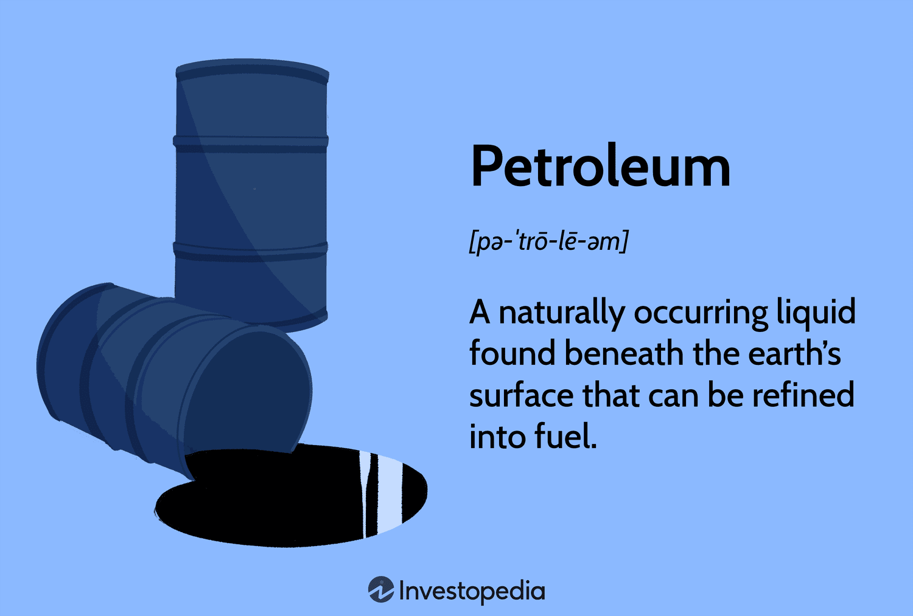

The landscape of petroleum oil investment and energy resources is undergoing significant transformations with the adoption of algorithmic trading, a method that is reshaping the financial domain. In this article, we examine the convergence of traditional oil reserves with contemporary algorithmic trading, shedding light on the shifts within industry dynamics. Our goal is to simplify the intricacies of petroleum investments and highlight the function of algorithmic trading in the energy sector.

The importance of oil reserves as foundational assets in global energy supply cannot be overstated, but they are now being managed alongside advanced, automated trading strategies, which offer new opportunities for market transactions. Investors and stakeholders must navigate an environment where oil reserves' strategic significance is in constant interaction with emerging trading technologies. This article offers a thorough guide aimed at understanding both elements, starting from the vital role of oil reserves, moving to the impact of automated trading strategies on market operations.

Furthermore, we address the regulatory frameworks that oversee these practices. Bodies such as the European Union have implemented stringent measures, seen in directives like MiFID II, to ensure transparency and mitigate risks associated with automated trading. By exploring these regulations, we provide a clearer picture of the operational landscape within which investors and companies operate.

Finally, we anticipate future trends that are likely to affect both oil and trading sectors. Technological advancements and increasingly complex market dynamics suggest a future where seamless integration of traditional resource management with innovative trading strategies is indispensable for maintaining competitiveness in the global energy market. This article serves as a guide for those immersed in or entering this evolving sector.

## Table of Contents

## Understanding Petroleum and Oil Reserves

Petroleum, commonly known as crude oil, is a vital energy resource formed from ancient organic materials over millions of years. This complex mixture of hydrocarbons and other organic compounds drives the global economy and supplies a significant portion of the world's energy needs. 

Oil reserves are crucial indicators of economic stability and geopolitical power. Countries with substantial reserves often wield considerable influence in global affairs. Venezuela, for example, possesses the largest proven oil reserves globally, estimated at around 303 billion barrels. Saudi Arabia and Canada follow, with reserves of approximately 267 billion and 170 billion barrels, respectively. These reserves play a pivotal role in shaping their economic and foreign policies.

Reserves are typically categorized into three types based on the probability of recovery: proven, probable, and possible. Proven reserves have a 90% confidence level of being recoverable under existing economic and operational conditions. Probable reserves have a 50% likelihood, while possible reserves are considered to have a 10% chance of being extracted. This classification aids investors and policymakers in assessing the economic viability of oil resources.

Strategic Petroleum Reserves (SPRs) serve as national safeguards against potential supply disruptions, offering market stability during crises. For instance, the United States maintains an SPR with a capacity of around 727 million barrels, stored in underground salt caverns, to cushion the impact of unforeseen supply shortages.

Accurate estimation of oil reserves is a complex process requiring advanced geological assessments. It involves seismic surveys, drilling exploratory wells, and integrating data from various geophysical and geological studies. Technological advances in extraction techniques, such as enhanced oil recovery (EOR) methods, have improved reserve estimation accuracy and increased the recoverable quantities of oil from known fields. These methods include thermal recovery, gas injection, and chemical flooding, each enhancing oil recovery by altering the physical or chemical properties of the reservoir fluid or the surrounding rock.

In summary, petroleum and oil reserves remain critical to understanding global economic dynamics. The classification and management of these reserves are integral to ensuring a stable energy supply and fostering geopolitical stability.

## Algorithmic Trading in the Energy Sector

Algorithmic trading, often abbreviated as algo trading, refers to the use of sophisticated algorithms to automate trading decisions in financial markets. In the energy sector, where market dynamics are inherently volatile and data-driven, the application of algo trading has become progressively more prevalent. This method leverages advanced computational techniques to process extensive datasets rapidly and execute trades based on predefined parameters, making it well-suited to the fast-paced nature of energy markets.

There are several types of algorithms employed in this context, each serving a distinct function. Execution algorithms are designed to efficiently manage order placement by breaking down large orders into smaller ones to minimize market impact. For instance, the Volume Weighted Average Price (VWAP) algorithm aims to execute an order close to the average price of the stock over a specified time period, enhancing the execution quality.

Signal generation algorithms analyze historical and real-time market data to generate trading signals based on statistical and mathematical models. These algorithms help identify profitable trading opportunities by distinguishing significant market patterns from noise. One common technique is the Moving Average Crossover strategy, where a buy signal is generated when a short-term moving average crosses above a long-term moving average, and a sell signal is generated in the opposite scenario.

Trading algorithms combine elements of execution and signal generation to make holistic trading decisions. These algorithms are capable of adjusting to market trends and price fluctuations by integrating market sentiment analysis, economic indicators, and other predictive data sources. They are crucial for traders looking to capitalize on short-term opportunities and mitigate risks associated with sudden market shifts.

Real-time data analysis is a critical component of [algorithmic trading](/wiki/algorithmic-trading), particularly in the energy sector, where price changes can be rapid and unpredictable. By continuously monitoring market conditions and executing trades at optimal times, these algorithms enhance decision-making processes and increase the agility of trading operations. This capability is especially valuable in markets affected by geopolitical tensions, natural disasters, and other factors impacting supply and demand.

The shifting energy landscape, characterized by a transition from fossil fuels to renewable energy sources and distributed energy generation, presents new complexities and challenges. Sophisticated trading strategies are essential for navigating this evolving market environment. Algorithms need to account for increased variability in energy supply, regulatory changes, and technological advancements to maintain effective operations. The integration of [machine learning](/wiki/machine-learning) models, which can adapt and learn from new data, holds promise for improving the predictive accuracy and efficiency of trading algorithms as the energy landscape continues to evolve.

## Impacts and Trends of Algo Trading in Energy Markets

Algorithmic trading, often cast as a transformative force in financial markets, has also established a profound impact on energy markets by facilitating rapid and informed trading decisions under volatile conditions. This approach, characterized by the use of complex algorithms to execute trading orders, enables market participants to swiftly analyze data and respond to market signals, thereby creating competitive advantages in fast-paced trading environments.

One of the primary advantages of algorithmic trading in energy markets is its capacity to process vast amounts of data more efficiently than human traders, thus allowing for a more precise analysis of price trends, market demand, and supply changes. For instance, algorithms can identify patterns in historical pricing data and predict future price movements through machine learning and statistical models. Typical algorithms employed include execution algorithms, which optimize the timing and size of trades to minimize market impact, and signal-generating algorithms, which identify potential trading opportunities based on statistical or technical indicators.

However, the benefits of algorithmic trading do not come without challenges. The very speed and automation that confer advantages also pose risks, such as potential market manipulation. High-frequency trading, a subset of algorithmic trading, can sometimes lead to market anomalies or "flash crashes," where rapid trading exacerbates [volatility](/wiki/volatility-trading-strategies). Additionally, the reliance on complex algorithms necessitates robust risk management protocols to manage these potential pitfalls. Rigorous testing and validation processes are essential to ensure the integrity and stability of trading systems.

To address these risks, regulatory bodies, particularly in the European Union, have established frameworks designed to control and oversee algorithmic trading activities. The Markets in Financial Instruments Directive II (MiFID II) introduced in the EU, imposes stringent rules on automated trading to enhance market transparency and reduce systemic risks. These regulations require firms to maintain detailed records of their algorithmic trading strategies, ensure adequate systems testing, and implement mechanisms to prevent market abuse.

Moreover, the integration of [artificial intelligence](/wiki/ai-artificial-intelligence) (AI) into trading algorithms presents both opportunities and challenges. AI enhances the capability of trading systems to learn from new data and adapt to unforeseen market conditions, thereby improving trade execution and risk assessment. However, as AI systems become more autonomous and complex, they raise concerns regarding ethical considerations and the potential for unforeseen operational risks. Hence, careful oversight and regulatory scrutiny are necessary to ensure that AI-driven trading adheres to industry standards and does not compromise market integrity.

In conclusion, the impact of algorithmic trading in energy markets underscores a significant shift in how market participants interact with and adapt to complex economic landscapes. Through a combination of advanced technology, stringent regulation, and effective risk management, algorithmic trading continues to transform the energy sector, making it more dynamic and responsive to the ever-changing market environment.

## Conclusion

The energy sector is undergoing significant transformation as oil reserves management and algorithmic trading develop in tandem. Traditional oil reserves continue to play a crucial role in the global energy supply. They are vital assets that impact economic stability and geopolitical strategies worldwide. However, the energy markets are becoming increasingly complex, and the integration of algorithmic trading presents sophisticated tools for navigating these markets. Algorithmic trading enhances the speed and precision of trading operations, allowing for quick adaptation to market dynamics, thus providing a competitive edge.

The ongoing advancements in technology are pivotal for maintaining an efficient and compliant energy sector. With the rapid progression of AI and machine learning technologies, the capabilities of algorithmic trading systems are expanding, offering more precise predictive analytics and better risk management. These technologies are essential for handling the volatility and unpredictability inherent in energy markets.

Regulatory measures also play a critical role in this evolving landscape. They ensure that as new technologies are adopted, there is a framework in place to mitigate potential risks associated with market manipulation and operational errors. Regulations such as the EU's Markets in Financial Instruments Directive II (MiFID II) exemplify such efforts to maintain integrity and stability in trading practices while accommodating innovation.

The future of the energy market's success will depend on the ability to strike a balance between managing traditional resources and implementing inventive trading strategies. This balance is essential for adapting to the challenges posed by the transition towards renewable energy sources and distributed energy generation. The combination of traditional oil reserve management and modern algorithmic trading underscores a path forward for maintaining competitiveness. As the energy landscape grows more intricate, the fusion of these practices will be indispensable for stakeholders aiming to navigate and succeed in the future energy market.

## References & Further Reading

[1]: Geman, H. (2005). *Commodities and Commodity Derivatives: Modeling and Pricing for Agriculturals, Metals and Energy*. Wiley Finance.

[2]: Lopez de Prado, M. (2018). *Advances in Financial Machine Learning*. Wiley.

[3]: Anonymous. (2021). ["Machine Learning in the Oil and Gas Industry: Including Geoscience, Reservoir Engineering, and Production Engineering with Python"](https://www.weforum.org/stories/2016/01/the-fourth-industrial-revolution-what-it-means-and-how-to-respond/).

[4]: Golez, B. & Kumm, J. (2012). ["Big Data in Natural Resource Management"](https://www.sciencedirect.com/science/article/pii/S0301420723009613). Economic and Financial Modelling.

[5]: European Securities and Markets Authority (ESMA). (2017). [MiFID II: Regulatory Technical and Implementing Standards](https://www.esma.europa.eu/publications-and-data/interactive-single-rulebook/mifid-ii).