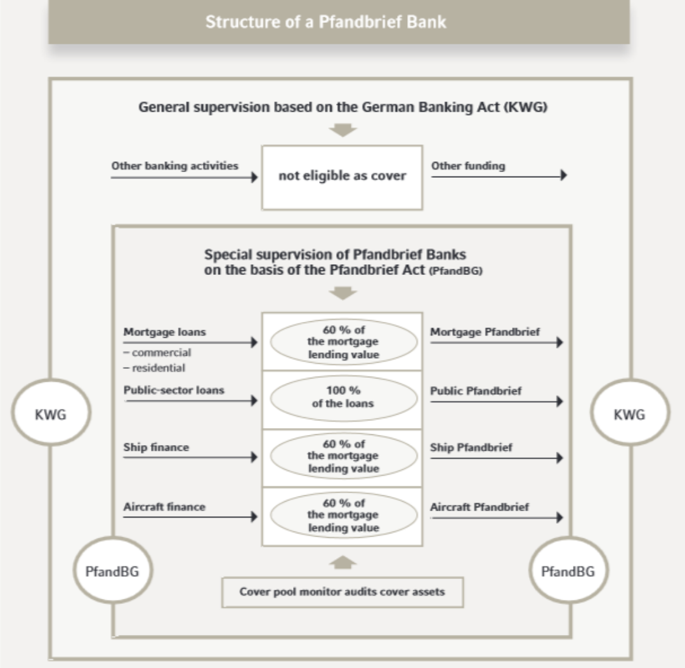

## Table of Contents

## What are Pfandbriefe?

Pfandbriefe are a type of bond that comes from Germany. They are used to help banks borrow money. Banks use the money they get from selling Pfandbriefe to give out loans, especially for real estate and public projects. The special thing about Pfandbriefe is that they are very safe. This is because they are backed by the loans the bank gives out. If the bank can't pay back the Pfandbriefe, the people who own them can take the loans as payment instead.

People like to buy Pfandbriefe because they are safe and give a good return. They are popular not just in Germany but also in other countries. Investors feel secure because the German government has strict rules about how Pfandbriefe can be made and managed. This makes sure that the bonds stay safe and reliable. So, Pfandbriefe are a good choice for people who want to invest their money without taking big risks.

## What is the history behind Pfandbriefe?

Pfandbriefe started a long time ago in Germany, back in the 1700s. They were created to help people buy land and build homes. The first Pfandbriefe were made by a man named Frederick the Great. He wanted to help farmers and others who needed money to buy property. So, he set up a system where banks could borrow money by selling these special bonds. This helped a lot of people get the money they needed.

Over time, Pfandbriefe became very popular and were used for more than just buying land. They started being used to fund big projects like building roads and schools. The German government made strict rules to make sure Pfandbriefe stayed safe for people to invest in. Today, Pfandbriefe are still used in Germany and other countries. They are known for being a safe way to invest money because they are backed by real loans and property.

## How do Pfandbriefe function as financial instruments?

Pfandbriefe work like special loans that banks can get by selling these bonds to investors. When a bank wants to give out loans for things like houses or public projects, it can sell Pfandbriefe to get the money it needs. The money from the Pfandbriefe is then used to make those loans. The people who buy Pfandbriefe are lending money to the bank, and in return, the bank promises to pay them back with interest over time.

What makes Pfandbriefe safe is that they are backed by the loans the bank makes. If the bank can't pay back the Pfandbriefe, the investors can take the loans instead. This means that even if the bank has problems, the investors still have a way to get their money back. This makes Pfandbriefe a very safe investment, which is why a lot of people and institutions like to buy them.

## What types of Pfandbriefe exist?

There are two main types of Pfandbriefe: Mortgage Pfandbriefe and Public Pfandbriefe. Mortgage Pfandbriefe are used to help people buy homes or other buildings. When a bank sells these Pfandbriefe, it uses the money to give out loans for real estate. The loans for the homes or buildings are what back the Pfandbriefe, making them safe for investors.

Public Pfandbriefe are a bit different. They are used to help fund big projects that the government or public organizations need money for, like building roads or schools. When a bank sells Public Pfandbriefe, it uses the money to give loans to these public projects. Just like with Mortgage Pfandbriefe, the loans for the public projects back the Pfandbriefe, making them a safe investment too.

## Who can issue Pfandbriefe?

Only special banks in Germany can issue Pfandbriefe. These banks are called Pfandbrief banks. They have to follow strict rules set by the German government to make sure the Pfandbriefe are safe for people to invest in.

Pfandbrief banks use the money they get from selling Pfandbriefe to give out loans. These loans can be for buying homes or for big public projects like building roads or schools. The loans back the Pfandbriefe, which makes them a safe investment for people who buy them.

## What are the legal requirements for issuing Pfandbriefe?

To issue Pfandbriefe, banks in Germany must follow strict rules set by the government. These rules are in a law called the Pfandbrief Act. The law says that only special banks, called Pfandbrief banks, can issue Pfandbriefe. These banks have to be very careful with the money they get from selling Pfandbriefe. They must use it to give out loans for things like buying homes or building public projects. The loans they give out are what back the Pfandbriefe, making them safe for people to invest in.

The Pfandbrief Act also has rules to make sure the Pfandbriefe stay safe. For example, the banks have to keep a special account with enough money to pay back the Pfandbriefe if something goes wrong. They also have to report regularly to the government about how they are using the money from the Pfandbriefe. This helps make sure that the Pfandbriefe are always backed by good loans and that investors can trust them.

## How are Pfandbriefe secured?

Pfandbriefe are secured by the loans that banks give out. When a bank sells Pfandbriefe, it uses the money to make loans for things like buying homes or building public projects. These loans are what back the Pfandbriefe. If the bank can't pay back the Pfandbriefe, the people who own them can take the loans instead. This makes Pfandbriefe very safe because the loans are like a backup plan for the investors.

The German government has strict rules to make sure Pfandbriefe stay safe. Banks have to keep a special account with enough money to pay back the Pfandbriefe if something goes wrong. They also have to report regularly to the government about how they are using the money from the Pfandbriefe. This helps make sure that the Pfandbriefe are always backed by good loans and that investors can trust them.

## What are the benefits of investing in Pfandbriefe?

Investing in Pfandbriefe can be a good choice because they are very safe. They are backed by real loans, like loans for homes or public projects. If the bank can't pay back the Pfandbriefe, the people who own them can take the loans instead. This makes Pfandbriefe a lot safer than many other investments. The German government also has strict rules to make sure Pfandbriefe stay safe, so investors can trust them.

Another benefit is that Pfandbriefe give a good return on investment. They pay interest regularly, which means investors get money back over time. This makes them a good choice for people who want to earn money without taking big risks. Because Pfandbriefe are so safe and reliable, a lot of people and big organizations like to invest in them.

## What are the risks associated with Pfandbriefe?

Even though Pfandbriefe are very safe, there are still some risks. One risk is that the loans that back the Pfandbriefe might not be paid back. If people can't pay their home loans or if public projects don't go as planned, it can cause problems for the Pfandbriefe. But the German government has strict rules to help make sure this doesn't happen often.

Another risk is that the interest rates might change. If interest rates go up, the value of Pfandbriefe can go down. This means that if you want to sell your Pfandbriefe before they are paid back, you might get less money than you expected. But because Pfandbriefe are so safe, this risk is usually not very big.

## How do Pfandbriefe compare to other fixed-income securities?

Pfandbriefe are a type of fixed-income security that are very safe because they are backed by real loans, like home loans or loans for public projects. Compared to other fixed-income securities, like government bonds or corporate bonds, Pfandbriefe are often seen as safer. This is because they have a special backup plan: if the bank can't pay back the Pfandbriefe, the people who own them can take the loans instead. Government bonds are also very safe, but they don't have this extra layer of protection. Corporate bonds can be riskier because they depend on how well the company is doing.

Another way Pfandbriefe are different is that they usually give a good return on investment. They pay interest regularly, which is similar to other fixed-income securities. But because Pfandbriefe are so safe, the interest rate might be a bit lower than what you could get from riskier corporate bonds. On the other hand, they often offer a better return than very safe government bonds. So, Pfandbriefe can be a good middle ground for people who want safety but also want to earn some money.

Overall, Pfandbriefe are a good choice for people who want a safe investment with a good return. They are safer than most corporate bonds and can offer a better return than government bonds. But like all investments, there are some risks, like changes in interest rates or problems with the loans that back the Pfandbriefe. Still, because of the strict rules in Germany, these risks are usually small.

## What role do Pfandbriefe play in the European financial market?

Pfandbriefe are very important in the European financial market. They are special bonds from Germany that help banks get money to give out loans for things like buying homes or building public projects. Because Pfandbriefe are so safe, a lot of people and big organizations in Europe like to invest in them. This makes them a big part of the European financial market. Banks in Germany use Pfandbriefe to get money, and then they can help more people and projects in Europe.

Pfandbriefe also help keep the European financial market stable. They are seen as very safe investments because they are backed by real loans. This means that even if something goes wrong with the bank, the people who own Pfandbriefe can still get their money back. Because of this, Pfandbriefe are trusted by investors all over Europe. They help make sure that money keeps moving around in the European economy, which is good for everyone.

## What recent regulatory changes have affected Pfandbriefe?

Recently, the European Union made some changes to the rules about Pfandbriefe. These changes are part of a bigger set of rules called the Capital Requirements Regulation (CRR) and the Bank Recovery and Resolution Directive (BRRD). The new rules want to make sure that Pfandbriefe stay safe and that banks can still use them to get money. One big change is that banks have to keep more money in a special account to make sure they can pay back the Pfandbriefe if something goes wrong. This makes Pfandbriefe even safer for people to invest in.

Another change is about how banks report information about Pfandbriefe. Now, they have to give more details about the loans that back the Pfandbriefe. This helps investors know more about what they are investing in and makes the market more open. These changes are meant to keep Pfandbriefe strong and trusted in the European financial market. Even with these new rules, Pfandbriefe are still a safe and good choice for people who want to invest their money.

## References & Further Reading

[1]: ["The Pfandbrief Market in Germany: Modernization and Traditions"](https://www.economist.com/finance-and-economics/2019/08/29/the-pfandbrief-a-fixture-of-german-finance-turns-250) by the International Monetary Fund (IMF)

[2]: ["Algorithmic Trading: Winning Strategies and Their Rationale"](https://www.wiley.com/en-us/Algorithmic+Trading%3A+Winning+Strategies+and+Their+Rationale-p-9781118746912) by Ernie Chan

[3]: ["Advances in Financial Machine Learning"](https://www.amazon.com/Advances-Financial-Machine-Learning-Marcos/dp/1119482089) by Marcos Lopez de Prado

[4]: ["The European Covered Bond Market"](https://www.nordeaassetmanagement.com/insights/how-to-capture-opportunities-in-the-european-covered-bond-market/) by European Central Bank

[5]: ["Understanding the German Covered Bond Market: The Role of Pfandbriefe"](https://fastercapital.com/content/Pfandbriefe--Pfandbriefe--The-German-Ancestor-of-Modern-Covered-Bonds.html) by Deutsche Bank Research