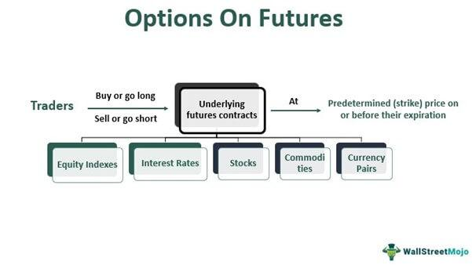

## Table of Contents

## What is PFG Futures?

PFG Futures, also known as Peregrine Financial Group, was a futures brokerage firm based in the United States. It was founded by Russell Wasendorf Sr. in 1969 and operated for over 40 years. The company offered services to help people trade futures contracts, which are agreements to buy or sell a commodity or financial instrument at a future date. PFG Futures was a member of the National Futures Association (NFA) and was regulated by the Commodity Futures Trading Commission (CFTC).

In 2012, PFG Futures faced a major scandal when it was discovered that Russell Wasendorf Sr. had been running a Ponzi scheme. He admitted to stealing over $200 million from customer accounts to cover up the firm's financial troubles. This led to the bankruptcy of PFG Futures and the loss of many customers' investments. The incident highlighted the importance of strong regulatory oversight and the need for investors to be cautious about where they place their money.

## How does PFG Futures differ from other futures trading platforms?

PFG Futures, before its downfall, was similar to other futures trading platforms in that it allowed people to trade futures contracts. Futures contracts are agreements to buy or sell something at a future date. Like other platforms, PFG Futures was regulated by the Commodity Futures Trading Commission (CFTC) and was a member of the National Futures Association (NFA). This meant it had to follow certain rules to protect customers and ensure fair trading.

What set PFG Futures apart, unfortunately, was the massive fraud committed by its founder, Russell Wasendorf Sr. He stole over $200 million from customer accounts and used the money to hide the firm's financial problems. This was a Ponzi scheme, where money from new investors is used to pay returns to earlier investors, creating the illusion of a successful business. Most other futures trading platforms do not engage in such illegal activities and are more transparent about their financial health. This scandal led to PFG Futures' bankruptcy and caused many customers to lose their investments.

## What are the basic requirements to start trading on PFG Futures?

Before PFG Futures went bankrupt, anyone who wanted to start trading on their platform needed to open an account. To do this, you would need to provide some personal information and maybe some financial details. You also needed to have enough money to meet the minimum account balance that PFG Futures required. This money would be used as a deposit to cover any potential losses from your trades.

Once your account was set up, you could start trading futures contracts. These are agreements to buy or sell something at a future date. You would use the PFG Futures trading platform to place your orders. It's important to understand that trading futures can be risky, so you should learn about the markets and maybe get some advice before you start.

## Can you explain the fee structure of PFG Futures?

When PFG Futures was still operating, they charged fees for trading futures contracts. These fees were usually a small amount of money that you had to pay every time you made a trade. The exact amount could change depending on what you were trading and how much you were trading. For example, if you were trading a popular commodity like corn, the fee might be different than if you were trading something less common.

Besides the trading fees, PFG Futures might have also charged other fees. These could include fees for keeping your account open, fees for withdrawing money, or fees for using certain services on their platform. It's important to know all the fees before you start trading because they can add up and affect how much money you make or lose.

## What types of futures contracts are available on PFG Futures?

PFG Futures offered a variety of futures contracts that people could trade. These included contracts for commodities like corn, wheat, and soybeans. They also had contracts for energy products like oil and natural gas. If you were interested in metals, you could trade futures for gold, silver, and copper.

In addition to commodities, PFG Futures also provided futures contracts for financial instruments. This meant you could trade futures on stock indices like the S&P 500, interest rates, and currencies. These types of contracts allowed people to bet on the future direction of financial markets, which could be useful for hedging or speculating.

## How does PFG Futures ensure the security of user funds and data?

Before it went bankrupt, PFG Futures tried to keep user funds and data safe. They followed rules set by the Commodity Futures Trading Commission (CFTC) and the National Futures Association (NFA). These rules said that PFG Futures had to keep customer money separate from their own money. This was supposed to make sure that if something went wrong with the company, customer funds would still be safe.

However, the big fraud by Russell Wasendorf Sr. showed that these rules were not enough. He stole over $200 million from customer accounts and used it to hide the company's money problems. This meant that even though PFG Futures was supposed to protect customer funds, they failed because of the illegal actions of their founder.

## What are the trading tools and features offered by PFG Futures?

PFG Futures offered a few tools and features to help people trade futures contracts. They had a trading platform where you could see prices and make trades. This platform showed charts and graphs to help you understand how the markets were moving. You could set up alerts to tell you when prices reached certain levels, which could be useful for deciding when to buy or sell.

Besides the trading platform, PFG Futures also gave access to market news and research. This information could help you learn more about the markets and make better trading decisions. They also had customer support to help if you had questions or problems. However, because of the fraud by Russell Wasendorf Sr., many people lost trust in PFG Futures and its tools.

## How can one manage risk while trading on PFG Futures?

Managing risk while trading on PFG Futures, or any futures platform, is important to protect your money. One way to do this is by using stop-loss orders. A stop-loss order is like a safety net that automatically sells your futures contract if the price drops to a certain level. This can help limit how much money you lose if the market moves against you. Another way to manage risk is by not putting all your money into one trade. Instead, spread your money across different trades. This is called diversification, and it can help reduce the impact if one trade goes bad.

Another important part of managing risk is understanding the markets and doing your research. Before you start trading, learn about the things you want to trade, like corn or oil. Knowing how these markets work can help you make better decisions. Also, keep an eye on the news and events that might affect prices. For example, if there's a big storm that could hurt corn crops, that might make corn prices go up. By staying informed, you can be ready for changes in the market and adjust your trades to manage risk better.

## What educational resources does PFG Futures provide for traders?

PFG Futures used to offer some educational resources to help traders learn more about futures trading. They had articles and guides on their website that explained the basics of futures contracts, how to read market charts, and tips for managing risk. These resources were designed to help both new and experienced traders understand the markets better and make smarter trading decisions.

They also provided access to webinars and seminars. These were like online classes where experts talked about different topics related to futures trading. Traders could learn about new strategies, get updates on market trends, and ask questions to the experts. These educational tools were meant to give traders the knowledge they needed to trade more confidently and successfully on the PFG Futures platform.

## How does PFG Futures comply with regulatory standards?

PFG Futures was supposed to follow rules set by the Commodity Futures Trading Commission (CFTC) and the National Futures Association (NFA). These rules were there to make sure that PFG Futures treated customers fairly and kept their money safe. One big rule was that they had to keep customer money separate from their own money. This was to protect customers if the company ever had money problems.

However, PFG Futures did not follow these rules properly. The founder, Russell Wasendorf Sr., stole over $200 million from customer accounts. He used this money to hide the fact that the company was in financial trouble. This was a big fraud that broke the rules and led to the company going bankrupt. It showed that even though there were rules in place, they were not enough to stop someone from doing something illegal.

## What advanced trading strategies can be implemented on PFG Futures?

PFG Futures allowed traders to use advanced trading strategies like spread trading. This is when you buy one futures contract and sell another at the same time. The idea is to make money from the difference in prices between the two contracts. For example, if you think the price of corn will go up more than wheat, you could buy a corn futures contract and sell a wheat futures contract. This can be a good way to manage risk because if the market goes down, the loss on one contract might be balanced by a gain on the other.

Another strategy that could be used on PFG Futures is options trading. Options give you the right, but not the obligation, to buy or sell a futures contract at a certain price. You can use options to protect your trades from big losses. For example, if you own a futures contract and you're worried the price might go down, you can buy an option that lets you sell the contract at a set price. This way, even if the market falls, you can limit how much money you lose. These strategies require a good understanding of the markets and can be risky, but they can also help you make more money if used correctly.

## How does PFG Futures integrate with other financial services and platforms?

PFG Futures used to work with other financial services and platforms to help traders do more with their money. They had connections with banks so that traders could easily move money in and out of their trading accounts. This made it easier for people to put money into their PFG Futures account to trade and take money out when they wanted to use it for other things. They also worked with other trading platforms and software, which let traders use different tools and see more information to help them make better trading decisions.

However, because of the big fraud by Russell Wasendorf Sr., many people lost trust in PFG Futures. This made it hard for them to keep good relationships with other financial services and platforms. After the fraud was found out, PFG Futures went bankrupt, and they could not keep working with other companies the way they used to. This showed how important it is for a trading platform to be honest and follow the rules to keep good connections with other financial services.

## References & Further Reading

[1]: Bergstra, J., Bardenet, R., Bengio, Y., & Kégl, B. (2011). ["Algorithms for Hyper-Parameter Optimization."](https://papers.nips.cc/paper/4443-algorithms-for-hyper-parameter-optimization) Advances in Neural Information Processing Systems 24.

[2]: ["Advances in Financial Machine Learning"](https://www.amazon.com/Advances-Financial-Machine-Learning-Marcos/dp/1119482089) by Marcos Lopez de Prado

[3]: ["Evidence-Based Technical Analysis: Applying the Scientific Method and Statistical Inference to Trading Signals"](https://www.amazon.com/Evidence-Based-Technical-Analysis-Scientific-Statistical/dp/0470008741) by David Aronson

[4]: ["Machine Learning for Algorithmic Trading"](https://github.com/PacktPublishing/Machine-Learning-for-Algorithmic-Trading-Second-Edition) by Stefan Jansen

[5]: ["Quantitative Trading: How to Build Your Own Algorithmic Trading Business"](https://books.google.com/books/about/Quantitative_Trading.html?id=j70yEAAAQBAJ) by Ernest P. Chan