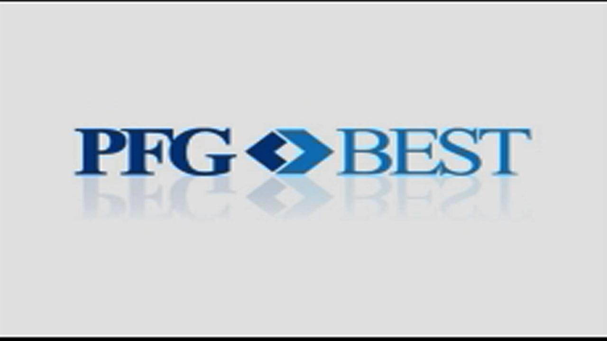

## Table of Contents

## What is PFGBest Financial Services?

PFGBest Financial Services was a financial company that used to help people trade in things like stocks, futures, and forex. It was started by a man named Russell Wasendorf, Sr. in 1990. The company was based in Iowa, USA. It was quite popular among traders because it offered good services and tools to help them make money.

However, in 2012, a big problem was found. It turned out that Russell Wasendorf, Sr. had been lying about how much money the company had. He had been stealing money from customers for many years. This was a huge shock to everyone. Because of this, PFGBest had to close down. Many people lost their money and trust in the company. This event showed how important it is to check and make sure financial companies are honest.

## When was PFGBest Financial Services founded?

PFGBest Financial Services was started in 1990. A man named Russell Wasendorf, Sr. founded it. The company was based in Iowa, in the United States. It helped people trade things like stocks, futures, and forex. Many traders liked using PFGBest because it had good tools and services to help them make money.

But in 2012, people found out that Russell Wasendorf, Sr. had been lying about the company's money. He had been stealing from customers for a long time. This was a big surprise and caused a lot of trouble. Because of this, PFGBest had to shut down. Many people lost their money and no longer trusted the company. This event showed why it's important to make sure financial companies are honest.

## Who are the founders of PFGBest Financial Services?

PFGBest Financial Services was started by Russell Wasendorf, Sr. He founded the company in 1990. The company was based in Iowa, in the United States. It helped people trade things like stocks, futures, and [forex](/wiki/forex-system). Many traders liked using PFGBest because it had good tools and services to help them make money.

But in 2012, people found out that Russell Wasendorf, Sr. had been lying about the company's money. He had been stealing from customers for a long time. This was a big surprise and caused a lot of trouble. Because of this, PFGBest had to shut down. Many people lost their money and no longer trusted the company. This event showed why it's important to make sure financial companies are honest.

## What types of financial services does PFGBest offer?

PFGBest Financial Services used to help people trade different things like stocks, futures, and forex. It was started by Russell Wasendorf, Sr. in 1990. The company was based in Iowa, USA. Traders liked using PFGBest because it had good tools and services to help them make money. They could use the company's platform to buy and sell different financial products easily.

However, in 2012, a big problem was discovered. It turned out that Russell Wasendorf, Sr. had been lying about how much money the company had. He had been stealing money from customers for many years. This was a huge shock to everyone. Because of this, PFGBest had to close down. Many people lost their money and trust in the company. This event showed how important it is to check and make sure financial companies are honest.

## How does PFGBest ensure the security of client funds?

PFGBest Financial Services used to say they had strong ways to keep client money safe. They talked about having good security systems and checks to make sure no one could steal the money. They also said they followed all the rules set by the government to protect client funds. This was supposed to make people feel safe about leaving their money with PFGBest.

But in 2012, it turned out that PFGBest was not honest about how they were keeping client money safe. The founder, Russell Wasendorf, Sr., had been lying and stealing money from customers for many years. He made up fake bank statements to hide what he was doing. This big problem showed that PFGBest did not really have good ways to protect client funds, and it led to the company closing down.

## What are the regulatory bodies that oversee PFGBest Financial Services?

PFGBest Financial Services was supposed to be watched by different groups to make sure they were doing things right. The main group that looked after them was the Commodity Futures Trading Commission (CFTC). This group makes rules for companies that help people trade futures and other things. Another group that was supposed to keep an eye on PFGBest was the National Futures Association (NFA). The NFA checks to make sure companies follow the rules and treat customers fairly.

But in 2012, it turned out that PFGBest was not following the rules. The founder, Russell Wasendorf, Sr., had been lying and stealing money from customers for many years. He made up fake bank statements to hide what he was doing. This big problem showed that the regulatory bodies did not catch what was happening at PFGBest. It made people question how well these groups were doing their job to protect customers.

## Can you explain the PFGBest scandal and its impact on the company?

The PFGBest scandal happened in 2012 when people found out that the founder, Russell Wasendorf, Sr., had been lying and stealing money from customers for many years. He made up fake bank statements to hide what he was doing. This was a big shock because PFGBest was supposed to be a trusted company that helped people trade stocks, futures, and forex. The company said they had good security systems and followed all the rules to keep client money safe, but it turned out they were not honest.

Because of the scandal, PFGBest had to close down. Many people lost their money and no longer trusted the company. This event showed how important it is to check and make sure financial companies are honest. It also made people question how well the groups that are supposed to watch over these companies, like the Commodity Futures Trading Commission (CFTC) and the National Futures Association (NFA), were doing their job to protect customers.

## What measures has PFGBest implemented post-scandal to rebuild trust?

PFGBest Financial Services could not implement any measures to rebuild trust after the scandal because the company had to close down. The scandal in 2012 was so big that it led to the immediate shutdown of the company. Russell Wasendorf, Sr., the founder, had been stealing money from customers for many years, and this made it impossible for PFGBest to continue operating.

After the company closed, the focus shifted to helping the customers who had lost money. The Commodity Futures Trading Commission (CFTC) and the National Futures Association (NFA) worked to investigate what happened and to try to return some of the money to the affected customers. This event showed everyone how important it is to make sure financial companies are honest and to have strong rules to protect people's money.

## How does PFGBest's trading platform work and what are its key features?

PFGBest's trading platform was a tool that helped people buy and sell things like stocks, futures, and forex. It was easy to use and had a lot of features that made trading simpler. People could see real-time prices, use different charts to understand the market better, and set up alerts to know when to buy or sell. The platform also let traders use different kinds of orders, like limit orders and stop orders, to control their trades better.

One of the key features of PFGBest's platform was its ability to let traders practice without using real money. This was called a demo account, and it helped new traders learn how to trade without risking their own money. Another important feature was the customer support. PFGBest had a team that could help traders with any problems or questions they had. This made people feel more comfortable using the platform. However, after the 2012 scandal, the company had to close down, and the platform is no longer available.

## What are the fees associated with using PFGBest's services?

PFGBest charged different fees for using their services. When people traded stocks, futures, or forex, they had to pay a fee for each trade they made. This fee was called a commission, and it depended on how much they were trading and what they were trading. For example, trading futures might have a different fee than trading forex. PFGBest also charged fees for other things like keeping an account open or withdrawing money.

These fees were important for PFGBest to make money and keep their services running. People needed to know about these fees because they could affect how much money they made from trading. The company tried to keep their fees clear so people could understand them, but after the 2012 scandal, it turned out that PFGBest was not honest about other things, which led to the company closing down.

## How does PFGBest compare to other financial service providers in terms of services and reputation?

Before the 2012 scandal, PFGBest was known for offering a wide range of trading services, including stocks, futures, and forex. It had a user-friendly trading platform with features like real-time prices, different charts, and the ability to set up alerts. This made it popular among traders who wanted to buy and sell different financial products easily. PFGBest also offered a demo account for people to practice trading without using real money, which was helpful for beginners. Compared to other financial service providers, PFGBest's fees were clear, and it had good customer support to help traders with any problems or questions.

However, the 2012 scandal changed everything. It was found out that the founder, Russell Wasendorf, Sr., had been stealing money from customers for many years. This led to a huge loss of trust in PFGBest, and the company had to close down. Before the scandal, PFGBest was seen as a reliable choice for trading, but after the scandal, its reputation was destroyed. Other financial service providers, like those that are still operating and have not had such scandals, are now seen as more trustworthy. They continue to offer similar services but with a stronger focus on security and transparency to prevent similar problems from happening.

## What future plans does PFGBest have for expanding its services or improving its offerings?

PFGBest does not have any future plans because the company had to close down after the 2012 scandal. The founder, Russell Wasendorf, Sr., was found to have been stealing money from customers for many years. This made it impossible for PFGBest to keep going. The company's reputation was destroyed, and it could not recover from the damage caused by the scandal.

After PFGBest closed, the focus shifted to helping the customers who had lost money. Groups like the Commodity Futures Trading Commission (CFTC) and the National Futures Association (NFA) worked to investigate what happened and try to return some of the money to the affected customers. This event showed everyone how important it is to make sure financial companies are honest and to have strong rules to protect people's money.

## References & Further Reading

[1]: Herskovitz, J. (2012). [Futures Broker PFGBest Founder Charged With Fraud.](https://www.investmentnews.com/regulation-and-legislation/pfgbests-fraud-went-undetected-in-two-agency-reviews/45733) Reuters.

[2]: Van Voris, B. (2013). [PFGBest's Wasendorf Gets 50-Year Sentence for $215 Million Fraud.](https://www.justice.gov/usao-ndia/pr/peregrine-financial-group-ceo-sentenced-50-years-fraud-embezzlement-and-lying) Bloomberg.

[3]: Lopez de Prado, M. (2018). [Advances in Financial Machine Learning.](https://www.amazon.com/Advances-Financial-Machine-Learning-Marcos/dp/1119482089) Wiley.

[4]: Aronson, D. R. (2007). [Evidence-Based Technical Analysis: Applying the Scientific Method and Statistical Inference to Trading Signals.](https://onlinelibrary.wiley.com/doi/book/10.1002/9781118268315) Wiley.

[5]: Jansen, S. (2020). [Machine Learning for Algorithmic Trading: Predictive models to extract signals from market and alternative data for systematic trading strategies with Python.](https://www.amazon.com/Machine-Learning-Algorithmic-Trading-alternative/dp/1839217715) Packt Publishing. 

[6]: Chan, E. P. (2008). [Quantitative Trading: How to Build Your Own Algorithmic Trading Business.](https://github.com/ftvision/quant_trading_echan_book) Wiley.

[7]: Commodity Futures Trading Commission (CFTC). [History of The CFTC.](https://www.cftc.gov/About/HistoryoftheCFTC/history_precftc.html) CFTC.