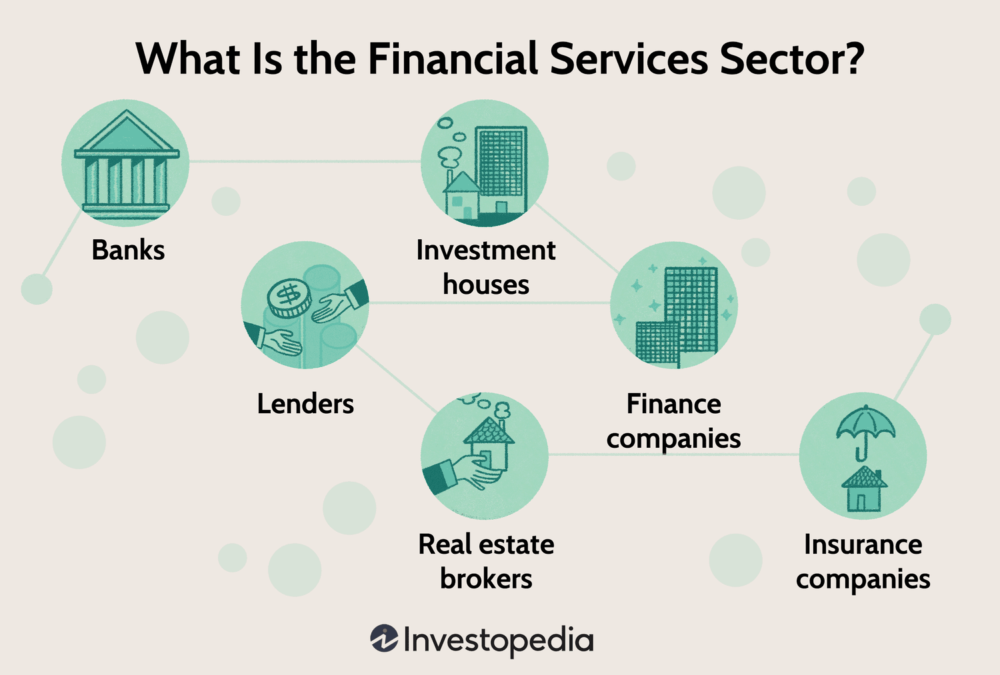

PFGBest, initially established as Peregrine Financial Group, Inc., became a significant entity within the financial services industry, primarily focusing on futures, options, and forex trading. Launched in 1980, the firm quickly rose to prominence due to its pioneering algorithmic trading solutions and a comprehensive portfolio of financial service products. Throughout its operational years, PFGBest was regarded as a formidable brokerage firm with advanced technological strategies that catered to both retail traders and large institutional investors. Algorithmic trading particularly stood out as a core component of PFGBest’s business model, enabling clients to utilize sophisticated trading strategies that enhanced execution speed and market precision.

This article provides a detailed examination of PFGBest's historical trajectory, from its initial establishment to its notable expansion phases, and ultimately to its decline and closure. At various stages of its growth, PFGBest made considerable contributions to the evolution of algorithmic trading, significantly influencing contemporaneous trading strategies and platforms. However, the firm's journey was not without challenges, culminating in one of the most notorious scandals in the financial sector, which led to its eventual downfall. The ensuing discussion sheds light on the impact PFGBest had on the financial industry, notably regarding trust and regulatory protocols. Through an analysis of PFGBest's rise and fall, we gain valuable insights into the essential practices and precautions necessary for maintaining ethical and secure financial operations within brokerage firms.

## Table of Contents

## Company History

PFGBest, originally launched as Peregrine Financial Group, Inc., was founded in 1980 by Russell R. Wasendorf, Sr. in Cedar Falls, Iowa. The firm was conceived with the objective of assisting investors in the commodity and financial markets, marking its entry into the competitive world of financial services. Over the years, PFGBest grew from its humble beginnings into a comprehensive brokerage firm that offered a range of personalized services across futures, options, and forex markets. This transformation reflected PFGBest’s commitment to providing extensive market access and tailored financial solutions to its clientele.

The firm’s expansion was notably accelerated in 2009 through the strategic acquisition of Alaron Trading Corporation. This acquisition significantly bolstered PFGBest’s assets under management, enabling the firm to cater to a broader customer base and enhance its market offerings. By integrating Alaron’s resources, PFGBest was able to expand its geographical presence and market share, paving the way for further growth and development within the financial industry.

PFGBest's achievements were recognized on a national level when it was ranked as the 35th largest broker by the Futures Industry Association in 2007. This accolade reflected its stature and credibility within the brokerage community, highlighting the effectiveness of its services and the trust it had cultivated among clients. As a top broker, PFGBest played a significant role in shaping the competitive landscape of financial services, leveraging its expertise to innovate and lead in both traditional and emerging markets.

## Algorithmic Trading at PFGBest

PFGBest, a prominent institution in financial services, was an early adopter of [algorithmic trading](/wiki/algorithmic-trading) solutions, setting itself apart in the brokerage industry. Central to its innovation was the development of its proprietary trading platform, BEST Direct. This platform was specifically designed for futures and [forex](/wiki/forex-system) trading, allowing customers to execute trades with enhanced speed and precision.

Algorithmic trading, which involves the use of computer algorithms to automatically make trading decisions, played a pivotal role in PFGBest's service offerings. This technology enabled the firm to provide clients with sophisticated trading strategies that were otherwise difficult to achieve manually. The algorithms could identify profitable trading opportunities by analyzing market data at speeds unattainable by human traders. The primary advantages included improved execution speed, accuracy, and the ability to handle multiple trades simultaneously.

The integration of algorithmic trading solutions significantly broadened PFGBest's client base. Retail traders, who often seek platforms that can offer competitive advantages through technology, were drawn to the enhanced trading capabilities. Simultaneously, institutional investors, with their larger trade volumes and demand for efficient execution, found the platform appealing due to its algorithmic precision and sophisticated features.

PFGBest's technological advancements not only differentiated it from competitors but also contributed to shaping the future landscape of trading. By prioritizing technological development and implementation, PFGBest established a model that continues to influence trading platforms in offering algorithm-driven strategies to a diverse spectrum of clients.

## The Scandal and Downfall

In 2012, PFGBest became the center of a massive fraud case that would eventually lead to its closure. Russell R. Wasendorf, Sr., the founder and CEO of PFGBest, was found guilty of falsifying bank records and embezzling over $200 million. His fraudulent scheme, which spanned more than two decades, involved falsifying financial documents to conceal the shortfall in customer funds. This deception managed to evade detection by regulators and auditors, severely compromising the financial integrity of the firm.

The fraud was primarily facilitated by Wasendorf's manipulation of bank statements, which misled investors, customers, and regulatory bodies into believing that PFGBest held more funds than it actually did. The CEO went to great lengths to fabricate supporting documents and forged external bank confirmation letters, often intercepting and altering communication flows between PFGBest and its bank. Such a sophisticated level of deceit allowed Wasendorf to sustain the company's illicit operations for years without raising suspicion.

The revelation of the fraud resulted in PFGBest's collapse, leaving many investors and clients in financial disarray. The scandal highlighted significant vulnerabilities in the regulatory framework governing futures commission merchants and the protection of client funds. In response to the PFGBest scandal, regulatory bodies, including the Commodity Futures Trading Commission (CFTC) and the National Futures Association (NFA), called for more stringent oversight and reforms to enhance the safeguarding of customer funds.

The PFGBest case served as a stark reminder of the essential need for robust regulatory measures and transparent practices in the financial industry to maintain trust and integrity. It led to increased scrutiny over how customer segregated funds should be held and protected, underscoring the importance of regular audits and comprehensive compliance checks to prevent similar fraudulent activities in the future.

## Impact on the Financial Industry

The PFGBest scandal significantly impacted the financial industry by eroding trust in brokerage firms and prompting a comprehensive review of existing regulatory frameworks. The revelation of fraudulent activities at PFGBest, involving the embezzlement of over $200 million, underscored the vulnerabilities in the financial regulatory systems, particularly concerning the handling of customer segregated funds. This breach of trust catalyzed a shift towards more stringent oversight and regulatory reforms.

One of the central responses to the PFGBest scandal was the push for enhanced protection of customer funds. The Commodity Futures Trading Commission (CFTC) and CME Group were among the leading organizations advocating for stricter regulations. Their primary goal was to restructure how customer segregated funds were managed, bolstering the safety and security of these assets. Regulatory bodies emphasized the need for improved audit trails, regular checks, and transparency in reporting the status of customer funds to prevent similar fraud incidents.

The scandal also highlighted a critical need for transparency and adherence to regulatory compliance. Financial service providers were called upon to implement more robust governance and internal control mechanisms. The PFGBest case served as a stark reminder of the repercussions of ethical lapses, reinforcing the industry's commitment to maintaining ethical standards and compliance with regulatory requirements. This led to increased scrutiny of brokerage operations, with regulators and market participants recognizing the importance of ethical practices in maintaining market integrity.

Overall, the PFGBest incident became a catalyst for broader regulatory changes aimed at protecting investors and upholding the integrity of the financial markets. Firms were encouraged to prioritize ethical behavior, transparency, and compliance to regain public trust and ensure the stability and reliability of financial services.

## Conclusion

PFGBest's trajectory, from its establishment as a reputable brokerage to its notorious collapse, serves as a critical lesson for the financial industry. The company initially prided itself on pioneering algorithmic trading, a field that has revolutionized how trading is conducted by allowing the execution of complex trading strategies with speed and precision. This innovation underscored PFGBest’s influence and appeal in the market, attracting both retail and institutional investors who were keen on leveraging these cutting-edge technologies.

However, the firm's involvement in one of the largest fraud incidents in the futures industry history highlights the urgent need for vigilance and regulatory oversight. The embezzlement of over $200 million by the firm's founder, over several decades, sent shockwaves through the financial sector, underscoring the vulnerabilities posed by inadequate oversight and unethical practices. This scandal prompted a reevaluation of protocols concerning client fund safety and fiduciary responsibilities within brokerage operations.

Future brokerages can glean valuable insights from PFGBest's history, particularly the importance of instilling robust ethical standards and adopting stringent measures to protect client funds. Learning from such historical failures is vital in reinforcing the trust and security that clients expect from financial service providers. The emphasis is on fostering transparency and ensuring compliance with regulatory frameworks to safeguard investor interests and preserve market integrity.

Despite its downfall, PFGBest’s early contributions to algorithmic trading continue to resonate within the industry. Its advancements in trading technology still influence contemporary trading methodologies and platforms, providing a foundation for future innovations. As the financial industry evolves, the case of PFGBest remains a poignant reminder of the balance between innovation and ethics.

## References & Further Reading

[1]: Herskovitz, J. (2012). [Futures Broker PFGBest Founder Charged With Fraud.](https://www.investmentnews.com/regulation-and-legislation/pfgbests-fraud-went-undetected-in-two-agency-reviews/45733) Reuters.

[2]: Van Voris, B. (2013). [PFGBest's Wasendorf Gets 50-Year Sentence for $215 Million Fraud.](https://www.justice.gov/usao-ndia/pr/peregrine-financial-group-ceo-sentenced-50-years-fraud-embezzlement-and-lying) Bloomberg.

[3]: Lopez de Prado, M. (2018). [Advances in Financial Machine Learning.](https://www.amazon.com/Advances-Financial-Machine-Learning-Marcos/dp/1119482089) Wiley.

[4]: Aronson, D. R. (2007). [Evidence-Based Technical Analysis: Applying the Scientific Method and Statistical Inference to Trading Signals.](https://onlinelibrary.wiley.com/doi/book/10.1002/9781118268315) Wiley.

[5]: Jansen, S. (2020). [Machine Learning for Algorithmic Trading: Predictive models to extract signals from market and alternative data for systematic trading strategies with Python.](https://www.amazon.com/Machine-Learning-Algorithmic-Trading-alternative/dp/1839217715) Packt Publishing. 

[6]: Chan, E. P. (2008). [Quantitative Trading: How to Build Your Own Algorithmic Trading Business.](https://github.com/ftvision/quant_trading_echan_book) Wiley.

[7]: Commodity Futures Trading Commission (CFTC). [History of The CFTC.](https://www.cftc.gov/About/HistoryoftheCFTC/history_precftc.html) CFTC.