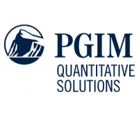

## Table of Contents

## What is PGIM Quant Solutions?

PGIM Quant Solutions is a part of PGIM, which is the investment management business of Prudential Financial. It uses numbers and computer models to make investment decisions. They look at a lot of data to find patterns and make smart choices about where to invest money. This method is called quantitative investing.

They help manage different kinds of investments like stocks, bonds, and other financial products. Their team uses advanced technology and math to create strategies that aim to give good returns for their clients. By using computers and data, they try to make better and more consistent investment decisions.

## Who founded PGIM Quant Solutions?

PGIM Quant Solutions was founded by Dr. David G. Stein. He started it in 2000. Dr. Stein is a smart person who knows a lot about using numbers and computers to make investment decisions. He wanted to create a place where people could use these skills to help others invest their money wisely.

Before starting PGIM Quant Solutions, Dr. Stein worked at other big companies. He used his experience to build a team of experts who are good at math and technology. Together, they work to find the best ways to invest money using data and computer models. Their goal is to help people grow their money safely and smartly.

## What are the main services offered by PGIM Quant Solutions?

PGIM Quant Solutions offers services that help people invest their money using numbers and computers. They use a lot of data to find patterns and make smart choices about where to put money. This is called quantitative investing. They manage different types of investments like stocks, bonds, and other financial products. Their team uses advanced technology and math to create strategies that aim to give good returns for their clients.

They also offer custom solutions for big investors. This means they can create special investment plans just for one client, based on what that client needs and wants. They use their skills in data analysis and computer models to make these plans work well. Their goal is to help people grow their money safely and smartly by using the power of numbers and technology.

## How does PGIM Quant Solutions use quantitative analysis in its operations?

PGIM Quant Solutions uses quantitative analysis to make smart investment choices. They look at a lot of numbers and data to find patterns and trends. By using computers and math, they can see which investments might do well in the future. This helps them decide where to put money for their clients. They use special computer programs and models to do this work quickly and accurately.

Their team is made up of people who are good at math and technology. They use these skills to create strategies that aim to give good returns for their clients. By looking at lots of data, they can find opportunities that others might miss. This way, they can make better and more consistent investment decisions. Their goal is to help people grow their money safely and smartly using the power of numbers and technology.

## What types of clients does PGIM Quant Solutions typically serve?

PGIM Quant Solutions typically serves big investors like pension funds, insurance companies, and other big organizations that manage a lot of money. These clients need help to grow their money safely and smartly. PGIM Quant Solutions uses numbers and computers to find the best ways to invest their money.

They also work with other investment firms that want to use their special skills in data analysis and computer models. These firms might not have their own team of experts in quantitative investing, so they come to PGIM Quant Solutions for help. By working together, they can make better investment choices and help their clients' money grow.

## Can you explain the investment philosophy of PGIM Quant Solutions?

PGIM Quant Solutions believes in using numbers and computers to make smart investment choices. They think that by looking at a lot of data, they can find patterns and trends that help them decide where to put money. This way, they can make better and more consistent decisions than just guessing or following what everyone else is doing. Their goal is to help their clients grow their money safely and smartly by using the power of technology and math.

They focus on using advanced computer models and data analysis to create investment strategies. These strategies are designed to give good returns for their clients, who are often big organizations like pension funds and insurance companies. By using quantitative analysis, PGIM Quant Solutions aims to find opportunities that others might miss, helping their clients' money grow over time.

## What are some of the key products developed by PGIM Quant Solutions?

PGIM Quant Solutions has developed several key products to help their clients invest their money wisely. One of their main products is called the Quantitative Equity Strategies. This product uses numbers and computers to find the best stocks to invest in. They look at a lot of data to see which companies might do well in the future. This helps them pick stocks that can grow their clients' money over time.

Another important product they offer is the Multi-Asset Solutions. This product helps clients invest in different types of investments like stocks, bonds, and other financial products all at once. By spreading the money across different investments, they can lower the risk and still aim for good returns. PGIM Quant Solutions uses their skills in data analysis and computer models to make these multi-asset strategies work well for their clients.

## How does PGIM Quant Solutions integrate ESG (Environmental, Social, and Governance) factors into its investment strategies?

PGIM Quant Solutions cares about the environment, how people are treated, and how companies are run. They call these things ESG factors, which stands for Environmental, Social, and Governance. They use numbers and computers to look at these factors when they decide where to invest money. By doing this, they can pick companies that are good for the planet and society, and also well-managed. This helps them make smart choices that can grow their clients' money while also doing good things for the world.

They use special computer programs to measure how well companies are doing with ESG. These programs look at a lot of data to see if a company is helping the environment, treating people well, and being run in a good way. If a company does well in these areas, PGIM Quant Solutions might decide to invest in it. This way, they can help their clients' money grow and also support companies that are making the world a better place.

## What is the performance history of PGIM Quant Solutions' flagship funds?

PGIM Quant Solutions has some main funds that they manage, and these funds have done well over time. One of their big funds is the Quantitative Equity Strategies fund. This fund has had good returns for its clients. It looks at a lot of data to pick the best stocks to invest in. Over the years, this fund has beaten the market a lot of times, which means it has done better than just following what everyone else is doing. This has helped their clients' money grow.

Another important fund they manage is the Multi-Asset Solutions fund. This fund invests in different types of things like stocks, bonds, and other financial products. By spreading the money around, it tries to lower the risk while still aiming for good returns. This fund has also done well, giving steady growth to its clients. Both of these funds show that PGIM Quant Solutions can use numbers and computers to make smart investment choices that help their clients' money grow over time.

## How does PGIM Quant Solutions approach risk management?

PGIM Quant Solutions takes risk management very seriously. They use numbers and computers to look at all the possible risks that could affect their investments. By studying a lot of data, they can see what might go wrong and plan ways to avoid big losses. They use special computer models to figure out how much risk they are taking and make sure it fits with what their clients want. This helps them keep their clients' money safe while still trying to grow it.

They also spread out the investments across different types of things like stocks, bonds, and other financial products. This is called diversification, and it helps lower the risk. If one investment does badly, the others might do well and balance it out. PGIM Quant Solutions keeps a close eye on all their investments and makes changes when needed to manage risk. Their goal is to find the right balance between growing their clients' money and keeping it safe.

## What technological tools and platforms does PGIM Quant Solutions use to enhance its quantitative strategies?

PGIM Quant Solutions uses a lot of smart technology to make their investment choices better. They have special computer programs that can look at huge amounts of data quickly. These programs help them find patterns and trends that they might miss if they were just looking at numbers by hand. They also use big computers that can do a lot of math very fast. This helps them test different investment ideas to see which ones might work best.

They also have their own platforms that they made just for them. These platforms help them keep track of all their investments and make changes when they need to. They use these tools to make sure their strategies are working well and to adjust them if something changes in the market. By using all this technology, PGIM Quant Solutions can make smarter and more consistent investment choices for their clients.

## What are the future trends and innovations PGIM Quant Solutions is focusing on in the field of quantitative investing?

PGIM Quant Solutions is always looking for new ways to make their investment strategies even better. One big trend they are focusing on is using artificial intelligence (AI) and machine learning. These technologies can look at huge amounts of data and find patterns that humans might miss. By using AI, PGIM Quant Solutions can make their computer models smarter and more accurate. This helps them pick investments that have a better chance of doing well in the future. They are also working on making their systems faster and more powerful so they can handle even more data and make quicker decisions.

Another area they are excited about is using more real-time data. This means they can see what is happening in the market right now and make changes to their investments very quickly. By using real-time data, PGIM Quant Solutions can react to new information faster than before. This can help them take advantage of new opportunities and avoid risks. They are also looking at ways to make their strategies more personalized for each client. By understanding what each client needs and wants, they can create special investment plans that fit just right.

## References & Further Reading

[1]: ["Algorithmic Trading and DMA: An Introduction to Direct Access Trading Strategies"](https://www.amazon.com/Algorithmic-Trading-DMA-introduction-strategies/dp/0956399207) by Barry Johnson

[2]: ["Machine Learning for Asset Managers"](https://www.cambridge.org/core/elements/machine-learning-for-asset-managers/6D9211305EA2E425D33A9F38D0AE3545) by Marcos Lopez de Prado

[3]: De Prado, M. L. (2018). ["Advances in Financial Machine Learning."](https://www.amazon.com/Advances-Financial-Machine-Learning-Marcos/dp/1119482089) Wiley.

[4]: Jaiswal, A. (2020). ["Hands-On Machine Learning for Algorithmic Trading."](https://github.com/PacktPublishing/Hands-On-Machine-Learning-for-Algorithmic-Trading) Packt Publishing.

[5]: Narang, R. K. (2009). ["Inside the Black Box: A Simple Guide to Quantitative and High-Frequency Trading."](https://onlinelibrary.wiley.com/doi/book/10.1002/9781118267738) Wiley.

[6]: Chan, E. P. (2009). ["Quantitative Trading: How to Build Your Own Algorithmic Trading Business."](https://github.com/ftvision/quant_trading_echan_book) Wiley.

[7]: Pardo, R. (2011). ["The Evaluation and Optimization of Trading Strategies."](https://onlinelibrary.wiley.com/doi/book/10.1002/9781119196969) Wiley.

[8]: ["2011 Flash Crash Analysis Report"](http://www.nanex.net/FlashCrashFinal/FlashCrashSummary.html) by U.S. Securities and Exchange Commission (SEC).

[9]: Aldridge, I. (2013). ["High-Frequency Trading: A Practical Guide to Algorithmic Strategies and Trading Systems."](https://www.amazon.com/High-Frequency-Trading-Practical-Algorithmic-Strategies/dp/1118343506) Wiley.