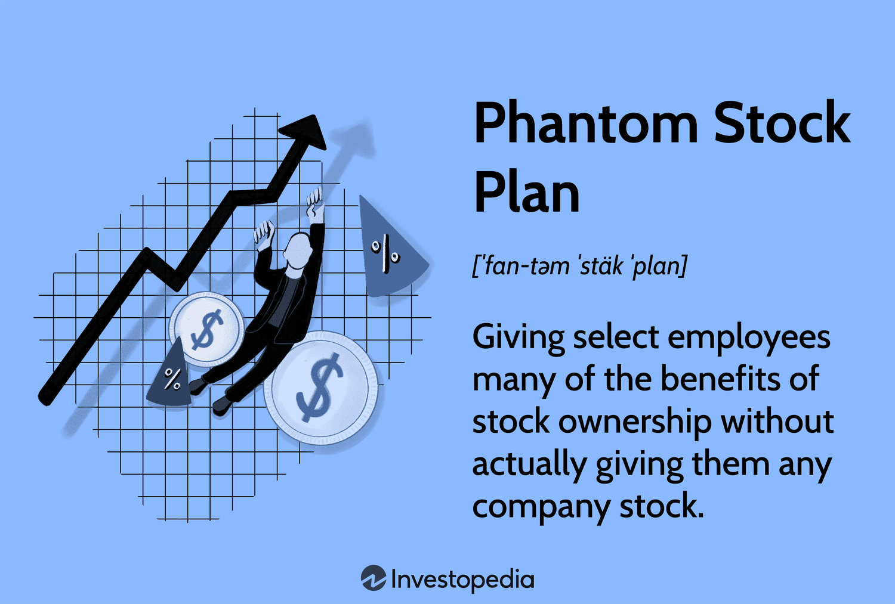

Employee compensation is undergoing a significant transformation as businesses strive to attract and retain top talent in an increasingly competitive marketplace. In this evolving landscape, phantom stock plans and algorithmic trading have emerged as pivotal components shaping modern employment strategies. While phantom stock plans offer employees economic benefits similar to stock ownership without actual equity transfer, algorithmic trading influences market conditions, potentially impacting the valuation of these plans.

The intersection of phantom stock plans and algo trading presents new opportunities for organizations to structure more effective and innovative compensation schemes. Understanding these concepts is essential for businesses aiming to align employee incentives with company performance and market dynamics. By exploring definitions, advantages, and practical examples, this article aims to shed light on how phantom stock plans can effectively integrate with algorithmic trading methodologies to maximize employee satisfaction and drive organizational success. Such an approach offers a tech-driven outlook for companies seeking to remain competitive in talent management, ultimately fostering an environment where both employers and employees can thrive.



## Table of Contents

## Understanding Phantom Stock Plans

Phantom stock plans serve as a strategic tool for companies aiming to provide employees with benefits akin to stock ownership without transferring actual equity. Typically utilized for senior managers or executives, these plans are crafted to replicate the economic advantages of owning company stock, hence fostering a sense of investment in the company's success.

The structure of phantom stock plans can be classified into two primary types: appreciation-only plans and full-value plans. Appreciation-only plans focus on the gains in stock value over a set period, offering employees a cash payout equivalent to the increase in stock price. Full-value plans, on the other hand, attribute both the initial stock value and any appreciation over time to the recipient, usually resulting in more substantial potential compensation.

These benefits often manifest as cash payouts linked directly to the company's stock performance. This design offers several advantages, notably aligning the recipient's interests with the company's growth trajectory while preserving the existing equity structure, thus avoiding shareholder dilution. 

Phantom stock is often viewed as a form of deferred compensation. It presents complexities, particularly concerning tax implications, as payouts are generally taxed as ordinary income when realized. This necessitates a thorough understanding of relevant tax regulations, which may vary by jurisdiction, and underscores the importance of strategic tax planning in the structuring of such plans. 

Overall, phantom stock plans provide a nuanced mechanism to incentivize key personnel, balancing the benefits of stock ownership with the need to maintain current ownership structures.

## Advantages and Disadvantages of Phantom Stock

Phantom stock plans, as a form of deferred compensation, offer several advantages and disadvantages that make them a compelling choice for certain organizational scenarios. Understanding these attributes is crucial for companies considering their implementation.

**Advantages:**

1. **Alignment of Interests:** One of the primary advantages of phantom stock plans is the alignment of employee interests with company success. By tying the benefits of phantom stock to the company's stock value, employees are incentivized to work towards enhancing the overall performance and profitability of the company. This alignment ensures that employees are motivated to contribute positively to the company's growth, akin to real shareholders.

2. **Preservation of Equity Structure:** These plans allow companies to reward and retain top talent without altering the current equity structure. Since no actual shares are issued, there is no dilution of ownership among existing shareholders. This aspect is especially appealing to companies that wish to maintain control without sacrificing the ability to provide competitive compensation packages.

3. **Flexibility and Customization:** Phantom stock plans offer significant flexibility in design and implementation. They can be tailored to meet the specific goals and needs of the organization, such as linking payouts to distinct performance targets. This customization potential makes them suitable for fostering long-term retention, as they can be structured to reward employees for both company-wide achievements and individual performance over time.

**Disadvantages:**

1. **Lack of Voting Rights:** Unlike actual stockholders, recipients of phantom stock do not receive voting rights. This lack of governance participation can be seen as a disadvantage by employees who wish to have a say in the strategic direction of the company.

2. **Tax Implications:** The tax treatment of phantom stock payouts is another critical consideration. Payouts from phantom stock plans are generally taxed as ordinary income, which can result in a higher tax burden compared to capital gains tax rates associated with actual stock ownership. This tax treatment can be less favorable to employees, potentially reducing the appeal of these plans compared to equity-based compensation.

3. **Vesting Schedules and Employment Contingency:** Phantom stock awards are commonly subject to vesting schedules, tying the financial benefits to employment longevity. While this promotes retention, it can also be a disadvantage if an employee leaves the company before full vesting, as they might forfeit the unvested portion of their phantom stock. Additionally, the economic benefits are contingent on continued employment, adding a layer of complexity to the employee-employer relationship.

In summary, while phantom stock plans provide organizations with a powerful tool to align employee interests with company objectives and maintain their equity structure, they also present challenges related to taxation, voting rights, and employment conditions. Companies must weigh these factors carefully when considering the adoption of such compensation schemes.

## Algo Trading and Phantom Stock: A Convergence

Algorithmic trading, or algo trading, uses computer algorithms to automate stock trading, which can significantly impact the valuation and management of phantom stocks. The influence of algo trading on stock prices stems from its ability to process large volumes of data quickly, identify patterns, and execute trades much faster and with greater precision than human traders. This capability can affect the real-time valuation of company stocks, thus influencing the perceived value of phantom stock awards given to employees.

Trading innovations brought by algorithmic processes can alter how companies approach phantom stock plans. Advanced algorithms can help predict future stock price movements more accurately, providing companies with insights that can refine their phantom stock payouts. For example, understanding market [volatility](/wiki/volatility-trading-strategies) and likely trends helps companies decide when to schedule payouts or adjust the value of phantom stock agreements. 

Integrating algo trading insights in structuring phantom stock payouts enables companies to develop a more dynamic compensation strategy. This approach involves using historical price data along with predictive analytics to forecast future stock performance. Python libraries such as Pandas and NumPy can be leveraged to conduct these types of financial analyses. For instance, a simple moving average (SMA) could help smooth out stock price data, providing a clearer picture of market trends. Here's a basic illustration with Python code:

```python
import pandas as pd

# Assuming we have stock price data stored in a DataFrame
data = pd.read_csv('stock_prices.csv')
data['SMA_20'] = data['Close'].rolling(window=20).mean()

print(data[['Date', 'Close', 'SMA_20']])
```

This code calculates a simple 20-day moving average to observe trends that might influence phantom stock valuations. By integrating such insights, companies can structure more realistic and competitive compensation plans.

The convergence of algo trading and phantom stock plans presents companies with opportunities to adopt a tech-driven perspective in constructing employee compensation schemes. This convergence allows for more nuanced and responsive adjustments to compensation packages, making them potentially more attractive to employees by basing them on refined predictions of stock performance and market conditions. 

The integration of predictive and algorithmic methodologies can help companies better anticipate market movements and adjust phantom stock valuations promptly, aligning with overall company performance and employee expectations. As trading technologies continue to advance, so will the ability to tailor compensation strategies more effectively, keeping companies at the forefront of competitive employee satisfaction and retention.

## Case Studies and Examples

### Case Studies and Examples

Several companies have effectively implemented phantom stock plans and integrated [algorithmic trading](/wiki/algorithmic-trading) insights to enhance their compensation strategies. These examples provide valuable insights into the versatility and impact of such approaches.

#### Tech Company: Retaining Top Executives

A notable example of leveraging phantom stock plans occurred within a mid-sized tech company facing significant market volatility. The company faced challenges in retaining its top executives due to fluctuations in its stock prices, which affected the perceived value of traditional stock options and equity compensation.

To maintain executive retention, the company introduced a phantom stock plan that allowed executives to receive cash payouts based on the company's stock valuation without diluting actual equity. This approach linked compensation directly to company performance, incentivizing executives to contribute to the company's stability and growth. Implementing a phantom stock plan allowed the company to navigate volatile market conditions and maintain a consistent leadership team, ultimately contributing to improved stock performance and employee morale.

#### Financial Firm: Integrating Algo Trading Insights

A leading financial firm offers a compelling example of integrating algorithmic trading insights with phantom stock plan valuations. The firm recognized the influence of algorithmic trading on stock market dynamics and sought to incorporate these insights into the valuation of phantom stock payouts.

By monitoring algorithmic trading trends and utilizing predictive analytics, the firm adjusted its phantom stock payout calculations to reflect more accurate stock valuations. This approach minimized volatility in compensation and aligned it with actual stock performance influenced by real-time trading activities. The firm successfully used this integration to ensure that its employee compensation remained competitive and reflective of market conditions while attracting top-tier talent from the financial sector.

#### Cross-Industry Applications

Different industries can leverage the benefits of phantom stock plans and algo trading insights to enhance employee satisfaction and optimize company performance. For instance, in the healthcare sector, institutions can use phantom stock plans to retain specialized professionals by linking payouts to service-based milestones or patient care outcomes, thus promoting long-term employment.

In the manufacturing industry, integrating algorithmic trading insights in phantom stock valuations can help companies respond swiftly to market changes. Enhanced predictive capabilities can guide the timing of compensation adjustments, aligning employee incentives with production and operational efficiency goals.

The successful application of these strategies across industries highlights their flexibility and potential to drive positive outcomes in employee satisfaction and company performance. By adapting these approaches to their specific needs, companies can navigate market challenges and maintain competitive edge.

## Practical Considerations

When implementing phantom stock plans, legal and regulatory considerations are paramount. These plans must comply with federal and state regulations, such as securities laws and tax codes. It is essential to ensure that phantom stock plans do not inadvertently create taxable events for employees before any financial benefit is realized. For instance, under the Internal Revenue Code Section 409A, non-compliance can result in significant penalties and immediate taxation of deferred compensation. Therefore, structuring these plans with precise legal language that adheres to such regulations and offering clear definitions of terms such as vesting, payouts, and triggering events are crucial. External legal counsel is often engaged to navigate these complexities and avoid potential legal pitfalls.

The role of financial advisors is equally critical in structuring and managing phantom stock plans effectively. These advisors aid in evaluating the financial impact on the organization and ensuring that the plan aligns with company goals. They typically use financial modeling to project the potential costs associated with various plan designs and outcomes. For example, advisors might employ scenario analysis or Monte Carlo simulations to predict future payouts under different market conditions. Here is a simple example of a Monte Carlo simulation in Python to model stock price projections:

```python
import numpy as np

# Parameters
initial_stock_price = 100  # Starting stock price
num_simulations = 1000     # Number of simulations
num_days = 252             # Number of days (one trading year)
volatility = 0.2           # Annualized volatility
risk_free_rate = 0.05      # Annual risk-free rate

# Simulation
simulations = np.zeros((num_days, num_simulations))
for sim in range(num_simulations):
    prices = [initial_stock_price]
    for day in range(1, num_days):
        daily_return = np.random.normal(risk_free_rate/num_days, volatility/np.sqrt(num_days))
        price_today = prices[-1] * np.exp(daily_return)
        prices.append(price_today)
    simulations[:, sim] = prices

# Expected stock price
expected_prices = np.mean(simulations, axis=1)
```

Understanding the balance between incentive and risk is fundamental when crafting these compensation mechanisms. Phantom stock plans should motivate employees to grow the company’s value without exposing them to excessive risk. These plans usually offer value appreciation, aligning employee interests with company performance. However, they must be structured to ensure that employees do not bear undue risk from market fluctuations, which could lead to demotivation. Moreover, transparent communication about the terms and potential risks associated with phantom stock is vital to managing expectations and maintaining trust.

In summary, effective implementation of phantom stock plans requires careful legal compliance, prudent financial management, and strategic alignment of incentives and risks. Organizations must integrate legal, financial, and strategic insights to craft phantom stock plans that fulfill their purpose of attracting and retaining talented personnel while ensuring compliance and financial viability.

## Conclusion

Phantom stock plans and algorithmic trading represent critical innovations in the sphere of modern employee compensation. Their integration provides a sophisticated avenue to align company growth objectives with employee incentives, effectively leveraging cutting-edge technologies. By incorporating phantom stock plans, organizations can offer employees benefits akin to stock ownership without relinquishing actual equity, thereby safeguarding the company’s existing ownership structure while promoting loyalty and performance through economic incentives.

Algorithmic trading's role in this integration lies in its capacity to influence stock valuations, which directly impacts the economic benefits derived from phantom stock plans. With detailed analyses and insights from algorithmic trading, companies can more accurately predict and structure payouts, ensuring that they remain competitive in compensation and attract top-tier talent.

As markets and technologies continue to evolve, so too must compensation strategies. The dynamic nature of modern markets necessitates flexibility and innovation in how companies structure their compensation mechanisms. By embracing these evolving tools, organizations not only enhance their ability to retain and motivate talent but also position themselves as leaders in innovative talent management strategies.

Companies that can adeptly navigate these changes, integrating technology-driven insights with strategic compensation planning, are likely to sustain a competitive edge in attracting and retaining high-caliber individuals. Consequently, this forward-thinking approach ensures that businesses remain resilient and innovative in the face of continuous market challenges and opportunities.

## References & Further Reading

[1]: Bergstra, J., Bardenet, R., Bengio, Y., & Kégl, B. (2011). ["Algorithms for Hyper-Parameter Optimization."](https://papers.nips.cc/paper/4443-algorithms-for-hyper-parameter-optimization) Advances in Neural Information Processing Systems 24.

[2]: ["Advances in Financial Machine Learning"](https://www.amazon.com/Advances-Financial-Machine-Learning-Marcos/dp/1119482089) by Marcos Lopez de Prado

[3]: ["Evidence-Based Technical Analysis: Applying the Scientific Method and Statistical Inference to Trading Signals"](https://www.amazon.com/Evidence-Based-Technical-Analysis-Scientific-Statistical/dp/0470008741) by David Aronson

[4]: ["Machine Learning for Algorithmic Trading"](https://github.com/stefan-jansen/machine-learning-for-trading) by Stefan Jansen

[5]: ["Quantitative Trading: How to Build Your Own Algorithmic Trading Business"](https://www.amazon.com/Quantitative-Trading-Build-Algorithmic-Business/dp/1119800064) by Ernest P. Chan