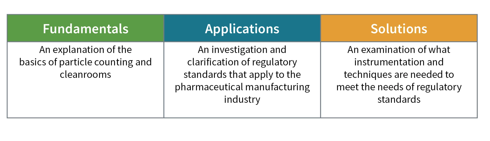

## Table of Contents

## What is the pharmaceutical industry?

The pharmaceutical industry is a big business that makes and sells medicines and drugs. These companies work to find new ways to treat sickness and help people feel better. They do a lot of research and testing to make sure their medicines are safe and work well.

These companies also have to follow many rules set by governments to make sure the medicines are good quality. They sell their products to hospitals, doctors, and stores where people can buy them. The industry is very important because it helps keep people healthy and can save lives with the medicines they create.

## What are the main sectors within the pharmaceutical industry?

The pharmaceutical industry has several main sectors that work together to bring medicines to people. One big sector is research and development (R&D). This is where scientists and researchers work to find new medicines or improve old ones. They do a lot of experiments and tests to make sure the medicines are safe and work well. Another important sector is manufacturing. This is where the medicines are actually made. Companies have big factories where they produce the drugs in large amounts, following strict rules to keep the quality high.

Another sector is marketing and sales. This is where companies tell doctors and hospitals about their medicines so they can use them to help patients. They also advertise to the public sometimes. The last main sector is regulation and compliance. This is very important because it makes sure that all the medicines are safe and meet the rules set by governments. Companies have to do a lot of paperwork and get approvals before they can sell their medicines. All these sectors work together to make sure people get the medicines they need.

## How does drug development and approval process work?

Drug development starts with an idea that a new medicine could help treat a disease. Scientists then do a lot of research to see if their idea can work. They start in labs, testing the drug on cells and animals to see if it's safe and works well. This part can take many years. If the drug looks promising, the company will ask the government for permission to test it on people. These tests, called clinical trials, happen in different stages. First, they test the drug on a small group of healthy people to check for safety. Then, they test it on people with the disease to see if it helps them get better. This whole process can take over a decade and cost a lot of money.

Once the clinical trials are done and the drug seems safe and effective, the company sends a big application to the government. In the United States, this goes to the Food and Drug Administration (FDA). The FDA looks at all the data from the trials to make sure the drug is safe and works well. If everything looks good, the FDA approves the drug, and the company can start making it and selling it to the public. Even after approval, the drug is watched closely to make sure it keeps being safe and effective. This whole process is very long and detailed, but it's important to make sure new medicines are good for people.

## What are the key regulatory bodies governing the pharmaceutical industry?

The main regulatory body in the United States for the pharmaceutical industry is the Food and Drug Administration (FDA). The FDA makes sure that all medicines are safe and work well before they can be sold. They look at all the data from the drug tests and decide if the medicine can be approved. The FDA also keeps watching the medicines after they are sold to make sure they stay safe and effective.

In Europe, the European Medicines Agency (EMA) does a similar job. They check new medicines to see if they are safe and work well for people in Europe. The EMA works with different countries in Europe to make sure the rules are followed everywhere. Both the FDA and the EMA have strict rules to protect people and make sure they get good medicines.

Other countries have their own regulatory bodies too. For example, in Japan, it's the Pharmaceuticals and Medical Devices Agency (PMDA). In Canada, it's Health Canada. All these agencies work to make sure medicines are safe and effective for the people in their countries. They all have their own rules, but they often work together to share information and help each other.

## What is the role of clinical trials in pharmaceuticals?

Clinical trials are a very important part of making new medicines. They help scientists find out if a new drug is safe and if it works well for people. After testing the drug on cells and animals in the lab, scientists need to test it on people to see how it affects them. Clinical trials are done in different stages. First, they test the drug on a small group of healthy people to check for safety. Then, they test it on people who have the disease to see if the drug helps them get better. This process can take many years and is very important to make sure the medicine is good for people.

The information from clinical trials is used by government agencies like the FDA in the United States to decide if the drug can be sold to the public. If the trials show that the drug is safe and works well, the agency will approve it. But if the trials show problems, the drug might not be approved, and the company will need to do more work. Clinical trials help make sure that new medicines are safe and effective before they are used by lots of people. This is a big part of keeping people healthy and making sure they get good medicines.

## How do patents affect the pharmaceutical industry?

Patents are very important in the pharmaceutical industry. They give the company that made a new medicine the right to be the only one to sell it for a certain time, usually about 20 years. This is important because making a new medicine costs a lot of money and takes many years. The patent helps the company make back the money they spent and make a profit. Without patents, other companies could just copy the medicine and sell it cheaper, and the company that did all the hard work wouldn't make any money.

But patents also have some problems. They can make medicines very expensive because the company that has the patent can set a high price. This can make it hard for people to afford the medicine they need. When the patent ends, other companies can make the same medicine and sell it for less, which is called a generic drug. This can make the medicine cheaper and easier for more people to get. So, patents help companies make new medicines, but they can also make it hard for people to afford them.

## What are the major challenges faced by the pharmaceutical industry?

The pharmaceutical industry faces many challenges. One big challenge is the high cost of making new medicines. It can take over a decade and billions of dollars to develop a new drug. This is because the process involves a lot of research, testing, and clinical trials to make sure the medicine is safe and works well. Companies need to spend a lot of money before they can even start selling the drug, and there's no guarantee it will be successful. This high cost can make it hard for companies to keep going and can lead to higher prices for medicines.

Another challenge is getting the medicine approved by government agencies like the FDA. The approval process is very strict and can take a long time. Companies have to do a lot of paperwork and follow many rules to show that their medicine is safe and effective. If the medicine doesn't pass all the tests, it won't be approved, and the company will lose all the money they spent on it. This can be very risky and stressful for the companies.

Lastly, there's the challenge of making medicines affordable for everyone. Patents can make medicines very expensive because the company that made the drug can set a high price. This can make it hard for people to afford the medicine they need. When the patent ends, other companies can make cheaper versions called generic drugs, but until then, the high cost can be a big problem. Balancing the need to make money with the need to help people get the medicines they need is a big challenge for the industry.

## How does the pharmaceutical industry contribute to global health?

The pharmaceutical industry helps global health a lot by making new medicines and vaccines. They spend a lot of time and money to find new ways to treat diseases like cancer, heart disease, and infections. When they find a new medicine, they test it to make sure it's safe and works well. Then, they can sell it to people all over the world. This helps people live longer and healthier lives because they can get the medicines they need to fight sickness.

Another way the industry helps is by working with governments and other groups to fight big health problems. For example, they help with programs to stop diseases like malaria and HIV/AIDS in poor countries. They also help during emergencies, like when there's a new virus like COVID-19. The industry works fast to make vaccines and treatments to stop the spread of the virus and save lives. By doing all this, the pharmaceutical industry plays a big role in keeping people healthy everywhere.

## What are the current trends and innovations in the pharmaceutical sector?

One big trend in the pharmaceutical industry is personalized medicine. This means making medicines that are just right for each person, based on their genes and health. Scientists are learning more about how different people react to medicines, so they can make treatments that work better and have fewer side effects. This is a big change from the old way of making one medicine for everyone. Another trend is using technology like [artificial intelligence](/wiki/ai-artificial-intelligence) (AI) and big data to help find new medicines faster. AI can look at huge amounts of information to find patterns and ideas that humans might miss. This can speed up the research and make it cheaper to find new treatments.

Another important innovation is in the way medicines are made. Companies are using new methods like 3D printing to make pills that can release medicine in a special way, like slowly over time or in different parts of the body. This can make the medicine work better and be easier for people to take. Also, there's a lot of work on making medicines from living things, like using bacteria or yeast to make drugs. This can be a greener way to make medicines and might be cheaper too. These trends and innovations are helping the pharmaceutical industry find new ways to help people stay healthy.

## How does the pharmaceutical industry manage supply chain and distribution?

The pharmaceutical industry manages its supply chain and distribution by working with many different groups to make sure medicines get to people who need them. They start by making the medicine in big factories. These factories have to follow strict rules to make sure the medicine is good quality. After the medicine is made, it is sent to places like warehouses where it is stored until it is ready to be sent out. The industry uses special trucks, planes, and ships to move the medicine around the world. They have to keep the medicine at the right temperature and make sure it doesn't get damaged. This is important because if the medicine is not handled right, it might not work well or could be unsafe.

Once the medicine gets to a country, it is sent to more warehouses or directly to places like hospitals and pharmacies. The industry uses computer systems to keep track of where the medicine is and how much is left. This helps them know when they need to make more or send more to different places. They also work with governments to make sure they follow all the rules about how to move and sell medicine. This whole process can be very hard because they have to make sure the medicine gets to people quickly and safely, no matter where they are in the world.

## What are the ethical considerations in pharmaceutical marketing and sales?

One big ethical issue in pharmaceutical marketing and sales is being honest with doctors and patients. Companies need to tell the truth about their medicines and not say they work better than they do. Sometimes, they might want to make their medicine sound better than it is to sell more, but this can be harmful if people start using a medicine that doesn't really help them. Companies also have to be careful about how they talk about their medicines in ads, making sure they don't hide any risks or side effects. Being honest is important because it helps doctors and patients make good choices about which medicines to use.

Another ethical consideration is making sure medicines are affordable for everyone. Sometimes, companies might set very high prices for their medicines, especially if they have a patent. This can make it hard for people who need the medicine to afford it. Companies have to think about balancing their need to make money with the need to help people get the medicines they need. They might work with governments or other groups to help make medicines cheaper for people who can't pay a lot. It's important for the industry to think about how their prices affect people's lives and health.

## How do mergers and acquisitions influence the dynamics of the pharmaceutical industry?

Mergers and acquisitions can change the way the pharmaceutical industry works. When two companies join together or one company buys another, it can make them stronger. They might be able to do more research and make new medicines faster because they have more money and people to work on it. It can also help them sell their medicines in more places around the world. But sometimes, when big companies get even bigger, it can make it harder for smaller companies to compete. This can lead to fewer choices for medicines and maybe even higher prices for people who need them.

Another way mergers and acquisitions affect the industry is by changing what kinds of medicines are being made. A company might buy another one because it has a good medicine that they want to sell. This can help them focus on certain diseases or types of treatments. But it can also mean that they stop working on other medicines that might be important. So, while mergers and acquisitions can help companies grow and do more, they can also change what medicines are available and how much they cost. It's a big part of how the industry keeps changing and trying to find new ways to help people stay healthy.

## References & Further Reading

[1]: Bergstra, J., Bardenet, R., Bengio, Y., & Kégl, B. (2011). ["Algorithms for Hyper-Parameter Optimization."](https://dl.acm.org/doi/10.5555/2986459.2986743) Advances in Neural Information Processing Systems 24.

[2]: ["Advances in Financial Machine Learning"](https://www.amazon.com/Advances-Financial-Machine-Learning-Marcos/dp/1119482089) by Marcos Lopez de Prado

[3]: ["Evidence-Based Technical Analysis: Applying the Scientific Method and Statistical Inference to Trading Signals"](https://www.amazon.com/Evidence-Based-Technical-Analysis-Scientific-Statistical/dp/0470008741) by David Aronson

[4]: ["Machine Learning for Algorithmic Trading"](https://github.com/stefan-jansen/machine-learning-for-trading) by Stefan Jansen

[5]: ["Quantitative Trading: How to Build Your Own Algorithmic Trading Business"](https://github.com/LucindaYa/quant-resources/blob/master/Quantitative%20Trading%20How%20to%20Build%20Your%20Own%20Algorithmic%20Trading%20Business.pdf) by Ernest P. Chan