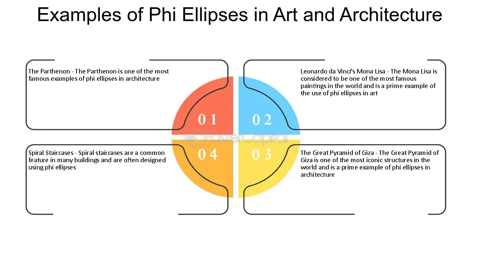

## Table of Contents

## What is a Phi Ellipse?

A Phi Ellipse is a special kind of ellipse that is related to the golden ratio, often called "Phi." The golden ratio is about 1.618 and is found in nature, art, and architecture. In a Phi Ellipse, the ratio of the lengths of the major and minor axes is equal to the golden ratio. This makes the ellipse look balanced and pleasing to the eye.

Phi Ellipses are used in design and art because they are thought to be more attractive. For example, artists might use Phi Ellipses to create paintings or sculptures that people find beautiful. Architects might use them in buildings to make the design look harmonious. By using the golden ratio, these ellipses help create a sense of order and beauty in various creations.

## How is a Phi Ellipse different from a standard ellipse?

A Phi Ellipse is different from a standard ellipse because of its special ratio. A standard ellipse can have any ratio between its major and minor axes. But a Phi Ellipse has a specific ratio, which is the golden ratio, about 1.618. This means that if you measure the longer axis and divide it by the shorter axis, you will get 1.618. This ratio is thought to be very pleasing to the eye.

Because of this special ratio, Phi Ellipses are often used in art and design. People believe that things that follow the golden ratio look more beautiful and balanced. So, artists and designers might choose to use Phi Ellipses in their work to make it more appealing. A standard ellipse, on the other hand, might not have this same effect because it doesn't necessarily follow the golden ratio.

## What is the mathematical definition of a Phi Ellipse?

A Phi Ellipse is a special type of ellipse where the ratio of the lengths of the major and minor axes is the golden ratio, which is about 1.618. This means if you take the length of the longer axis and divide it by the length of the shorter axis, you get 1.618. This ratio is called "Phi," and it's found in many places in nature and art.

In simple math terms, if we call the length of the major axis "a" and the length of the minor axis "b," then for a Phi Ellipse, a/b = 1.618. This specific ratio makes the Phi Ellipse different from a regular ellipse, where the ratio of the axes can be any number. People often find the shape of a Phi Ellipse to be more pleasing and balanced because of this special ratio.

## What are the key parameters that define a Phi Ellipse?

A Phi Ellipse is defined by two main parameters: the length of its major axis and the length of its minor axis. The major axis is the longer one, and the minor axis is the shorter one. What makes a Phi Ellipse special is that the ratio between these two lengths is always the same. This ratio is called the golden ratio, which is about 1.618. So, if you divide the length of the major axis by the length of the minor axis, you get 1.618.

These two parameters, the major and minor axes, are important because they shape the ellipse. When the ratio between them is the golden ratio, the ellipse looks balanced and pleasing to the eye. This is why Phi Ellipses are often used in art and design. They help create a sense of harmony and beauty in the things people make, like paintings, sculptures, and even buildings.

## How is the Phi Ellipse related to the golden ratio?

A Phi Ellipse is special because it's connected to the golden ratio, which is about 1.618. The golden ratio is a number that people think looks really nice and balanced. In a Phi Ellipse, the longer side, called the major axis, is 1.618 times longer than the shorter side, called the minor axis. This makes the Phi Ellipse different from other ellipses because it always has this special ratio.

People use Phi Ellipses in art and design because they think the golden ratio makes things look more beautiful. When artists or designers make something with a Phi Ellipse, they believe it will look more pleasing to the eye. This is why you might see Phi Ellipses in paintings, sculptures, or even buildings. The golden ratio helps make these creations look more harmonious and balanced.

## What are the geometric properties of a Phi Ellipse?

A Phi Ellipse is a special kind of ellipse that has a unique shape because of the golden ratio. The golden ratio is about 1.618, and in a Phi Ellipse, the longer side, called the major axis, is 1.618 times longer than the shorter side, called the minor axis. This ratio makes the Phi Ellipse look balanced and pleasing to the eye. The major and minor axes are the two main lines that run through the center of the ellipse, and they help define its shape.

Because of this special ratio, a Phi Ellipse has a very specific look. When you draw a Phi Ellipse, you can see that it's not too stretched out and not too round. It's just right, and this is why people think it looks nice. The golden ratio helps make the Phi Ellipse seem harmonious, which is why artists and designers often use it in their work. They believe that using the golden ratio can make their creations more beautiful and balanced.

## Can you explain the mechanism behind the formation of a Phi Ellipse?

A Phi Ellipse is created when the lengths of its major and minor axes follow a special ratio called the golden ratio. The golden ratio is about 1.618, and in a Phi Ellipse, the longer side, or major axis, is 1.618 times longer than the shorter side, or minor axis. To make a Phi Ellipse, you start by deciding how long you want the minor axis to be. Then, you multiply that length by 1.618 to find the length of the major axis. Once you have these two lengths, you can draw an ellipse that fits these measurements.

When you draw a Phi Ellipse, you need to make sure that the center of the ellipse is the same for both axes. The major axis goes from one side of the ellipse to the other, through the middle, and the minor axis goes from top to bottom, also through the middle. By keeping the ratio between these two axes at 1.618, you create a shape that looks balanced and pleasing to the eye. This is why artists and designers often use Phi Ellipses in their work, as the golden ratio is believed to enhance the beauty and harmony of their creations.

## What are some common applications of Phi Ellipses in design and architecture?

Phi Ellipses are often used in design and architecture because they look nice and balanced. The special ratio of 1.618, called the golden ratio, makes Phi Ellipses pleasing to the eye. Artists and designers use Phi Ellipses in paintings, sculptures, and other artwork to make them more beautiful. For example, a painter might use a Phi Ellipse to shape the main subject of a painting, making it look more harmonious. This is because the golden ratio is thought to be very attractive to people.

In architecture, Phi Ellipses can be seen in the design of buildings and structures. Architects might use them to make the layout of a building look more balanced and appealing. For instance, the shape of a window or the curve of a roof might follow the Phi Ellipse to create a sense of harmony. Using Phi Ellipses in this way can make a building not only look good but also feel more comfortable and pleasing to be in. This is why many architects pay attention to the golden ratio when they design their projects.

## How can one construct a Phi Ellipse using basic geometric tools?

To construct a Phi Ellipse using basic geometric tools, you'll need a ruler, a compass, and a pencil. First, decide on the length of the minor axis, which is the shorter side of the ellipse. Let's say you choose a length of 10 units. Now, to find the length of the major axis, you need to multiply the minor axis length by the golden ratio, which is about 1.618. So, 10 times 1.618 gives you a major axis length of about 16.18 units. Draw a horizontal line for the major axis and a vertical line for the minor axis, making sure they cross at the center of the ellipse.

Next, use your compass to find points along the major and minor axes to help you draw the ellipse. Start by setting your compass to half the length of the minor axis, which is 5 units in this case. Place the compass point at the center and draw two arcs above and below the center on the vertical line. Then, set the compass to half the length of the major axis, which is about 8.09 units. Place the compass point at the center again and draw two arcs to the left and right of the center on the horizontal line. Now, you can use these points as guides to draw the smooth curve of the Phi Ellipse, making sure it touches all four arcs. This method will give you a Phi Ellipse with the golden ratio built right into its shape.

## What are the advanced mathematical formulas used to describe Phi Ellipses?

A Phi Ellipse can be described using advanced mathematical formulas, but we'll keep it simple. The basic equation for an ellipse is (x^2/a^2) + (y^2/b^2) = 1, where 'a' is the length of the major axis and 'b' is the length of the minor axis. For a Phi Ellipse, the special thing is that 'a' divided by 'b' equals the golden ratio, which is about 1.618. So, if you know 'b', you can find 'a' by multiplying 'b' by 1.618. This makes the formula for a Phi Ellipse (x^2/(1.618b)^2) + (y^2/b^2) = 1.

To make this even clearer, let's say 'b' is 10 units. Then 'a' would be 10 times 1.618, which is about 16.18 units. So, the equation for this specific Phi Ellipse would be (x^2/(16.18)^2) + (y^2/10^2) = 1. This equation helps you understand how the golden ratio shapes the Phi Ellipse. It's a way to see how the special ratio of 1.618 makes the ellipse look balanced and pleasing to the eye.

## How do Phi Ellipses appear in nature and art?

Phi Ellipses show up in nature in many cool ways. For example, the shape of some seashells, like the nautilus, follows the golden ratio, which is what makes a Phi Ellipse. The way the shell grows and curls around itself looks a lot like a Phi Ellipse. Also, the way some flowers and leaves are arranged can form patterns that look like Phi Ellipses. These patterns help the plants grow in a way that is balanced and efficient, which is pretty amazing.

In art, artists use Phi Ellipses because they think it makes their work look better. Painters might use the shape of a Phi Ellipse to draw the main part of their painting, like a person's face or a big tree. This makes the painting look more balanced and pleasing to the eye. Sculptors also use Phi Ellipses in their work, shaping their sculptures to fit this special ratio. This is why you might see Phi Ellipses in famous paintings and sculptures, as artists believe it adds a sense of harmony and beauty to their creations.

## What are the current research trends and future prospects in the study of Phi Ellipses?

Right now, people are studying Phi Ellipses to learn more about how they can be used in different areas. Scientists and mathematicians are looking at how Phi Ellipses show up in nature, like in the way plants grow or how animals move. They want to understand if the golden ratio, which makes a Phi Ellipse, has a special role in these natural patterns. In technology, researchers are trying to use Phi Ellipses to make things like computer graphics and designs look better. They think that using the golden ratio can make digital images and models more appealing and easier to look at.

In the future, the study of Phi Ellipses could lead to new ways of making art and designing buildings. Artists might find new ways to use Phi Ellipses in their paintings, sculptures, and other works to make them even more beautiful. Architects could use Phi Ellipses to design buildings that feel more balanced and pleasing to be in. Also, as we learn more about how Phi Ellipses appear in nature, we might discover new ways to use them in science and technology, like in biology or engineering. This could help us create things that work better and look nicer, all because of the special shape of the Phi Ellipse.

## What is Understanding Elliptical Geometry?

An ellipse is a fundamental geometric shape defined as the set of all points where the sum of the distances from two fixed points, known as foci, is constant. This shape can be described using the mathematical formula:

$$
\frac{(x - h)^2}{a^2} + \frac{(y - k)^2}{b^2} = 1
$$

where $(h, k)$ represents the center of the ellipse, $a$ is the length of the semi-major axis, and $b$ is the length of the semi-minor axis. The major axis is the longest diameter of the ellipse, while the minor axis is the shortest. The eccentricity of an ellipse, $e$, is given by:

$$
e = \sqrt{1 - \frac{b^2}{a^2}}
$$

The eccentricity ranges from 0 to 1, where an ellipse with $e = 0$ is a perfect circle, and as the eccentricity approaches 1, the ellipse becomes more elongated.

Elliptical geometry is prevalent in various practical applications. In astronomy, the orbits of planets and comets are elliptical, a principle first articulated by Johannes Kepler in his first law of planetary motion. Another interesting application is in architecture and acoustics, notably in the design of whispering galleries. These are circular or elliptical enclosures where sound waves can travel across the surface, allowing a whisper to be heard clearly across a great distance. The symmetry and reflective properties of ellipses facilitate this unique phenomenon. These examples illustrate the significance of ellipses beyond theoretical mathematics, demonstrating their utility in understanding and designing physical systems.

## References & Further Reading

[1]: Ehlers, J. F. (2001). ["Rocket Science for Traders: Digital Signal Processing Applications."](https://archive.org/details/rocketsciencefor0000ehle) Wiley.

[2]: Ramos-Requena, J. P., Peran, J. R., & Garcia, J. (2010). ["Genetic Algorithms for Phi-Ellipse Technical Indicator Optimization."](https://www.semanticscholar.org/paper/An-Alternative-Approach-to-Measure-Co-Movement-Two-Ramos-Requena-Trinidad-Segovia/1ead21251c249a12309da87ff4067da3435c1f42) Universidad de Almeria.

[3]: Lopez de Prado, M. (2018). ["Advances in Financial Machine Learning."](https://www.amazon.com/Advances-Financial-Machine-Learning-Marcos/dp/1119482089) Wiley.

[4]: Hulley, H., & Platen, E. (2011). ["Algorithmic Trading in Efficient Markets."](https://www.semanticscholar.org/paper/Hedging-for-the-long-run-Hulley-Platen/8d2f22aa22a6b916e3fc6b994b5af2089caa9787) Journal of Computer Science.

[5]: Chan, E. P. (2008). ["Quantitative Trading: How to Build Your Own Algorithmic Trading Business."](https://github.com/ftvision/quant_trading_echan_book) Wiley.