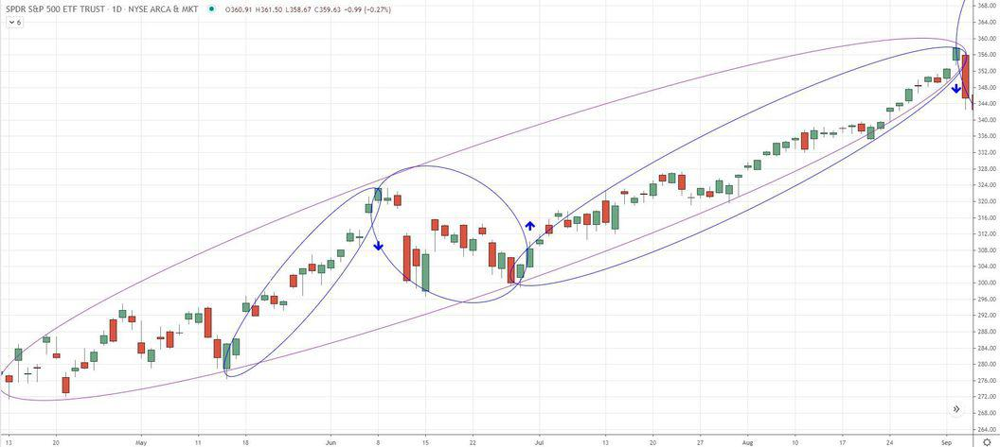

In mathematics and finance, the integration of geometric principles with algorithmic trading presents intriguing possibilities. One notable example of this intersection is the use of elliptical geometry in algorithmic trading strategies. This article focuses on the interaction between elliptical geometry, with particular attention to the phi-ellipse, and its applications in algorithmic trading.

The exploration of phi-ellipses and their mathematical characteristics offers valuable insights into their use in trading. Phi-ellipses aid traders in identifying market trends and potential points of reversal, providing a geometric perspective on price movement. By analyzing these patterns, traders can potentially gain an edge in understanding market dynamics. As we investigate the phi-ellipse, we will reveal how its unique features make it a tool worth considering in trading strategies. Through this geometric lens, traders can enhance their ability to forecast market behavior and make informed decisions.



## Table of Contents

## Understanding Elliptical Geometry

An ellipse is a fundamental geometric shape defined as the set of all points where the sum of the distances from two fixed points, known as foci, is constant. This shape can be described using the mathematical formula:

$$
\frac{(x - h)^2}{a^2} + \frac{(y - k)^2}{b^2} = 1
$$

where $(h, k)$ represents the center of the ellipse, $a$ is the length of the semi-major axis, and $b$ is the length of the semi-minor axis. The major axis is the longest diameter of the ellipse, while the minor axis is the shortest. The eccentricity of an ellipse, $e$, is given by:

$$
e = \sqrt{1 - \frac{b^2}{a^2}}
$$

The eccentricity ranges from 0 to 1, where an ellipse with $e = 0$ is a perfect circle, and as the eccentricity approaches 1, the ellipse becomes more elongated.

Elliptical geometry is prevalent in various practical applications. In astronomy, the orbits of planets and comets are elliptical, a principle first articulated by Johannes Kepler in his first law of planetary motion. Another interesting application is in architecture and acoustics, notably in the design of whispering galleries. These are circular or elliptical enclosures where sound waves can travel across the surface, allowing a whisper to be heard clearly across a great distance. The symmetry and reflective properties of ellipses facilitate this unique phenomenon. These examples illustrate the significance of ellipses beyond theoretical mathematics, demonstrating their utility in understanding and designing physical systems.

## What is a Phi-Ellipse?

A phi-ellipse, also referred to as a Fibonacci ellipse, is a geometric and analytical tool used in the field of technical analysis within financial markets. This tool is instrumental in identifying price patterns and discerning potential trends and reversals. Unlike traditional analysis tools that merely highlight support and resistance levels, phi-ellipses offer a unique approach to visualizing overarching market trends.

The phi-ellipse's foundation lies in the Fibonacci sequence and the golden ratio (often denoted as phi or φ). The Fibonacci sequence is an ordered series of numbers where each number is the sum of its two preceding ones, usually starting with 0 and 1. The ratio of successive Fibonacci numbers approximates the golden ratio (φ ≈ 1.6180339887...), which is a significant value not only in mathematics but also in art and nature.

Mathematically, the construction of a phi-ellipse involves the selection of three pivotal points on a stock chart: a swing low, a subsequent swing high (or peak), and another point where a reversal occurs. These points serve as the anchoring nodes for determining the ellipse's orientation and geometry. The phi-ellipse is then drawn such that it spans these points, effectively encompassing the main trend while indicating areas that might signify a change in price direction.

In [algorithmic trading](/wiki/algorithmic-trading), the phi-ellipse serves as a visual and computational aid that adheres to the symmetry and balanced proportions characteristic of geometric shapes. The phi ratio’s intrinsic properties allow traders to anticipate potential market movements by recognizing structural patterns that repeat throughout various time frames. This characteristic makes it advantageous compared to linear indicators, which may overlook the subtleties of a price’s cyclical nature.

By employing phi-ellipses, traders can achieve a better understanding of macro trends, as the ellipses encapsulate longer-term movements rather than short-lived fluctuations. Their application extends beyond simple market observation by guiding the development of trading algorithms capable of responding to evolutions in market dynamics. This makes phi-ellipses an essential component of an advanced technical analysis toolkit, providing a more holistic view of market behavior.

## Application of Phi-Ellipses in Algorithmic Trading

In algorithmic trading, phi-ellipses serve as powerful tools for distilling intricate price movements into more comprehensible trends. These ellipses offer a visual framework that aids traders in deciphering market dynamics and making informed decisions. By simplifying complex price action, phi-ellipses highlight the overarching direction of market trends.

A phi-ellipse is derived by plotting three significant points on a price chart—typically a swing low, a subsequent peak, and a reversal point. These points generate an ellipse that encapsulates the primary trend, allowing traders to grasp the trajectory of price movements. This representation of market behavior is instrumental in identifying trend directions with precision.

The integration of phi-ellipses into trading strategies allows traders to enhance their decision-making processes. By providing a geometrically informed perspective of market trends, phi-ellipses facilitate the detection of potential trend reversal points, emphasizing the major trend alignments. These insights enable traders to adjust their positions in anticipation of trend shifts, optimizing entry and [exit](/wiki/exit-strategy) points.

Furthermore, phi-ellipses enrich traditional financial models by embedding geometric insights into existing analytical methods. When combined with moving averages, oscillators, and other technical indicators, phi-ellipses add a layer of analytical depth, offering a balanced approach that amalgamates mathematical insights with empirical market data. This multi-faceted strategy broadens the analytical horizon, reinforcing the trader's ability to interpret market conditions accurately.

Mathematically, phi-ellipses incorporate the golden ratio, commonly denoted as φ (phi), which plays a crucial role in their formation. The use of the Fibonacci sequence, from which phi is derived, bolsters the reliability of the patterns observed, as financial markets often exhibit Fibonacci-related behaviors. By leveraging this mathematical foundation, traders gain a nuanced understanding of market rhythm, further refining their trading models.

In conclusion, employing phi-ellipses in algorithmic trading harnesses the power of geometric principles to bring clarity to market analyses. By integrating these ellipses into trading strategies, traders not only simplify complex price movements but also enhance the precision of their predictions, thereby achieving better trading outcomes.

## Drawing Phi-Ellipses: A Practical Example

To construct a phi-ellipse on a stock price chart, you must first identify three crucial points: a swing low, a peak after this low, and a subsequent reversal point. These points are essential as they form the basis for drawing the phi-ellipse, a tool that helps in visualizing macro trends and potential reversal areas. 

1. **Selecting Three Points:**
   - **Swing Low:** Begin by identifying a significant low point on the stock chart. This point represents a trough where the price has dipped to a relatively low level before commencing an upward movement.
   - **Peak After Low:** Next, locate the prominent peak that follows this low. This point acts as the opposite extreme of the market movement, illustrating a temporary maximum before another shift occurs.
   - **Subsequent Reversal Point:** Finally, find the next significant reversal point, where the price has changed direction following the peak. This point marks the beginning of a new trend, either upward or downward.

2. **Construction of the Phi-Ellipse:**
   - Connect these three points in sequence. The phi-ellipse is then drawn to encompass the fluctuating price movements between these indicators.
   - The resulting ellipse not only highlights the main trend but also accentuates potential areas where the trend might change direction, helping traders anticipate future price actions.

3. **Illustrative Examples Using Software:**
   - Specialized trading software is necessary to effectively draw phi-ellipses, given their reliance on Fibonacci principles. Unfortunately, many standard trading platforms do not support such tools directly.
   - For a practical approach, traders often rely on sophisticated charting software, possibly leveraging platforms like MetaTrader or TradingView, which might support custom scripts or plugins to facilitate the drawing of phi-ellipses.

Here is a basic Python code snippet using matplotlib that could illustrate how one might begin plotting an ellipse, though without direct financial context:

```python
import matplotlib.pyplot as plt
import numpy as np

# Define swing low, peak, and reversal point
swing_low = np.array([0, 1])
peak = np.array([1, 4])
reversal = np.array([5, 2])

# Calculate the parameters for the ellipse
center_x = (swing_low[0] + peak[0] + reversal[0]) / 3
center_y = (swing_low[1] + peak[1] + reversal[1]) / 3
width = np.max([np.linalg.norm(peak - swing_low), np.linalg.norm(reversal - swing_low)])
height = np.linalg.norm(reversal - peak) / 2

# Plotting the ellipse
ellipse = plt.Circle((center_x, center_y), width/2, height, color='b', alpha=0.2)
plt.gca().add_patch(ellipse)

# Plot points
plt.plot([swing_low[0], peak[0], reversal[0]], [swing_low[1], peak[1], reversal[1]], 'ro')

# Configuration
plt.xlim(-1, 7)
plt.ylim(0, 5)
plt.xlabel('Time')
plt.ylabel('Price')
plt.title('Phi-Ellipse Example')

# Show plot
plt.axis('equal')
plt.grid(True)
plt.show()
```
This code sets up a rudimentary framework to demonstrate basic ellipse plotting using points, suitable for visualization but lacking intricate financial overlays. Advanced implementations would require deeper integration with market data and Fibonacci tools, typically available in financial analysis software.

## Limitations and Considerations

Despite the intriguing potential of phi-ellipses in algorithmic trading, their application is not without limitations. As a relatively niche tool, phi-ellipses are not widely adopted, and they might not consistently yield accurate market projections. Their use is largely deemed speculative, and reliance solely on phi-ellipses can lead to suboptimal trading decisions.

One primary consideration is the unpredictability inherent in financial markets. Phi-ellipses, while visually compelling, are fundamentally mathematical constructs that may not always account for external market variables. This limitation necessitates the integration of phi-ellipses with other technical indicators and a comprehensive analysis of price action to enhance their effectiveness. Tools such as moving averages, RSI (Relative Strength Index), or MACD (Moving Average Convergence Divergence) can provide additional insights that, when used in conjunction with phi-ellipses, help to validate trend predictions and potential reversal points.

Traders using phi-ellipses must remain aware of the possibility of overfitting data—an issue prevalent when applying complex mathematical models to dynamic financial markets. Overfitting occurs when a model describes random error or noise instead of the underlying relationship, possibly resulting in misleading conclusions. To mitigate this, traders should test phi-ellipse strategies under various market conditions and time frames. Backtesting and forward testing are essential practices to verify the robustness and adaptability of these models before making actual trading decisions.

Additionally, the construction of phi-ellipses hinges on selecting specific points within a price chart, such as swing highs and lows. This selection can be subjective and may vary between analysts, potentially leading to inconsistent interpretations and conclusions. As such, clear criteria and guidelines should be established to ensure consistency when identifying these key points.

Ultimately, while phi-ellipses can offer unique insights into market dynamics, they should be part of a broader toolkit. Successful trading often requires a balanced approach that combines mathematical tools with qualitative market analysis, ensuring decisions are informed by a comprehensive understanding of both historical patterns and present market conditions. Traders must exercise caution and acknowledge these limitations when incorporating phi-ellipses into their trading strategies.

## Conclusion

The intersection of mathematics and finance through tools such as phi-ellipses demonstrates the significant potential of applying geometric principles to real-world trading scenarios. This approach offers a fresh perspective on market dynamics, leveraging the inherent properties of ellipses to discern price patterns and potential reversals. As algorithmic trading progresses, incorporating advanced mathematical techniques like the phi-ellipse can provide traders with unique insights, enhancing their ability to predict and respond to market movements.

The success of these techniques, however, relies on more than just mathematical precision; it demands a comprehensive understanding to effectively interpret and utilize these complex patterns in trading. Balancing mathematical proficiency with trading expertise ensures that these innovative tools are applied judiciously, taking into account market [volatility](/wiki/volatility-trading-strategies), trading psychology, and other external factors that influence trading outcomes. By integrating phi-ellipses into a broader analytical framework, traders can potentially uncover deeper insights, aligning algorithmic strategies with the fluid nature of financial markets.

This hybrid approach not only reinforces the symbiotic relationship between mathematics and finance but also exemplifies the ongoing evolution of trading techniques. As traders continue to seek out novel methodologies to stay ahead in competitive markets, the adoption of phi-ellipses and similar geometric tools marks a step forward in the sophisticated arena of algorithmic trading, highlighting the importance of continuous learning and adaptation in this fast-paced field.

## References & Further Reading

[1]: Ehlers, J. F. (2001). ["Rocket Science for Traders: Digital Signal Processing Applications."](https://archive.org/details/rocketsciencefor0000ehle) Wiley.

[2]: Ramos-Requena, J. P., Peran, J. R., & Garcia, J. (2010). ["Genetic Algorithms for Phi-Ellipse Technical Indicator Optimization."](https://www.semanticscholar.org/paper/An-Alternative-Approach-to-Measure-Co-Movement-Two-Ramos-Requena-Trinidad-Segovia/1ead21251c249a12309da87ff4067da3435c1f42) Universidad de Almeria.

[3]: Lopez de Prado, M. (2018). ["Advances in Financial Machine Learning."](https://www.amazon.com/Advances-Financial-Machine-Learning-Marcos/dp/1119482089) Wiley.

[4]: Hulley, H., & Platen, E. (2011). ["Algorithmic Trading in Efficient Markets."](https://www.semanticscholar.org/paper/Hedging-for-the-long-run-Hulley-Platen/8d2f22aa22a6b916e3fc6b994b5af2089caa9787) Journal of Computer Science.

[5]: Chan, E. P. (2008). ["Quantitative Trading: How to Build Your Own Algorithmic Trading Business."](https://github.com/ftvision/quant_trading_echan_book) Wiley.