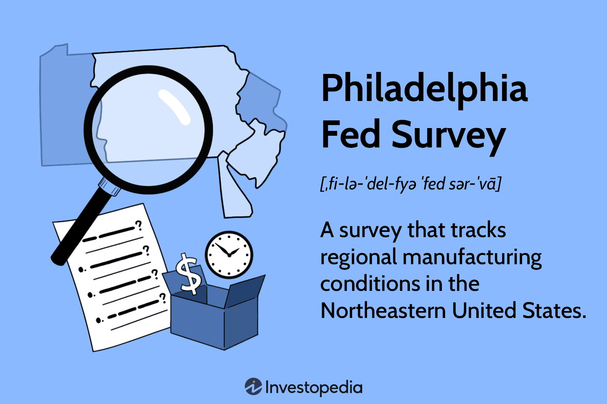

In the rapidly evolving economic landscape, understanding regional economies is crucial for businesses, policymakers, and investors alike. The Philadelphia Fed Survey serves as an essential tool for gauging regional economic health, focusing specifically on manufacturing conditions in the Northeastern United States. Officially known as the Manufacturing Business Outlook Survey, this financial indicator is generated monthly by the Federal Reserve Bank of Philadelphia. By assessing variables such as employment levels, new orders, shipments, and other key measures, the survey provides valuable insights into the economic vitality of the Third Federal Reserve District, which includes Pennsylvania, New Jersey, and Delaware.

As the financial markets continue to integrate technology at unprecedented rates, the role of such economic indicators in automated trading systems is becoming increasingly significant. Algorithmic trading, a method that uses computer algorithms to execute trades based on defined instructions, relies heavily on high-quality data inputs to optimize trading strategies. Economic indicators from the Philadelphia Fed Survey offer such critical data, enabling traders to make informed decisions.



This article explores the intersection between the Philadelphia Fed Survey and automated trading systems. It examines the survey's methodology, its impact on understanding regional economic dynamics, and the implications for algorithmic trading. By providing a comprehensive overview of these elements, this discussion aims to highlight the relevance of traditional economic metrics in modern financial contexts.

## Table of Contents

## Understanding the Philadelphia Fed Survey

The Philadelphia Fed Survey, officially termed the Manufacturing Business Outlook Survey, serves as a barometer for manufacturing conditions within the Northeastern United States. This survey is conducted monthly by the Federal Reserve Bank of Philadelphia, offering vital insights into regional economic trends and manufacturing activities. Its primary focus is on the Third Federal Reserve District, which includes Eastern Pennsylvania, Southern New Jersey, and Delaware. The survey's findings are pivotal for analysts and policymakers who monitor economic health and trends.

The survey participants are generally senior executives or influential figures within manufacturing firms. These respondents provide qualitative data by evaluating the changes in their company’s business activities over the past month and expressing their future outlook. Some of the key business measures reported in the survey include:

1. **Employment Levels**: Participants are asked to report changes in employment within their organizations, highlighting whether the workforce expanded, contracted, or remained stable over the specified period. This metric is crucial in assessing the labor market health and potential future employment trends.

2. **Order Volumes**: The survey gathers information on new order volumes, which indicates demand for manufactured goods. Increased new orders suggest potential growth in production activities, while a decline may signal manufacturing slowdowns. This measure helps in understanding the demand-dynamics faced by manufacturers.

3. **Shipments**: This metric assesses the volume of goods that have been shipped. Changes in shipment volumes can affect inventory levels and influence future manufacturing output.

4. **Prices Paid and Received**: The survey also examines input costs and selling prices, offering insights into inflationary pressures and manufacturers' pricing power.

5. **Inventories**: Information on inventory levels is gathered to assess stock accumulation or depletion, important for understanding supply chain efficiencies and demand expectations.

Overall, the Manufacturing Business Outlook Survey functions as an essential tool for evaluating economic conditions in the manufacturing sector. Its structured and detailed approach in capturing current business conditions and expectations allows industry stakeholders to make informed decisions. The data from the survey not only reflect regional dynamics but also contribute to assessing broader economic trends across the United States.

## Significance of the Survey in Regional Economic Analysis

The Philadelphia Fed Survey is a valuable instrument in assessing the economic vitality of the Third Federal Reserve District, which includes Pennsylvania, New Jersey, and Delaware. This survey offers a granular view of the manufacturing landscape, providing vital insights that are indispensable for economic analysis and policy formulation.

The survey's indicators, such as employment levels, new orders, shipments, and inventory status, offer a concise snapshot of both current and anticipated future manufacturing conditions. These metrics are crucial for policymakers and economic analysts as they craft strategies to stimulate growth or mitigate downturns. For instance, an increase in new orders might signal expansion, prompting the need for supportive policy measures to address potential supply chain constraints. Conversely, a decline in employment levels could necessitate targeted interventions to bolster workforce participation.

Beyond its primary regional focus, the Philadelphia Fed Survey frequently predicts broader economic trends across the United States. Although the insights are derived from a specific geographic area, the interconnectedness of regional and national economies allows these indicators to serve as bellwethers for wider economic shifts. For example, rising inventory levels reported in the survey may prelude broader inventory adjustments across the country, affecting national GDP growth rates.

Policymakers and analysts alike benefit from this predictive capability, as the survey's outcomes can inform decisions on interest rates, infrastructure investment, and other fiscal policies. The ability to anticipate and respond to economic changes enhances the resilience of both regional and national economies.

In summary, the Philadelphia Fed Survey is an essential tool for understanding not only the economic conditions within the Third Federal Reserve District but also the potential implications for the broader U.S. economy. Its indicators serve as a critical resource for decision-makers aiming to foster economic stability and growth.

## Applications in Algorithmic Trading

Algorithmic trading has revolutionized the financial markets by relying heavily on data-driven decision-making processes, enabling traders to execute orders at speeds and frequency unimaginable to human traders. The Philadelphia Fed Survey provides critical insights into the manufacturing business conditions in the Northeastern United States, offering traders valuable data that can be incorporated into predictive models for [algorithmic trading](/wiki/algorithmic-trading).

The Philadelphia Fed Survey delivers monthly data on several economic indicators such as employment levels, order volumes, and overall manufacturing activity. This consistent flow of information allows traders to feed their algorithms with recent economic conditions, helping them predict future market performance. More specifically, insights from the survey can be integrated into algorithms that adjust trading strategies based on the detected economic trends. For instance, a sharp increase in the survey's index might signal improved manufacturing conditions, prompting algorithms to favor investments in sectors sensitive to economic growth.

To illustrate how survey data could be used in algorithmic trading, consider a simple moving average crossover strategy. The fundamental idea of this strategy is that an upward crossover (a short-term moving average crossing above a long-term moving average) signals a favorable market condition, while a downward crossover suggests otherwise. By incorporating the Philadelphia Fed Survey data, traders can add another layer to this strategy, such as:

```python
import numpy as np
import pandas as pd

# Assuming df is a pandas DataFrame containing historical market data
# and 'fed_survey_index' as one of its columns.
short_window = 20
long_window = 50

# Calculating moving averages
df['short_mavg'] = df['close_price'].rolling(window=short_window, min_periods=1).mean()
df['long_mavg'] = df['close_price'].rolling(window=long_window, min_periods=1).mean()

# Generate trading signals: 1 for buy, -1 for sell
df['signal'] = 0
df.loc[df['short_mavg'] > df['long_mavg'], 'signal'] = 1
df.loc[df['short_mavg'] < df['long_mavg'], 'signal'] = -1

# Adjust signals based on Philadelphia Fed Survey Index
threshold = 0  # Neutral benchmark for the survey index
df['signal'] = np.where(df['fed_survey_index'] > threshold, df['signal'], -df['signal'])
```

By integrating the Philadelphia Fed Survey index into the above trading strategy, the algorithm can dynamically adjust its actions depending on the observed economic indicators. This form of strategy adjustment is particularly beneficial because it accommodates economic shifts, helping traders anticipate market movements more accurately.

However, the utility of the Philadelphia Fed Survey extends beyond simple adjustment of signals. Machine learning models, such as regression models or neural networks, can also be trained with this survey data to forecast market dynamics. By harnessing the predictive power of [machine learning](/wiki/machine-learning), traders can refine their strategies to better exploit economic indicators, maximizing return while managing risk.

In conclusion, the incorporation of the Philadelphia Fed Survey into algorithmic trading models allows traders to harness valuable regional economic data, providing a tactical advantage in anticipating market movements and optimizing portfolios. This capability is essential in an increasingly complex and fast-paced financial environment, where timely and informed decisions are crucial.

## Challenges and Considerations

The Philadelphia Fed Survey is a valuable tool for analyzing regional economic conditions, yet it is not without limitations. One primary challenge is its regional focus, which means it might not capture broader national or global economic shifts. The survey specifically targets the Northeastern United States and provides insights mainly into the manufacturing conditions within Pennsylvania, New Jersey, and Delaware. Consequently, while it offers detailed regional data, significant economic events occurring outside this region or affecting the global economy could go unnoticed, potentially leading to gaps in comprehensive economic analysis.

Given these limitations, traders and analysts must integrate the Philadelphia Fed Survey's findings with other economic data sources. Relying solely on this survey might result in an incomplete view of the overall economic landscape. For instance, major national economic trends could exert significant influence on market conditions that the survey does not explicitly address. Therefore, a multi-faceted approach that incorporates additional sources, such as international market reports or other regional surveys, is crucial for constructing a holistic economic analysis.

From the perspective of algorithmic trading, this comprehensive approach is essential. Trading strategies highly depend on predictive modeling, which requires thorough and diverse data inputs. To compensate for potential gaps in the Philadelphia Fed Survey's coverage, traders typically input data from multiple sources into their algorithms. Python, a widely used language in algorithmic trading, allows for the integration and analysis of various data sets. Traders might employ libraries like `pandas` for data manipulation and `scikit-learn` for predictive analytics:

```python
import pandas as pd
from sklearn.linear_model import LinearRegression

# Example: Assuming philly_data and national_data are pre-processed DataFrames
df = pd.merge(philly_data, national_data, on='date')
model = LinearRegression()

X = df[['philly_indicator', 'national_indicator']]
y = df['market_trend']
model.fit(X, y)

# Predict future market trend
future_trend = model.predict([[future_philly, future_national]])
```

This code demonstrates how to merge regional and broader data sources to build a predictive model that could be used to inform trading decisions. By employing such methods, traders not only leverage the valuable insights from the Philadelphia Fed Survey but also mitigate the risks associated with its regional specificity, ensuring more robust and informed trading strategies.

## Conclusion

The Philadelphia Fed Survey is a pivotal resource in assessing regional economic health and informing algorithmic trading practices. By providing comprehensive data on manufacturing conditions, employment levels, and order volumes within the Northeastern United States, the survey equips both traders and policymakers with the information necessary to make informed decisions. This data supports the evaluation of current economic conditions and projections for future trends.

The survey's findings are integral for algorithmic trading strategies that rely on data-driven decision-making processes. Traders utilize the insights derived from the survey to enhance predictive models and refine trading algorithms. By incorporating economic indicators, such as those provided by the survey, traders can anticipate market movements and adjust portfolios accordingly to optimize returns.

As the economy continues to evolve, the integration of data from resources like the Philadelphia Fed Survey with advanced trading algorithms becomes increasingly essential. This integration allows for more precise analysis and improved reaction times to economic changes, ensuring that trading strategies remain robust and effective in a dynamic market environment. Thus, the continued use of the Philadelphia Fed Survey stands as a cornerstone for both economic analysis and sophisticated trading methodologies.

## References & Further Reading

[1]: Crone, T. M. (2007). ["A History of the Philadelphia Federal Reserve's Manufacturing Business Outlook Survey."](https://www.philadelphiafed.org/-/media/frbp/assets/economy/articles/business-review/2007/q3/crone_pattern-regional-differences.pdf) Federal Reserve Bank of Philadelphia Working Paper.

[2]: ["The Role of Manufacturing Surveys in Economic Forecasting"](https://www.richmondfed.org/-/media/richmondfedorg/publications/research/economic_quarterly/2004/fall/pdf/harrisowenssarte.pdf) - A paper discussing various manufacturing surveys including the Philadelphia Fed Manufacturing Business Outlook Survey.

[3]: Brynildsen, K. (2005). ["Regional Economic Indicators."](https://www.jstor.org/stable/i40002295) Chicago Fed Letter, Federal Reserve Bank of Chicago, discussing regional economic indicators like the Philadelphia Fed Survey.

[4]: ["Algorithmic Trading: Winning Strategies and Their Rationale"](https://www.wiley.com/en-us/Algorithmic+Trading%3A+Winning+Strategies+and+Their+Rationale-p-9781118746912) by Ernie Chan

[5]: ["The Art of Execution: Improving Performance in Algorithmic Trading."](https://fastercapital.com/content/Automated-Execution--The-Art-of-Automated-Execution-in-Algorithmic-Trading.html) Investopedia article discussing enhancements in algorithmic trading strategies.