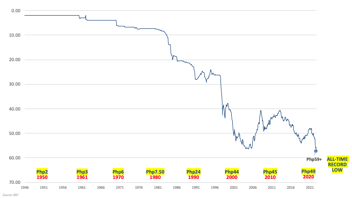

## Table of Contents

## What is the Philippine Peso?

The Philippine Peso is the official currency of the Philippines. It is used every day by people in the Philippines to buy things like food, clothes, and other stuff they need. The symbol for the Philippine Peso is ₱, and sometimes people write it as PHP. One Peso is made up of 100 centavos, which are like smaller coins.

The Philippine Peso has been around for a long time. It started being used in the late 1800s when the Philippines was still a Spanish colony. Over the years, the design of the Peso has changed a lot. Today, you can find Peso notes in different amounts like ₱20, ₱50, ₱100, ₱200, ₱500, and ₱1000. There are also coins for smaller amounts like 1, 5, 10, and 25 centavos, and 1, 5, and 10 Pesos.

## When was the Philippine Peso first introduced?

The Philippine Peso was first introduced in the late 1800s, during the time when the Philippines was still a Spanish colony. Before that, the Spanish used different kinds of money in the Philippines, like the Mexican Peso and the Spanish Dollar. But in 1852, Spain decided to make a special currency just for the Philippines, and that's how the Philippine Peso was born.

When the Philippines became independent in 1946, the Philippine Peso kept being used as the country's official money. Over the years, the design and the value of the Peso have changed a lot. But it has always been an important part of everyday life for people in the Philippines, helping them buy things they need and want.

## What are the denominations of the Philippine Peso?

The Philippine Peso comes in different amounts, called denominations. For paper money, you can find notes worth ₱20, ₱50, ₱100, ₱200, ₱500, and ₱1000. These notes have different colors and pictures on them to help people tell them apart easily.

For coins, there are smaller amounts like 1 centavo, 5 centavos, 10 centavos, and 25 centavos. There are also bigger coins worth ₱1, ₱5, and ₱10. Coins are handy for buying small things or getting change when you shop.

All these different denominations make it easy for people in the Philippines to use the right amount of money for whatever they need to buy.

## How has the design of the Philippine Peso changed over time?

The design of the Philippine Peso has changed a lot since it was first introduced in the late 1800s. When it started, the Peso had pictures and symbols from the time when Spain ruled the Philippines. Over the years, as the country went through different governments and gained independence, the designs on the Peso changed to show important people, places, and events in Philippine history. For example, older notes might have had pictures of Spanish kings or queens, but newer ones show Filipino heroes like Jose Rizal or important landmarks like the Tubbataha Reef.

Today, the Philippine Peso notes and coins have colorful designs that are easy to recognize. The front of the notes usually shows a famous Filipino person, while the back shows something important about the Philippines, like a natural wonder or a historical site. The coins also have different designs, with some showing animals or plants that are special to the Philippines. These designs not only make the money look nice but also help people learn about their country's history and culture every time they use it.

## What historical events have significantly impacted the value of the Philippine Peso?

The value of the Philippine Peso has been affected by many big events in history. One important event was World War II. During the war, the Philippines was occupied by Japan, and the Japanese government printed a lot of money, which made the Peso lose a lot of its value. After the war, when the Philippines became independent in 1946, the country had to rebuild, and the Peso's value kept changing as the economy tried to recover.

Another event that had a big impact was the Asian Financial Crisis in 1997. This crisis started in Thailand but quickly spread to other countries in Asia, including the Philippines. Many people lost trust in their money, and the value of the Peso dropped a lot. The government had to take steps to try to fix the economy, like getting help from other countries and making new rules about money. These events show how the value of the Peso can change because of big things happening in the world.

## How is the Philippine Peso managed by the Bangko Sentral ng Pilipinas?

The Bangko Sentral ng Pilipinas, or BSP, is like the boss of all the money in the Philippines, including the Philippine Peso. They make sure the Peso keeps its value and that there is enough money for everyone to use. The BSP does this by deciding how much money should be printed and by setting something called the [interest rate](/wiki/interest-rate-trading-strategies). The interest rate is like a price for borrowing money, and changing it can help control how much money people want to borrow and spend.

The BSP also keeps an eye on how the Peso is doing compared to other countries' money. If the Peso is getting too weak or too strong, the BSP might step in to help balance things out. They can do this by buying or selling Pesos in the world market. All these actions help make sure the Philippine Peso stays useful and stable, so people in the Philippines can trust it and use it every day.

## What are the current exchange rates of the Philippine Peso against major currencies like the USD, EUR, and JPY?

The Philippine Peso's value changes every day when compared to other big currencies like the US Dollar (USD), the Euro (EUR), and the Japanese Yen (JPY). As of today, you can get about 58 Philippine Pesos for 1 US Dollar. This means if you have 1 USD, you can exchange it for around 58 PHP. The exchange rate between the Peso and the Dollar is important because many things in the Philippines, like imports and loans, are priced in US Dollars.

For the Euro, the exchange rate is around 63 Philippine Pesos for 1 Euro. So, if you have 1 EUR, you can get about 63 PHP. The Euro is used by many countries in Europe, and its value against the Peso can affect trade and travel between the Philippines and Europe. Lastly, for the Japanese Yen, the exchange rate is about 0.37 Philippine Pesos for 1 Yen. This means 1 JPY can be exchanged for around 0.37 PHP. Japan is a big trading partner for the Philippines, so the Yen's value against the Peso is also important for businesses and people who travel between the two countries.

## How does inflation affect the Philippine Peso?

Inflation is when the prices of things we buy, like food and clothes, go up over time. When inflation happens, the value of the Philippine Peso goes down. This means that with the same amount of Pesos, you can buy less stuff than before. For example, if a candy bar costs 10 Pesos today, and inflation makes prices go up, that same candy bar might cost 12 Pesos next year. So, your Pesos don't go as far as they used to.

The Bangko Sentral ng Pilipinas, or BSP, tries to keep inflation under control. They do this by changing the interest rates, which is like the price of borrowing money. If inflation is too high, the BSP might raise interest rates to make borrowing more expensive, which can slow down spending and help bring prices down. By managing inflation, the BSP helps make sure that the Philippine Peso stays useful and that people can still buy what they need with it.

## What are the factors that influence the exchange rate of the Philippine Peso?

The exchange rate of the Philippine Peso can change because of many things. One big [factor](/wiki/factor-investing) is how well the Philippine economy is doing. If the economy is growing and people are making more money, the Peso can become stronger because more people want to buy it. Another factor is the interest rates set by the Bangko Sentral ng Pilipinas. If they make borrowing money more expensive by raising interest rates, it can make the Peso stronger because people from other countries might want to invest in the Philippines to get higher returns on their money.

Another thing that affects the Peso's exchange rate is what's happening in the world. If there's a lot of uncertainty or problems in other countries, people might want to keep their money in the Philippines, making the Peso stronger. Also, the prices of things the Philippines sells to other countries, like fruits and electronics, can make a difference. If these prices go up, it can make the Peso stronger because other countries need to use more of their money to buy Philippine products. All these factors together help decide how many Pesos you get for other kinds of money, like the US Dollar or the Euro.

## How does the Philippine Peso's value compare to other Southeast Asian currencies?

The Philippine Peso's value compared to other Southeast Asian currencies can change a lot. For example, compared to the Indonesian Rupiah, the Peso is usually stronger. If you have 1 Peso, you can get around 250 Rupiah. This means that things in Indonesia might seem cheaper if you're using Pesos. On the other hand, the Singapore Dollar is much stronger than the Peso. You need about 40 Pesos to get 1 Singapore Dollar, so things in Singapore can seem more expensive if you're using Pesos.

Another currency to compare with is the Thai Baht. The Peso and the Baht are pretty close in value, with 1 Peso being worth around 0.6 Baht. This means that if you're traveling between the Philippines and Thailand, the cost of things might feel similar. The Malaysian Ringgit is also close to the Peso, with 1 Peso being worth about 0.09 Ringgit. So, when you're looking at how the Peso stacks up against other Southeast Asian currencies, it's important to remember that these values can change and affect how much you can buy in different countries.

## What are the economic policies that have been implemented to stabilize the Philippine Peso?

The Bangko Sentral ng Pilipinas, or BSP, has used different ways to keep the Philippine Peso stable. One big way is by changing the interest rates. When the BSP makes borrowing money more expensive by raising interest rates, it can help slow down spending and keep prices from going up too fast. This can make the Peso stronger because people from other countries might want to invest in the Philippines to get higher returns on their money. The BSP also keeps an eye on how much money is in the country. If there's too much money, it can make the Peso weaker, so the BSP might take some money out of circulation to help balance things out.

Another thing the BSP does is buy and sell Pesos in the world market. If the Peso is getting too weak, the BSP might use its money to buy Pesos, which can help make it stronger. If the Peso is getting too strong, the BSP might sell some Pesos to keep things balanced. The government also helps by making rules about how money can move in and out of the country. These rules can stop too much money from leaving the Philippines, which can help keep the Peso stable. All these actions together help make sure the Peso stays useful and that people can trust it.

## How do global economic trends impact the Philippine Peso's exchange rate?

Global economic trends can have a big impact on the Philippine Peso's exchange rate. When big things happen in the world, like a financial crisis or changes in oil prices, it can make people feel unsure about their money. If people think the world economy is not doing well, they might want to keep their money in safer places, like the Philippines. This can make the Peso stronger because more people want to buy it. On the other hand, if the world economy is doing great, people might want to invest their money in other countries, which can make the Peso weaker.

Another way global trends affect the Peso is through trade. The Philippines buys and sells a lot of things with other countries, like electronics and fruits. If the prices of these things go up or down because of what's happening around the world, it can change how much other countries want to buy from the Philippines. If the Philippines is selling more stuff, it can make the Peso stronger because other countries need to use more of their money to buy Philippine products. But if the Philippines is buying more stuff from other countries, it can make the Peso weaker because the country needs to use more Pesos to pay for those things.

## References & Further Reading

[1]: Bergstra, J., Bardenet, R., Bengio, Y., & Kégl, B. (2011). ["Algorithms for Hyper-Parameter Optimization."](https://dl.acm.org/doi/10.5555/2986459.2986743) Advances in Neural Information Processing Systems 24.

[2]: ["Advances in Financial Machine Learning"](https://www.amazon.com/Advances-Financial-Machine-Learning-Marcos/dp/1119482089) by Marcos Lopez de Prado

[3]: ["Evidence-Based Technical Analysis: Applying the Scientific Method and Statistical Inference to Trading Signals"](https://www.amazon.com/Evidence-Based-Technical-Analysis-Scientific-Statistical/dp/0470008741) by David Aronson

[4]: ["Machine Learning for Algorithmic Trading"](https://github.com/stefan-jansen/machine-learning-for-trading) by Stefan Jansen

[5]: ["Quantitative Trading: How to Build Your Own Algorithmic Trading Business"](https://www.amazon.com/Quantitative-Trading-Build-Algorithmic-Business/dp/1119800064) by Ernest P. Chan