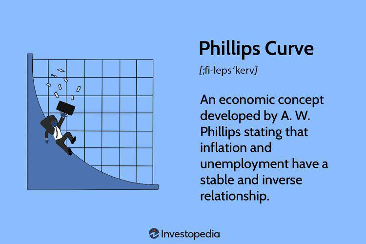

Economic theory is a fundamental framework that helps in understanding how economies function, examining the relationships between various economic variables, and predicting the potential outcomes of economic activities. It encompasses numerous subfields, each addressing different aspects of economic interactions. Two critical macroeconomic indicators within this framework are inflation and unemployment. 

Inflation refers to the rate at which the general level of prices for goods and services rises, diminishing purchasing power. It can arise due to factors such as increased demand for products (demand-pull inflation) or rising production costs (cost-push inflation). Unemployment, on the other hand, measures the percentage of the labor force that is jobless and actively seeking employment. It is categorized into several types: frictional, structural, and cyclical unemployment, each with unique causes and implications for economic stability and growth.

A notable contribution to economic theory is the Phillips Curve, introduced by economist A.W. Phillips in 1958. It posits an inverse relationship between inflation and unemployment, suggesting that as inflation rises, unemployment tends to fall, and vice versa. This relationship gained prominence during the mid-20th century, providing a conceptual tool for policymakers to balance these two economic variables. However, the robustness of the Phillips Curve was challenged during the stagflation period of the 1970s, which witnessed high inflation and high unemployment simultaneously.

In recent decades, algorithmic trading has revolutionized financial markets. It utilizes advanced mathematical models and computer algorithms to execute trades at speeds and frequencies beyond human capability. This paradigm shift to quantitative and high-frequency trading has enhanced market efficiency by narrowing bid-ask spreads and improving liquidity. However, it also poses risks such as increased market volatility and potential price anomalies.

The interplay among inflation, unemployment, the Phillips Curve, and algorithmic trading forms the crux of this article. By exploring how algorithmic trading might influence traditional economic relationships like those depicted by the Phillips Curve, we aim to provide insights valuable to investors, economists, and policymakers. Understanding these dynamics is crucial for navigating the complexities of modern economic systems and adapting strategies to mitigate risks and harness opportunities for growth in evolving financial environments.

## Table of Contents

## Understanding Inflation and Unemployment

Inflation and unemployment are pivotal concepts in economic theory, shaping the landscape of macroeconomic policy and decision-making. Understanding their definitions, causes, and effects is essential for grasping their influence on economic stability and societal well-being.

**Definition and Causes of Inflation**

Inflation is defined as the rate at which the general level of prices for goods and services rises, eroding purchasing power over time. Two primary theories explain the causes of inflation: demand-pull and cost-push inflation.

1. **Demand-pull inflation** occurs when aggregate demand in an economy outpaces aggregate supply. This typically happens in a growing economy where increased consumption, government spending, or investment creates excess demand. Mathematically, it can be modeled as:
$$
   P_t = D_t - S_t 

$$

   where $P_t$ is the price level at time $t$, $D_t$ is the aggregate demand, and $S_t$ is the aggregate supply.

2. **Cost-push inflation** arises when the costs of production increase, leading producers to pass on higher costs to consumers in the form of increased prices. This can be due to rising labor costs or increases in the prices of raw materials. The relationship can be expressed as:
$$
   P_t = C(L_t, R_t)

$$

   where $C$ is the cost of production, $L_t$ is the cost of labor, and $R_t$ is the cost of raw materials.

**Impact of Inflation on Purchasing Power and Economic Stability**

Inflation reduces the purchasing power of money, meaning consumers can buy fewer goods and services with the same amount of money over time. If wages do not keep pace with inflation, real income declines, leading to reduced consumer spending and saving. Elevated inflation can also destabilize economies by increasing uncertainty, discouraging investment, and complicating monetary policy efforts aimed at maintaining price stability.

**Unemployment Types: Frictional, Structural, and Cyclical**

Unemployment, in simple terms, is the state where individuals who are capable of working and are actively seeking employment are unable to find jobs.

- **Frictional unemployment** results from the time spent by workers in between jobs or entering the labor force for the first time. It is often viewed as voluntary and short-term.

- **Structural unemployment** occurs when there is a mismatch between the skills of the workforce and the demands of the labor market, often due to technological advancements or shifts in consumer preferences.

- **Cyclical unemployment** is linked to the natural ups and downs of the economic cycle, increasing during recessions and falling during periods of economic growth.

**Consequences of High Unemployment on Social and Economic Well-being**

High unemployment has profound social and economic consequences. Economically, it leads to lower output and income, reducing overall economic growth. Socially, it can result in increased poverty, reduced standards of living, and heightened social unrest. Long-term unemployment can cause skill erosion, making it harder for workers to regain employment, thereby perpetuating cycles of disadvantage.

**The Balance Between Inflation and Unemployment as an Economic Challenge**

The balance between inflation and unemployment is a perennial challenge for policymakers. The Phillips Curve historically suggested an inverse relationship between the two, implying that reducing unemployment might lead to higher inflation and vice versa. However, this relationship is not linear and can be influenced by external factors like expectations, global economic trends, and technological changes. Striking an optimal balance requires nuanced economic policies that consider both immediate and long-term consequences.

## The Phillips Curve: Historical Perspective and Evolution

The Phillips Curve is a concept in economic theory that illustrates the relationship between inflation and unemployment. Named after economist A.W. Phillips, this hypothesis was first proposed in his 1958 paper, where Phillips examined the empirical data from the United Kingdom over a period of nearly a century. He found an inverse relationship between the rate of wage inflation and unemployment, suggesting that lower unemployment in an economy is generally associated with higher inflation.

The original Phillips Curve posited that policymakers could target lower unemployment rates at the expense of higher inflation, and vice versa. This apparent trade-off between inflation and unemployment became a central topic in macroeconomic policy during the mid-20th century.

However, the Phillips Curve faced significant criticism, particularly during the 1970s when many Western economies experienced stagflation, a situation characterized by high inflation and high unemployment occurring simultaneously. This phenomenon contradicted the fundamental premise of the Phillips Curve and led to intense scrutiny and reevaluation of its applicability.

Over time, the Phillips Curve evolved to incorporate new insights, leading to the development of the expectations-augmented Phillips Curve. This theory, proposed by economists such as Milton Friedman and Edmund Phelps, introduced the concept of inflation expectations. According to this view, the trade-off between inflation and unemployment is not stable in the long run because expectations adjust. Individuals and businesses adjust their expectations based on past experiences, meaning that the long-term Phillips Curve is vertical at the natural rate of unemployment. In mathematical terms, the expectations-augmented Phillips Curve can be expressed as:

$$
\pi_t = \pi_{t-1} + \gamma (u_t - u_n)
$$

where $\pi_t$ is the current inflation rate, $\pi_{t-1}$ is the expected inflation rate, $\gamma$ is a parameter reflecting the responsiveness of inflation to the unemployment gap, $u_t$ is the current unemployment rate, and $u_n$ is the natural rate of unemployment.

Further evolution of the Phillips Curve included the introduction of concepts such as the Long-Run Phillips Curve, which posits that there is no trade-off between inflation and unemployment in the long run. The curve suggests that any attempt to reduce unemployment below its natural rate will result in accelerating inflation without permanently lowering unemployment. 

Today, the relevance and applicability of the Phillips Curve remain subjects of debate. Proponents argue that the Curve still provides valuable insights into short-term economic dynamics, while critics highlight its limitations, especially in the context of globalization, technological advancements, and changes in labor market structures.

Recent economic conditions and unconventional monetary policies have sparked renewed interest in the Phillips Curve. Economists continue to explore its implications, testing its limits and seeking to refine models that better capture the complexities of modern economies. Understanding the Phillips Curve's historical perspective and evolution is crucial for grasping its contemporary relevance and the ongoing debates surrounding its role in economic theory.

## Algorithmic Trading and its Economic Implications

Algorithmic trading, commonly known as algo trading, refers to the use of computer algorithms to automate and execute trading decisions in financial markets. These algorithms rely on pre-defined strategies, mathematical models, and real-time market data to determine the timing, price, and quantity of orders. Algo trading aims to reduce costs, minimize human errors, and capitalize on market opportunities faster than manual trading.

Historically, the incorporation of quantitative analysis and technological advancements led to the emergence of quantitative and high-frequency trading ([HFT](/wiki/high-frequency-trading-strategies)) within the broader spectrum of [algorithmic trading](/wiki/algorithmic-trading). Quantitative trading relies on mathematical computations and statistical techniques to identify trading opportunities, while HFT focuses on executing a large number of orders at extremely high speeds. HFT firms often leverage cutting-edge technology and infrastructure to gain competitive advantages by exploiting short-lived market inefficiencies.

One significant impact of algorithmic trading is its influence on market efficiency and [liquidity](/wiki/liquidity-risk-premium). By continuously buying and selling large volumes of assets, algo trading can enhance market depth, resulting in tighter bid-ask spreads and lower transaction costs. This increased liquidity benefits market participants by ensuring better price discovery and smoother trade execution.

However, algorithmic trading also carries certain risks and challenges. One primary concern is the potential for increased market [volatility](/wiki/volatility-trading-strategies) and anomalies. The rapid execution speed of algorithms can amplify price fluctuations, particularly during periods of low liquidity or unexpected market events. Notably, the "Flash Crash" of May 6, 2010, illustrated how algorithmic trading could exacerbate market instability. Due to erroneous algorithms and unexpected feedback loops, the U.S. stock markets experienced a dramatic decline and subsequent recovery within minutes, underscoring the susceptibility of markets to algo-driven volatilities.

Moreover, algorithmic trading has intriguing implications for economic indicators such as inflation and unemployment, although its direct impact may not be immediately evident. The efficiencies introduced by algo trading might indirectly influence these indicators through the broader financial system. For instance, enhanced liquidity and reduced transaction costs can lower capital costs for businesses, potentially fostering economic growth and impacting employment levels. Conversely, in times of market stress, the rapid withdrawal of liquidity by algorithms can exacerbate instability, influencing the economic environment and possibly affecting unemployment rates.

In summary, while algorithmic trading offers improvements in market operations, these advancements necessitate a comprehensive understanding of the risks associated with automated trading systems. The interplay between algorithmic trading and economic indicators such as inflation and unemployment continues to warrant attention, both for optimizing trading strategies and for assessing its broader implications on financial stability.

## Interconnection Between the Phillips Curve and Algo Trading

The Phillips Curve, which posits an inverse relationship between inflation and unemployment, has long been a cornerstone in economic theory. However, its dynamics have been subject to scrutiny and evolution over time, particularly with the advent of algorithmic trading. Algorithmic trading, utilizing advanced mathematical models and vast amounts of data to execute trades, brings new dimensions to how inflation and unemployment indicators are interpreted and acted upon in financial markets.

Algorithmic trading has the potential to influence the Phillips Curve by altering market responses to economic data, which can, in turn, affect inflation-unemployment trade-offs. Through real-time data analysis and execution speed, algorithms can respond to inflationary signals much faster than human traders, potentially exacerbating or mitigating market movements. This rapid reaction can intensify or dampen the traditional Phillips Curve response seen from changes in monetary policy or economic indicators.

The integration of big data and [artificial intelligence](/wiki/ai-artificial-intelligence) (AI) into economic modeling and predictions disrupts traditional methods. With the ability to process and analyze large datasets, AI can uncover patterns that human analysts might overlook, leading to more sophisticated and responsive trading strategies. This technology can detect nuanced economic trends, adjusting trading parameters to optimize for desired outcomes like inflation hedges or unemployment-based portfolio adjustments. Such advanced predictive capabilities may reshape established economic models, including the Phillips Curve, by providing insights into previously unrecognized correlations or causal relationships.

Recent economic events illustrate the impact of algorithmic trading on the Phillips Curve dynamics. For instance, during periods of market volatility, algorithms may capitalize on short-term inflation or unemployment reports, leading to market corrections that diverge from traditional expectations. The COVID-19 pandemic provides an example where algorithmic trading played a significant role in the rapid market adjustments to unprecedented fiscal and monetary policy interventions. The algorithms' ability to swiftly interpret and react to changing economic conditions may have contributed to the deviations from conventional Phillips Curve predictions observed during this period.

In conclusion, the intersection of the Phillips Curve and algorithmic trading highlights a critical area of economic research and market strategy. As algorithmic trading continues to evolve, its influence on inflation and unemployment dynamics necessitates ongoing scrutiny and adaptation of economic models to ensure they reflect the current realities of financial markets.

## Case Studies and Real-World Examples

Economic periods characterized by significant inflation and unemployment shifts provide valuable insights into the complexities of macroeconomic dynamics. Notable historical instances of such economic volatility include the stagflation of the 1970s and the global financial crisis of 2007-2008.

During the 1970s, Western economies experienced stagflation, a period marked by concurrent high inflation and unemployment, challenging the traditional Phillips Curve hypothesis that suggested an inverse relationship between these two variables. This period was characterized by the oil embargo, which led to an increase in oil prices and, subsequently, widespread cost-push inflation. The economic stagnation that followed resulted in high unemployment, forcing economists to reconsider existing theories and models, leading to the development of the expectations-augmented Phillips Curve, which incorporated adaptive expectations of inflation.

The 2007-2008 global financial crisis further highlighted the limitations of traditional economic models in predicting and managing economic downturns. During this period, algorithmic trading, particularly high-frequency trading (HFT), played a notable role in exacerbating market volatility. The flash crash of May 6, 2010, is a prominent example where algorithmic trading contributed to a sudden and severe stock market drop, raising concerns about the potential for such technologies to amplify financial instability.

Algorithmic trading has also had measurable impacts on economic indicators like inflation and unemployment, although these effects are complex and multifaceted. The speed and efficiency of algorithmic trading have improved market liquidity and enabled the rapid dissemination of information, which can influence investor sentiment and economic conditions. However, the risks associated with algorithmic trading, such as increased volatility and potential market manipulation, pose challenges to economic stability.

A case study of Japan provides insight into the interplay between inflation, unemployment, and algorithmic trading. Japan has faced prolonged periods of low inflation and economic stagnation since the 1990s, known as the "Lost Decade." Efforts to revive the economy through monetary and fiscal policies faced hurdles, including an aging population and deflationary pressures. In recent years, Japan has embraced advanced financial technologies, including algorithmic trading, to increase market efficiency and liquidity. These efforts have been met with mixed results, as temporary improvements in inflation and employment rates have been overshadowed by persistent structural challenges.

In summary, real-world examples underscore the complexity of the relationships between inflation, unemployment, and algorithmic trading. While technological advancements provide opportunities for financial innovation and market improvements, they also introduce new challenges for economic management and require ongoing adaptation by investors, policymakers, and economists.

## Conclusion

The relationship between inflation, unemployment, and the Phillips Curve has been a cornerstone of macroeconomic theory. The Phillips Curve originally suggested an inverse relationship between inflation and unemployment, implying that policy interventions could target one variable at the expense of the other. However, historical events such as the stagflation of the 1970s, where high inflation coexisted with high unemployment, challenged this simplistic trade-off view. This led to adaptations like the expectations-augmented Phillips Curve, which incorporates expectations and highlights the long-run neutrality of unemployment towards inflation. 

Algorithmic trading, characterized by the use of complex algorithms and high-speed computations, significantly alters modern economic landscapes. It enhances market efficiency, providing liquidity and reducing costs, but can also introduce risks like increased volatility and flash crashes. These activities can obscure traditional economic signals, including the dynamics captured by the Phillips Curve, by reacting instantaneously to news and trends that previously unfolded more gradually.

Looking forward, the future of economic theory will likely incorporate advancements in algorithmic strategies, big data, and artificial intelligence. These technologies offer greater predictive power and can refine models that account for the non-linear interaction between inflation and unemployment. As these models evolve, they may reshape our understanding of economic relationships and the efficacy of monetary policies.

The importance of adapting to these changes cannot be overstated. Economists, policymakers, and investors must heed new computational techniques and data-driven insights. By understanding and integrating these advancements, they can devise strategies that are not only responsive to current economic phenomena but also resilient against future uncertainties. This adaptability is crucial for ensuring economic stability and prosperity in increasingly complex global markets.

## References & Further Reading

[1]: Friedman, M. (1968). ["The Role of Monetary Policy."](https://www.aeaweb.org/aer/top20/58.1.1-17.pdf) American Economic Review, 58(1), 1-17.

[2]: Phillips, A.W. (1958). ["The Relation between Unemployment and the Rate of Change of Money Wage Rates in the United Kingdom, 1861-1957."](https://onlinelibrary.wiley.com/doi/full/10.1111/j.1468-0335.1958.tb00003.x) Economica, 25(100), 283-299.

[3]: Phelps, E. S. (1968). ["Money-Wage Dynamics and Labor Market Equilibrium."](https://www.journals.uchicago.edu/doi/10.1086/259438) Journal of Political Economy, 76(4), 678-711.

[4]: Lopez de Prado, M. (2018). ["Advances in Financial Machine Learning."](https://books.google.com/books/about/Advances_in_Financial_Machine_Learning.html?id=oU9KDwAAQBAJ) John Wiley & Sons.

[5]: Aronson, D. (2006). ["Evidence-Based Technical Analysis: Applying the Scientific Method and Statistical Inference to Trading Signals."](https://www.amazon.com/Evidence-Based-Technical-Analysis-Scientific-Statistical/dp/0470008741) John Wiley & Sons.

[6]: Jansen, S. (2020). ["Machine Learning for Algorithmic Trading, 2nd Edition."](https://github.com/stefan-jansen/machine-learning-for-trading) Packt Publishing.

[7]: Chan, E. P. (2008). ["Quantitative Trading: How to Build Your Own Algorithmic Trading Business."](https://github.com/ftvision/quant_trading_echan_book) John Wiley & Sons.

[8]: Bernanke, B. S. (2015). ["The Courage to Act: A Memoir of a Crisis and Its Aftermath."](https://archive.org/details/couragetoactmemo0000bern) W. W. Norton & Company.

[9]: Hull, J. C. (2018). ["Options, Futures, and Other Derivatives."](https://www.semanticscholar.org/paper/Options%2C-Futures%2C-and-Other-Derivatives-Hull/89bdee500c8623864fc9eb7a471546aa713acc44) Pearson.