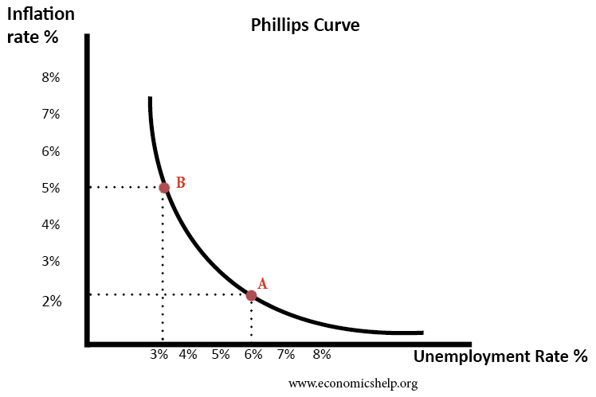

## Table of Contents

## What is the Phillips Curve?

The Phillips Curve is an economic concept that shows the relationship between unemployment and inflation. It suggests that when unemployment is low, inflation tends to be high, and when unemployment is high, inflation tends to be low. This idea was first introduced by economist A.W. Phillips in 1958, based on his observations of the British economy.

In simple terms, the Phillips Curve means that if more people have jobs, prices of goods and services might go up because companies need to pay workers more to keep them. On the other hand, if fewer people are working, companies don't need to raise wages as much, so prices stay lower. Policymakers use this idea to help manage the economy, trying to find a balance between keeping unemployment low and controlling inflation.

## Who developed the Phillips Curve?

The Phillips Curve was developed by an economist named A.W. Phillips. He was from New Zealand but worked in the United Kingdom. In 1958, Phillips noticed a pattern in the British economy. He saw that when more people had jobs, prices of things like food and clothes went up. And when fewer people were working, prices didn't go up as much.

Phillips put his findings into a graph, which he called the Phillips Curve. This graph showed that there was a trade-off between unemployment and inflation. It meant that if the government wanted to keep more people working, they might have to accept higher prices. This idea became very important for people who make decisions about the economy. They use the Phillips Curve to try to balance having lots of jobs with keeping prices stable.

## What is the relationship between inflation and unemployment according to the Phillips Curve?

The Phillips Curve shows that there is a connection between how many people are out of work and how fast prices are going up. When fewer people are unemployed, it means more people have jobs. When more people are working, companies often have to pay them more money to keep them. This can make the cost of things like food and clothes go up, which is what we call inflation. So, according to the Phillips Curve, when unemployment is low, inflation tends to be high.

On the other hand, when a lot of people are out of work, companies don't need to pay as much to get workers. This means they don't have to raise prices as much, so inflation stays low. The Phillips Curve helps people who make decisions about the economy to see this trade-off. They can try to keep more people working, but they might have to accept that prices will go up faster. Or, they can try to keep prices from going up too fast, but that might mean more people will be out of work.

## How does the Phillips Curve illustrate trade-offs in economic policy?

The Phillips Curve shows that there's a trade-off between keeping unemployment low and keeping inflation under control. When more people have jobs, companies might need to pay them more money to keep them working. This can cause the prices of things to go up, which is what we call inflation. So, if the government wants to make sure a lot of people have jobs, they might have to accept that prices will go up faster.

On the other hand, if the government wants to keep prices from going up too fast, they might need to let more people be out of work. When fewer people are working, companies don't have to pay as much to get workers, so they don't need to raise prices as much. This means that to keep inflation low, the government might have to accept higher unemployment. It's like choosing between two important things and trying to find a balance that works best for the economy.

## What is the difference between the short-run and long-run Phillips Curve?

The short-run Phillips Curve shows that there can be a trade-off between unemployment and inflation over a short period of time. If the economy gets a sudden boost, like from more spending or lower taxes, more people can get jobs quickly. But this can also make prices go up faster because companies need to pay more to keep their workers. So, in the short run, when unemployment goes down, inflation might go up.

The long-run Phillips Curve, however, suggests that this trade-off doesn't last forever. Over time, people get used to higher prices and expect them. They ask for higher wages to keep up with the cost of living, and businesses raise their prices to cover these higher wages. This means that in the long run, the economy settles into a natural rate of unemployment, no matter what the inflation rate is. So, the long-run Phillips Curve is a vertical line, showing that changing inflation doesn't change the natural rate of unemployment in the long term.

## How has the Phillips Curve been used in economic policy-making?

The Phillips Curve has been a helpful tool for people who make decisions about the economy. They use it to understand how changing unemployment might affect inflation. For example, if a government wants to lower unemployment, they might use policies like spending more money or cutting taxes. These actions can create more jobs, but they might also make prices go up. By looking at the Phillips Curve, policymakers can see this trade-off and decide how much they are willing to let inflation rise to keep more people working.

However, the Phillips Curve has also shown that this trade-off isn't always the same in the long run. Over time, people get used to higher prices and expect them. They might ask for higher wages, and businesses will raise prices to cover these costs. This means that trying to keep unemployment low by letting inflation rise might not work forever. Policymakers need to be careful because pushing inflation too high might not keep unemployment low in the long run. They use the Phillips Curve to find a balance that works best for the economy over time.

## What are the criticisms of the Phillips Curve?

Some people think the Phillips Curve doesn't always work the way it says it should. They've seen times when both unemployment and inflation were high or both were low at the same time. This goes against what the Phillips Curve says should happen. For example, in the 1970s, the United States had a problem called stagflation, where prices were going up fast but a lot of people were also out of work. This showed that the Phillips Curve might not be as useful as people thought because it couldn't explain what was happening.

Another criticism is that the Phillips Curve doesn't take into account how people expect inflation to change. If people think prices will go up a lot, they might ask for higher wages right away. This can make inflation go up even if unemployment is high. Also, some say that the Phillips Curve works differently in the short run than in the long run. In the short run, you might see the trade-off between unemployment and inflation, but over time, the economy finds a natural rate of unemployment no matter what inflation is doing. This means the Phillips Curve might be more useful for short-term decisions, but not as much for planning the future of the economy.

## Can you explain the concept of stagflation in relation to the Phillips Curve?

Stagflation is when the economy has high inflation and high unemployment at the same time. This goes against what the Phillips Curve says should happen. The Phillips Curve suggests that if unemployment is high, inflation should be low, and if unemployment is low, inflation should be high. But during stagflation, both are high, which makes it hard for people who make decisions about the economy to know what to do.

In the 1970s, the United States had a big problem with stagflation. Prices were going up fast, but a lot of people were also out of work. This showed that the Phillips Curve might not be as helpful as people thought because it couldn't explain what was happening. Economists had to look for other reasons why both inflation and unemployment were high, like problems with oil supplies and how people expected prices to change. This made them realize that the Phillips Curve might work better for short-term decisions but not as well for understanding what's happening in the economy over a long time.

## How have empirical studies supported or challenged the Phillips Curve?

Empirical studies have both supported and challenged the Phillips Curve. In the beginning, many studies found evidence that there was a trade-off between unemployment and inflation, just like the Phillips Curve said. They looked at data from different countries and times and saw that when unemployment was low, inflation tended to be high, and when unemployment was high, inflation was low. This made a lot of people believe in the Phillips Curve and use it to help make decisions about the economy.

But over time, other studies started to challenge the idea. They found that the trade-off between unemployment and inflation didn't always work the way the Phillips Curve said it should. For example, during the 1970s, the United States had a problem called stagflation, where both unemployment and inflation were high at the same time. This went against what the Phillips Curve predicted. Also, some studies showed that the relationship between unemployment and inflation might be different in the short run than in the long run. In the long run, the economy might settle into a natural rate of unemployment no matter what the inflation rate is, which makes the Phillips Curve less useful for understanding long-term economic trends.

## What are the modern adaptations of the Phillips Curve?

Modern economists have made changes to the Phillips Curve to make it work better with what we see in the economy today. One big change is adding people's expectations about inflation into the model. If people think prices will go up a lot, they might ask for higher wages even if unemployment is high. This can make inflation go up even when the Phillips Curve says it shouldn't. So, the new Phillips Curve takes into account what people think will happen with prices in the future, not just what's happening now.

Another change is looking at the difference between the short run and the long run. In the short run, the Phillips Curve might still show that if unemployment goes down, inflation might go up. But over time, the economy finds a natural rate of unemployment no matter what the inflation rate is. This means that in the long run, the Phillips Curve is more like a vertical line, showing that changing inflation doesn't change the natural rate of unemployment. These modern adaptations help economists and policymakers understand the economy better and make more accurate decisions.

## How does the Phillips Curve relate to the concept of the Non-Accelerating Inflation Rate of Unemployment (NAIRU)?

The Phillips Curve and the Non-Accelerating Inflation Rate of Unemployment (NAIRU) are connected because they both help us understand how unemployment and inflation work together. The Phillips Curve says that when unemployment is low, inflation tends to be high, and when unemployment is high, inflation tends to be low. But NAIRU is a special kind of unemployment rate where inflation doesn't go up or down. It's like a balance point in the economy. If unemployment is lower than NAIRU, inflation might start to go up faster. If unemployment is higher than NAIRU, inflation might start to go down.

Economists use the idea of NAIRU to make the Phillips Curve more accurate. They think that in the long run, the economy will always come back to this special rate of unemployment, no matter what inflation is doing. So, the long-run Phillips Curve becomes a straight, vertical line at the NAIRU level. This means that trying to keep unemployment below NAIRU might make inflation go up a lot, but it won't last forever. The economy will eventually move back to the NAIRU, and inflation will stop changing so much. This helps people who make decisions about the economy to understand how to keep things stable over time.

## What are the implications of the Phillips Curve for central banks' monetary policy?

The Phillips Curve gives central banks a way to think about how their decisions might change unemployment and inflation. If a central bank wants to lower unemployment, they might decide to make more money available or lower interest rates. This can help people and businesses borrow more, which can lead to more jobs. But the Phillips Curve says that if unemployment goes down a lot, inflation might go up. So, central banks have to be careful because they don't want prices to go up too fast.

In the long run, the Phillips Curve tells central banks that they can't keep unemployment low forever by letting inflation go up. The economy will always come back to a natural rate of unemployment, no matter what inflation is doing. This means central banks need to think about both the short run and the long run when they make decisions. They might use the Phillips Curve to find a balance where they can keep unemployment low for a while without making inflation go up too much. But they also need to remember that in the end, they can't control unemployment as much as they might want to.

## What is the relationship between inflation and unemployment?

Inflation and unemployment are pivotal concepts in economic theory, shaping the landscape of macroeconomic policy and decision-making. Understanding their definitions, causes, and effects is essential for grasping their influence on economic stability and societal well-being.

**Definition and Causes of Inflation**

Inflation is defined as the rate at which the general level of prices for goods and services rises, eroding purchasing power over time. Two primary theories explain the causes of inflation: demand-pull and cost-push inflation.

1. **Demand-pull inflation** occurs when aggregate demand in an economy outpaces aggregate supply. This typically happens in a growing economy where increased consumption, government spending, or investment creates excess demand. Mathematically, it can be modeled as:
$$
   P_t = D_t - S_t 

$$

   where $P_t$ is the price level at time $t$, $D_t$ is the aggregate demand, and $S_t$ is the aggregate supply.

2. **Cost-push inflation** arises when the costs of production increase, leading producers to pass on higher costs to consumers in the form of increased prices. This can be due to rising labor costs or increases in the prices of raw materials. The relationship can be expressed as:
$$
   P_t = C(L_t, R_t)

$$

   where $C$ is the cost of production, $L_t$ is the cost of labor, and $R_t$ is the cost of raw materials.

**Impact of Inflation on Purchasing Power and Economic Stability**

Inflation reduces the purchasing power of money, meaning consumers can buy fewer goods and services with the same amount of money over time. If wages do not keep pace with inflation, real income declines, leading to reduced consumer spending and saving. Elevated inflation can also destabilize economies by increasing uncertainty, discouraging investment, and complicating monetary policy efforts aimed at maintaining price stability.

**Unemployment Types: Frictional, Structural, and Cyclical**

Unemployment, in simple terms, is the state where individuals who are capable of working and are actively seeking employment are unable to find jobs.

- **Frictional unemployment** results from the time spent by workers in between jobs or entering the labor force for the first time. It is often viewed as voluntary and short-term.

- **Structural unemployment** occurs when there is a mismatch between the skills of the workforce and the demands of the labor market, often due to technological advancements or shifts in consumer preferences.

- **Cyclical unemployment** is linked to the natural ups and downs of the economic cycle, increasing during recessions and falling during periods of economic growth.

**Consequences of High Unemployment on Social and Economic Well-being**

High unemployment has profound social and economic consequences. Economically, it leads to lower output and income, reducing overall economic growth. Socially, it can result in increased poverty, reduced standards of living, and heightened social unrest. Long-term unemployment can cause skill erosion, making it harder for workers to regain employment, thereby perpetuating cycles of disadvantage.

**The Balance Between Inflation and Unemployment as an Economic Challenge**

The balance between inflation and unemployment is a perennial challenge for policymakers. The Phillips Curve historically suggested an inverse relationship between the two, implying that reducing unemployment might lead to higher inflation and vice versa. However, this relationship is not linear and can be influenced by external factors like expectations, global economic trends, and technological changes. Striking an optimal balance requires nuanced economic policies that consider both immediate and long-term consequences.

## What is the historical perspective and evolution of the Phillips Curve?

The Phillips Curve is a concept in economic theory that illustrates the relationship between inflation and unemployment. Named after economist A.W. Phillips, this hypothesis was first proposed in his 1958 paper, where Phillips examined the empirical data from the United Kingdom over a period of nearly a century. He found an inverse relationship between the rate of wage inflation and unemployment, suggesting that lower unemployment in an economy is generally associated with higher inflation.

The original Phillips Curve posited that policymakers could target lower unemployment rates at the expense of higher inflation, and vice versa. This apparent trade-off between inflation and unemployment became a central topic in macroeconomic policy during the mid-20th century.

However, the Phillips Curve faced significant criticism, particularly during the 1970s when many Western economies experienced stagflation, a situation characterized by high inflation and high unemployment occurring simultaneously. This phenomenon contradicted the fundamental premise of the Phillips Curve and led to intense scrutiny and reevaluation of its applicability.

Over time, the Phillips Curve evolved to incorporate new insights, leading to the development of the expectations-augmented Phillips Curve. This theory, proposed by economists such as Milton Friedman and Edmund Phelps, introduced the concept of inflation expectations. According to this view, the trade-off between inflation and unemployment is not stable in the long run because expectations adjust. Individuals and businesses adjust their expectations based on past experiences, meaning that the long-term Phillips Curve is vertical at the natural rate of unemployment. In mathematical terms, the expectations-augmented Phillips Curve can be expressed as:

$$
\pi_t = \pi_{t-1} + \gamma (u_t - u_n)
$$

where $\pi_t$ is the current inflation rate, $\pi_{t-1}$ is the expected inflation rate, $\gamma$ is a parameter reflecting the responsiveness of inflation to the unemployment gap, $u_t$ is the current unemployment rate, and $u_n$ is the natural rate of unemployment.

Further evolution of the Phillips Curve included the introduction of concepts such as the Long-Run Phillips Curve, which posits that there is no trade-off between inflation and unemployment in the long run. The curve suggests that any attempt to reduce unemployment below its natural rate will result in accelerating inflation without permanently lowering unemployment. 

Today, the relevance and applicability of the Phillips Curve remain subjects of debate. Proponents argue that the Curve still provides valuable insights into short-term economic dynamics, while critics highlight its limitations, especially in the context of globalization, technological advancements, and changes in labor market structures.

Recent economic conditions and unconventional monetary policies have sparked renewed interest in the Phillips Curve. Economists continue to explore its implications, testing its limits and seeking to refine models that better capture the complexities of modern economies. Understanding the Phillips Curve's historical perspective and evolution is crucial for grasping its contemporary relevance and the ongoing debates surrounding its role in economic theory.

## References & Further Reading

[1]: Friedman, M. (1968). ["The Role of Monetary Policy."](https://www.aeaweb.org/aer/top20/58.1.1-17.pdf) American Economic Review, 58(1), 1-17.

[2]: Phillips, A.W. (1958). ["The Relation between Unemployment and the Rate of Change of Money Wage Rates in the United Kingdom, 1861-1957."](https://onlinelibrary.wiley.com/doi/full/10.1111/j.1468-0335.1958.tb00003.x) Economica, 25(100), 283-299.

[3]: Phelps, E. S. (1968). ["Money-Wage Dynamics and Labor Market Equilibrium."](https://www.journals.uchicago.edu/doi/10.1086/259438) Journal of Political Economy, 76(4), 678-711.

[4]: Lopez de Prado, M. (2018). ["Advances in Financial Machine Learning."](https://books.google.com/books/about/Advances_in_Financial_Machine_Learning.html?id=oU9KDwAAQBAJ) John Wiley & Sons.

[5]: Aronson, D. (2006). ["Evidence-Based Technical Analysis: Applying the Scientific Method and Statistical Inference to Trading Signals."](https://www.amazon.com/Evidence-Based-Technical-Analysis-Scientific-Statistical/dp/0470008741) John Wiley & Sons.

[6]: Jansen, S. (2020). ["Machine Learning for Algorithmic Trading, 2nd Edition."](https://github.com/stefan-jansen/machine-learning-for-trading) Packt Publishing.

[7]: Chan, E. P. (2008). ["Quantitative Trading: How to Build Your Own Algorithmic Trading Business."](https://github.com/ftvision/quant_trading_echan_book) John Wiley & Sons.

[8]: Bernanke, B. S. (2015). ["The Courage to Act: A Memoir of a Crisis and Its Aftermath."](https://archive.org/details/couragetoactmemo0000bern) W. W. Norton & Company.

[9]: Hull, J. C. (2018). ["Options, Futures, and Other Derivatives."](https://www.semanticscholar.org/paper/Options%2C-Futures%2C-and-Other-Derivatives-Hull/89bdee500c8623864fc9eb7a471546aa713acc44) Pearson.