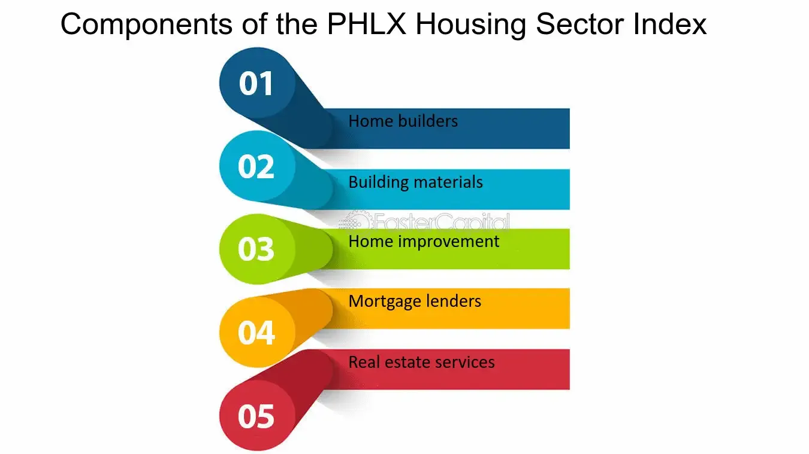

## Table of Contents

## What is the PHLX Housing Sector Index?

The PHLX Housing Sector Index, often referred to as HGX, is a stock market index that tracks the performance of companies involved in the housing industry. This includes businesses that build homes, make home products, and provide services related to housing. The index is managed by the Philadelphia Stock Exchange, which is why it has "PHLX" in its name.

The HGX is important because it gives investors a way to see how the housing market is doing overall. By looking at the HGX, people can understand if companies in the housing sector are doing well or not. This can help them make decisions about buying or selling stocks in these companies. The index includes a mix of big and small companies, so it gives a broad view of the housing industry.

## What are the main components of the PHLX Housing Sector Index?

The PHLX Housing Sector Index, or HGX, includes a variety of companies that are all connected to the housing industry. Some of the main companies in the index are big builders like D.R. Horton and Lennar. These companies build lots of homes all over the country. There are also companies that make things for homes, like Mohawk Industries, which makes flooring, and Masco, which makes things like faucets and cabinets.

Other important parts of the HGX are companies that help people buy homes. For example, there's Zillow, which helps people find homes to buy or rent online. There's also Rocket Companies, which helps people get loans to buy homes. These companies are important because they make it easier for people to enter the housing market.

The HGX tries to show how the whole housing industry is doing by including different types of companies. Some companies are big and well-known, while others are smaller but still important. By looking at the HGX, people can get a good idea of whether the housing market is strong or if it's struggling.

## How is the PHLX Housing Sector Index calculated?

The PHLX Housing Sector Index, or HGX, is calculated by looking at the stock prices of the companies in the index. Each company's stock price is important, but not all companies are treated the same. Some companies have a bigger impact on the index because they are bigger or more important to the housing industry. This is called "market capitalization weighting." It means that if a big company's stock price goes up or down a lot, it will change the index more than if a small company's stock price changes.

To find the value of the HGX, you start with a base value and then adjust it based on how the stock prices of the companies in the index change. If the stock prices go up, the index goes up. If the stock prices go down, the index goes down. The Philadelphia Stock Exchange keeps track of these changes and updates the index every day. This way, people can see how the housing industry is doing by looking at the HGX.

## Why is the PHLX Housing Sector Index important for investors?

The PHLX Housing Sector Index, or HGX, is important for investors because it helps them understand how the housing industry is doing. By looking at the HGX, investors can see if companies that build homes, make home products, and help people buy homes are doing well or not. This information is useful because it can help investors decide whether to buy or sell stocks in these companies. If the HGX is going up, it might be a good time to invest in housing companies. If it's going down, it might be better to wait or sell.

The HGX also gives investors a way to see the big picture of the housing market. Instead of looking at just one or two companies, the HGX shows how a whole group of housing-related companies is doing. This can help investors see trends and make smarter choices. For example, if the HGX is growing, it might mean that more people are buying homes and the economy is strong. If the HGX is falling, it might mean that fewer people are buying homes and the economy could be slowing down.

## Can you provide examples of companies included in the PHLX Housing Sector Index?

The PHLX Housing Sector Index, or HGX, includes different types of companies that are all part of the housing industry. Some of the companies in the HGX are big home builders like D.R. Horton and Lennar. These companies build lots of homes all over the country. Another company in the index is PulteGroup, which also builds homes and is known for its quality.

There are also companies that make things for homes in the HGX. For example, Mohawk Industries makes flooring, and Masco makes things like faucets and cabinets. These companies are important because they help make homes more comfortable and nice to live in. Another company in the index is Owens Corning, which makes insulation and roofing materials.

Some companies in the HGX help people buy homes. Zillow is one of these companies, and it helps people find homes to buy or rent online. Another company is Rocket Companies, which helps people get loans to buy homes. These companies make it easier for people to enter the housing market, which is why they are part of the HGX.

## How does the PHLX Housing Sector Index compare to other housing market indices?

The PHLX Housing Sector Index, or HGX, is different from other housing market indices because it focuses on the performance of companies in the housing industry. Other indices, like the S&P/Case-Shiller Home Price Indices, look at home prices in different cities. The HGX includes companies that build homes, make home products, and help people buy homes, so it gives investors a broad view of the housing market. This can be useful for investors who want to know how housing-related businesses are doing, not just how home prices are changing.

Another index that people often compare to the HGX is the Dow Jones U.S. Real Estate Index. This index includes companies involved in real estate, but it's broader than the HGX because it also includes companies that own and manage properties, not just those directly involved in building and selling homes. The HGX is more specific to the housing industry, so it can give a clearer picture of how home builders and related companies are doing. This makes it a good tool for investors who are interested in the housing sector specifically.

In summary, the HGX is unique because it focuses on companies directly involved in housing, while other indices might look at home prices or a wider range of real estate companies. By comparing the HGX to these other indices, investors can get a more complete understanding of the housing market and make better investment decisions.

## What historical trends can be observed in the PHLX Housing Sector Index?

The PHLX Housing Sector Index, or HGX, has shown some interesting trends over the years. One big trend is that the HGX often goes up and down with the overall economy. When the economy is doing well, more people want to buy homes, so home builders and companies that make home products do better. This makes the HGX go up. But when the economy is not doing well, fewer people buy homes, and the HGX goes down. For example, during the housing boom in the early 2000s, the HGX went up a lot. But then, during the housing crash in 2008, the HGX fell sharply.

Another trend we can see is that the HGX can be affected by interest rates. When interest rates are low, it's cheaper for people to borrow money to buy homes. This can make the HGX go up because more people can afford to buy homes. But when interest rates go up, borrowing money becomes more expensive, and fewer people buy homes, which can make the HGX go down. For example, in the years after the 2008 crash, when interest rates were kept very low, the HGX slowly started to recover. But whenever there are talks about raising interest rates, the HGX often shows some worry and might go down a bit.

## How does the PHLX Housing Sector Index react to economic changes?

The PHLX Housing Sector Index, or HGX, goes up and down based on how the economy is doing. When the economy is strong, people feel good about buying homes. This means more business for home builders and companies that make things for homes, so the HGX goes up. But when the economy is weak, people are less likely to buy homes. They might be worried about losing their jobs or not having enough money. This makes the HGX go down because fewer people are buying what these companies are selling.

Interest rates also play a big role in how the HGX reacts to economic changes. When interest rates are low, it's easier and cheaper for people to borrow money to buy homes. This can make the HGX go up because more people can afford to buy. But when interest rates go up, borrowing money becomes more expensive, and fewer people buy homes. This can make the HGX go down. So, the HGX is like a mirror that shows us how the housing market is feeling about the economy and interest rates.

## What are the criteria for a company to be included in the PHLX Housing Sector Index?

To be included in the PHLX Housing Sector Index, a company must be involved in the housing industry. This means they can be companies that build homes, make things for homes like flooring or faucets, or help people buy homes by providing loans or online home search services. The company also needs to be listed on a major U.S. stock exchange, like the New York Stock Exchange or the NASDAQ. This makes sure that the companies in the HGX are easy for investors to buy and sell.

The Philadelphia Stock Exchange, which manages the HGX, also looks at how big the company is. Bigger companies have a bigger impact on the index because they are more important to the housing industry. This is called market capitalization weighting. The HGX tries to include a mix of big and small companies to give a good picture of the whole housing market. By including different types of companies, the HGX shows investors how the housing industry is doing overall.

## How can investors use the PHLX Housing Sector Index to diversify their portfolios?

Investors can use the PHLX Housing Sector Index, or HGX, to diversify their portfolios by investing in a group of companies that are all part of the housing industry. Instead of putting all their money into just one or two housing companies, they can invest in the HGX and spread their risk across many different companies. This way, if one company does badly, it won't hurt their whole investment as much. The HGX includes big home builders, companies that make things for homes, and companies that help people buy homes, so it gives a broad view of the housing market.

Another way investors can use the HGX to diversify is by balancing their investments across different sectors of the economy. If an investor already has a lot of money in tech or healthcare stocks, adding some HGX to their portfolio can help balance things out. The housing industry often moves differently than other parts of the economy, so it can help smooth out the ups and downs of their overall investments. By including the HGX, investors can have a more stable and diversified portfolio, which can help them feel more secure about their investments.

## What are some advanced trading strategies involving the PHLX Housing Sector Index?

One advanced trading strategy involving the PHLX Housing Sector Index, or HGX, is called sector rotation. This means moving money from one part of the economy to another based on where things are doing well. If an investor thinks the housing market is about to do better than other parts of the economy, they might buy more HGX. They could do this by buying stocks of companies in the HGX or by buying exchange-traded funds (ETFs) that track the HGX. When they think the housing market is going to slow down, they might sell some of their HGX investments and put the money into other sectors. This strategy can help them make money by being in the right place at the right time.

Another strategy is using options on the HGX. Options are like bets on whether the HGX will go up or down. An investor might buy a call option if they think the HGX is going to go up. This gives them the right to buy the HGX at a certain price in the future. If the HGX does go up, they can make money. If they think the HGX is going to go down, they might buy a put option. This gives them the right to sell the HGX at a certain price in the future. If the HGX does go down, they can make money. Options can be risky, but they can also help investors make money in different ways than just buying and selling stocks.

A third strategy is using technical analysis to find good times to buy or sell HGX. This means looking at charts and patterns to see where the HGX might be going next. For example, an investor might look for times when the HGX is at the bottom of a trend and about to go back up. They could buy the HGX at that point and then sell it when it reaches the top of the trend. Or they might use moving averages to see if the HGX is going up or down over time. By using these patterns and signals, investors can try to time their trades better and make more money.

## How do global economic factors influence the performance of the PHLX Housing Sector Index?

Global economic factors can have a big impact on the PHLX Housing Sector Index, or HGX. One way this happens is through changes in the world economy. If other countries are doing well, it can help the U.S. economy grow too. More people might want to buy homes in the U.S. because they feel good about their jobs and money. This can make the HGX go up because more people are buying what the companies in the HGX are selling. But if other countries are not doing well, it can make the U.S. economy slow down. Fewer people might want to buy homes, and the HGX could go down because there's less business for the companies in the index.

Another way global economic factors influence the HGX is through interest rates. Many countries work together on interest rates, and if rates go up in other countries, it can affect the U.S. too. When interest rates are high, it's harder for people to borrow money to buy homes. This can make the HGX go down because fewer people are buying homes. On the other hand, if interest rates are low in other countries, it can help keep U.S. rates low too. This makes it easier for people to borrow money and buy homes, which can make the HGX go up. So, what happens in the world economy can really change how well the HGX does.

## What is the PHLX Housing Sector Index (HGX) and how can it be understood?

The PHLX Housing Sector Index (HGX) is a benchmark index designed to gauge the performance of companies within the housing sector, primarily focusing on industries related to home building and manufacturing. This index serves as a vital tool for investors and analysts to assess fluctuations in the housing market and related sectors, providing insight into broader economic trends.

The inception of the HGX traces back to July 12, 2002, when it was introduced by the Philadelphia Stock Exchange as a means to track housing-related companies. Since its creation, the HGX has undergone various transitions, adapted to changes in the market, and integrated with NASDAQ OMX following the Philadelphia Stock Exchange's acquisition in 2008. One significant milestone included its adaptation to the rapid technological and algorithmic advancements in trading, facilitating greater accessibility and real-time data for traders and investors.

The calculation of the HGX involves a market capitalization-weighted approach, where the index value is determined by the aggregated market values of its constituent companies, adjusted by specific factors to reflect dividends and stock splits accurately. Two primary forms of the index exist: the price return index and the total return index. The price return index tracks only the price movements of the constituent stocks, whereas the total return index incorporates dividends reinvested, offering a comprehensive view of the index's performance. The formula for the index can be represented as:

$$
\text{Index Level} = \frac{\sum (\text{Price}_i \times \text{Shares}_i \times \text{Adjustment Factor}_i)}{\text{Divisor}}
$$

where $\text{Price}_i$ is the price of company $i$, $\text{Shares}_i$ is the number of shares of company $i$, and the Adjustment Factor applies any dividend or split adjustments.

Historically, the HGX has been susceptible to many key events affecting the housing sector. The 2008 financial crisis had a profound impact, leading to a significant drop in the index as housing markets collapsed. More recently, the COVID-19 pandemic in 2020 prompted fluctuations as housing demand shifted dramatically due to economic uncertainties and changing consumer behavior. These events have underscored the sensitivity of the HGX to macroeconomic conditions and regulatory changes, reflecting its role as a barometer for the housing sector's health and transformation over time.

## References & Further Reading

[1]: ["Advances in Financial Machine Learning"](https://www.amazon.com/Advances-Financial-Machine-Learning-Marcos/dp/1119482089) by Marcos Lopez de Prado

[2]: ["Machine Learning for Algorithmic Trading"](https://github.com/stefan-jansen/machine-learning-for-trading) by Stefan Jansen

[3]: ["Quantitative Trading: How to Build Your Own Algorithmic Trading Business"](https://www.amazon.com/Quantitative-Trading-Build-Algorithmic-Business/dp/1119800064) by Ernest P. Chan

[4]: ["Evidence-Based Technical Analysis: Applying the Scientific Method and Statistical Inference to Trading Signals"](https://www.amazon.com/Evidence-Based-Technical-Analysis-Scientific-Statistical/dp/0470008741) by David Aronson

[5]: Case, K. E., & Shiller, R. J. (2003). ["Is There a Bubble in the Housing Market?"](http://www.econ.yale.edu/~shiller/pubs/p1089.pdf) National Bureau of Economic Research Working Paper No. 10870.