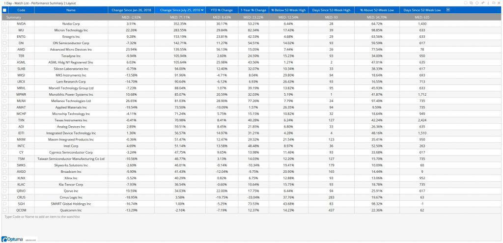

The SOX Index, formally known as the Philadelphia Semiconductor Index, is a crucial barometer for the semiconductor sector, encompassing 30 leading semiconductor companies. This index is pivotal for gauging the overall health and trends within a sector that is fundamental to modern technology, powering everything from smartphones to complex data centers. Given its composition of prominent semiconductor firms, the SOX Index stands as a vital tool for investors seeking insights into technological advancements and market dynamics associated with semiconductors.

Established by the Philadelphia Stock Exchange, now a part of Nasdaq, the PHLX Semiconductor Index plays a key role in the financial markets by specifically tracking the performance of semiconductor stocks. This index helps investors and market analysts understand sector-specific performances, enabling them to make informed decisions based on the trends and analyses derived from its components. As technology continues to evolve, the PHLX Semiconductor Index provides a benchmark against which the growth and challenges of the semiconductor industry can be measured.

Algorithmic trading, an increasingly prominent force in the financial markets, has significantly influenced the semiconductor sector. This form of trading uses computer algorithms to execute trades at speeds and volumes beyond the capability of human traders. Algorithmic trading has introduced new efficiencies and complexities to trading semiconductor stocks, enhancing liquidity and market depth while introducing new risks, such as volatility spikes driven by automated processes.

Understanding these elements—SOX Index, PHLX Semiconductor Index, and algorithmic trading—is vital for investors and traders aiming to navigate the semiconductor sector's intricacies. Each component influences investment strategies, risk management, and decision-making processes. The interplay between these elements highlights the necessity for investors to stay informed about technological advancements and market developments.

This article aims to explore each component thoroughly, providing a comprehensive understanding of how they interconnect and influence the semiconductor investment landscape. Through examining the SOX Index and PHLX Semiconductor Index’s significance and how algorithmic trading integrates with these indices, readers will gain valuable insights into investment opportunities and challenges within this pivotal sector.

## Table of Contents

## Understanding the SOX Index

The Philadelphia Semiconductor Index (SOX) is a vital benchmark that tracks the performance of companies within the semiconductor industry. Established on December 1, 1993, the SOX index is a modified market capitalization-weighted index comrpising 30 securities primarily involved in the design, distribution, manufacture, and sale of semiconductors. Its significant components include industry leaders such as Intel, Nvidia, and TSMC, reflecting a broad spectrum of the sector's activities and trends.

The relevance of these components is underscored by their substantial contribution to semiconductor innovation and market dynamics. For instance, companies like TSMC play a critical role in chip manufacturing processes, which are foundational to technological advancements across various sectors, including consumer electronics and automotive industries. Each company's influence is adjusted based on market capitalization, ensuring the index remains reflective of actual market conditions.

Historically, the SOX index has exhibited fluctuations influenced by technological cycles, macroeconomic factors, and evolving industry dynamics. For example, the dot-com bubble in the late 1990s and the global financial crisis of 2008 impacted the index, showcasing its susceptibility to both market exuberance and economic downturns. However, the long-term trend has been upward, consistent with rapid technological advancements and growing demand for semiconductor products. Volatility is common; for instance, the index might record annualized [volatility](/wiki/volatility-trading-strategies) rates that exceed those of broader market indices, reflecting the sector's fast-paced and innovation-driven nature.

Technological advancements are pivotal in shaping the SOX index. Innovations such as new semiconductor materials, enhanced fabrication technologies, and developments in AI and IoT have propelled growth in the semiconductor market, thereby influencing the performance of the index. As semiconductors become more integral to cutting-edge technology, from autonomous vehicles to advanced computing systems, the index's trajectory is closely correlated with these technological milestones.

Investors keenly follow the SOX index as it offers critical insights into the semiconductor sector's current and future states. It serves as a barometer for economic health within the technology sector, providing a snapshot of how various drivers, from consumer demand to geopolitical factors, are impacting the broader market. Moreover, the index's behavior can hint at broader economic trends, given the integral role of semiconductors in a variety of industries. Thus, in-depth analysis of the SOX provides investors with opportunities to craft informed investment strategies and anticipate market movements in technology-reliant sectors.

 to PHLX Semiconductor

The PHLX Semiconductor Index (SOXX) represents a critical benchmark for tracking the progress of the semiconductor sector in the financial markets. It comprises 30 firms primarily involved in the design, distribution, manufacture, and sale of semiconductors. The performance of this index is vital for investors, industry analysts, and traders as it reflects the sector's health and its alignment with technological advancements.

The PHLX Semiconductor Index functions by providing a consolidated view of the semiconductor market. It uses a modified market capitalization-weighted methodology, where components are weighted according to their respective market capitalizations, subject to certain constraints. This weighting mechanism ensures that no single company dominates the index, allowing for a balanced representation of the sector.

In comparing the PHLX Semiconductor Index with other indices, such as the Dow Jones U.S. Semiconductor Index (DJUSSC) or the MSCI ACWI Semiconductors Index, it emerges as a focused and industry-specific benchmark. While the other indices may include a broader range of technology-related stocks, the PHLX is dedicated solely to semiconductors, offering targeted insights for investors closely following this industry.

The role of the PHLX Semiconductor Index in providing market insights is significant. It serves as a barometer for the semiconductor sector's performance, aiding investors in making informed decisions. By analyzing the movement of the index, stakeholders can gauge the impact of market trends, technological breakthroughs, and macroeconomic factors on semiconductor companies.

Case studies exemplify the PHLX's influence on decision-making within the industry. For instance, during periods of rapid technological innovation, companies within the index may experience significant valuation shifts. By monitoring these trends, investors and firms can adjust their strategies to mitigate risks and capitalize on opportunities presented by emerging technologies.

Furthermore, the PHLX Semiconductor Index is intrinsically linked with the broader technology market due to the critical role semiconductors play in technological innovation. As semiconductor components are integral to gadgets, computers, and infrastructure, their performance often correlates with the wider tech industry's health. Consequently, fluctuations in the PHLX index can signal changes in investor sentiment across the technology sector.

In summary, the PHLX Semiconductor Index is an indispensable tool for those interested in the semiconductor market. It not only captures the performance of key sector players but also provides a lens through which broader technological and market trends can be understood. This makes it a crucial index for anyone involved in the semiconductor arena.

## The Rise of Algorithmic Trading

Algorithmic trading refers to the use of computer algorithms to automate trading decisions, allowing transactions to be executed at optimal speeds and with precision beyond human capability. These algorithms follow a pre-set sequence of instructions to gauge market data and determine necessary actions in financial marketplaces, such as the buying or selling of assets. Typically, [algorithmic trading](/wiki/algorithmic-trading) optimizes trading by slicing large orders into smaller, more manageable segments—which are then sent out based on the algorithm’s dictates. 

Algorithmic trading is reshaping the semiconductor sector dramatically, specifically by dictating the flow and [liquidity](/wiki/liquidity-risk-premium) standards of indices, such as the Philadelphia Semiconductor Index (SOX). The incorporation of algorithms enables traders to adjust swiftly to the market’s fast-paced changes which are especially pertinent given the rapid technological advancements inherent in the semiconductor industry. Several trends and tools have gained popularity within this space, such as [machine learning](/wiki/machine-learning) models fed with vast arrays of historical price data, which are then tasked to predict market movements. High-frequency trading ([HFT](/wiki/high-frequency-trading-strategies)) systems capitalize on algorithms to execute trades across multiple markets in fractions of a second, taking advantage of inefficiencies and [arbitrage](/wiki/arbitrage) opportunities.

The advantages of algorithmic trading for investors focused on the SOX Index are substantial. Algorithms provide enhanced market accessibility and allow for the swift shifts between stocks on the index, maximizing profits while minimizing risks. Furthermore, they offer a robust approach to decision-making, relying on real-time data analysis and reducing the emotional biases that often affect human trades. For those keenly observing the SOX Index, algorithmic trading presents the potential to anticipate and mitigate the adverse impacts of market volatility.

However, algorithmic trading is not without challenges and risks, especially in volatile industries like semiconductors. One primary concern lies in the market's potential susceptibility to flash crashes—sudden, drastic declines in stock prices that can occur when algorithms interact unpredictably. The dependency on technology also poses systemic risks, as any glitches could potentially lead to unintended trades with substantial financial repercussions. Additionally, regulatory scrutiny is mounting as regulators seek to ensure that algorithmic strategies contribute positively to market function rather than disruption.

In summary, algorithmic trading is transforming the semiconductor market by introducing efficiencies and precision which are invaluable for navigating the complex terrain of the SOX Index. Despite the risks, the evolution of this technology signals profound shifts in how trades are executed and understood within the financial ecosystem.

## Impact of Algo Trading on the SOX Index and PHLX Semiconductor

Algorithmic trading has significantly influenced the performance and dynamics of the SOX Index and PHLX Semiconductor, reshaping how investors and traders approach these markets. Algorithmic strategies manipulate vast datasets to optimize trading decisions, often leading to changes in market behavior and index performance.

One notable impact of algorithmic trading on the SOX Index is its role in enhancing liquidity and market efficiency. Algorithms can execute trades at speeds and volumes unattainable by human traders, thus ensuring that buy and sell orders are processed swiftly. This rapid execution reduces the bid-ask spread, a crucial measure of market liquidity. Algorithmic trading also facilitates market efficiency by providing more accurate price discovery, reflecting the real-time valuation of semiconductor stocks more precisely. 

Specific components of the PHLX Semiconductor Index have also been affected by algorithmic trading. For example, companies with high-frequency trading (HFT) capabilities often witness increased trading activity. These companies experience significant price fluctuations due to the high-speed nature of algorithmic trading, which can create opportunities or risks depending on market conditions. Algorithms may also target specific index components based on [momentum](/wiki/momentum), [volume](/wiki/volume-trading-strategy) patterns, and historical performance data, influencing their market valuations more drastically than others.

However, the rise of algorithmic trading has attracted regulatory scrutiny. Regulators are increasingly concerned about the potential for algorithms to exacerbate market volatility or engage in manipulative practices. The "flash crash" phenomenon, where markets experience rapid, significant losses within minutes, is often linked to algorithmic trading. Thus, regulators are instituting measures such as circuit breakers and other safeguards to protect against such events.

Looking towards the future, algorithmic trading is expected to further evolve, potentially reshaping the SOX Index. Machine learning and [artificial intelligence](/wiki/ai-artificial-intelligence) advancements can lead to more sophisticated trading algorithms capable of making even more precise predictions based on vast, complex data sets. These technologies could improve predictive accuracy for semiconductor stocks and refine trading strategies to enhance returns or risk mitigation. As such, continuous development and implementation of innovative algorithmic solutions will likely be pivotal in shaping future trends in the SOX Index. Investors and traders must remain vigilant, adapting to the evolving landscape to leverage the benefits while managing inherent risks.

## Investment Strategies Involving the SOX Index and Algo Trading

Investors seeking strategies involving the SOX Index and algorithmic trading should consider a multifaceted approach to optimize returns. 

Practical strategies for leveraging algorithmic trading with the SOX Index include developing models that capitalize on high-frequency trading opportunities and long-term investment patterns. By designing algorithms that exploit intraday volatility, investors can harness short-term price movements within the SOX Index. This requires sophisticated algorithms capable of rapid execution to react promptly to market developments. For instance, implementing mean-reversion or momentum-based strategies can help capitalize on short-term fluctuations.

Diversification techniques utilizing insights from the PHLX Semiconductor are crucial for balancing risk and enhancing portfolio resilience. The PHLX provides critical data for sector-specific performance, enabling investors to make informed decisions. By monitoring sector trends and individual stock performance within the PHLX, investors can diversify across different semiconductor components, thereby mitigating risk associated with single-stock exposure.

When considering long-term versus short-term algorithmic strategies, investors need to evaluate their risk tolerance and investment objectives. Long-term strategies often focus on the fundamental value of semiconductor stocks, leveraging algorithms to optimize entry and [exit](/wiki/exit-strategy) points over extended periods. Conversely, short-term strategies might prioritize technical indicators and trading signals. Balancing these approaches ensures a dynamic strategy adaptable to varying market conditions.

Risk management practices are essential to protect investments from algorithmic trading anomalies. Implementing stop-loss mechanisms and defining risk parameters help prevent significant losses. Additionally, continually [backtesting](/wiki/backtesting) algorithms against historical data can significantly reduce the likelihood of unforeseen outcomes. Understanding the impact of latency and ensuring algorithm robustness under different market scenarios further safeguard investments.

The integration of AI and machine learning represents a significant advancement in refining algorithmic trading strategies for the SOX Index. Machine learning models can analyze massive datasets to identify patterns and predict market movements with improved accuracy. Python libraries such as SciKit-Learn and TensorFlow facilitate the development of predictive models that enhance decision-making capabilities. For example, using a machine learning model to predict volatility trends can optimize trade timings and improve overall strategy performance.

In summary, investors utilizing algorithmic trading in the context of the SOX Index should adopt a strategy that harmonizes short- and long-term goals, leverages insights from PHLX Semiconductor, implements robust risk management, and integrates cutting-edge AI technologies for superior outcomes.

## Conclusion

The Philadelphia Semiconductor Index (SOX) and the PHLX Semiconductor Index have proven to be vital indicators in the semiconductor industry, with each index providing indispensable insight into market conditions and future growth prospects. Understanding the intricate dynamics of these indices is crucial for investors aiming to tap into the semiconductor sector's potential. Algorithmic trading has further enhanced these indices' relevance by revolutionizing trading processes and outcomes through automation and advanced data analytics.

Integrating the SOX Index, PHLX Semiconductor, and algorithmic trading is strategically crucial for investors seeking to capitalize on semiconductor market fluctuations. By leveraging the capabilities of algorithmic trading, investors can execute trades with optimal timing and precision, enhancing liquidity and efficiency in semiconductor transactions. This integration provides a competitive edge in investment strategies, ensuring that investors can effectively navigate market volatilities and changing technological landscapes.

Looking ahead, the semiconductor sector promises significant opportunities, driven by continuous technological advancements and a growing reliance on digital and electronic solutions. The ever-evolving landscape of trading technologies, including machine learning and artificial intelligence, will further shape the future of the semiconductor markets, offering enhanced analytical capabilities and trading strategies that are more adaptive and predictive. As the semiconductor industry continues to evolve, it remains crucial for investors to stay informed, monitoring market developments and incorporating innovative trading methodologies.

In conclusion, a meticulous understanding of the SOX Index, PHLX Semiconductor, and algorithmic trading is indispensable for success in semiconductor investments. Investors are encouraged to continually research these components, ensuring that they remain adaptable and prepared for changes in this dynamic sector. By maintaining a proactive approach to monitoring and integrating these elements, investors can effectively capitalize on the myriad opportunities within the semiconductor market.

## References & Further Reading

[1]: Slater, M. (2020). ["PHLX Semiconductor Sector Index and the Role of Algo Trading"](https://indexes.nasdaqomx.com/docs/FS_SOX.pdf) Nasdaq.

[2]: Lopez de Prado, M. (2018). ["Advances in Financial Machine Learning"](https://www.amazon.com/Advances-Financial-Machine-Learning-Marcos/dp/1119482089). Wiley.

[3]: Chan, E. (2008). ["Quantitative Trading: How to Build Your Own Algorithmic Trading Business"](https://github.com/ftvision/quant_trading_echan_book). Wiley.

[4]: Aronson, D. (2006). ["Evidence-Based Technical Analysis: Applying the Scientific Method and Statistical Inference to Trading Signals"](https://www.amazon.com/Evidence-Based-Technical-Analysis-Scientific-Statistical/dp/0470008741). Wiley.

[5]: Jansen, S. (2018). ["Machine Learning for Algorithmic Trading"](https://searchworks.stanford.edu/view/13246850). Packt Publishing.