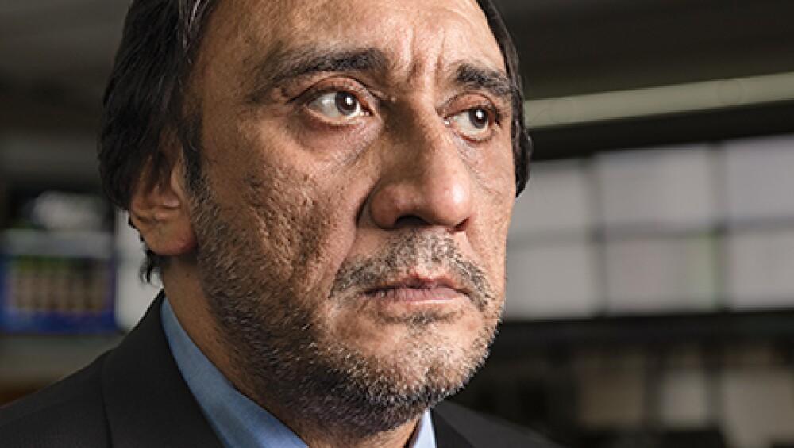

## Table of Contents

## Who is Phupinder Gill?

Phupinder Gill is a person who used to work at the Chicago Mercantile Exchange (CME). He was the CEO there for a long time, from 2007 until he retired in 2016. The CME is a big place where people buy and sell things like corn, oil, and even money from different countries. Phupinder helped make the CME grow and become more important in the world.

Before he was the CEO, Phupinder worked in different jobs at the CME. He started working there in 1992 and slowly moved up to bigger roles. He was good at his job and helped the company a lot. People respected him and thought he did a great job leading the CME.

## What is Phupinder Gill's professional background?

Phupinder Gill started working at the Chicago Mercantile Exchange (CME) in 1992. He began in a smaller role and over time, he took on bigger and more important jobs. He worked hard and learned a lot about how the exchange worked. This helped him move up in the company.

In 2007, Phupinder became the CEO of the CME. He led the company for nine years until he retired in 2016. During his time as CEO, he helped the CME grow and become more important around the world. People thought he did a good job and respected him for his leadership.

## What are the key positions Phupinder Gill has held in his career?

Phupinder Gill started his career at the Chicago Mercantile Exchange (CME) in 1992. He began in a smaller role and worked his way up in the company. Over the years, he took on more important jobs and learned a lot about how the exchange worked.

In 2007, Phupinder became the CEO of the CME. This was a big job where he was in charge of the whole company. He stayed as the CEO for nine years until he retired in 2016. During his time as CEO, he helped the CME grow and become more important around the world.

## What industry does Phupinder Gill primarily work in?

Phupinder Gill primarily works in the financial industry, specifically in the field of futures and options trading. He spent most of his career at the Chicago Mercantile Exchange (CME), which is a big place where people buy and sell things like corn, oil, and money from different countries.

At the CME, Phupinder started working in 1992 and eventually became the CEO in 2007. He led the company for nine years until he retired in 2016. During his time as CEO, he helped the CME grow and become more important around the world.

## What are some of Phupinder Gill's notable achievements in his field?

Phupinder Gill helped the Chicago Mercantile Exchange (CME) grow a lot during his time as CEO. He started working at the CME in 1992 and became the CEO in 2007. Under his leadership, the CME became more important around the world. He worked hard to make the company bigger and better. People respected him and thought he did a great job leading the CME.

One of Phupinder's big achievements was helping the CME merge with the Chicago Board of Trade (CBOT) in 2007. This made the CME even bigger and stronger. It also helped the company offer more things for people to buy and sell. Phupinder's leadership was important in making this happen. He stayed as the CEO until he retired in 2016, and during that time, he kept working to make the CME successful.

## How has Phupinder Gill contributed to the development of his industry?

Phupinder Gill has made big contributions to the financial industry, especially in futures and options trading. He started working at the Chicago Mercantile Exchange (CME) in 1992 and became the CEO in 2007. During his time as CEO, he helped the CME grow and become more important around the world. He worked hard to make the company bigger and better. People respected him and thought he did a great job leading the CME.

One of Phupinder's big achievements was helping the CME merge with the Chicago Board of Trade (CBOT) in 2007. This made the CME even bigger and stronger. It also helped the company offer more things for people to buy and sell. Phupinder's leadership was important in making this happen. He stayed as the CEO until he retired in 2016, and during that time, he kept working to make the CME successful.

## What leadership qualities does Phupinder Gill exhibit?

Phupinder Gill shows many good leadership qualities. He is hard-working and dedicated. He started at the Chicago Mercantile Exchange (CME) in a small job and worked his way up to become the CEO. This shows he is patient and willing to learn and grow. He also helped the CME grow a lot during his time as CEO. This shows he is good at making plans and getting things done.

Another important quality Phupinder has is his ability to lead big changes. He helped the CME merge with the Chicago Board of Trade (CBOT). This was a big deal that made the CME stronger and more important. It shows he can handle big projects and make them successful. People respected him and thought he did a great job leading the CME. This shows he is good at working with others and [earning](/wiki/earning-announcement) their trust.

## What challenges has Phupinder Gill faced in his career and how did he overcome them?

Phupinder Gill faced many challenges during his career at the Chicago Mercantile Exchange (CME). One big challenge was leading the company through the financial crisis in 2008. This was a hard time for many businesses, and the CME needed to stay strong. Phupinder had to make sure the company kept working well and helped people who used the exchange. He worked hard to keep the CME stable and trusted during this tough time.

Another challenge was merging the CME with the Chicago Board of Trade (CBOT) in 2007. This was a big project that needed a lot of planning and hard work. Phupinder had to make sure both companies worked well together and that the merger made the new company stronger. He overcame this challenge by being a good leader and working with everyone involved to make the merger successful. In the end, the merger helped the CME grow and become more important in the world.

## What is Phupinder Gill's approach to innovation and technology in his field?

Phupinder Gill believes that innovation and technology are very important in the financial industry. When he was the CEO of the Chicago Mercantile Exchange (CME), he worked hard to use new technology to make the company better. He knew that using computers and the internet could help people buy and sell things more easily. So, he made sure the CME used the latest technology to stay ahead of other companies.

One way Phupinder used technology was by making the CME's trading systems better. He helped create new ways for people to trade things like corn, oil, and money from different countries. This made it easier and faster for people to do their business. Phupinder's focus on technology helped the CME grow and become more important around the world.

## How does Phupinder Gill influence corporate strategy and decision-making?

Phupinder Gill has a big impact on how companies make plans and decisions. When he was the CEO of the Chicago Mercantile Exchange (CME), he helped the company grow by making smart choices. He looked at what the company needed and what people wanted. Then, he made plans to make the CME bigger and better. He was good at seeing the big picture and figuring out what steps to take to reach the company's goals.

One way Phupinder influenced corporate strategy was by leading the merger with the Chicago Board of Trade (CBOT). This was a big decision that made the CME stronger. He worked with other leaders to plan the merger and make sure it went well. Phupinder also used technology to help the company. He knew that using new tools could make trading easier and faster. So, he made sure the CME used the latest technology to stay ahead of other companies. His focus on technology and smart planning helped the CME become more important around the world.

## What is Phupinder Gill's vision for the future of his industry?

Phupinder Gill believes that the future of the financial industry will be shaped a lot by technology. He thinks that new tools and computers will make trading even easier and faster. He wants to see the industry use these new technologies to help people buy and sell things like corn, oil, and money from different countries more smoothly. Phupinder believes that staying ahead with technology will keep companies like the Chicago Mercantile Exchange (CME) strong and important in the world.

He also thinks that working together with other companies is important for the future. Phupinder helped the CME merge with the Chicago Board of Trade (CBOT), which made the CME bigger and stronger. He believes that more mergers and partnerships can help the industry grow and offer more things for people to trade. By working together, companies can share their knowledge and resources to make the whole industry better.

## What lessons can aspiring professionals learn from Phupinder Gill's career?

Aspiring professionals can learn a lot from Phupinder Gill's career. One big lesson is the importance of hard work and dedication. Phupinder started at the Chicago Mercantile Exchange (CME) in a small job and worked his way up to become the CEO. This shows that if you keep working hard and learning, you can achieve big things. Another lesson is the value of patience and long-term planning. Phupinder took his time to grow in his career and made smart plans to help the CME grow. This teaches us that success often comes from thinking about the future and working towards it step by step.

Another important lesson from Phupinder's career is the need to embrace change and innovation. He helped the CME use new technology to make trading easier and faster. This shows that being open to new ideas and tools can help you stay ahead in your field. Phupinder also led the merger with the Chicago Board of Trade (CBOT), which made the CME stronger. This teaches us that working with others and being willing to change can lead to big successes. By following these lessons, aspiring professionals can learn how to grow in their careers and make a positive impact in their industries.

## References & Further Reading

[1]: ["CME Group Overview"](https://www.cmegroup.com/company/visit/files/cme-group-overview.pdf) - CME Group Website

[2]: Kroszner, R. S., & Melamed, L. J. (2013). ["The History and Future of the CME: The Changing Cash Market for Commercial Paper."](https://www.nber.org/system/files/working_papers/w7582/w7582.pdf) Chicago Federal Reserve.

[3]: ["Advances in Financial Machine Learning"](https://www.amazon.com/Advances-Financial-Machine-Learning-Marcos/dp/1119482089) by Marcos Lopez de Prado

[4]: Aldridge, I. (2013). ["High-Frequency Trading: A Practical Guide to Algorithmic Strategies and Trading Systems."](https://www.amazon.com/High-Frequency-Trading-Practical-Algorithmic-Strategies/dp/1118343506) Wiley.

[5]: ["Algorithmic Trading and DMA: An Introduction to Direct Access Trading Strategies"](https://archive.org/details/algorithmictradi0000john) by Barry Johnson