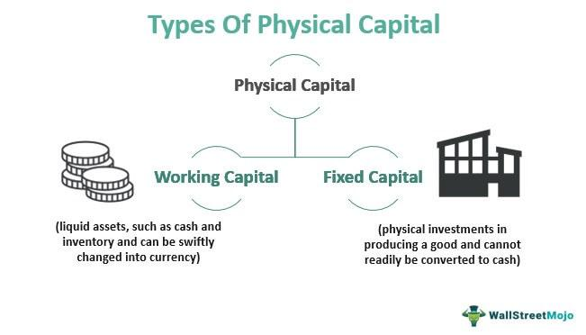

## Table of Contents

## What is physical capital?

Physical capital refers to the tangible, man-made items that are used in the production of goods and services. This includes things like machinery, buildings, tools, and vehicles. These items are essential for businesses to operate efficiently and produce the products or services they offer. Physical capital is different from other types of capital, like human capital (skills and knowledge) and financial capital (money), because it is something you can touch and see.

Investing in physical capital can help a business grow and become more productive. For example, if a factory buys a new machine that can produce items faster than the old one, the factory can make more products in less time. This can lead to more sales and higher profits. Over time, physical capital can wear out or become outdated, so businesses need to keep maintaining and updating their equipment to stay competitive.

## How does physical capital differ from human capital?

Physical capital is all about the stuff you can touch and see that helps make things or provide services. This includes machines, buildings, tools, and trucks. These things are important because they help businesses do their work faster and better. For example, a bakery needs ovens to bake bread. Without ovens, the bakery can't make bread, so the ovens are a big part of what makes the bakery successful.

Human capital is different because it's about the skills, knowledge, and experience that people have. It's not something you can touch, but it's really important for businesses too. For example, the baker at the bakery needs to know how to mix the dough and bake it just right. The more the baker knows and the better they are at their job, the better the bread will be. So, while physical capital is about the tools and machines, human capital is about the people who use them.

## What are the main types of physical capital?

Physical capital includes things like machinery and equipment. These are the tools and machines businesses use to make products. For example, a car factory uses robots to put cars together. These robots are physical capital because they help the factory make cars faster and better.

Another type of physical capital is buildings and structures. These are places where businesses do their work. A store needs a building to sell things to customers. A factory needs a building to house its machines and workers. These buildings are physical capital because they are important for the business to operate.

Lastly, there are vehicles and transportation equipment. These help move things from one place to another. A delivery company needs trucks to bring packages to people's homes. A construction company needs bulldozers to move dirt and build roads. These vehicles are physical capital because they help businesses get their work done.

## Can you give examples of tangible physical capital?

Tangible physical capital includes things like machines and equipment. A good example is a sewing machine in a clothing factory. The sewing machine helps workers sew clothes quickly and neatly. Another example is a computer in an office. The computer helps people do their work, like writing emails or making spreadsheets. These machines and equipment are important because they help businesses do their jobs better and faster.

Another type of tangible physical capital is buildings and structures. For example, a supermarket is a building where people can buy food and other things. The supermarket needs a building to store all its products and for customers to shop in. A school is another example. The school needs buildings for classrooms where students can learn. These buildings are important because they give businesses and organizations a place to do their work.

Vehicles and transportation equipment are also tangible physical capital. A delivery truck is a good example. A company like Amazon uses delivery trucks to bring packages to people's homes. Another example is a forklift in a warehouse. The forklift helps workers move heavy boxes and pallets around. These vehicles and equipment are important because they help businesses move things from one place to another.

## What is the role of physical capital in economic growth?

Physical capital plays a big role in helping the economy grow. It includes things like machines, buildings, and vehicles that businesses use to make stuff or provide services. When businesses invest in new and better physical capital, they can make more things faster and with less cost. This means they can sell more and make more money. As businesses grow, they can hire more people, which helps the whole economy because more people have jobs and can buy things.

Over time, having good physical capital makes the economy stronger. If a country keeps updating its machines and building new factories, it can keep making new products and staying competitive with other countries. This is important because it helps the country's businesses stay strong and keep growing. When businesses are doing well, they pay more taxes, which the government can use to build roads, schools, and other things that help everyone. So, physical capital is a key part of making the economy grow and keeping it healthy.

## How do businesses acquire physical capital?

Businesses can get physical capital in a few ways. One way is by buying it with their own money. If a business has saved up enough, it can use that money to buy new machines or build a new factory. Another way is by borrowing money from a bank or investors. The business can take out a loan or sell shares to get the money it needs. Then, it can use that money to buy the physical capital it needs to grow.

Sometimes, businesses can also lease or rent physical capital instead of buying it. This can be a good option if they don't want to spend a lot of money upfront or if they need the equipment for a short time. Leasing means they can use the machines or buildings without owning them. It's like renting an apartment instead of buying a house. This way, businesses can still use the physical capital they need without having to pay for it all at once.

## What are the maintenance costs associated with physical capital?

Keeping physical capital in good shape can cost money. Businesses have to pay for things like fixing machines when they break, painting buildings to keep them looking nice, and making sure vehicles are safe to use. These costs can add up over time. If a business doesn't take care of its physical capital, it might have to stop working until things are fixed, which can mean losing money.

Sometimes, businesses need to spend money to update their physical capital. This can mean buying new machines that are better than the old ones or making changes to buildings to make them more useful. These updates can help the business work better and make more money in the long run, but they can be expensive at first. It's important for businesses to think about these costs when they plan how to use their money.

## How does depreciation affect physical capital?

Depreciation is when physical capital loses value over time. This happens because machines wear out, buildings get old, and vehicles need more repairs as they get used. When a business buys physical capital, like a new machine, it starts to lose value right away. This is important for businesses to know because they need to plan for buying new things to replace the old ones.

Depreciation also affects how businesses keep track of their money. They can write off the cost of the physical capital over time on their taxes. This means they don't have to pay taxes on the full cost of the machine all at once. Instead, they can spread it out over the years the machine is used. This helps businesses manage their money better and plan for the future.

## What strategies can be used to optimize the use of physical capital?

Businesses can optimize the use of physical capital by making sure they use their machines, buildings, and vehicles as much as possible. This means keeping them busy and working all the time. If a machine is sitting idle, it's not helping the business make money. So, businesses can plan their work to make sure all their physical capital is being used. They can also train their workers to use the machines better and faster, which helps get more work done.

Another way to optimize physical capital is by taking good care of it. Regular maintenance and repairs can keep machines running smoothly and prevent big problems later. Businesses can also think about upgrading their physical capital to newer, more efficient models. This might cost money at first, but it can save money in the long run because new machines can work faster and use less energy. By keeping their physical capital in good shape and using it wisely, businesses can make the most out of what they have.

## How do technological advancements impact the value and types of physical capital?

Technological advancements can change the value and types of physical capital a lot. When new technology comes out, old machines and tools can become less valuable because they're not as good as the new ones. For example, if a new computer comes out that's faster and cheaper than the old ones, businesses might want to switch to the new computers. This makes the old computers worth less money. Also, new technology can create new types of physical capital. For instance, when robots started being used in factories, they became a new kind of physical capital that businesses could use to make things faster and better.

Because of technological advancements, businesses need to keep updating their physical capital to stay competitive. If they don't, they might fall behind other businesses that have newer, better machines. This means businesses have to think about the cost of buying new technology and how it will help them in the long run. Keeping up with technology can be expensive, but it can also help businesses make more money and stay ahead of their competition. So, technological advancements push businesses to always look for new and better ways to use physical capital.

## What are the environmental considerations when managing physical capital?

When businesses manage their physical capital, they need to think about how it affects the environment. Machines and vehicles can use a lot of energy and create pollution. If businesses use old machines that aren't efficient, they might use more energy than they need to. This can harm the environment by using up resources and making the air and water dirty. To help the environment, businesses can choose physical capital that uses less energy and creates less pollution. They can also recycle old machines and buildings instead of throwing them away.

Another way businesses can take care of the environment is by thinking about where they build their factories and buildings. If they build in places that harm nature, like cutting down a lot of trees or building near water, it can hurt the environment. Businesses can try to build in places that don't harm nature as much. They can also use materials that are good for the environment when they build or fix their physical capital. By making smart choices about their physical capital, businesses can help protect the environment while still doing their work.

## How can the efficiency of physical capital be measured and improved?

The efficiency of physical capital can be measured by looking at how well it helps a business do its work. One way to do this is by checking how much stuff the machines make in a certain time. If a machine can make more products faster than before, it's working more efficiently. Businesses can also look at how much it costs to use the machines. If the cost of running the machines goes down while they make the same amount of stuff, that's a sign they're using their physical capital better. Another way to measure efficiency is by seeing how often the machines are used. If they're sitting idle a lot, they're not being used efficiently.

To improve the efficiency of physical capital, businesses can do a few things. They can make sure their workers know how to use the machines the best way possible. Training workers to use the machines more quickly and safely can help get more work done. Businesses can also keep their machines in good shape by doing regular maintenance. This helps prevent big problems that can stop work. Another way to improve efficiency is by upgrading to newer, better machines that use less energy and can make more stuff. By keeping their physical capital working well and using it as much as possible, businesses can make the most out of what they have.

## What is Understanding Physical Capital?

Physical capital is a foundational element in production processes, indispensable for generating goods and services within an economy. It encompasses long-term investments in various human-made assets, essential for the operation and efficiency of businesses. Common examples of physical capital include machinery used in factories, office buildings, and infrastructure such as roads and bridges—each playing a crucial role in facilitating business activities.

This category of capital serves as the backbone for technological and industrial advancements. By investing in physical capital, businesses can significantly enhance their productivity. For instance, upgrading machinery can lead to faster production speeds and higher product quality, thereby increasing output efficiency. Similarly, investing in modern office spaces can create a conducive environment for innovation and collaboration, driving business growth and profitability over time.

Effective management of physical capital is necessary to maximize its benefits. This involves a strategic evaluation of several factors, such as asset depreciation, which is the gradual loss of asset value over time due to wear and tear or obsolescence. Businesses often use formulas like the straight-line depreciation method to allocate the cost of an asset over its useful life, helping to plan for future capital expenditures. For instance, the straight-line depreciation formula is:

$$
\text{Depreciation Expense} = \frac{\text{Cost of the Asset} - \text{Salvage Value}}{\text{Useful Life}}
$$

Beyond depreciation management, maintenance is crucial to ensuring that assets continue to function efficiently and deliver expected returns. Regular maintenance can prolong an asset's useful life, delay its depreciation, and prevent costly downtimes.

Additionally, businesses must consider the appreciation of certain physical assets. For example, real estate properties may increase in value over time due to favorable market conditions or strategic improvements. Recognizing the potential for value appreciation can help companies optimize their investment decisions.

In sum, physical capital represents a critical component of economic activity, providing the tools and structures necessary for production. Through careful investment and management of these assets, businesses can achieve greater efficiency, productivity, and long-term profitability, enabling them to maintain a competitive edge in their respective industries.

## References & Further Reading

[1]: Bergstra, J., Bardenet, R., Bengio, Y., & Kégl, B. (2011). ["Algorithms for Hyper-Parameter Optimization."](https://dl.acm.org/doi/10.5555/2986459.2986743) Advances in Neural Information Processing Systems 24.

[2]: ["Advances in Financial Machine Learning"](https://www.amazon.com/Advances-Financial-Machine-Learning-Marcos/dp/1119482089) by Marcos Lopez de Prado

[3]: ["Evidence-Based Technical Analysis: Applying the Scientific Method and Statistical Inference to Trading Signals"](https://www.amazon.com/Evidence-Based-Technical-Analysis-Scientific-Statistical/dp/0470008741) by David Aronson

[4]: ["Machine Learning for Algorithmic Trading"](https://github.com/PacktPublishing/Machine-Learning-for-Algorithmic-Trading-Second-Edition) by Stefan Jansen

[5]: ["Quantitative Trading: How to Build Your Own Algorithmic Trading Business"](https://books.google.com/books/about/Quantitative_Trading.html?id=j70yEAAAQBAJ) by Ernest P. Chan