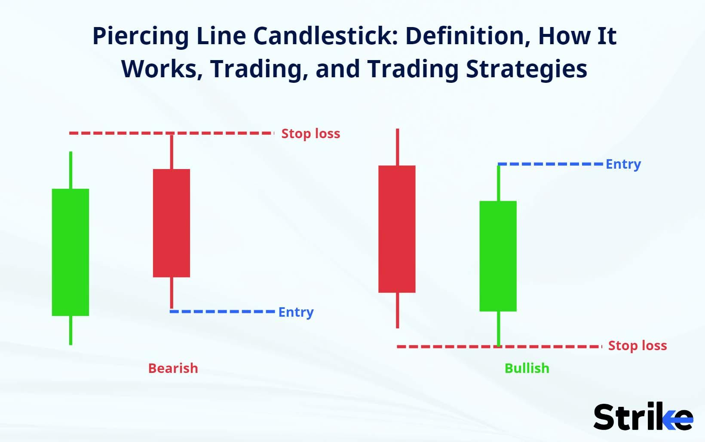

## Table of Contents

## What is a piercing pattern in trading?

A piercing pattern is a type of candlestick pattern that traders use to predict a possible reversal in the market. It usually appears at the end of a downtrend and suggests that the price might start going up soon. The pattern consists of two candles: the first one is a long red or black candle, showing that the price went down a lot during that period. The second candle is a long green or white one that opens below the low of the first candle but closes above the midpoint of the first candle's body.

This pattern is important because it shows that buyers are starting to take control from sellers. When the second candle opens lower but then closes much higher, it means that after an initial drop, buyers stepped in strongly and pushed the price up. Traders often see this as a signal to buy, hoping that the price will continue to rise. However, it's always a good idea to use other indicators and tools to confirm the pattern before making any trading decisions.

## How does a piercing pattern form on a candlestick chart?

A piercing pattern forms on a candlestick chart when there's a change in the direction of the price after it has been going down for a while. Imagine the price has been dropping, and you see a long red or black candle on the chart. This candle shows that the sellers were in control that day, pushing the price lower.

The next day, something interesting happens. The price opens even lower than where it closed the day before, making it look like the downtrend might continue. But then, buyers step in strongly, and the price starts to go up. By the end of the day, the price has risen so much that the candle closes above the midpoint of the previous day's red or black candle. This new green or white candle shows that buyers are now taking over, and it forms the piercing pattern on the chart.

## What are the key characteristics of a piercing pattern?

A piercing pattern is easy to spot on a chart because it has two main parts. First, you see a long red or black candle. This candle shows that the price went down a lot on that day, meaning sellers were in charge. It's important that this candle comes after a time when the price has been falling, showing that the market was in a downtrend.

The second part of the pattern is a long green or white candle that comes right after the red or black one. This new candle starts even lower than where the first candle ended, but then the price goes up a lot during the day. By the end, the green or white candle closes above the middle of the first candle's body. This shows that buyers are now taking over, and it might mean the price will start going up soon.

## Can you explain the psychology behind a piercing pattern?

The psychology behind a piercing pattern is all about how buyers and sellers feel and act. When you see a long red or black candle, it means sellers were strong and pushed the price down a lot. This makes people think the price will keep going down. But then, the next day starts with the price opening even lower, which might make some people think the downtrend will keep going. But something changes during that day.

Suddenly, buyers start buying a lot, and the price goes up so much that it closes above the middle of the red candle from the day before. This shows that buyers are now feeling confident and are taking control from the sellers. It's like they are saying, "We think the price has gone down enough, and now it's time for it to go up." This change in who is in control can make other people think the price might keep going up, so they start buying too.

## How reliable is a piercing pattern as a bullish reversal signal?

A piercing pattern can be a good sign that the price might start going up, but it's not perfect. It works best when you see it after the price has been going down for a while. If you see this pattern, it means buyers are starting to take over from sellers, which can be a good sign for the price to go up. But, it's important to remember that no pattern works all the time. Sometimes, even if you see a piercing pattern, the price might keep going down.

To make sure a piercing pattern is a good sign, it's a good idea to look at other things too. You can use other charts or tools to see if they also say the price might go up. This way, you can feel more sure about your decision. So, while a piercing pattern can be helpful, it's best to use it with other signs to make the best choice about buying or selling.

## What are the best market conditions for a piercing pattern to be effective?

A piercing pattern works best when the price has been going down for a while. Imagine the price is like a ball rolling down a hill. When it finally stops and starts to roll back up, that's when a piercing pattern can be a good sign. If you see this pattern after a long time of the price going down, it means buyers are starting to take over from sellers, and it might be a good time for the price to start going up.

But, it's not just about seeing the pattern. The market needs to be in the right mood too. If a lot of people are starting to feel hopeful about the price going up, and if there's news or other signs that support this, then the piercing pattern is more likely to work. So, it's important to look at what's happening around the pattern to see if it's a good time for the price to change direction.

## How should a trader confirm a piercing pattern before making a trade?

Before making a trade based on a piercing pattern, a trader should look at other things to make sure it's a good sign. One way is to check other charts or tools that show if the price might go up. For example, if the price is near a level where it has gone up before, or if other signs like moving averages or the RSI also say the price might go up, then the piercing pattern is more likely to be right.

Another thing to do is to see what's happening in the market. If there's good news or if people are starting to feel more hopeful about the price going up, then the piercing pattern is more likely to work. It's like checking the weather before going outside; you want to make sure everything looks good before you decide to trade. By looking at these other signs, a trader can feel more sure about using the piercing pattern to make a trade.

## What are common mistakes traders make when using piercing patterns?

One common mistake traders make when using piercing patterns is relying on the pattern alone without looking at other signs. They see the pattern and think it's a sure sign the price will go up, but they don't check other charts or tools to see if the price really might go up. This can lead to bad trades because the piercing pattern doesn't work all the time, and it's better to use it with other signs to be more sure.

Another mistake is not paying attention to the market's mood. If the market is still feeling down and people are not hopeful about the price going up, then the piercing pattern might not work as well. Traders need to look at what's happening around the pattern, like news or other signs, to see if it's a good time for the price to change direction. By ignoring these things, traders can miss important clues that could help them make better trades.

## How does a piercing pattern differ from other candlestick patterns like the bullish engulfing pattern?

A piercing pattern and a bullish engulfing pattern both show that buyers might be taking over from sellers, but they look a bit different on a chart. A piercing pattern has two candles: the first is a long red or black candle that shows the price went down a lot, and the second is a long green or white candle that opens lower but closes above the middle of the first candle's body. This means the price started lower but then went up a lot during the day. On the other hand, a bullish engulfing pattern also has two candles, but the second green or white candle completely covers or "engulfs" the body of the first red or black candle. This means the price opens lower but then goes up so much that it closes higher than where the first candle started.

The main difference between these two patterns is how much the second candle covers the first one. In a piercing pattern, the second candle only needs to close above the middle of the first candle's body, while in a bullish engulfing pattern, the second candle must cover the whole body of the first candle. Both patterns can be good signs that the price might start going up, but the bullish engulfing pattern is often seen as a stronger sign because it shows a bigger change in who is in control of the price. Traders might feel more sure about the price going up when they see a bullish engulfing pattern, but it's always a good idea to look at other signs too before making a trade.

## Can piercing patterns be used in conjunction with other technical indicators?

Yes, piercing patterns can be used with other technical indicators to make better trading decisions. When you see a piercing pattern, it's like seeing a sign that the price might start going up. But to be more sure, you can look at other tools like moving averages, which show where the price has been going over time, or the RSI, which tells you if the price is too high or too low. If these other tools also say the price might go up, then the piercing pattern is more likely to be right.

It's also a good idea to check the volume, which shows how many people are buying or selling. If the volume goes up when you see a piercing pattern, it means more people are interested in the price going up, which makes the pattern more reliable. By using these other indicators with the piercing pattern, you can feel more confident about making a trade.

## What are the risk management strategies to consider when trading based on a piercing pattern?

When trading based on a piercing pattern, it's important to use risk management strategies to protect your money. One good way is to set a stop-loss order. This means you decide a price where you will sell if the price goes down instead of up like you hoped. This helps you not lose too much money if the piercing pattern doesn't work out. Another way is to only risk a small part of your money on each trade. If you only use a little bit of your money, you can still trade even if one trade doesn't go well.

Another important strategy is to check other signs and tools before you trade. If other charts or indicators also say the price might go up, you can feel more sure about the piercing pattern. This can help you make better choices and lower your risk. Also, think about how much money you could make compared to how much you could lose. If the possible reward is a lot bigger than the risk, it might be a good trade. By using these strategies, you can trade more safely and protect your money.

## How can algorithmic trading systems incorporate piercing patterns into their strategies?

Algorithmic trading systems can use piercing patterns to help them decide when to buy or sell. These systems look at lots of charts and numbers very quickly, much faster than a person can. When the system sees a piercing pattern after the price has been going down, it can be a sign to buy because it means buyers might be taking over. The system can be set up to look for this pattern and then check other signs like moving averages or volume to make sure it's a good time to buy. This way, the system can use the piercing pattern along with other tools to make smart trading choices.

To make the system work well with piercing patterns, it's important to set rules for how to use them. For example, the system can be told to only buy if the piercing pattern happens with high volume, which means a lot of people are buying. It can also be set to use a stop-loss order to limit how much money can be lost if the trade doesn't go well. By setting these rules, the system can trade more safely and make better use of the piercing pattern to find good times to buy.

## References & Further Reading

[1]: Nison, S. (1991). ["Japanese Candlestick Charting Techniques: A Contemporary Guide to the Ancient Investment Techniques of the Far East"](https://archive.org/details/japanesecandlest0000niso). New York Institute of Finance.

[2]: Gomber, P., Arndt, B., Lutat, M., & Uhle, T. (2011). ["High-frequency trading"](https://papers.ssrn.com/sol3/papers.cfm?abstract_id=1858626). Business & Information Systems Engineering, 3(2), 69-73.

[3]: Chan, E. (2009). ["Quantitative Trading: How to Build Your Own Algorithmic Trading Business"](https://github.com/ftvision/quant_trading_echan_book). Wiley.

[4]: Jansen, S. (2018). ["Machine Learning for Algorithmic Trading: Predictive models to extract signals from market and alternative data for systematically trading strategies with Python"](https://www.amazon.com/Machine-Learning-Algorithmic-Trading-intelligence/dp/1789346374). Packt Publishing.

[5]: Aronson, D. R. (2006). ["Evidence-Based Technical Analysis: Applying the Scientific Method and Statistical Inference to Trading Signals"](https://www.amazon.com/Evidence-Based-Technical-Analysis-Scientific-Statistical/dp/0470008741). Wiley.

[6]: Lopez de Prado, M. (2018). ["Advances in Financial Machine Learning"](https://www.amazon.com/Advances-Financial-Machine-Learning-Marcos/dp/1119482089). Wiley.