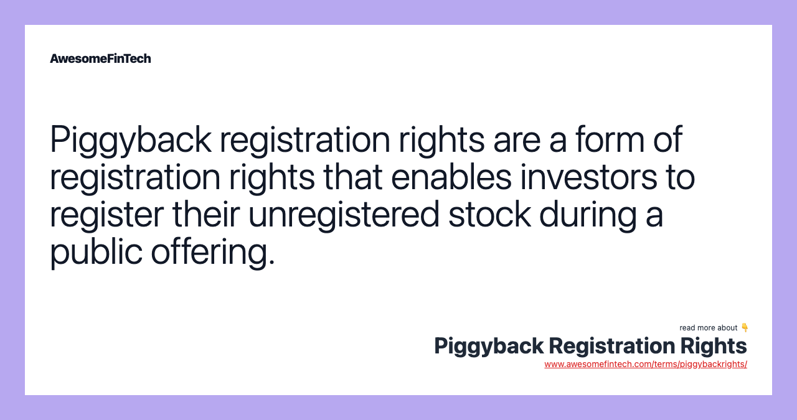

## Table of Contents

## What is piggyback registration?

Piggyback registration is a way for smaller shareholders to sell their shares when a company does a big sale of its own stock. When a company decides to sell new shares to the public, it's called a primary offering. If the company is already public, this is often called a secondary offering. In these cases, the company has to file a registration statement with the Securities and Exchange Commission (SEC). Piggyback registration rights allow certain shareholders to include their own shares in this registration, so they can sell their shares at the same time as the company.

This can be really helpful for shareholders who might not have enough shares to do their own big sale. By joining the company's offering, they can take advantage of the same process and potentially get a better price for their shares. However, the company can sometimes limit how many shares these shareholders can sell, to make sure their own offering goes smoothly. So, piggyback registration gives smaller shareholders a chance to sell, but it's up to the company to decide how much they can sell.

## How does piggyback registration differ from other types of registration?

Piggyback registration is different from other types of registration because it lets smaller shareholders join a company's big stock sale. When a company wants to sell new shares, it has to file a registration with the SEC. Piggyback registration rights let certain shareholders add their own shares to this registration, so they can sell at the same time as the company. This is helpful for shareholders who don't have enough shares to do their own big sale. They can use the company's registration to sell their shares and maybe get a better price.

Other types of registration, like demand registration, work differently. With demand registration, big shareholders can ask the company to start a new registration just for them. This means the company has to file a new registration with the SEC, even if it's not planning to sell its own shares. This can be more work for the company, but it gives big shareholders more control over when and how they sell their shares. Piggyback registration is easier for the company because it's just adding to an existing registration, but it gives shareholders less control over the timing and amount of shares they can sell.

## Who can initiate a piggyback registration?

A piggyback registration is started by the company when it decides to sell new shares to the public. The company files a registration with the SEC for its own stock sale. Shareholders with piggyback registration rights can then ask to include their shares in this registration. They don't start the process themselves; they just join the company's existing registration.

The company decides if it will let these shareholders add their shares and how many shares they can sell. This is different from demand registration, where big shareholders can ask the company to start a new registration just for them. With piggyback registration, shareholders have to wait for the company to start its own sale and then ask to join in.

## What are the key components of a piggyback registration?

Piggyback registration happens when a company decides to sell new shares and files a registration with the SEC. Shareholders who have piggyback registration rights can ask to include their own shares in this registration. This means they can sell their shares at the same time as the company. It's helpful for shareholders who don't have enough shares to do their own big sale. They can join the company's sale and maybe get a better price for their shares.

The company controls the piggyback registration process. It decides if it will let shareholders add their shares and how many shares they can sell. The company might limit the number of shares to make sure its own sale goes smoothly. Shareholders can't start a piggyback registration on their own; they have to wait for the company to start its own sale and then ask to join in. This is different from demand registration, where big shareholders can ask the company to start a new registration just for them.

## Under what conditions can a piggyback registration be triggered?

A piggyback registration can be triggered when a company decides to sell new shares to the public. This usually happens when the company wants to raise money or when existing shareholders want to sell their shares. When the company decides to do this, it has to file a registration with the Securities and Exchange Commission (SEC). This is the company's own registration for selling its shares.

Once the company starts this process, shareholders who have piggyback registration rights can ask to include their own shares in the company's registration. This means they can sell their shares at the same time as the company. The company decides if it will let these shareholders join in and how many shares they can sell. The company might limit the number of shares to make sure its own sale goes smoothly.

## What are the benefits of piggyback registration for shareholders?

Piggyback registration helps shareholders by letting them sell their shares when the company sells new shares. This is good for shareholders who don't have enough shares to do their own big sale. By joining the company's sale, they can use the same process and maybe get a better price for their shares. This can save them time and money because they don't have to start their own registration with the SEC.

The company controls the piggyback registration process, but it can still be a big help for shareholders. They can sell their shares at the same time as the company, which can be easier and more efficient. The company might limit how many shares shareholders can sell, but it's still a chance for them to sell their shares without having to do all the work themselves.

## What are the potential drawbacks of piggyback registration for the company?

Piggyback registration can make things harder for the company. When the company wants to sell new shares, it has to file a registration with the SEC. If shareholders want to join in with their own shares, it can make the process more complicated. The company might have to spend more time and money to make sure everything goes smoothly. It also has to decide how many shares the shareholders can sell, which can be tricky.

Another problem is that piggyback registration might make the company's own sale less successful. If too many shareholders want to sell their shares at the same time, it could lower the price of the company's shares. This could make it harder for the company to raise the money it needs. The company has to balance its own needs with the needs of the shareholders, which can be a challenge.

## How does the process of piggyback registration work step-by-step?

When a company wants to sell new shares to the public, it starts by filing a registration with the Securities and Exchange Commission (SEC). This is called the company's primary offering. Shareholders who have piggyback registration rights can then ask to include their own shares in this registration. They do this by sending a request to the company, letting them know they want to join the sale. The company looks at these requests and decides if it will let the shareholders join in and how many shares they can sell. The company might limit the number of shares to make sure its own sale goes smoothly.

Once the company agrees to include the shareholders' shares, it updates the registration with the SEC to include these additional shares. The company then moves forward with the sale, selling both its own shares and the shareholders' shares at the same time. This can be a big help for shareholders who don't have enough shares to do their own big sale. They can use the company's registration to sell their shares and maybe get a better price. The whole process is controlled by the company, but it gives shareholders a chance to sell their shares without having to start their own registration.

## What legal considerations should be taken into account during a piggyback registration?

When a company does a piggyback registration, it needs to make sure it follows all the rules from the Securities and Exchange Commission (SEC). The company has to file a registration that includes all the details about the shares it wants to sell, as well as the shares from shareholders who want to join in. The company also has to make sure it's fair to all the shareholders who want to sell their shares. This means deciding how many shares each shareholder can sell and making sure no one gets left out. If the company doesn't follow these rules, it could get in trouble with the SEC.

Another important thing to think about is the agreements the company has with its shareholders. These agreements might say what kind of rights shareholders have when it comes to piggyback registration. The company needs to make sure it follows these agreements and treats shareholders fairly. If there's a disagreement about how many shares shareholders can sell or how the process should work, it could end up in court. So, it's really important for the company to be clear and fair with its shareholders during a piggyback registration.

## How can piggyback registration impact the timing of a public offering?

Piggyback registration can change the timing of a public offering because it adds more steps for the company. When the company wants to sell new shares, it has to file a registration with the SEC. If shareholders want to join in with their own shares, the company has to look at their requests and decide how many shares they can sell. This can take extra time and might delay the company's own sale. The company wants to make sure everything goes smoothly, so it has to be careful about how it handles the shareholders' shares.

Sometimes, piggyback registration can make the public offering take longer because the company has to balance its own needs with the needs of the shareholders. If a lot of shareholders want to sell their shares, it could make the process more complicated. The company might have to spend more time figuring out how to include these shares without messing up its own sale. This can slow things down and make the whole process take longer than if the company was just selling its own shares.

## What are some real-world examples of piggyback registration?

When a big company like Facebook wants to sell more shares to the public, it has to file a registration with the SEC. If some of the early investors or employees who got shares want to sell theirs too, they can ask to join in on Facebook's registration. This is called piggyback registration. For example, when Facebook did its big sale in 2012, some of its early investors used piggyback registration to sell their shares at the same time. This helped them get a good price for their shares without having to do all the work of a separate sale.

Another example is when a company like Uber decides to sell more shares. If some of Uber's big shareholders want to sell their shares too, they can ask to join Uber's registration. This happened when Uber did its big sale in 2019. Some of its early investors and employees used piggyback registration to sell their shares along with Uber's new shares. This made it easier for them to sell their shares and helped them get a better price.

## How can companies strategically manage piggyback registration requests to optimize their public offerings?

When a company wants to sell new shares to the public, it can use piggyback registration to let some shareholders join in. To make this work well, the company needs to be smart about how it handles these requests. It should look at how many shares the shareholders want to sell and decide if it's okay to include them all. If too many shares are added, it could make the company's own sale less successful. So, the company might need to limit how many shares shareholders can sell. This helps make sure the company can still raise the money it needs while letting shareholders sell their shares too.

The company can also talk to the shareholders about the timing of the sale. If a lot of shareholders want to sell their shares, it might take longer to get everything ready. The company can work with them to find a good time for everyone. This way, the company can make sure its own sale goes smoothly and the shareholders can still join in. By being clear and fair with the shareholders, the company can make the whole process easier and more successful for everyone involved.

## References & Further Reading

[1]: ["Algorithmic Trading and DMA: An introduction to direct access trading strategies"](https://www.amazon.com/Algorithmic-Trading-DMA-introduction-strategies/dp/0956399207) by Barry Johnson

[2]: ["The Volatility Machine: Emerging Economics and the Threat of Financial Collapse"](https://www.amazon.com/Volatility-Machine-Emerging-Economics-Financial/dp/0195143302) by Michael Pettis

[3]: Bodie, Z., Kane, A., & Marcus, A. J. (2013). ["Investments"](https://books.google.com/books/about/EBOOK_Investments_Global_edition.html?id=BMsvEAAAQBAJ). McGraw-Hill Education.

[4]: Hull, J. C. (2018). ["Options, Futures, and Other Derivatives"](https://www.semanticscholar.org/paper/Options%2C-Futures%2C-and-Other-Derivatives-Hull/89bdee500c8623864fc9eb7a471546aa713acc44). Pearson Education.

[5]: Schlichting, P., & Sinning, C. (2020). ["The Role of Algorithmic Trading in Market Liquidity"](https://www.sec.gov/file/Algo_Trading_Report_2020.pdf). Journal of Financial Services Research.